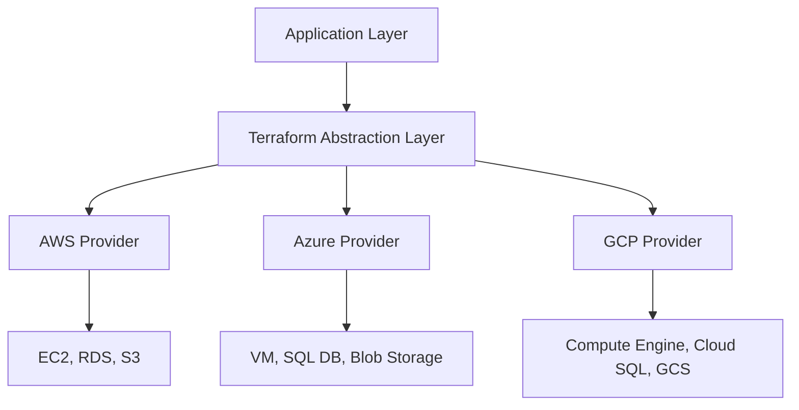

# How to Use Terraform in a Cloud-Agnostic Way

Author: [nawazdhandala](https://www.github.com/nawazdhandala)

Tags: Terraform, Multi-Cloud, Infrastructure as Code, Cloud Architecture, DevOps

Description: Learn strategies for writing cloud-agnostic Terraform code that works across AWS, Azure, and GCP. This guide covers abstraction patterns, module design, and practical techniques for multi-cloud deployments.

As organizations adopt multi-cloud strategies for resilience, cost optimization, or compliance requirements, the ability to write portable infrastructure code becomes crucial. Terraform's provider-agnostic nature makes it an excellent choice for multi-cloud deployments, but achieving true cloud-agnosticism requires careful architecture and abstraction patterns.

## The Multi-Cloud Challenge

Each cloud provider offers similar services with different APIs, naming conventions, and capabilities. A virtual machine is called EC2 on AWS, Compute Engine on GCP, and Virtual Machine on Azure. Writing code that abstracts these differences while maintaining flexibility is the core challenge.



## Strategy 1: Abstract Module Pattern

Create wrapper modules that present a unified interface regardless of the underlying provider:

```hcl
# modules/compute/main.tf
variable "provider_type" {
  type        = string
  description = "Cloud provider: aws, azure, or gcp"
  validation {
    condition     = contains(["aws", "azure", "gcp"], var.provider_type)
    error_message = "Provider must be aws, azure, or gcp."
  }
}

variable "instance_config" {
  type = object({
    name          = string
    size          = string  # small, medium, large, xlarge
    image         = string  # os type: ubuntu-22, rhel-9, windows-2022
    subnet_id     = string
    ssh_key_name  = optional(string)
  })
}

locals {
  # Size mapping across providers
  size_map = {
    aws = {
      small  = "t3.small"
      medium = "t3.medium"
      large  = "t3.large"
      xlarge = "t3.xlarge"
    }
    azure = {
      small  = "Standard_B1s"
      medium = "Standard_B2s"
      large  = "Standard_B4ms"
      xlarge = "Standard_D4s_v3"
    }
    gcp = {
      small  = "e2-small"
      medium = "e2-medium"
      large  = "e2-standard-4"
      xlarge = "e2-standard-8"
    }
  }

  # Image mapping across providers
  image_map = {
    aws = {
      "ubuntu-22"    = "ami-0123456789abcdef0"  # Replace with actual AMI
      "rhel-9"       = "ami-0fedcba9876543210"
      "windows-2022" = "ami-0abcdef1234567890"
    }
    azure = {
      "ubuntu-22"    = "Canonical:0001-com-ubuntu-server-jammy:22_04-lts:latest"
      "rhel-9"       = "RedHat:RHEL:9-lvm:latest"
      "windows-2022" = "MicrosoftWindowsServer:WindowsServer:2022-Datacenter:latest"
    }
    gcp = {
      "ubuntu-22"    = "ubuntu-os-cloud/ubuntu-2204-lts"
      "rhel-9"       = "rhel-cloud/rhel-9"
      "windows-2022" = "windows-cloud/windows-2022"
    }
  }

  actual_size  = local.size_map[var.provider_type][var.instance_config.size]
  actual_image = local.image_map[var.provider_type][var.instance_config.image]
}

# AWS Implementation
resource "aws_instance" "this" {
  count = var.provider_type == "aws" ? 1 : 0

  ami           = local.actual_image
  instance_type = local.actual_size
  subnet_id     = var.instance_config.subnet_id
  key_name      = var.instance_config.ssh_key_name

  tags = {
    Name = var.instance_config.name
  }
}

# Azure Implementation
resource "azurerm_linux_virtual_machine" "this" {
  count = var.provider_type == "azure" ? 1 : 0

  name                = var.instance_config.name
  resource_group_name = var.azure_resource_group
  location            = var.azure_location
  size                = local.actual_size
  admin_username      = "adminuser"
  network_interface_ids = [var.instance_config.subnet_id]

  source_image_reference {
    publisher = split(":", local.actual_image)[0]
    offer     = split(":", local.actual_image)[1]
    sku       = split(":", local.actual_image)[2]
    version   = split(":", local.actual_image)[3]
  }

  os_disk {
    caching              = "ReadWrite"
    storage_account_type = "Standard_LRS"
  }
}

# GCP Implementation
resource "google_compute_instance" "this" {
  count = var.provider_type == "gcp" ? 1 : 0

  name         = var.instance_config.name
  machine_type = local.actual_size
  zone         = var.gcp_zone

  boot_disk {
    initialize_params {
      image = local.actual_image
    }
  }

  network_interface {
    subnetwork = var.instance_config.subnet_id
  }
}

# Unified output
output "instance_id" {
  value = coalesce(
    try(aws_instance.this[0].id, null),
    try(azurerm_linux_virtual_machine.this[0].id, null),
    try(google_compute_instance.this[0].id, null)
  )
}

output "private_ip" {
  value = coalesce(
    try(aws_instance.this[0].private_ip, null),
    try(azurerm_linux_virtual_machine.this[0].private_ip_address, null),
    try(google_compute_instance.this[0].network_interface[0].network_ip, null)
  )
}
```

## Strategy 2: Provider-Specific Submodules

A cleaner approach separates provider implementations into submodules:

```
modules/
  database/
    main.tf          # Entry point with provider selection
    variables.tf     # Common variables
    outputs.tf       # Unified outputs
    aws/
      main.tf        # AWS RDS implementation
      variables.tf
      outputs.tf
    azure/
      main.tf        # Azure SQL implementation
      variables.tf
      outputs.tf
    gcp/
      main.tf        # Cloud SQL implementation
      variables.tf
      outputs.tf
```

The main module delegates to the appropriate submodule:

```hcl
# modules/database/main.tf
variable "provider_type" {
  type = string
}

variable "database_config" {
  type = object({
    name           = string
    engine         = string  # postgres, mysql
    engine_version = string
    size           = string  # small, medium, large
    storage_gb     = number
    multi_az       = bool
  })
}

module "aws_database" {
  source = "./aws"
  count  = var.provider_type == "aws" ? 1 : 0

  config = var.database_config
}

module "azure_database" {
  source = "./azure"
  count  = var.provider_type == "azure" ? 1 : 0

  config = var.database_config
}

module "gcp_database" {
  source = "./gcp"
  count  = var.provider_type == "gcp" ? 1 : 0

  config = var.database_config
}

output "connection_string" {
  value = coalesce(
    try(module.aws_database[0].connection_string, null),
    try(module.azure_database[0].connection_string, null),
    try(module.gcp_database[0].connection_string, null)
  )
  sensitive = true
}
```

## Strategy 3: Configuration-Driven Infrastructure

Use YAML or JSON configuration files to define infrastructure in a provider-agnostic way:

```yaml
# infrastructure.yaml
environments:
  production:
    provider: aws
    region: us-east-1
    compute:
      - name: web-server
        size: large
        count: 3
        image: ubuntu-22
    databases:
      - name: main-db
        engine: postgres
        version: "15"
        size: medium
        storage_gb: 100
        high_availability: true
  dr-site:
    provider: gcp
    region: us-central1
    compute:
      - name: web-server
        size: large
        count: 2
        image: ubuntu-22
    databases:
      - name: main-db
        engine: postgres
        version: "15"
        size: medium
        storage_gb: 100
        high_availability: true
```

Parse and deploy using Terraform:

```hcl
# main.tf
locals {
  config = yamldecode(file("${path.root}/infrastructure.yaml"))
}

module "environment" {
  for_each = local.config.environments
  source   = "./modules/environment"

  provider_type = each.value.provider
  region        = each.value.region
  compute       = each.value.compute
  databases     = each.value.databases
}
```

## Strategy 4: Terragrunt for Multi-Cloud Management

Terragrunt provides additional abstraction for managing configurations across providers:

```hcl
# terragrunt.hcl at root
locals {
  provider_vars = read_terragrunt_config(find_in_parent_folders("provider.hcl"))
  provider_type = local.provider_vars.locals.provider_type
}

remote_state {
  backend = local.provider_type == "aws" ? "s3" : (
    local.provider_type == "gcp" ? "gcs" : "azurerm"
  )

  config = local.provider_type == "aws" ? {
    bucket         = "terraform-state-${get_aws_account_id()}"
    key            = "${path_relative_to_include()}/terraform.tfstate"
    region         = "us-east-1"
    encrypt        = true
    dynamodb_table = "terraform-locks"
  } : (
    local.provider_type == "gcp" ? {
      bucket = "terraform-state-${get_env("GCP_PROJECT")}"
      prefix = "${path_relative_to_include()}"
    } : {
      resource_group_name  = "terraform-state-rg"
      storage_account_name = "tfstate${get_env("AZURE_SUBSCRIPTION_ID")}"
      container_name       = "tfstate"
      key                  = "${path_relative_to_include()}/terraform.tfstate"
    }
  )
}
```

## Handling Provider-Specific Features

Some features don't have equivalents across all providers. Handle these gracefully:

```hcl
variable "enable_spot_instances" {
  type        = bool
  default     = false
  description = "Enable spot/preemptible instances (AWS/GCP only)"
}

resource "aws_spot_instance_request" "this" {
  count = var.provider_type == "aws" && var.enable_spot_instances ? 1 : 0
  # ... spot configuration
}

resource "google_compute_instance" "preemptible" {
  count = var.provider_type == "gcp" && var.enable_spot_instances ? 1 : 0

  scheduling {
    preemptible       = true
    automatic_restart = false
  }
  # ... instance configuration
}

# Azure doesn't have direct spot equivalent for VMs
# Document this limitation
resource "null_resource" "azure_spot_warning" {
  count = var.provider_type == "azure" && var.enable_spot_instances ? 1 : 0

  provisioner "local-exec" {
    command = "echo 'Warning: Spot instances not supported on Azure in this module. Using standard instances.'"
  }
}
```

## Testing Multi-Cloud Configurations

Use Terratest or similar frameworks to validate across providers:

```go
// infrastructure_test.go
func TestMultiCloudCompute(t *testing.T) {
    providers := []string{"aws", "azure", "gcp"}

    for _, provider := range providers {
        t.Run(provider, func(t *testing.T) {
            terraformOptions := &terraform.Options{
                TerraformDir: "../modules/compute",
                Vars: map[string]interface{}{
                    "provider_type": provider,
                    "instance_config": map[string]interface{}{
                        "name":  "test-instance",
                        "size":  "small",
                        "image": "ubuntu-22",
                    },
                },
            }

            defer terraform.Destroy(t, terraformOptions)
            terraform.InitAndApply(t, terraformOptions)

            instanceId := terraform.Output(t, terraformOptions, "instance_id")
            assert.NotEmpty(t, instanceId)
        })
    }
}
```

## Best Practices for Cloud-Agnostic Terraform

1. **Define a common vocabulary**: Create consistent naming for sizes, regions, and services
2. **Document limitations**: Be explicit about features that don't translate across providers
3. **Use feature flags**: Allow enabling provider-specific optimizations when needed
4. **Test on all targets**: Validate configurations work on each provider before deployment
5. **Version lock providers**: Pin provider versions to avoid unexpected changes
6. **Separate concerns**: Keep provider-specific code isolated from business logic

## Conclusion

Writing cloud-agnostic Terraform requires upfront investment in abstraction layers, but pays dividends in flexibility and disaster recovery capabilities. By using module patterns, configuration-driven approaches, and careful handling of provider-specific features, teams can maintain portable infrastructure code that deploys consistently across AWS, Azure, and GCP.

The key is finding the right balance between abstraction and provider-specific optimization. Start with common patterns, document edge cases, and iterate based on real-world requirements.
