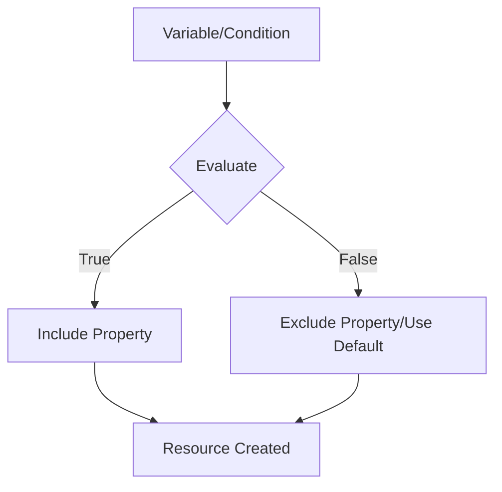

# How to Conditionally Use Properties in Terraform

Author: [nawazdhandala](https://www.github.com/nawazdhandala)

Tags: Terraform, Conditional Logic, Dynamic Blocks, HCL, Best Practices

Description: Learn how to conditionally include or exclude properties in Terraform resources using conditional expressions, dynamic blocks, and null values for flexible infrastructure configurations.

Terraform configurations often need to adapt based on environment, feature flags, or input variables. This guide covers various techniques to conditionally include or exclude properties in your Terraform resources.

## Understanding Conditional Properties



Terraform provides several mechanisms for conditional configuration:
- Ternary expressions
- Null coalescing
- Dynamic blocks
- Count and for_each conditionals

## Basic Ternary Expressions

The most common pattern uses the ternary operator `condition ? true_value : false_value`:

```hcl
variable "environment" {
  type    = string
  default = "development"
}

variable "enable_deletion_protection" {
  type    = bool
  default = false
}

resource "aws_db_instance" "main" {
  identifier     = "mydb-${var.environment}"
  engine         = "postgres"
  engine_version = "15.4"
  instance_class = var.environment == "production" ? "db.r6g.xlarge" : "db.t3.micro"

  allocated_storage     = var.environment == "production" ? 100 : 20
  max_allocated_storage = var.environment == "production" ? 500 : 50

  # Enable Multi-AZ only in production
  multi_az = var.environment == "production" ? true : false

  # Deletion protection based on environment or explicit override
  deletion_protection = var.enable_deletion_protection || var.environment == "production"

  # Backup retention - longer in production
  backup_retention_period = var.environment == "production" ? 30 : 7

  # Performance Insights only in production
  performance_insights_enabled = var.environment == "production"

  tags = {
    Environment = var.environment
  }
}
```

## Using Null to Omit Properties

Setting a property to `null` tells Terraform to use the provider's default or omit the property entirely:

```hcl
variable "custom_kms_key" {
  type    = string
  default = null  # Use AWS default encryption if not specified
}

variable "enable_enhanced_monitoring" {
  type    = bool
  default = false
}

resource "aws_db_instance" "main" {
  identifier     = "mydb"
  engine         = "postgres"
  instance_class = "db.t3.micro"

  # Only set KMS key if provided, otherwise use default
  kms_key_id = var.custom_kms_key

  # Conditionally enable enhanced monitoring
  monitoring_interval = var.enable_enhanced_monitoring ? 60 : 0
  monitoring_role_arn = var.enable_enhanced_monitoring ? aws_iam_role.monitoring[0].arn : null
}

# Conditionally create monitoring role
resource "aws_iam_role" "monitoring" {
  count = var.enable_enhanced_monitoring ? 1 : 0

  name = "rds-monitoring-role"

  assume_role_policy = jsonencode({
    Version = "2012-10-17"
    Statement = [
      {
        Action = "sts:AssumeRole"
        Effect = "Allow"
        Principal = {
          Service = "monitoring.rds.amazonaws.com"
        }
      }
    ]
  })
}
```

## Dynamic Blocks for Conditional Nested Configurations

Dynamic blocks are essential when you need to conditionally include entire configuration blocks:

```hcl
variable "enable_logging" {
  type    = bool
  default = true
}

variable "log_bucket" {
  type    = string
  default = ""
}

variable "ingress_rules" {
  type = list(object({
    port        = number
    protocol    = string
    cidr_blocks = list(string)
    description = string
  }))
  default = []
}

resource "aws_s3_bucket" "main" {
  bucket = "my-application-bucket"
}

resource "aws_s3_bucket_logging" "main" {
  count = var.enable_logging && var.log_bucket != "" ? 1 : 0

  bucket = aws_s3_bucket.main.id

  target_bucket = var.log_bucket
  target_prefix = "logs/"
}

# Security group with dynamic ingress rules
resource "aws_security_group" "main" {
  name        = "application-sg"
  description = "Application security group"
  vpc_id      = var.vpc_id

  # Dynamic ingress rules based on variable
  dynamic "ingress" {
    for_each = var.ingress_rules
    content {
      from_port   = ingress.value.port
      to_port     = ingress.value.port
      protocol    = ingress.value.protocol
      cidr_blocks = ingress.value.cidr_blocks
      description = ingress.value.description
    }
  }

  egress {
    from_port   = 0
    to_port     = 0
    protocol    = "-1"
    cidr_blocks = ["0.0.0.0/0"]
  }
}
```

## Conditional Dynamic Blocks

Combine conditions with dynamic blocks:

```hcl
variable "environment" {
  type = string
}

variable "enable_encryption" {
  type    = bool
  default = true
}

variable "encryption_key_arn" {
  type    = string
  default = ""
}

resource "aws_launch_template" "main" {
  name_prefix   = "app-"
  image_id      = var.ami_id
  instance_type = var.instance_type

  # Conditional EBS encryption block
  dynamic "block_device_mappings" {
    for_each = var.enable_encryption ? [1] : []
    content {
      device_name = "/dev/xvda"

      ebs {
        volume_size           = 50
        volume_type           = "gp3"
        encrypted             = true
        kms_key_id            = var.encryption_key_arn != "" ? var.encryption_key_arn : null
        delete_on_termination = true
      }
    }
  }

  # Monitoring - only detailed in production
  monitoring {
    enabled = var.environment == "production"
  }

  # Metadata options - conditional IMDSv2 requirement
  dynamic "metadata_options" {
    for_each = var.environment == "production" ? [1] : []
    content {
      http_endpoint               = "enabled"
      http_tokens                 = "required"  # Require IMDSv2
      http_put_response_hop_limit = 1
    }
  }

  # IAM instance profile - only if role is specified
  dynamic "iam_instance_profile" {
    for_each = var.instance_profile_name != "" ? [1] : []
    content {
      name = var.instance_profile_name
    }
  }
}
```

## Complex Conditional Logic with Locals

Use locals to simplify complex conditional logic:

```hcl
variable "environment" {
  type = string
}

variable "feature_flags" {
  type = object({
    enable_waf     = bool
    enable_cdn     = bool
    enable_logging = bool
  })
  default = {
    enable_waf     = false
    enable_cdn     = false
    enable_logging = true
  }
}

locals {
  is_production = var.environment == "production"
  is_staging    = var.environment == "staging"
  is_dev        = var.environment == "development"

  # Computed settings based on environment
  settings = {
    instance_type = local.is_production ? "m6i.xlarge" : (local.is_staging ? "m6i.large" : "t3.medium")

    desired_capacity = local.is_production ? 4 : (local.is_staging ? 2 : 1)
    min_size         = local.is_production ? 2 : 1
    max_size         = local.is_production ? 10 : (local.is_staging ? 4 : 2)

    enable_waf = local.is_production || var.feature_flags.enable_waf
    enable_cdn = local.is_production || var.feature_flags.enable_cdn

    log_retention_days = local.is_production ? 365 : (local.is_staging ? 30 : 7)
  }

  # Conditional tags
  common_tags = {
    Environment = var.environment
    ManagedBy   = "terraform"
  }

  production_tags = local.is_production ? {
    CostCenter  = "production"
    Compliance  = "required"
    BackupLevel = "critical"
  } : {}

  all_tags = merge(local.common_tags, local.production_tags)
}

resource "aws_autoscaling_group" "main" {
  name                = "app-${var.environment}"
  vpc_zone_identifier = var.subnet_ids

  desired_capacity = local.settings.desired_capacity
  min_size         = local.settings.min_size
  max_size         = local.settings.max_size

  launch_template {
    id      = aws_launch_template.main.id
    version = "$Latest"
  }

  dynamic "tag" {
    for_each = local.all_tags
    content {
      key                 = tag.key
      value               = tag.value
      propagate_at_launch = true
    }
  }
}
```

## Conditional Resource Creation with Count

Use `count` to conditionally create entire resources:

```hcl
variable "create_bastion" {
  type    = bool
  default = false
}

variable "enable_nat_gateway" {
  type    = bool
  default = true
}

# Conditionally create bastion host
resource "aws_instance" "bastion" {
  count = var.create_bastion ? 1 : 0

  ami           = var.bastion_ami
  instance_type = "t3.micro"
  subnet_id     = var.public_subnet_ids[0]

  tags = {
    Name = "bastion-${var.environment}"
  }
}

# Reference conditionally created resource
output "bastion_ip" {
  value = var.create_bastion ? aws_instance.bastion[0].public_ip : null
}

# NAT Gateway - one per AZ in production, single in dev
resource "aws_nat_gateway" "main" {
  count = var.enable_nat_gateway ? (local.is_production ? length(var.public_subnet_ids) : 1) : 0

  allocation_id = aws_eip.nat[count.index].id
  subnet_id     = var.public_subnet_ids[count.index]

  tags = {
    Name = "nat-${var.environment}-${count.index + 1}"
  }
}

resource "aws_eip" "nat" {
  count  = var.enable_nat_gateway ? (local.is_production ? length(var.public_subnet_ids) : 1) : 0
  domain = "vpc"
}
```

## Conditional for_each

Use `for_each` with conditional logic:

```hcl
variable "databases" {
  type = map(object({
    engine         = string
    instance_class = string
    enabled        = bool
  }))
  default = {
    users = {
      engine         = "postgres"
      instance_class = "db.t3.micro"
      enabled        = true
    }
    analytics = {
      engine         = "postgres"
      instance_class = "db.r6g.large"
      enabled        = false  # Disabled in dev
    }
  }
}

# Only create enabled databases
resource "aws_db_instance" "databases" {
  for_each = { for k, v in var.databases : k => v if v.enabled }

  identifier     = "${each.key}-${var.environment}"
  engine         = each.value.engine
  instance_class = each.value.instance_class

  # ... other configuration
}
```

## Coalesce and Try Functions

Use `coalesce` and `try` for fallback values:

```hcl
variable "instance_type" {
  type    = string
  default = ""
}

variable "config" {
  type    = any
  default = {}
}

locals {
  # Use provided value or fall back to default
  instance_type = coalesce(var.instance_type, "t3.micro")

  # Safely access nested values with defaults
  vpc_cidr = try(var.config.networking.vpc_cidr, "10.0.0.0/16")

  # Multiple fallbacks
  ami_id = coalesce(
    var.custom_ami_id,
    data.aws_ami.latest.id,
    "ami-default"
  )
}
```

## Best Practices

1. **Keep conditions readable**: Use locals for complex conditions
2. **Document conditional behavior**: Add comments explaining why properties are conditional
3. **Use feature flags**: Create explicit boolean variables for features
4. **Test all paths**: Ensure both true and false conditions work correctly
5. **Avoid deeply nested conditions**: Refactor into modules if logic becomes complex

```hcl
# Good: Clear and documented
locals {
  # Enable WAF in production or when explicitly requested
  enable_waf = var.environment == "production" || var.force_enable_waf
}

# Avoid: Deeply nested ternary
instance_type = var.env == "prod" ? (var.high_memory ? "r6g.2xlarge" : "m6i.xlarge") : (var.env == "staging" ? "m6i.large" : "t3.micro")
```

## Conclusion

Conditional properties in Terraform enable flexible, environment-aware configurations. Use ternary expressions for simple conditions, null values to omit properties, and dynamic blocks for conditional nested configurations. Combine these techniques with locals to keep your code readable and maintainable. Remember to test all conditional paths and document the logic behind your conditions for future maintainers.
