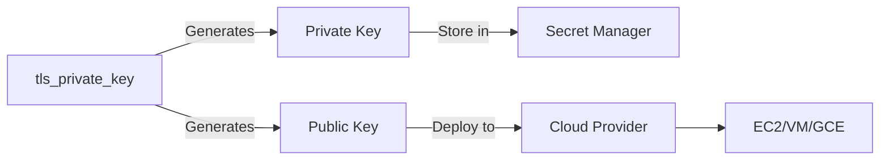

# How to Create SSH Keys in Terraform

Author: [nawazdhandala](https://www.github.com/nawazdhandala)

Tags: Terraform, SSH, Security, AWS, Azure, Key Management, TLS Provider

Description: Learn how to generate, manage, and deploy SSH keys using Terraform's TLS provider, including secure storage in secret managers, key rotation strategies, and multi-cloud deployment patterns.

SSH key management is a critical aspect of infrastructure security. This guide shows you how to generate SSH keys using Terraform, store them securely, and deploy them across various cloud platforms.

## Understanding SSH Key Generation in Terraform



Terraform can generate SSH keys using the `tls` provider, then deploy them to cloud resources and store sensitive materials securely.

## Basic SSH Key Generation

```hcl
# providers.tf
terraform {
  required_providers {
    tls = {
      source  = "hashicorp/tls"
      version = "~> 4.0"
    }
    aws = {
      source  = "hashicorp/aws"
      version = "~> 5.0"
    }
  }
}

provider "tls" {}
provider "aws" {
  region = "us-east-1"
}

# Generate SSH key pair
resource "tls_private_key" "main" {
  algorithm = "RSA"
  rsa_bits  = 4096
}

# Output public key (safe to display)
output "public_key_openssh" {
  description = "Public key in OpenSSH format"
  value       = tls_private_key.main.public_key_openssh
}

# Output private key (sensitive)
output "private_key_pem" {
  description = "Private key in PEM format"
  value       = tls_private_key.main.private_key_pem
  sensitive   = true
}
```

## Deploying to AWS

### EC2 Key Pair

```hcl
# Generate key pair
resource "tls_private_key" "ec2" {
  algorithm = "RSA"
  rsa_bits  = 4096
}

# Create AWS key pair from generated public key
resource "aws_key_pair" "main" {
  key_name   = "app-${var.environment}-key"
  public_key = tls_private_key.ec2.public_key_openssh

  tags = {
    Name        = "app-${var.environment}-key"
    Environment = var.environment
  }
}

# Store private key in AWS Secrets Manager
resource "aws_secretsmanager_secret" "ssh_private_key" {
  name        = "ssh-keys/app-${var.environment}"
  description = "SSH private key for ${var.environment} environment"

  tags = {
    Environment = var.environment
  }
}

resource "aws_secretsmanager_secret_version" "ssh_private_key" {
  secret_id = aws_secretsmanager_secret.ssh_private_key.id
  secret_string = jsonencode({
    private_key = tls_private_key.ec2.private_key_pem
    public_key  = tls_private_key.ec2.public_key_openssh
    key_name    = aws_key_pair.main.key_name
  })
}

# EC2 instance using the key
resource "aws_instance" "app" {
  ami           = var.ami_id
  instance_type = "t3.medium"
  key_name      = aws_key_pair.main.key_name
  subnet_id     = var.subnet_id

  tags = {
    Name = "app-${var.environment}"
  }
}
```

### Multiple Keys for Different Environments

```hcl
variable "environments" {
  type    = list(string)
  default = ["dev", "staging", "production"]
}

# Generate key pair for each environment
resource "tls_private_key" "env_keys" {
  for_each = toset(var.environments)

  algorithm = "RSA"
  rsa_bits  = 4096
}

resource "aws_key_pair" "env_keys" {
  for_each = toset(var.environments)

  key_name   = "app-${each.key}-key"
  public_key = tls_private_key.env_keys[each.key].public_key_openssh

  tags = {
    Environment = each.key
  }
}

resource "aws_secretsmanager_secret" "env_keys" {
  for_each = toset(var.environments)

  name = "ssh-keys/app-${each.key}"
}

resource "aws_secretsmanager_secret_version" "env_keys" {
  for_each = toset(var.environments)

  secret_id     = aws_secretsmanager_secret.env_keys[each.key].id
  secret_string = tls_private_key.env_keys[each.key].private_key_pem
}
```

## Deploying to Azure

```hcl
# providers.tf
terraform {
  required_providers {
    tls = {
      source  = "hashicorp/tls"
      version = "~> 4.0"
    }
    azurerm = {
      source  = "hashicorp/azurerm"
      version = "~> 3.85"
    }
  }
}

provider "azurerm" {
  features {}
}

# Generate SSH key
resource "tls_private_key" "vm" {
  algorithm = "RSA"
  rsa_bits  = 4096
}

# Store in Azure Key Vault
resource "azurerm_key_vault_secret" "ssh_private_key" {
  name         = "vm-ssh-private-key"
  value        = tls_private_key.vm.private_key_pem
  key_vault_id = azurerm_key_vault.main.id

  content_type = "application/x-pem-file"

  tags = {
    Environment = var.environment
  }
}

# Azure VM with SSH key
resource "azurerm_linux_virtual_machine" "app" {
  name                = "app-vm-${var.environment}"
  resource_group_name = azurerm_resource_group.main.name
  location            = azurerm_resource_group.main.location
  size                = "Standard_D2s_v3"
  admin_username      = "adminuser"

  network_interface_ids = [
    azurerm_network_interface.app.id,
  ]

  admin_ssh_key {
    username   = "adminuser"
    public_key = tls_private_key.vm.public_key_openssh
  }

  os_disk {
    caching              = "ReadWrite"
    storage_account_type = "Standard_LRS"
  }

  source_image_reference {
    publisher = "Canonical"
    offer     = "0001-com-ubuntu-server-jammy"
    sku       = "22_04-lts"
    version   = "latest"
  }

  tags = {
    Environment = var.environment
  }
}
```

## Deploying to GCP

```hcl
# providers.tf
terraform {
  required_providers {
    tls = {
      source  = "hashicorp/tls"
      version = "~> 4.0"
    }
    google = {
      source  = "hashicorp/google"
      version = "~> 5.0"
    }
  }
}

provider "google" {
  project = var.project_id
  region  = var.region
}

# Generate SSH key
resource "tls_private_key" "gce" {
  algorithm = "RSA"
  rsa_bits  = 4096
}

# Store in Secret Manager
resource "google_secret_manager_secret" "ssh_key" {
  secret_id = "ssh-private-key-${var.environment}"

  replication {
    auto {}
  }
}

resource "google_secret_manager_secret_version" "ssh_key" {
  secret      = google_secret_manager_secret.ssh_key.id
  secret_data = tls_private_key.gce.private_key_pem
}

# GCE instance with SSH key
resource "google_compute_instance" "app" {
  name         = "app-${var.environment}"
  machine_type = "e2-medium"
  zone         = "${var.region}-a"

  boot_disk {
    initialize_params {
      image = "ubuntu-os-cloud/ubuntu-2204-lts"
    }
  }

  network_interface {
    network = "default"
    access_config {}
  }

  metadata = {
    ssh-keys = "appuser:${tls_private_key.gce.public_key_openssh}"
  }

  tags = ["app-server"]
}
```

## ED25519 Keys (Modern Alternative)

ED25519 keys are smaller and faster than RSA:

```hcl
resource "tls_private_key" "ed25519" {
  algorithm = "ED25519"
}

# Use with AWS
resource "aws_key_pair" "ed25519" {
  key_name   = "app-ed25519-key"
  public_key = tls_private_key.ed25519.public_key_openssh
}

output "public_key" {
  value = tls_private_key.ed25519.public_key_openssh
}
```

## Key Rotation Strategy

Implement key rotation with versioning:

```hcl
variable "key_version" {
  type        = string
  description = "Key version for rotation"
  default     = "v1"
}

resource "tls_private_key" "rotating" {
  algorithm = "RSA"
  rsa_bits  = 4096

  # Recreate key when version changes
  keepers = {
    version = var.key_version
  }
}

resource "aws_key_pair" "rotating" {
  key_name   = "app-key-${var.key_version}"
  public_key = tls_private_key.rotating.public_key_openssh
}

# Store all versions in Secrets Manager
resource "aws_secretsmanager_secret" "ssh_key" {
  name = "ssh-keys/app-${var.key_version}"
}

resource "aws_secretsmanager_secret_version" "ssh_key" {
  secret_id     = aws_secretsmanager_secret.ssh_key.id
  secret_string = tls_private_key.rotating.private_key_pem
}

# Output for CI/CD
output "current_key_name" {
  value = aws_key_pair.rotating.key_name
}
```

## Writing Keys to Local Files

For development environments, you might need local key files:

```hcl
resource "tls_private_key" "local" {
  algorithm = "RSA"
  rsa_bits  = 4096
}

# Write private key to file
resource "local_sensitive_file" "private_key" {
  content         = tls_private_key.local.private_key_pem
  filename        = "${path.module}/keys/id_rsa"
  file_permission = "0600"
}

# Write public key to file
resource "local_file" "public_key" {
  content         = tls_private_key.local.public_key_openssh
  filename        = "${path.module}/keys/id_rsa.pub"
  file_permission = "0644"
}
```

**Note**: Avoid storing keys in local files for production. Use secret managers instead.

## Using Existing Keys

If you have existing SSH keys, reference them instead of generating:

```hcl
# Read existing public key from file
data "local_file" "existing_public_key" {
  filename = var.public_key_path
}

resource "aws_key_pair" "existing" {
  key_name   = "existing-key"
  public_key = data.local_file.existing_public_key.content
}

# Or pass as variable
variable "ssh_public_key" {
  type        = string
  description = "SSH public key content"
  sensitive   = true
}

resource "aws_key_pair" "from_variable" {
  key_name   = "variable-key"
  public_key = var.ssh_public_key
}
```

## Multi-Cloud Module

Create a reusable module for multi-cloud SSH key management:

```hcl
# modules/ssh-key/variables.tf
variable "name" {
  type = string
}

variable "cloud_provider" {
  type    = string
  # aws, azure, gcp
}

variable "algorithm" {
  type    = string
  default = "RSA"
}

variable "rsa_bits" {
  type    = number
  default = 4096
}

# modules/ssh-key/main.tf
resource "tls_private_key" "this" {
  algorithm = var.algorithm
  rsa_bits  = var.algorithm == "RSA" ? var.rsa_bits : null
}

# AWS
resource "aws_key_pair" "this" {
  count = var.cloud_provider == "aws" ? 1 : 0

  key_name   = var.name
  public_key = tls_private_key.this.public_key_openssh
}

resource "aws_secretsmanager_secret" "this" {
  count = var.cloud_provider == "aws" ? 1 : 0

  name = "ssh-keys/${var.name}"
}

resource "aws_secretsmanager_secret_version" "this" {
  count = var.cloud_provider == "aws" ? 1 : 0

  secret_id     = aws_secretsmanager_secret.this[0].id
  secret_string = tls_private_key.this.private_key_pem
}

# modules/ssh-key/outputs.tf
output "public_key_openssh" {
  value = tls_private_key.this.public_key_openssh
}

output "private_key_pem" {
  value     = tls_private_key.this.private_key_pem
  sensitive = true
}

output "key_name" {
  value = var.cloud_provider == "aws" ? aws_key_pair.this[0].key_name : var.name
}
```

## Security Best Practices

### 1. Never Commit Keys to Git

```gitignore
# .gitignore
*.pem
*.key
id_rsa*
```

### 2. Use Encryption at Rest

```hcl
# AWS Secrets Manager with CMK
resource "aws_kms_key" "secrets" {
  description = "KMS key for SSH key encryption"
}

resource "aws_secretsmanager_secret" "ssh_key" {
  name       = "ssh-keys/app"
  kms_key_id = aws_kms_key.secrets.id
}
```

### 3. Implement Access Logging

```hcl
# CloudTrail for secret access
resource "aws_cloudtrail" "secrets_access" {
  name                          = "secrets-access-trail"
  s3_bucket_name                = aws_s3_bucket.cloudtrail.id
  include_global_service_events = true

  event_selector {
    read_write_type           = "All"
    include_management_events = true

    data_resource {
      type   = "AWS::SecretsManager::Secret"
      values = ["arn:aws:secretsmanager:*:*:secret:ssh-keys/*"]
    }
  }
}
```

### 4. Limit Key Scope

```hcl
# Create keys with limited permissions
resource "tls_private_key" "restricted" {
  algorithm = "RSA"
  rsa_bits  = 4096
}

# Add command restriction in authorized_keys
output "restricted_authorized_key" {
  value = "command=\"/usr/local/bin/restricted-shell\",no-port-forwarding,no-X11-forwarding ${tls_private_key.restricted.public_key_openssh}"
}
```

## Conclusion

Terraform's TLS provider makes SSH key generation straightforward, but proper key management requires secure storage in secret managers and careful access control. Always store private keys in encrypted secret managers rather than local files or state, implement key rotation policies, and use the minimum necessary key size (4096-bit RSA or ED25519). For multi-cloud deployments, create reusable modules that handle key generation and storage consistently across providers.
