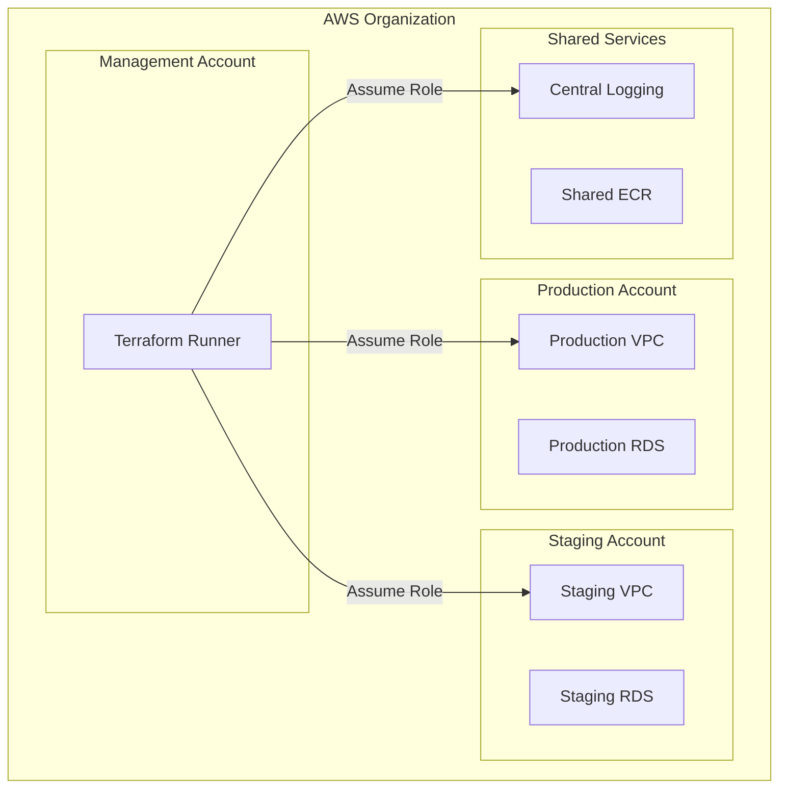

# How to Deploy to Multiple AWS Accounts with Terraform

Author: [nawazdhandala](https://www.github.com/nawazdhandala)

Tags: Terraform, AWS, Multi-Account, Infrastructure as Code, Cross-Account, IAM

Description: Learn how to structure Terraform configurations to deploy infrastructure across multiple AWS accounts using provider aliases, assume role, and organizational patterns for enterprise-scale deployments.

Managing infrastructure across multiple AWS accounts is a common requirement for organizations implementing AWS best practices like account isolation for security, billing separation, and environment segregation. This guide covers various approaches to deploy Terraform configurations across multiple AWS accounts.

## Why Multi-Account Architecture?



Multi-account setups provide:
- **Security isolation**: Blast radius containment
- **Billing separation**: Clear cost attribution
- **Compliance**: Regulatory requirements
- **Resource limits**: Avoid hitting AWS quotas

## Method 1: Provider Aliases with Assume Role

The most common pattern uses provider aliases with IAM role assumption.

### Setting Up Cross-Account IAM Roles

First, create an IAM role in each target account that Terraform can assume:

```hcl
# In target account: iam-role.tf
resource "aws_iam_role" "terraform_deploy" {
  name = "TerraformDeployRole"

  assume_role_policy = jsonencode({
    Version = "2012-10-17"
    Statement = [
      {
        Effect = "Allow"
        Principal = {
          AWS = "arn:aws:iam::${var.management_account_id}:root"
        }
        Action = "sts:AssumeRole"
        Condition = {
          StringEquals = {
            "sts:ExternalId" = var.external_id
          }
        }
      }
    ]
  })
}

resource "aws_iam_role_policy_attachment" "terraform_deploy" {
  role       = aws_iam_role.terraform_deploy.name
  policy_arn = "arn:aws:iam::aws:policy/AdministratorAccess"
}
```

### Configuring Multiple Providers

```hcl
# providers.tf
terraform {
  required_providers {
    aws = {
      source  = "hashicorp/aws"
      version = "~> 5.0"
    }
  }
}

# Default provider - management account
provider "aws" {
  region = "us-east-1"
}

# Production account
provider "aws" {
  alias  = "production"
  region = "us-east-1"

  assume_role {
    role_arn     = "arn:aws:iam::111111111111:role/TerraformDeployRole"
    session_name = "TerraformProduction"
    external_id  = var.external_id
  }
}

# Staging account
provider "aws" {
  alias  = "staging"
  region = "us-east-1"

  assume_role {
    role_arn     = "arn:aws:iam::222222222222:role/TerraformDeployRole"
    session_name = "TerraformStaging"
    external_id  = var.external_id
  }
}

# Shared services account
provider "aws" {
  alias  = "shared"
  region = "us-east-1"

  assume_role {
    role_arn     = "arn:aws:iam::333333333333:role/TerraformDeployRole"
    session_name = "TerraformShared"
    external_id  = var.external_id
  }
}
```

### Using Provider Aliases in Resources

```hcl
# Create VPC in production
resource "aws_vpc" "production" {
  provider   = aws.production
  cidr_block = "10.0.0.0/16"

  tags = {
    Name        = "production-vpc"
    Environment = "production"
  }
}

# Create VPC in staging
resource "aws_vpc" "staging" {
  provider   = aws.staging
  cidr_block = "10.1.0.0/16"

  tags = {
    Name        = "staging-vpc"
    Environment = "staging"
  }
}

# Shared ECR repository
resource "aws_ecr_repository" "app" {
  provider = aws.shared
  name     = "my-application"

  image_scanning_configuration {
    scan_on_push = true
  }
}
```

## Method 2: Dynamic Provider Configuration

For more flexibility, use dynamic provider configuration with variables:

```hcl
# variables.tf
variable "accounts" {
  description = "Map of account configurations"
  type = map(object({
    account_id  = string
    role_name   = string
    region      = string
    environment = string
  }))
  default = {
    production = {
      account_id  = "111111111111"
      role_name   = "TerraformDeployRole"
      region      = "us-east-1"
      environment = "production"
    }
    staging = {
      account_id  = "222222222222"
      role_name   = "TerraformDeployRole"
      region      = "us-east-1"
      environment = "staging"
    }
  }
}

# providers.tf
provider "aws" {
  alias  = "production"
  region = var.accounts["production"].region

  assume_role {
    role_arn = "arn:aws:iam::${var.accounts["production"].account_id}:role/${var.accounts["production"].role_name}"
  }
}

provider "aws" {
  alias  = "staging"
  region = var.accounts["staging"].region

  assume_role {
    role_arn = "arn:aws:iam::${var.accounts["staging"].account_id}:role/${var.accounts["staging"].role_name}"
  }
}
```

## Method 3: Modules with Provider Passing

Create reusable modules that accept provider configurations:

```hcl
# modules/vpc/main.tf
terraform {
  required_providers {
    aws = {
      source                = "hashicorp/aws"
      version               = "~> 5.0"
      configuration_aliases = [aws.target]
    }
  }
}

variable "vpc_cidr" {
  type = string
}

variable "environment" {
  type = string
}

resource "aws_vpc" "main" {
  provider   = aws.target
  cidr_block = var.vpc_cidr

  tags = {
    Name        = "${var.environment}-vpc"
    Environment = var.environment
  }
}

output "vpc_id" {
  value = aws_vpc.main.id
}
```

### Using the Module

```hcl
# main.tf
module "production_vpc" {
  source = "./modules/vpc"

  providers = {
    aws.target = aws.production
  }

  vpc_cidr    = "10.0.0.0/16"
  environment = "production"
}

module "staging_vpc" {
  source = "./modules/vpc"

  providers = {
    aws.target = aws.staging
  }

  vpc_cidr    = "10.1.0.0/16"
  environment = "staging"
}
```

## Method 4: Separate State Files per Account

For large organizations, maintain separate Terraform configurations per account:

```
infrastructure/
  accounts/
    production/
      main.tf
      backend.tf
      terraform.tfvars
    staging/
      main.tf
      backend.tf
      terraform.tfvars
    shared-services/
      main.tf
      backend.tf
      terraform.tfvars
  modules/
    vpc/
    rds/
    ecs/
```

### Account-Specific Configuration

```hcl
# accounts/production/backend.tf
terraform {
  backend "s3" {
    bucket         = "company-terraform-state"
    key            = "accounts/production/terraform.tfstate"
    region         = "us-east-1"
    encrypt        = true
    dynamodb_table = "terraform-locks"
  }
}

# accounts/production/main.tf
provider "aws" {
  region = "us-east-1"

  assume_role {
    role_arn = "arn:aws:iam::111111111111:role/TerraformDeployRole"
  }
}

module "vpc" {
  source = "../../modules/vpc"

  vpc_cidr    = var.vpc_cidr
  environment = "production"
}
```

## Cross-Account Resource Sharing

Sometimes resources need to reference each other across accounts:

```hcl
# Create ECR repository in shared account
resource "aws_ecr_repository" "app" {
  provider = aws.shared
  name     = "my-application"
}

# Grant production account access to pull images
resource "aws_ecr_repository_policy" "app" {
  provider   = aws.shared
  repository = aws_ecr_repository.app.name

  policy = jsonencode({
    Version = "2012-10-17"
    Statement = [
      {
        Sid    = "AllowPull"
        Effect = "Allow"
        Principal = {
          AWS = [
            "arn:aws:iam::111111111111:root",  # Production
            "arn:aws:iam::222222222222:root"   # Staging
          ]
        }
        Action = [
          "ecr:GetDownloadUrlForLayer",
          "ecr:BatchGetImage",
          "ecr:BatchCheckLayerAvailability"
        ]
      }
    ]
  })
}

# Use the ECR repository in production
resource "aws_ecs_task_definition" "app" {
  provider = aws.production
  family   = "my-application"

  container_definitions = jsonencode([
    {
      name  = "app"
      image = "${aws_ecr_repository.app.repository_url}:latest"
      # ... other configuration
    }
  ])
}
```

## VPC Peering Across Accounts

```hcl
# Requester VPC (production account)
resource "aws_vpc_peering_connection" "prod_to_shared" {
  provider      = aws.production
  vpc_id        = aws_vpc.production.id
  peer_vpc_id   = aws_vpc.shared.id
  peer_owner_id = "333333333333"  # Shared account ID
  peer_region   = "us-east-1"

  tags = {
    Name = "prod-to-shared-peering"
  }
}

# Accepter (shared account)
resource "aws_vpc_peering_connection_accepter" "prod_to_shared" {
  provider                  = aws.shared
  vpc_peering_connection_id = aws_vpc_peering_connection.prod_to_shared.id
  auto_accept               = true

  tags = {
    Name = "prod-to-shared-peering"
  }
}
```

## Using Terragrunt for Multi-Account

For complex setups, Terragrunt simplifies multi-account management:

```hcl
# terragrunt.hcl (root)
remote_state {
  backend = "s3"
  generate = {
    path      = "backend.tf"
    if_exists = "overwrite_terragrunt"
  }
  config = {
    bucket         = "company-terraform-state"
    key            = "${path_relative_to_include()}/terraform.tfstate"
    region         = "us-east-1"
    encrypt        = true
    dynamodb_table = "terraform-locks"
  }
}

# accounts/production/terragrunt.hcl
include "root" {
  path = find_in_parent_folders()
}

generate "provider" {
  path      = "provider.tf"
  if_exists = "overwrite_terragrunt"
  contents  = <<EOF
provider "aws" {
  region = "us-east-1"
  assume_role {
    role_arn = "arn:aws:iam::111111111111:role/TerraformDeployRole"
  }
}
EOF
}
```

## Security Best Practices

1. **Use External IDs**: Prevent confused deputy attacks
2. **Least Privilege**: Grant only necessary permissions
3. **Session Policies**: Further restrict assumed role permissions
4. **MFA Requirements**: Require MFA for sensitive accounts

```hcl
provider "aws" {
  alias  = "production"
  region = "us-east-1"

  assume_role {
    role_arn     = "arn:aws:iam::111111111111:role/TerraformDeployRole"
    external_id  = var.external_id
    session_name = "Terraform-${var.run_id}"

    # Further restrict permissions for this session
    policy = jsonencode({
      Version = "2012-10-17"
      Statement = [
        {
          Effect   = "Allow"
          Action   = ["ec2:*", "rds:*"]
          Resource = "*"
        }
      ]
    })
  }
}
```

## Conclusion

Deploying Terraform across multiple AWS accounts requires careful planning around IAM roles, provider configuration, and state management. Choose the approach that best fits your organization's size and complexity. For smaller teams, provider aliases work well. For enterprise scale, consider separate state files per account with shared modules, potentially managed through Terragrunt. Always follow security best practices like using external IDs and least privilege IAM policies.
