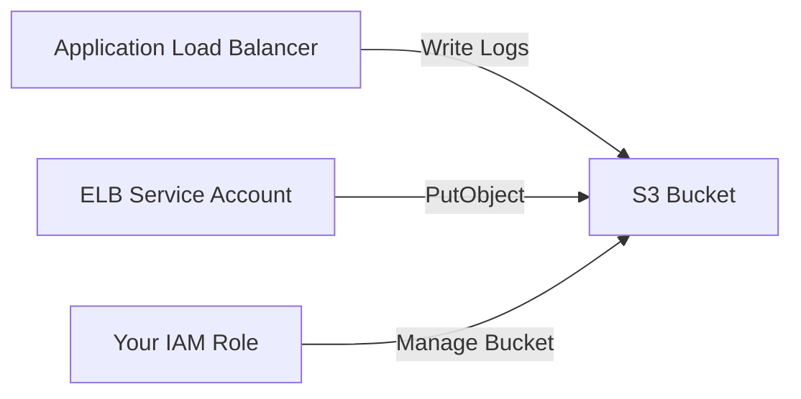

# How to Fix 'ELB S3 Permissions' Issues in Terraform

Author: [nawazdhandala](https://www.github.com/nawazdhandala)

Tags: Terraform, AWS, ELB, ALB, S3, Access Logs, IAM, Permissions

Description: Learn how to fix common ELB and ALB S3 access logging permissions issues in Terraform, including bucket policies, encryption settings, and region-specific configurations.

Enabling access logs for Elastic Load Balancers (ELB/ALB) to S3 is a common requirement, but the permissions setup is notoriously tricky. This guide covers the common issues and their solutions.

## Understanding ELB to S3 Logging



ELB access logging requires:
1. An S3 bucket with the correct bucket policy
2. Proper encryption configuration
3. Region-specific ELB service account permissions

## Common Error Messages

You might see errors like:
- `Access Denied for bucket`
- `The bucket policy does not allow ELB to put objects into this bucket`
- `InvalidRequest: Access Denied for ELB Account`

## The Complete Solution

### Step 1: Create the S3 Bucket

```hcl
# variables.tf
variable "region" {
  type    = string
  default = "us-east-1"
}

variable "environment" {
  type    = string
  default = "production"
}

# ELB account IDs per region (AWS managed)
locals {
  elb_account_ids = {
    "us-east-1"      = "127311923021"
    "us-east-2"      = "033677994240"
    "us-west-1"      = "027434742980"
    "us-west-2"      = "797873946194"
    "af-south-1"     = "098369216593"
    "ap-east-1"      = "754344448648"
    "ap-south-1"     = "718504428378"
    "ap-northeast-1" = "582318560864"
    "ap-northeast-2" = "600734575887"
    "ap-northeast-3" = "383597477331"
    "ap-southeast-1" = "114774131450"
    "ap-southeast-2" = "783225319266"
    "ca-central-1"   = "985666609251"
    "eu-central-1"   = "054676820928"
    "eu-west-1"      = "156460612806"
    "eu-west-2"      = "652711504416"
    "eu-west-3"      = "009996457667"
    "eu-south-1"     = "635631232127"
    "eu-north-1"     = "897822967062"
    "me-south-1"     = "076674570225"
    "sa-east-1"      = "507241528517"
  }

  elb_account_id = local.elb_account_ids[var.region]
}

# S3 bucket for ALB access logs
resource "aws_s3_bucket" "alb_logs" {
  bucket = "alb-logs-${var.environment}-${data.aws_caller_identity.current.account_id}"

  tags = {
    Name        = "ALB Access Logs"
    Environment = var.environment
  }
}

data "aws_caller_identity" "current" {}
```

### Step 2: Configure Bucket Policy

This is where most issues occur. The bucket policy must allow the ELB service account to write logs:

```hcl
# Bucket policy for ALB access logs
resource "aws_s3_bucket_policy" "alb_logs" {
  bucket = aws_s3_bucket.alb_logs.id
  policy = data.aws_iam_policy_document.alb_logs.json
}

data "aws_iam_policy_document" "alb_logs" {
  # Allow ELB to put access logs
  statement {
    sid    = "AllowELBRootAccount"
    effect = "Allow"

    principals {
      type        = "AWS"
      identifiers = ["arn:aws:iam::${local.elb_account_id}:root"]
    }

    actions = [
      "s3:PutObject"
    ]

    resources = [
      "${aws_s3_bucket.alb_logs.arn}/*"
    ]
  }

  # For newer regions or ALBv2, also allow the delivery service
  statement {
    sid    = "AllowLogDeliveryService"
    effect = "Allow"

    principals {
      type        = "Service"
      identifiers = ["delivery.logs.amazonaws.com"]
    }

    actions = [
      "s3:PutObject"
    ]

    resources = [
      "${aws_s3_bucket.alb_logs.arn}/*"
    ]

    condition {
      test     = "StringEquals"
      variable = "s3:x-amz-acl"
      values   = ["bucket-owner-full-control"]
    }
  }

  # Allow delivery service to check bucket ACL
  statement {
    sid    = "AllowLogDeliveryServiceAclCheck"
    effect = "Allow"

    principals {
      type        = "Service"
      identifiers = ["delivery.logs.amazonaws.com"]
    }

    actions = [
      "s3:GetBucketAcl"
    ]

    resources = [
      aws_s3_bucket.alb_logs.arn
    ]
  }

  # Enforce TLS
  statement {
    sid    = "EnforceTLS"
    effect = "Deny"

    principals {
      type        = "*"
      identifiers = ["*"]
    }

    actions = ["s3:*"]

    resources = [
      aws_s3_bucket.alb_logs.arn,
      "${aws_s3_bucket.alb_logs.arn}/*"
    ]

    condition {
      test     = "Bool"
      variable = "aws:SecureTransport"
      values   = ["false"]
    }
  }
}
```

### Step 3: Handle Encryption

ELB access logs only support SSE-S3 encryption, NOT SSE-KMS:

```hcl
# Correct encryption for ELB logs - SSE-S3 only
resource "aws_s3_bucket_server_side_encryption_configuration" "alb_logs" {
  bucket = aws_s3_bucket.alb_logs.id

  rule {
    apply_server_side_encryption_by_default {
      sse_algorithm = "AES256"  # SSE-S3, NOT aws:kms
    }
  }
}

# This will cause errors - DON'T use KMS for ELB logs
# resource "aws_s3_bucket_server_side_encryption_configuration" "wrong" {
#   bucket = aws_s3_bucket.alb_logs.id
#   rule {
#     apply_server_side_encryption_by_default {
#       sse_algorithm     = "aws:kms"  # This breaks ELB logging
#       kms_master_key_id = aws_kms_key.logs.arn
#     }
#   }
# }
```

### Step 4: Configure the ALB

```hcl
# Application Load Balancer
resource "aws_lb" "main" {
  name               = "app-${var.environment}"
  internal           = false
  load_balancer_type = "application"
  security_groups    = [aws_security_group.alb.id]
  subnets            = var.public_subnet_ids

  enable_deletion_protection = var.environment == "production"

  # Enable access logs
  access_logs {
    bucket  = aws_s3_bucket.alb_logs.id
    prefix  = "alb/${var.environment}"
    enabled = true
  }

  tags = {
    Name        = "app-${var.environment}"
    Environment = var.environment
  }

  # Ensure bucket policy is in place before enabling logs
  depends_on = [aws_s3_bucket_policy.alb_logs]
}
```

## Complete Working Example

Here's a full, tested configuration:

```hcl
# main.tf
terraform {
  required_providers {
    aws = {
      source  = "hashicorp/aws"
      version = "~> 5.0"
    }
  }
}

provider "aws" {
  region = var.region
}

variable "region" {
  type    = string
  default = "us-east-1"
}

variable "environment" {
  type    = string
  default = "dev"
}

variable "vpc_id" {
  type = string
}

variable "public_subnet_ids" {
  type = list(string)
}

data "aws_caller_identity" "current" {}
data "aws_region" "current" {}

locals {
  elb_account_ids = {
    "us-east-1"      = "127311923021"
    "us-east-2"      = "033677994240"
    "us-west-1"      = "027434742980"
    "us-west-2"      = "797873946194"
    "eu-west-1"      = "156460612806"
    "eu-west-2"      = "652711504416"
    "eu-central-1"   = "054676820928"
    "ap-southeast-1" = "114774131450"
    "ap-southeast-2" = "783225319266"
    "ap-northeast-1" = "582318560864"
  }

  elb_account_id = lookup(local.elb_account_ids, data.aws_region.current.name, "127311923021")
  account_id     = data.aws_caller_identity.current.account_id
}

# S3 bucket for logs
resource "aws_s3_bucket" "alb_logs" {
  bucket        = "alb-access-logs-${local.account_id}-${var.region}"
  force_destroy = var.environment != "production"

  tags = {
    Name        = "ALB Access Logs"
    Environment = var.environment
  }
}

# Block public access
resource "aws_s3_bucket_public_access_block" "alb_logs" {
  bucket = aws_s3_bucket.alb_logs.id

  block_public_acls       = true
  block_public_policy     = true
  ignore_public_acls      = true
  restrict_public_buckets = true
}

# Enable versioning (optional but recommended)
resource "aws_s3_bucket_versioning" "alb_logs" {
  bucket = aws_s3_bucket.alb_logs.id
  versioning_configuration {
    status = "Enabled"
  }
}

# SSE-S3 encryption (required for ELB logs)
resource "aws_s3_bucket_server_side_encryption_configuration" "alb_logs" {
  bucket = aws_s3_bucket.alb_logs.id

  rule {
    apply_server_side_encryption_by_default {
      sse_algorithm = "AES256"
    }
  }
}

# Lifecycle policy to manage log retention
resource "aws_s3_bucket_lifecycle_configuration" "alb_logs" {
  bucket = aws_s3_bucket.alb_logs.id

  rule {
    id     = "expire-old-logs"
    status = "Enabled"

    expiration {
      days = 90
    }

    noncurrent_version_expiration {
      noncurrent_days = 30
    }
  }
}

# Bucket policy
resource "aws_s3_bucket_policy" "alb_logs" {
  bucket = aws_s3_bucket.alb_logs.id
  policy = jsonencode({
    Version = "2012-10-17"
    Statement = [
      {
        Sid    = "AllowELBRootAccount"
        Effect = "Allow"
        Principal = {
          AWS = "arn:aws:iam::${local.elb_account_id}:root"
        }
        Action   = "s3:PutObject"
        Resource = "${aws_s3_bucket.alb_logs.arn}/*"
      },
      {
        Sid    = "AllowLogDeliveryService"
        Effect = "Allow"
        Principal = {
          Service = "delivery.logs.amazonaws.com"
        }
        Action   = "s3:PutObject"
        Resource = "${aws_s3_bucket.alb_logs.arn}/*"
        Condition = {
          StringEquals = {
            "s3:x-amz-acl" = "bucket-owner-full-control"
          }
        }
      },
      {
        Sid    = "AllowLogDeliveryServiceAclCheck"
        Effect = "Allow"
        Principal = {
          Service = "delivery.logs.amazonaws.com"
        }
        Action   = "s3:GetBucketAcl"
        Resource = aws_s3_bucket.alb_logs.arn
      },
      {
        Sid       = "EnforceTLS"
        Effect    = "Deny"
        Principal = "*"
        Action    = "s3:*"
        Resource = [
          aws_s3_bucket.alb_logs.arn,
          "${aws_s3_bucket.alb_logs.arn}/*"
        ]
        Condition = {
          Bool = {
            "aws:SecureTransport" = "false"
          }
        }
      }
    ]
  })

  depends_on = [aws_s3_bucket_public_access_block.alb_logs]
}

# Security group for ALB
resource "aws_security_group" "alb" {
  name        = "alb-${var.environment}"
  description = "Security group for ALB"
  vpc_id      = var.vpc_id

  ingress {
    from_port   = 443
    to_port     = 443
    protocol    = "tcp"
    cidr_blocks = ["0.0.0.0/0"]
  }

  ingress {
    from_port   = 80
    to_port     = 80
    protocol    = "tcp"
    cidr_blocks = ["0.0.0.0/0"]
  }

  egress {
    from_port   = 0
    to_port     = 0
    protocol    = "-1"
    cidr_blocks = ["0.0.0.0/0"]
  }
}

# Application Load Balancer
resource "aws_lb" "main" {
  name               = "app-alb-${var.environment}"
  internal           = false
  load_balancer_type = "application"
  security_groups    = [aws_security_group.alb.id]
  subnets            = var.public_subnet_ids

  access_logs {
    bucket  = aws_s3_bucket.alb_logs.id
    prefix  = "alb-logs"
    enabled = true
  }

  tags = {
    Name        = "app-alb-${var.environment}"
    Environment = var.environment
  }

  depends_on = [aws_s3_bucket_policy.alb_logs]
}

output "alb_dns_name" {
  value = aws_lb.main.dns_name
}

output "logs_bucket" {
  value = aws_s3_bucket.alb_logs.id
}
```

## Troubleshooting

### Issue 1: Bucket in Different Region

The S3 bucket must be in the same region as the ALB:

```hcl
# Ensure bucket is in the same region
resource "aws_s3_bucket" "alb_logs" {
  bucket = "alb-logs-${var.environment}"
  # No need to specify region - uses provider's region
}
```

### Issue 2: Bucket Ownership Controls

If you have bucket ownership controls enabled:

```hcl
resource "aws_s3_bucket_ownership_controls" "alb_logs" {
  bucket = aws_s3_bucket.alb_logs.id

  rule {
    object_ownership = "BucketOwnerPreferred"
  }
}
```

### Issue 3: Testing Permissions

Verify your setup with AWS CLI:

```bash
# Check bucket policy
aws s3api get-bucket-policy --bucket your-bucket-name

# Test ELB can write (this won't work directly, but check ALB events)
aws elbv2 describe-load-balancers --names your-alb-name

# Check for access log files after enabling
aws s3 ls s3://your-bucket-name/alb-logs/ --recursive
```

### Issue 4: Dependency Ordering

Ensure resources are created in the right order:

```hcl
resource "aws_lb" "main" {
  # ... configuration ...

  depends_on = [
    aws_s3_bucket_policy.alb_logs,
    aws_s3_bucket_public_access_block.alb_logs
  ]
}
```

## Classic ELB vs ALB

For Classic ELB, the policy is slightly different:

```hcl
# For Classic ELB
data "aws_iam_policy_document" "classic_elb_logs" {
  statement {
    effect = "Allow"

    principals {
      type        = "AWS"
      identifiers = ["arn:aws:iam::${local.elb_account_id}:root"]
    }

    actions = ["s3:PutObject"]

    resources = [
      "${aws_s3_bucket.elb_logs.arn}/AWSLogs/${local.account_id}/*"
    ]
  }
}
```

## Conclusion

ELB S3 logging permissions issues usually stem from incorrect bucket policies, wrong encryption types (using KMS instead of SSE-S3), or region mismatches. Always use the region-specific ELB account ID in your bucket policy, stick with SSE-S3 encryption, and ensure proper dependency ordering in your Terraform configuration. With the patterns shown in this guide, you can reliably enable access logging for your load balancers.
