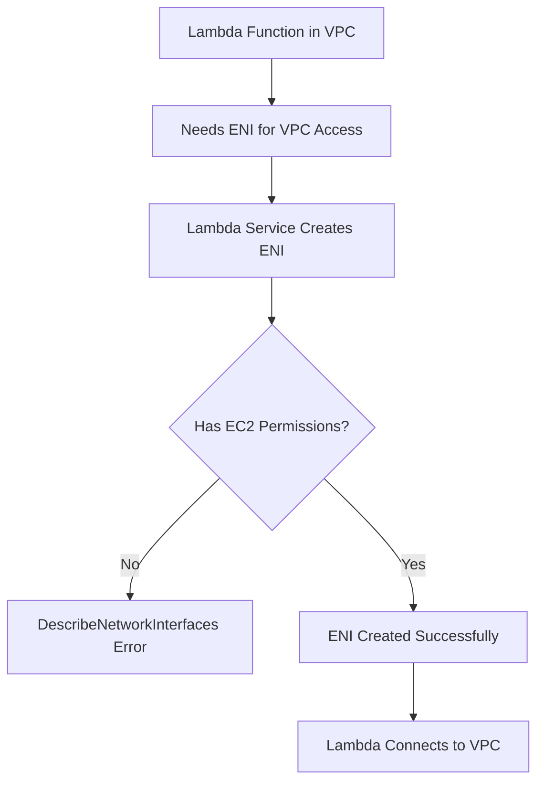

# How to Fix 'DescribeNetworkInterfaces' Permission Errors in Lambda

Author: [nawazdhandala](https://www.github.com/nawazdhandala)

Tags: Terraform, AWS, Lambda, IAM, VPC, Troubleshooting

Description: Learn how to resolve the common 'DescribeNetworkInterfaces' permission error when deploying Lambda functions in VPCs with Terraform. This guide covers IAM policies, ENI management, and best practices.

When deploying AWS Lambda functions inside a VPC using Terraform, you might encounter the dreaded "DescribeNetworkInterfaces" permission error. This occurs because Lambda needs specific EC2 permissions to manage Elastic Network Interfaces (ENIs) that connect your function to the VPC. Let's understand why this happens and how to fix it properly.

## Understanding the Error

The error typically appears during `terraform apply`:

```
Error: error creating Lambda Function: InvalidParameterValueException:
The provided execution role does not have permissions to call
DescribeNetworkInterfaces on EC2

Error: error creating Lambda Function: InvalidParameterValueException:
The provided execution role does not have permissions to call
CreateNetworkInterface on EC2
```



## Why Lambda Needs EC2 Permissions

When you configure a Lambda function with VPC access, AWS creates Elastic Network Interfaces in your specified subnets. The Lambda execution role needs permissions to:

1. **DescribeNetworkInterfaces** - Find existing ENIs
2. **CreateNetworkInterface** - Create new ENIs for the function
3. **DeleteNetworkInterface** - Clean up ENIs when the function is deleted
4. **DescribeSubnets** - Validate subnet configurations
5. **DescribeVpcs** - Validate VPC configurations
6. **DescribeSecurityGroups** - Validate security group configurations
7. **AssignPrivateIpAddresses** - Assign IPs to ENIs

## The Solution: AWSLambdaVPCAccessExecutionRole

AWS provides a managed policy specifically for this purpose:

```hcl
# Lambda execution role
resource "aws_iam_role" "lambda" {
  name = "lambda-vpc-execution-role"

  assume_role_policy = jsonencode({
    Version = "2012-10-17"
    Statement = [{
      Action = "sts:AssumeRole"
      Effect = "Allow"
      Principal = {
        Service = "lambda.amazonaws.com"
      }
    }]
  })
}

# Attach the managed VPC access policy
resource "aws_iam_role_policy_attachment" "lambda_vpc_access" {
  role       = aws_iam_role.lambda.name
  policy_arn = "arn:aws:iam::aws:policy/service-role/AWSLambdaVPCAccessExecutionRole"
}

# Also attach basic execution role for CloudWatch Logs
resource "aws_iam_role_policy_attachment" "lambda_basic" {
  role       = aws_iam_role.lambda.name
  policy_arn = "arn:aws:iam::aws:policy/service-role/AWSLambdaBasicExecutionRole"
}
```

## Custom Policy Approach

If you prefer a custom policy with minimal permissions:

```hcl
resource "aws_iam_role" "lambda" {
  name = "lambda-vpc-execution-role"

  assume_role_policy = jsonencode({
    Version = "2012-10-17"
    Statement = [{
      Action = "sts:AssumeRole"
      Effect = "Allow"
      Principal = {
        Service = "lambda.amazonaws.com"
      }
    }]
  })
}

resource "aws_iam_role_policy" "lambda_vpc_access" {
  name = "lambda-vpc-access"
  role = aws_iam_role.lambda.id

  policy = jsonencode({
    Version = "2012-10-17"
    Statement = [
      {
        Sid    = "VPCNetworkInterfaceManagement"
        Effect = "Allow"
        Action = [
          "ec2:CreateNetworkInterface",
          "ec2:DescribeNetworkInterfaces",
          "ec2:DeleteNetworkInterface",
          "ec2:AssignPrivateIpAddresses",
          "ec2:UnassignPrivateIpAddresses"
        ]
        Resource = "*"
      },
      {
        Sid    = "VPCDescribePermissions"
        Effect = "Allow"
        Action = [
          "ec2:DescribeSubnets",
          "ec2:DescribeSecurityGroups",
          "ec2:DescribeVpcs"
        ]
        Resource = "*"
      },
      {
        Sid    = "CloudWatchLogs"
        Effect = "Allow"
        Action = [
          "logs:CreateLogGroup",
          "logs:CreateLogStream",
          "logs:PutLogEvents"
        ]
        Resource = "arn:aws:logs:*:*:*"
      }
    ]
  })
}
```

## More Restrictive Policy with Resource Constraints

For better security, restrict permissions to specific resources:

```hcl
data "aws_caller_identity" "current" {}
data "aws_region" "current" {}

resource "aws_iam_role_policy" "lambda_vpc_access_restricted" {
  name = "lambda-vpc-access-restricted"
  role = aws_iam_role.lambda.id

  policy = jsonencode({
    Version = "2012-10-17"
    Statement = [
      {
        Sid    = "CreateNetworkInterfaceInSubnets"
        Effect = "Allow"
        Action = [
          "ec2:CreateNetworkInterface"
        ]
        Resource = [
          "arn:aws:ec2:${data.aws_region.current.name}:${data.aws_caller_identity.current.account_id}:subnet/${aws_subnet.private_a.id}",
          "arn:aws:ec2:${data.aws_region.current.name}:${data.aws_caller_identity.current.account_id}:subnet/${aws_subnet.private_b.id}",
          "arn:aws:ec2:${data.aws_region.current.name}:${data.aws_caller_identity.current.account_id}:network-interface/*",
          "arn:aws:ec2:${data.aws_region.current.name}:${data.aws_caller_identity.current.account_id}:security-group/${aws_security_group.lambda.id}"
        ]
      },
      {
        Sid    = "ManageNetworkInterfaces"
        Effect = "Allow"
        Action = [
          "ec2:DescribeNetworkInterfaces",
          "ec2:DeleteNetworkInterface",
          "ec2:AssignPrivateIpAddresses",
          "ec2:UnassignPrivateIpAddresses"
        ]
        Resource = "*"
        Condition = {
          StringEquals = {
            "ec2:Vpc" = "arn:aws:ec2:${data.aws_region.current.name}:${data.aws_caller_identity.current.account_id}:vpc/${aws_vpc.main.id}"
          }
        }
      },
      {
        Sid    = "DescribeVPCResources"
        Effect = "Allow"
        Action = [
          "ec2:DescribeSubnets",
          "ec2:DescribeSecurityGroups",
          "ec2:DescribeVpcs"
        ]
        Resource = "*"
      }
    ]
  })
}
```

## Complete Lambda with VPC Configuration

Here's a complete example that won't have permission errors:

```hcl
# VPC and networking
resource "aws_vpc" "main" {
  cidr_block           = "10.0.0.0/16"
  enable_dns_hostnames = true
  enable_dns_support   = true

  tags = {
    Name = "lambda-vpc"
  }
}

resource "aws_subnet" "private_a" {
  vpc_id            = aws_vpc.main.id
  cidr_block        = "10.0.1.0/24"
  availability_zone = "${data.aws_region.current.name}a"

  tags = {
    Name = "lambda-private-a"
  }
}

resource "aws_subnet" "private_b" {
  vpc_id            = aws_vpc.main.id
  cidr_block        = "10.0.2.0/24"
  availability_zone = "${data.aws_region.current.name}b"

  tags = {
    Name = "lambda-private-b"
  }
}

# Security group for Lambda
resource "aws_security_group" "lambda" {
  name        = "lambda-sg"
  description = "Security group for Lambda function"
  vpc_id      = aws_vpc.main.id

  egress {
    from_port   = 0
    to_port     = 0
    protocol    = "-1"
    cidr_blocks = ["0.0.0.0/0"]
  }

  tags = {
    Name = "lambda-sg"
  }
}

# Lambda execution role with VPC permissions
resource "aws_iam_role" "lambda" {
  name = "lambda-vpc-role"

  assume_role_policy = jsonencode({
    Version = "2012-10-17"
    Statement = [{
      Action = "sts:AssumeRole"
      Effect = "Allow"
      Principal = {
        Service = "lambda.amazonaws.com"
      }
    }]
  })
}

resource "aws_iam_role_policy_attachment" "lambda_vpc" {
  role       = aws_iam_role.lambda.name
  policy_arn = "arn:aws:iam::aws:policy/service-role/AWSLambdaVPCAccessExecutionRole"
}

resource "aws_iam_role_policy_attachment" "lambda_basic" {
  role       = aws_iam_role.lambda.name
  policy_arn = "arn:aws:iam::aws:policy/service-role/AWSLambdaBasicExecutionRole"
}

# Lambda function
resource "aws_lambda_function" "main" {
  function_name = "vpc-connected-function"
  role          = aws_iam_role.lambda.arn
  handler       = "index.handler"
  runtime       = "nodejs18.x"
  filename      = data.archive_file.lambda.output_path

  vpc_config {
    subnet_ids         = [aws_subnet.private_a.id, aws_subnet.private_b.id]
    security_group_ids = [aws_security_group.lambda.id]
  }

  # Important: Wait for IAM role to propagate
  depends_on = [
    aws_iam_role_policy_attachment.lambda_vpc,
    aws_iam_role_policy_attachment.lambda_basic,
    aws_cloudwatch_log_group.lambda
  ]
}

# CloudWatch Log Group (created explicitly to control retention)
resource "aws_cloudwatch_log_group" "lambda" {
  name              = "/aws/lambda/vpc-connected-function"
  retention_in_days = 14
}

# Lambda source code
data "archive_file" "lambda" {
  type        = "zip"
  output_path = "${path.module}/lambda.zip"

  source {
    content  = <<-EOT
      exports.handler = async (event) => {
        console.log('Event:', JSON.stringify(event));
        return {
          statusCode: 200,
          body: JSON.stringify({ message: 'Hello from VPC!' })
        };
      };
    EOT
    filename = "index.js"
  }
}
```

## Common Pitfalls and Solutions

### Pitfall 1: IAM Propagation Delay

IAM policies take time to propagate. Add explicit dependencies:

```hcl
resource "aws_lambda_function" "main" {
  # ... configuration

  depends_on = [
    aws_iam_role_policy_attachment.lambda_vpc,
    aws_iam_role_policy_attachment.lambda_basic
  ]
}
```

Or add a time delay:

```hcl
resource "time_sleep" "wait_for_iam" {
  depends_on = [
    aws_iam_role_policy_attachment.lambda_vpc
  ]

  create_duration = "10s"
}

resource "aws_lambda_function" "main" {
  # ... configuration

  depends_on = [time_sleep.wait_for_iam]
}
```

### Pitfall 2: Subnet Has No Route to NAT Gateway

VPC Lambda functions lose internet access. Ensure subnets have NAT Gateway routes:

```hcl
# NAT Gateway for outbound internet access
resource "aws_eip" "nat" {
  domain = "vpc"
}

resource "aws_nat_gateway" "main" {
  allocation_id = aws_eip.nat.id
  subnet_id     = aws_subnet.public.id
}

resource "aws_route_table" "private" {
  vpc_id = aws_vpc.main.id

  route {
    cidr_block     = "0.0.0.0/0"
    nat_gateway_id = aws_nat_gateway.main.id
  }
}

resource "aws_route_table_association" "private_a" {
  subnet_id      = aws_subnet.private_a.id
  route_table_id = aws_route_table.private.id
}
```

### Pitfall 3: ENI Limits

Each Lambda function creates ENIs. Check your account limits:

```bash
aws service-quotas get-service-quota \
  --service-code ec2 \
  --quota-code L-DF5E4CA3
```

### Pitfall 4: Deleting Lambda with Active ENIs

ENI cleanup can take time. Increase delete timeouts:

```hcl
resource "aws_lambda_function" "main" {
  # ... configuration

  timeouts {
    create = "10m"
    delete = "10m"
  }
}
```

## Using AWS Lambda Module

The terraform-aws-modules/lambda module handles this automatically:

```hcl
module "lambda" {
  source  = "terraform-aws-modules/lambda/aws"
  version = "~> 6.0"

  function_name = "vpc-connected-function"
  handler       = "index.handler"
  runtime       = "nodejs18.x"

  source_path = "${path.module}/src"

  vpc_subnet_ids         = [aws_subnet.private_a.id, aws_subnet.private_b.id]
  vpc_security_group_ids = [aws_security_group.lambda.id]

  # Module automatically adds required VPC permissions
  attach_network_policy = true
}
```

## Conclusion

The "DescribeNetworkInterfaces" error is a common hurdle when deploying VPC-connected Lambda functions with Terraform. The fix is straightforward: ensure your Lambda execution role has the `AWSLambdaVPCAccessExecutionRole` managed policy or equivalent custom permissions. Remember to handle IAM propagation delays with explicit dependencies and consider using established Terraform modules that handle these permissions automatically.
