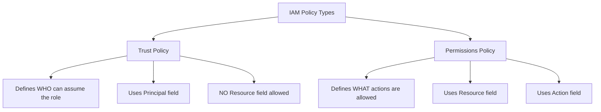

# How to Fix "MalformedPolicyDocument: Has prohibited field Resource"

Author: [nawazdhandala](https://www.github.com/nawazdhandala)

Tags: Terraform, AWS, IAM, Policy, Troubleshooting, Security

Description: Learn how to fix the "MalformedPolicyDocument: Has prohibited field Resource" error in Terraform AWS deployments. This guide explains IAM policy types, trust policies vs permissions policies, and correct policy structures.

The "MalformedPolicyDocument: Has prohibited field Resource" error is a common pitfall when working with AWS IAM in Terraform. This error occurs when you incorrectly include a `Resource` field in an IAM trust policy (assume role policy). Understanding the difference between trust policies and permissions policies is key to fixing this issue.

## Understanding the Error

The error typically looks like this:

```
Error: error creating IAM Role (my-role): MalformedPolicyDocument:
Has prohibited field Resource

  on main.tf line 10, in resource "aws_iam_role" "example":
  10: resource "aws_iam_role" "example" {
```



## The Problem: Wrong Policy Type

The error occurs when you use a permissions policy structure in the `assume_role_policy` argument:

```hcl
# WRONG - This causes the error
resource "aws_iam_role" "example" {
  name = "my-role"

  assume_role_policy = jsonencode({
    Version = "2012-10-17"
    Statement = [{
      Effect   = "Allow"
      Action   = "sts:AssumeRole"
      Resource = "*"  # ERROR: Resource not allowed in trust policy!
    }]
  })
}
```

## The Solution: Use Principal Instead of Resource

Trust policies define WHO can assume the role using `Principal`:

```hcl
# CORRECT - Trust policy structure
resource "aws_iam_role" "example" {
  name = "my-role"

  assume_role_policy = jsonencode({
    Version = "2012-10-17"
    Statement = [{
      Effect = "Allow"
      Principal = {
        Service = "lambda.amazonaws.com"
      }
      Action = "sts:AssumeRole"
    }]
  })
}
```

## Common Scenarios and Fixes

### Scenario 1: Lambda Execution Role

```hcl
# WRONG
resource "aws_iam_role" "lambda" {
  name = "lambda-execution-role"

  assume_role_policy = jsonencode({
    Version = "2012-10-17"
    Statement = [{
      Effect   = "Allow"
      Action   = "sts:AssumeRole"
      Resource = "arn:aws:lambda:*:*:function:*"  # Wrong!
    }]
  })
}

# CORRECT
resource "aws_iam_role" "lambda" {
  name = "lambda-execution-role"

  assume_role_policy = jsonencode({
    Version = "2012-10-17"
    Statement = [{
      Effect = "Allow"
      Principal = {
        Service = "lambda.amazonaws.com"
      }
      Action = "sts:AssumeRole"
    }]
  })
}
```

### Scenario 2: EC2 Instance Role

```hcl
# WRONG
resource "aws_iam_role" "ec2" {
  name = "ec2-instance-role"

  assume_role_policy = jsonencode({
    Version = "2012-10-17"
    Statement = [{
      Effect   = "Allow"
      Action   = "sts:AssumeRole"
      Resource = "arn:aws:ec2:*:*:instance/*"  # Wrong!
    }]
  })
}

# CORRECT
resource "aws_iam_role" "ec2" {
  name = "ec2-instance-role"

  assume_role_policy = jsonencode({
    Version = "2012-10-17"
    Statement = [{
      Effect = "Allow"
      Principal = {
        Service = "ec2.amazonaws.com"
      }
      Action = "sts:AssumeRole"
    }]
  })
}
```

### Scenario 3: Cross-Account Role Assumption

```hcl
# WRONG
resource "aws_iam_role" "cross_account" {
  name = "cross-account-role"

  assume_role_policy = jsonencode({
    Version = "2012-10-17"
    Statement = [{
      Effect   = "Allow"
      Action   = "sts:AssumeRole"
      Resource = "arn:aws:iam::OTHER_ACCOUNT:root"  # Wrong!
    }]
  })
}

# CORRECT
resource "aws_iam_role" "cross_account" {
  name = "cross-account-role"

  assume_role_policy = jsonencode({
    Version = "2012-10-17"
    Statement = [{
      Effect = "Allow"
      Principal = {
        AWS = "arn:aws:iam::OTHER_ACCOUNT:root"
      }
      Action = "sts:AssumeRole"
    }]
  })
}
```

### Scenario 4: ECS Task Role

```hcl
# CORRECT ECS task execution role
resource "aws_iam_role" "ecs_task_execution" {
  name = "ecs-task-execution-role"

  assume_role_policy = jsonencode({
    Version = "2012-10-17"
    Statement = [{
      Effect = "Allow"
      Principal = {
        Service = "ecs-tasks.amazonaws.com"
      }
      Action = "sts:AssumeRole"
    }]
  })
}
```

### Scenario 5: Multiple Principals

```hcl
# Allow both Lambda and API Gateway to assume the role
resource "aws_iam_role" "multi_service" {
  name = "multi-service-role"

  assume_role_policy = jsonencode({
    Version = "2012-10-17"
    Statement = [{
      Effect = "Allow"
      Principal = {
        Service = [
          "lambda.amazonaws.com",
          "apigateway.amazonaws.com"
        ]
      }
      Action = "sts:AssumeRole"
    }]
  })
}
```

## Complete Example: Role with Both Policies

Here's how to correctly define both the trust policy and permissions policy:

```hcl
# IAM Role with trust policy (assume_role_policy)
resource "aws_iam_role" "lambda" {
  name = "lambda-execution-role"

  # Trust policy - defines WHO can assume this role
  # Uses Principal, NOT Resource
  assume_role_policy = jsonencode({
    Version = "2012-10-17"
    Statement = [{
      Effect = "Allow"
      Principal = {
        Service = "lambda.amazonaws.com"
      }
      Action = "sts:AssumeRole"
    }]
  })
}

# Permissions policy - defines WHAT actions the role can perform
# Uses Resource to specify which resources actions apply to
resource "aws_iam_role_policy" "lambda_permissions" {
  name = "lambda-permissions"
  role = aws_iam_role.lambda.id

  policy = jsonencode({
    Version = "2012-10-17"
    Statement = [
      {
        Effect = "Allow"
        Action = [
          "logs:CreateLogGroup",
          "logs:CreateLogStream",
          "logs:PutLogEvents"
        ]
        Resource = "arn:aws:logs:*:*:*"  # Resource IS allowed here
      },
      {
        Effect = "Allow"
        Action = [
          "s3:GetObject",
          "s3:PutObject"
        ]
        Resource = "arn:aws:s3:::my-bucket/*"  # Resource IS allowed here
      }
    ]
  })
}
```

## Policy Comparison Table

| Attribute | Trust Policy (assume_role_policy) | Permissions Policy |
|-----------|----------------------------------|-------------------|
| Purpose | Who can assume the role | What actions are allowed |
| Principal | Required | Not used |
| Resource | Prohibited | Required |
| Action | Usually `sts:AssumeRole` | Service-specific actions |
| Attached to | Role (inline) | Role, User, Group |

## Using Data Sources for Common Trust Policies

AWS provides data sources for common trust policy patterns:

```hcl
# Use aws_iam_policy_document for cleaner syntax
data "aws_iam_policy_document" "lambda_assume_role" {
  statement {
    effect = "Allow"

    principals {
      type        = "Service"
      identifiers = ["lambda.amazonaws.com"]
    }

    actions = ["sts:AssumeRole"]
  }
}

resource "aws_iam_role" "lambda" {
  name               = "lambda-execution-role"
  assume_role_policy = data.aws_iam_policy_document.lambda_assume_role.json
}
```

## Adding Conditions to Trust Policies

Trust policies can include conditions:

```hcl
resource "aws_iam_role" "github_actions" {
  name = "github-actions-role"

  assume_role_policy = jsonencode({
    Version = "2012-10-17"
    Statement = [{
      Effect = "Allow"
      Principal = {
        Federated = "arn:aws:iam::${data.aws_caller_identity.current.account_id}:oidc-provider/token.actions.githubusercontent.com"
      }
      Action = "sts:AssumeRoleWithWebIdentity"
      Condition = {
        StringEquals = {
          "token.actions.githubusercontent.com:aud" = "sts.amazonaws.com"
        }
        StringLike = {
          "token.actions.githubusercontent.com:sub" = "repo:myorg/myrepo:*"
        }
      }
    }]
  })
}
```

## Debugging Policy Errors

### 1. Validate JSON Syntax

```bash
# Check JSON validity
echo '{"Version":"2012-10-17",...}' | jq .
```

### 2. Use Terraform Console

```bash
terraform console

> jsonencode({
    Version = "2012-10-17"
    Statement = [{
      Effect = "Allow"
      Principal = { Service = "lambda.amazonaws.com" }
      Action = "sts:AssumeRole"
    }]
  })
```

### 3. Check AWS IAM Policy Simulator

Test policies before applying:
- Go to IAM Console > Policy Simulator
- Test trust policies and permissions policies separately

### 4. Enable Detailed Terraform Logging

```bash
export TF_LOG=DEBUG
terraform apply
```

## Common AWS Service Principals

Reference for frequently used service principals:

```hcl
# Common AWS service principals for trust policies
locals {
  service_principals = {
    lambda          = "lambda.amazonaws.com"
    ec2             = "ec2.amazonaws.com"
    ecs_tasks       = "ecs-tasks.amazonaws.com"
    ecs             = "ecs.amazonaws.com"
    apigateway      = "apigateway.amazonaws.com"
    events          = "events.amazonaws.com"
    states          = "states.amazonaws.com"  # Step Functions
    codebuild       = "codebuild.amazonaws.com"
    codepipeline    = "codepipeline.amazonaws.com"
    cloudformation  = "cloudformation.amazonaws.com"
    s3              = "s3.amazonaws.com"
    sns             = "sns.amazonaws.com"
    sqs             = "sqs.amazonaws.com"
    rds             = "rds.amazonaws.com"
    elasticache     = "elasticache.amazonaws.com"
    firehose        = "firehose.amazonaws.com"
    glue            = "glue.amazonaws.com"
    eks             = "eks.amazonaws.com"
    eks_fargate_pod = "eks-fargate-pods.amazonaws.com"
  }
}
```

## Summary

The "Has prohibited field Resource" error occurs because:

1. **Trust policies** (assume_role_policy) define WHO can assume a role using `Principal`
2. **Permissions policies** define WHAT actions are allowed using `Resource`
3. Including `Resource` in a trust policy is invalid

Remember:
- Trust policy = Principal (who) + Action (sts:AssumeRole)
- Permissions policy = Action (what) + Resource (where)

Understanding this distinction eliminates this common Terraform/AWS IAM error and helps you write correct IAM configurations.
