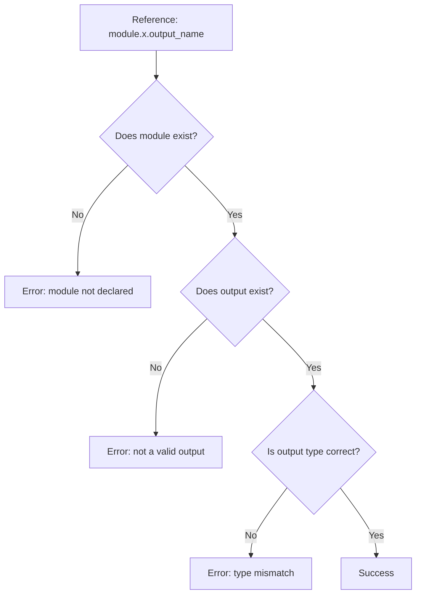

# How to Fix "Not a valid output for module" Errors in Terraform

Author: [nawazdhandala](https://www.github.com/nawazdhandala)

Tags: Terraform, Debugging, Infrastructure as Code, Modules, Troubleshooting

Description: Learn how to diagnose and fix the "not a valid output for module" error in Terraform. This guide covers common causes, debugging techniques, and best practices for module output management.

The "not a valid output for module" error is one of the most common issues Terraform users encounter when working with modules. This error occurs when you reference an output that doesn't exist in a module, often due to typos, refactoring, or misunderstanding module interfaces. Let's explore the causes and solutions.

## Understanding the Error

The error typically looks like this:

```
Error: Unsupported attribute

  on main.tf line 15, in resource "aws_instance" "example":
  15:   subnet_id = module.network.private_subnet_id

This object has no argument, nested block, or exported attribute named
"private_subnet_id". Did you mean "private_subnet_ids"?
```

Or:

```
Error: Invalid reference

  on main.tf line 20:
  20:   value = module.database.connection_string

A managed resource "module" "database" has not been declared in module.
```



## Common Causes and Solutions

### Cause 1: Typo in Output Name

The most common cause is a simple typo:

```hcl
# In the module (modules/network/outputs.tf)
output "private_subnet_ids" {  # Note: plural "ids"
  value = aws_subnet.private[*].id
}

# In the root module (main.tf) - WRONG
resource "aws_instance" "example" {
  subnet_id = module.network.private_subnet_id  # Missing 's'
}

# CORRECT
resource "aws_instance" "example" {
  subnet_id = module.network.private_subnet_ids[0]  # Correct name
}
```

**Solution**: Check the module's `outputs.tf` file for the exact output name.

### Cause 2: Output Not Defined in Module

The output simply doesn't exist in the module:

```hcl
# Module only exports these outputs
output "vpc_id" {
  value = aws_vpc.main.id
}

output "subnet_ids" {
  value = aws_subnet.main[*].id
}

# Trying to use non-existent output - WRONG
resource "aws_security_group" "example" {
  vpc_id = module.network.vpc_cidr_block  # This output doesn't exist
}
```

**Solution**: Add the missing output to the module:

```hcl
# Add to modules/network/outputs.tf
output "vpc_cidr_block" {
  description = "The CIDR block of the VPC"
  value       = aws_vpc.main.cidr_block
}
```

### Cause 3: Module Source Changed

When updating a module source, outputs might have changed:

```hcl
# Before update - using local module
module "database" {
  source = "./modules/database"
}

# After update - using registry module with different outputs
module "database" {
  source  = "terraform-aws-modules/rds/aws"
  version = "6.0.0"
}

# The output names are different!
# Local module: module.database.endpoint
# Registry module: module.database.db_instance_endpoint
```

**Solution**: Review the new module's documentation and update all references:

```hcl
# Update references to match new module outputs
output "database_endpoint" {
  value = module.database.db_instance_endpoint  # Updated name
}
```

### Cause 4: Conditional Module with count or for_each

When modules use `count` or `for_each`, they become lists or maps:

```hcl
# Module with count
module "database" {
  count  = var.create_database ? 1 : 0
  source = "./modules/database"
}

# WRONG - Treating as single instance
output "db_endpoint" {
  value = module.database.endpoint  # Error!
}

# CORRECT - Access with index
output "db_endpoint" {
  value = var.create_database ? module.database[0].endpoint : null
}

# Or use one() function
output "db_endpoint" {
  value = one(module.database[*].endpoint)
}
```

### Cause 5: Module Not Yet Applied

Outputs aren't available until the module is applied:

```hcl
module "vpc" {
  source = "./modules/vpc"
}

# If you've just added this module and haven't run apply,
# the outputs won't exist yet
resource "aws_instance" "example" {
  subnet_id = module.vpc.subnet_id  # May error if module not applied
}
```

**Solution**: Run `terraform init` and `terraform apply` to create the module resources first.

## Debugging Techniques

### 1. List Available Outputs

Use `terraform console` to explore module outputs:

```bash
$ terraform console

> module.network
{
  "private_subnet_ids" = [
    "subnet-abc123",
    "subnet-def456",
  ]
  "public_subnet_ids" = [
    "subnet-ghi789",
  ]
  "vpc_id" = "vpc-xyz123"
}

> keys(module.network)
[
  "private_subnet_ids",
  "public_subnet_ids",
  "vpc_id",
]
```

### 2. Check Module Output Definitions

```bash
# List all outputs in a module
cat modules/network/outputs.tf
```

### 3. Use terraform state list

Check what resources and outputs exist in state:

```bash
$ terraform state list

module.network.aws_vpc.main
module.network.aws_subnet.private[0]
module.network.aws_subnet.private[1]
```

### 4. Validate Configuration

Run validation to catch errors early:

```bash
$ terraform validate

Error: Unsupported attribute

  on main.tf line 25, in resource "aws_instance" "web":
  25:   subnet_id = module.network.privat_subnet_id

This object has no argument, nested block, or exported attribute named
"privat_subnet_id". Did you mean one of these?
  - private_subnet_ids
```

## Prevention Best Practices

### 1. Document Module Outputs

Create comprehensive output documentation:

```hcl
# modules/network/outputs.tf

output "vpc_id" {
  description = "The ID of the VPC"
  value       = aws_vpc.main.id
}

output "vpc_cidr_block" {
  description = "The CIDR block of the VPC"
  value       = aws_vpc.main.cidr_block
}

output "private_subnet_ids" {
  description = "List of private subnet IDs"
  value       = aws_subnet.private[*].id
}

output "public_subnet_ids" {
  description = "List of public subnet IDs"
  value       = aws_subnet.public[*].id
}

output "nat_gateway_ips" {
  description = "List of NAT Gateway public IPs"
  value       = aws_eip.nat[*].public_ip
}
```

### 2. Use IDE Extensions

Install Terraform extensions for VS Code or other IDEs that provide autocomplete for module outputs.

### 3. Create Output Variables File

Maintain a reference file listing all module outputs:

```hcl
# modules/network/README.md or outputs.md
/*
Available Outputs:
- vpc_id: string - The VPC ID
- vpc_cidr_block: string - The VPC CIDR block
- private_subnet_ids: list(string) - List of private subnet IDs
- public_subnet_ids: list(string) - List of public subnet IDs
- nat_gateway_ips: list(string) - NAT Gateway public IPs
*/
```

### 4. Version Lock Modules

Prevent unexpected changes by locking module versions:

```hcl
module "vpc" {
  source  = "terraform-aws-modules/vpc/aws"
  version = "5.1.2"  # Pin to specific version

  name = "my-vpc"
  cidr = "10.0.0.0/16"
}
```

### 5. Use Output Validation

Add validation to catch issues early:

```hcl
# In the calling configuration
locals {
  # Validate expected outputs exist
  _vpc_output_check = module.network.vpc_id
  _subnet_check     = length(module.network.private_subnet_ids) > 0
}

# This will fail at plan time if outputs don't exist
resource "null_resource" "output_validation" {
  triggers = {
    vpc_id         = local._vpc_output_check
    subnet_present = local._subnet_check
  }
}
```

## Advanced Scenarios

### Handling Optional Outputs

When outputs might not exist based on conditions:

```hcl
# In module
output "rds_endpoint" {
  description = "RDS endpoint (only if RDS is created)"
  value       = var.create_rds ? aws_db_instance.main[0].endpoint : null
}

# In calling code - handle null safely
locals {
  database_url = module.database.rds_endpoint != null ? (
    "postgresql://${var.db_user}:${var.db_password}@${module.database.rds_endpoint}/mydb"
  ) : ""
}
```

### Working with Complex Output Types

```hcl
# Module output with complex type
output "subnets" {
  value = {
    for subnet in aws_subnet.main :
    subnet.availability_zone => {
      id         = subnet.id
      cidr_block = subnet.cidr_block
      public     = subnet.map_public_ip_on_launch
    }
  }
}

# Accessing complex outputs
resource "aws_instance" "example" {
  for_each = module.network.subnets

  availability_zone = each.key
  subnet_id         = each.value.id

  tags = {
    CIDR = each.value.cidr_block
  }
}
```

### Migrating Between Module Versions

When upgrading modules with breaking output changes:

```hcl
# Create compatibility layer
locals {
  # Map old output names to new ones
  db_endpoint = try(
    module.database.db_instance_endpoint,  # New name (v6.x)
    module.database.this_db_instance_endpoint,  # Old name (v5.x)
    module.database.endpoint  # Even older name
  )
}

# Use the compatibility variable
output "database_connection" {
  value = local.db_endpoint
}
```

## Conclusion

The "not a valid output for module" error usually stems from simple issues like typos, missing outputs, or module interface changes. By using debugging tools like `terraform console`, maintaining good documentation, and following versioning best practices, you can quickly identify and resolve these errors. Remember to validate your configurations early and often, and keep your module interfaces well-documented to prevent these issues from occurring in the first place.
