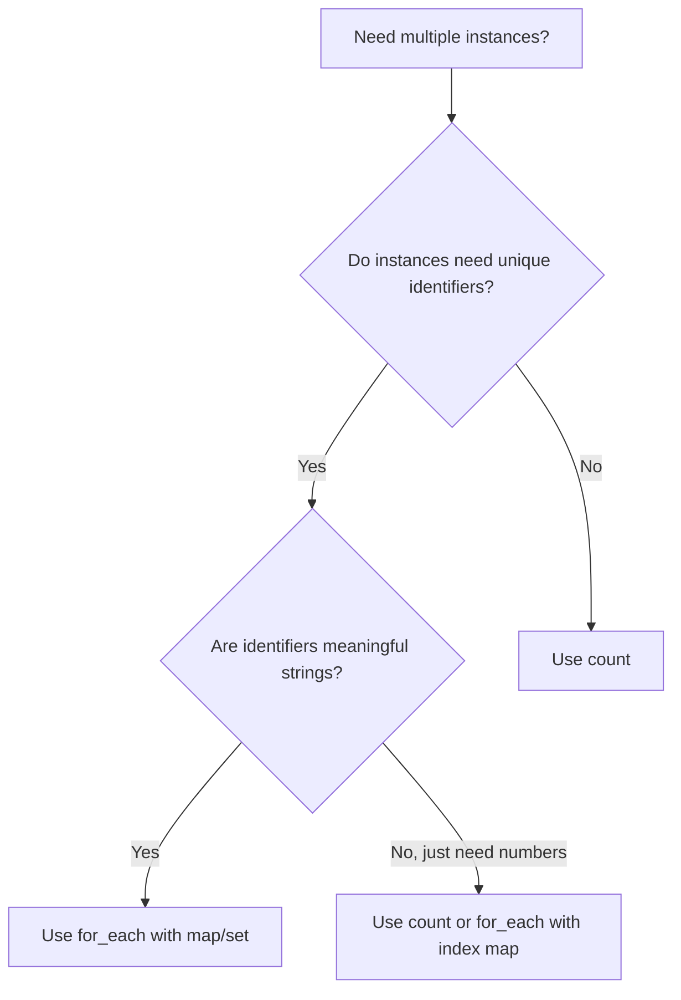

# How to Get List Index in Terraform for_each

Author: [nawazdhandala](https://www.github.com/nawazdhandala)

Tags: Terraform, Infrastructure as Code, DevOps, HCL

Description: Learn how to access list indices when using for_each in Terraform, including workarounds for common scenarios and when to use count vs for_each.

---

Terraform's `for_each` meta-argument creates multiple resource instances from a map or set. However, unlike `count`, `for_each` does not provide a direct index number. This guide shows you how to get indices when you need them and explains the best approach for different scenarios.

## The Index Problem with for_each

With `count`, you get `count.index` automatically:

```hcl
# Using count - index is available
resource "aws_instance" "server" {
  count         = 3
  ami           = "ami-0c55b159cbfafe1f0"
  instance_type = "t3.micro"

  tags = {
    Name = "server-${count.index}"  # server-0, server-1, server-2
  }
}
```

With `for_each`, you get `each.key` and `each.value`, but no numeric index:

```hcl
# Using for_each - no direct index
variable "server_names" {
  default = ["web", "api", "worker"]
}

resource "aws_instance" "server" {
  for_each      = toset(var.server_names)
  ami           = "ami-0c55b159cbfafe1f0"
  instance_type = "t3.micro"

  tags = {
    Name = each.key  # web, api, worker
    # But how do I get 0, 1, 2?
  }
}
```

## Method 1: Convert List to Map with Indices

The most common solution is transforming your list into a map with indices as keys:

```hcl
variable "server_names" {
  default = ["web", "api", "worker"]
}

locals {
  # Convert list to map: { "0" = "web", "1" = "api", "2" = "worker" }
  servers_with_index = { for idx, name in var.server_names : idx => name }
}

resource "aws_instance" "server" {
  for_each      = local.servers_with_index
  ami           = "ami-0c55b159cbfafe1f0"
  instance_type = "t3.micro"

  tags = {
    Name  = each.value           # web, api, worker
    Index = each.key             # 0, 1, 2
    Order = "server-${each.key}" # server-0, server-1, server-2
  }
}
```

## Method 2: Use zipmap for Index Access

Another approach uses `zipmap` to create a map from two lists:

```hcl
variable "availability_zones" {
  default = ["us-east-1a", "us-east-1b", "us-east-1c"]
}

locals {
  # Create map: { "0" = "us-east-1a", "1" = "us-east-1b", "2" = "us-east-1c" }
  az_map = zipmap(
    range(length(var.availability_zones)),
    var.availability_zones
  )
}

resource "aws_subnet" "private" {
  for_each          = local.az_map
  vpc_id            = aws_vpc.main.id
  availability_zone = each.value
  cidr_block        = cidrsubnet(aws_vpc.main.cidr_block, 8, tonumber(each.key))

  tags = {
    Name = "private-subnet-${each.key}"
    AZ   = each.value
  }
}
```

## Method 3: Create Complex Map with Index Property

For complex scenarios, create a map that includes the index as a property:

```hcl
variable "servers" {
  default = [
    { name = "web", size = "t3.micro" },
    { name = "api", size = "t3.small" },
    { name = "worker", size = "t3.medium" }
  ]
}

locals {
  # Map with index included in each value
  servers_map = {
    for idx, server in var.servers : server.name => merge(server, { index = idx })
  }
  # Result: {
  #   "web"    = { name = "web", size = "t3.micro", index = 0 }
  #   "api"    = { name = "api", size = "t3.small", index = 1 }
  #   "worker" = { name = "worker", size = "t3.medium", index = 2 }
  # }
}

resource "aws_instance" "server" {
  for_each      = local.servers_map
  ami           = "ami-0c55b159cbfafe1f0"
  instance_type = each.value.size

  tags = {
    Name     = each.key
    Size     = each.value.size
    Index    = each.value.index
    Priority = each.value.index == 0 ? "primary" : "secondary"
  }
}
```

## Practical Example: Subnet CIDR Calculation

A common need for indices is calculating CIDR blocks:

```hcl
variable "environment" {
  default = "production"
}

variable "availability_zones" {
  type    = list(string)
  default = ["us-east-1a", "us-east-1b", "us-east-1c"]
}

resource "aws_vpc" "main" {
  cidr_block = "10.0.0.0/16"

  tags = {
    Name = "${var.environment}-vpc"
  }
}

locals {
  # Create subnets with calculated CIDR blocks
  subnets = {
    for idx, az in var.availability_zones : az => {
      az         = az
      index      = idx
      cidr       = cidrsubnet(aws_vpc.main.cidr_block, 8, idx)
      name       = "${var.environment}-subnet-${idx}"
    }
  }
}

resource "aws_subnet" "main" {
  for_each = local.subnets

  vpc_id            = aws_vpc.main.id
  availability_zone = each.value.az
  cidr_block        = each.value.cidr

  tags = {
    Name  = each.value.name
    Index = each.value.index
    AZ    = each.value.az
  }
}

# Output the subnet IDs with their indices
output "subnet_info" {
  value = {
    for k, v in aws_subnet.main : k => {
      id    = v.id
      cidr  = v.cidr_block
      index = local.subnets[k].index
    }
  }
}
```

## When to Use count vs for_each

Understanding when to use each approach helps avoid index problems:



### Use count when:
- Instances are identical
- Order matters for referencing
- You need simple numeric indexing

```hcl
# Good use of count - identical instances
resource "aws_instance" "worker" {
  count         = var.worker_count
  ami           = var.ami_id
  instance_type = "t3.micro"

  tags = {
    Name = "worker-${count.index}"
  }
}
```

### Use for_each when:
- Each instance has unique attributes
- You want stable resource addresses
- Removing middle items should not affect others

```hcl
# Good use of for_each - stable addresses
variable "databases" {
  default = {
    users    = { size = "db.t3.micro", storage = 20 }
    products = { size = "db.t3.small", storage = 50 }
    orders   = { size = "db.t3.medium", storage = 100 }
  }
}

resource "aws_db_instance" "main" {
  for_each             = var.databases
  identifier           = each.key
  instance_class       = each.value.size
  allocated_storage    = each.value.storage
  engine               = "postgres"
  # ...
}
```

## Advanced: Nested for_each with Indices

For nested structures, combine multiple for expressions:

```hcl
variable "environments" {
  default = {
    dev  = ["app", "api"]
    prod = ["app", "api", "worker"]
  }
}

locals {
  # Flatten with indices
  services = merge([
    for env, services in var.environments : {
      for idx, svc in services : "${env}-${svc}" => {
        environment   = env
        service       = svc
        index         = idx
        global_index  = sum([for e, s in var.environments : length(s) if e < env]) + idx
      }
    }
  ]...)
}

resource "aws_ecs_service" "main" {
  for_each = local.services

  name            = each.key
  cluster         = aws_ecs_cluster.main[each.value.environment].id
  task_definition = aws_ecs_task_definition.main[each.value.service].arn
  desired_count   = each.value.index == 0 ? 3 : 1  # Primary service gets more instances
}
```

## Common Pitfalls

### Pitfall 1: Changing List Order

```hcl
# DANGEROUS: Changing order causes resource recreation
variable "servers" {
  default = ["web", "api"]  # If you change to ["api", "web"], resources recreate
}

# SAFE: Use meaningful keys
variable "servers" {
  default = {
    web = { size = "t3.micro" }
    api = { size = "t3.small" }
  }
}
```

### Pitfall 2: Using toset Loses Order

```hcl
# toset() creates unordered set - indices may not match original order
locals {
  names = toset(["charlie", "alice", "bob"])  # Order is not guaranteed
}
```

### Pitfall 3: Mixing count and for_each References

```hcl
# This works - referencing for_each resources
output "instance_ids" {
  value = [for instance in aws_instance.server : instance.id]
}

# For specific index access, use the key
output "first_instance" {
  value = aws_instance.server["web"].id  # Use the key, not index
}
```

---

While Terraform's `for_each` does not provide direct numeric indices, converting lists to maps with indices solves most use cases. Choose the method that best fits your needs: simple index maps for basic numbering, or complex maps when you need indices alongside other properties. Remember that `for_each` with meaningful keys provides more stable resource addresses than `count` with indices.
