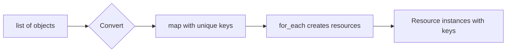

# How to Loop Through list(objects) with for_each in Terraform

Author: [nawazdhandala](https://www.github.com/nawazdhandala)

Tags: Terraform, for_each, Loops, Lists, Objects, HCL

Description: Learn how to effectively use for_each with list of objects in Terraform, including conversion techniques, indexing strategies, and best practices for managing multiple similar resources.

Terraform's `for_each` meta-argument is powerful for creating multiple similar resources, but it requires a map or set of strings - not a list directly. This guide shows you how to work with lists of objects effectively.

## Understanding the Challenge



The `for_each` meta-argument doesn't accept lists directly because resources need stable keys for state management. Here's how to convert and use lists of objects.

## Basic Conversion: List to Map

The most common pattern uses a `for` expression to convert a list to a map:

```hcl
variable "users" {
  type = list(object({
    name  = string
    email = string
    role  = string
  }))
  default = [
    {
      name  = "alice"
      email = "alice@example.com"
      role  = "admin"
    },
    {
      name  = "bob"
      email = "bob@example.com"
      role  = "developer"
    },
    {
      name  = "charlie"
      email = "charlie@example.com"
      role  = "viewer"
    }
  ]
}

# Convert list to map using 'name' as the key
resource "aws_iam_user" "users" {
  for_each = { for user in var.users : user.name => user }

  name = each.value.name

  tags = {
    Email = each.value.email
    Role  = each.value.role
  }
}

# Access the resources
output "user_arns" {
  value = { for k, v in aws_iam_user.users : k => v.arn }
}
```

## Using Index as Key

When objects don't have a unique identifier, use the index:

```hcl
variable "subnets" {
  type = list(object({
    cidr_block        = string
    availability_zone = string
  }))
  default = [
    {
      cidr_block        = "10.0.1.0/24"
      availability_zone = "us-east-1a"
    },
    {
      cidr_block        = "10.0.2.0/24"
      availability_zone = "us-east-1b"
    },
    {
      cidr_block        = "10.0.3.0/24"
      availability_zone = "us-east-1c"
    }
  ]
}

# Using index as key
resource "aws_subnet" "private" {
  for_each = { for idx, subnet in var.subnets : idx => subnet }

  vpc_id            = aws_vpc.main.id
  cidr_block        = each.value.cidr_block
  availability_zone = each.value.availability_zone

  tags = {
    Name = "private-subnet-${each.key}"
  }
}
```

**Note**: Using index as key means if you reorder the list, Terraform will destroy and recreate resources. Prefer meaningful keys when possible.

## Creating Compound Keys

For more stability, create compound keys from multiple fields:

```hcl
variable "security_group_rules" {
  type = list(object({
    type        = string
    from_port   = number
    to_port     = number
    protocol    = string
    cidr_blocks = list(string)
    description = string
  }))
  default = [
    {
      type        = "ingress"
      from_port   = 443
      to_port     = 443
      protocol    = "tcp"
      cidr_blocks = ["0.0.0.0/0"]
      description = "HTTPS"
    },
    {
      type        = "ingress"
      from_port   = 80
      to_port     = 80
      protocol    = "tcp"
      cidr_blocks = ["0.0.0.0/0"]
      description = "HTTP"
    },
    {
      type        = "egress"
      from_port   = 0
      to_port     = 0
      protocol    = "-1"
      cidr_blocks = ["0.0.0.0/0"]
      description = "All outbound"
    }
  ]
}

# Create unique key from multiple fields
resource "aws_security_group_rule" "rules" {
  for_each = {
    for rule in var.security_group_rules :
    "${rule.type}-${rule.protocol}-${rule.from_port}-${rule.to_port}" => rule
  }

  security_group_id = aws_security_group.main.id
  type              = each.value.type
  from_port         = each.value.from_port
  to_port           = each.value.to_port
  protocol          = each.value.protocol
  cidr_blocks       = each.value.cidr_blocks
  description       = each.value.description
}
```

## Nested Loops: Flattening Lists

When you need to iterate over nested structures:

```hcl
variable "applications" {
  type = list(object({
    name         = string
    environments = list(string)
    port         = number
  }))
  default = [
    {
      name         = "api"
      environments = ["dev", "staging", "prod"]
      port         = 8080
    },
    {
      name         = "web"
      environments = ["dev", "staging", "prod"]
      port         = 3000
    }
  ]
}

locals {
  # Flatten to create app-environment combinations
  app_environments = flatten([
    for app in var.applications : [
      for env in app.environments : {
        key   = "${app.name}-${env}"
        name  = app.name
        env   = env
        port  = app.port
      }
    ]
  ])
}

# Create resources for each app-environment combination
resource "aws_ecs_service" "apps" {
  for_each = { for item in local.app_environments : item.key => item }

  name            = each.value.key
  cluster         = aws_ecs_cluster.main.id
  task_definition = aws_ecs_task_definition.apps[each.key].arn
  desired_count   = each.value.env == "prod" ? 3 : 1

  tags = {
    Application = each.value.name
    Environment = each.value.env
  }
}
```

## Filtering Lists Before for_each

Apply conditions to filter the list:

```hcl
variable "ec2_instances" {
  type = list(object({
    name          = string
    instance_type = string
    enabled       = bool
    environment   = string
  }))
  default = [
    {
      name          = "web-server"
      instance_type = "t3.medium"
      enabled       = true
      environment   = "production"
    },
    {
      name          = "batch-processor"
      instance_type = "c5.xlarge"
      enabled       = false
      environment   = "production"
    },
    {
      name          = "dev-server"
      instance_type = "t3.micro"
      enabled       = true
      environment   = "development"
    }
  ]
}

# Only create enabled instances
resource "aws_instance" "servers" {
  for_each = {
    for instance in var.ec2_instances :
    instance.name => instance
    if instance.enabled
  }

  ami           = var.ami_id
  instance_type = each.value.instance_type

  tags = {
    Name        = each.value.name
    Environment = each.value.environment
  }
}

# Only production instances
resource "aws_cloudwatch_metric_alarm" "cpu" {
  for_each = {
    for instance in var.ec2_instances :
    instance.name => instance
    if instance.enabled && instance.environment == "production"
  }

  alarm_name          = "${each.value.name}-cpu-alarm"
  comparison_operator = "GreaterThanThreshold"
  evaluation_periods  = 2
  metric_name         = "CPUUtilization"
  namespace           = "AWS/EC2"
  period              = 300
  statistic           = "Average"
  threshold           = 80

  dimensions = {
    InstanceId = aws_instance.servers[each.key].id
  }
}
```

## Working with Complex Nested Objects

```hcl
variable "databases" {
  type = list(object({
    name     = string
    engine   = string
    version  = string
    size     = string
    replicas = list(object({
      name   = string
      region = string
    }))
  }))
  default = [
    {
      name    = "users-db"
      engine  = "postgres"
      version = "15"
      size    = "db.r6g.large"
      replicas = [
        { name = "users-db-replica-1", region = "us-west-2" },
        { name = "users-db-replica-2", region = "eu-west-1" }
      ]
    },
    {
      name    = "orders-db"
      engine  = "postgres"
      version = "15"
      size    = "db.r6g.xlarge"
      replicas = [
        { name = "orders-db-replica-1", region = "us-west-2" }
      ]
    }
  ]
}

# Primary databases
resource "aws_db_instance" "primary" {
  for_each = { for db in var.databases : db.name => db }

  identifier     = each.value.name
  engine         = each.value.engine
  engine_version = each.value.version
  instance_class = each.value.size

  tags = {
    Name = each.value.name
    Role = "primary"
  }
}

# Flatten replicas with parent reference
locals {
  all_replicas = flatten([
    for db in var.databases : [
      for replica in db.replicas : {
        key         = replica.name
        primary_db  = db.name
        region      = replica.region
        engine      = db.engine
        version     = db.version
        size        = db.size
      }
    ]
  ])
}

# Read replicas
resource "aws_db_instance" "replicas" {
  for_each = { for replica in local.all_replicas : replica.key => replica }

  identifier          = each.value.key
  replicate_source_db = aws_db_instance.primary[each.value.primary_db].identifier
  instance_class      = each.value.size

  tags = {
    Name       = each.value.key
    Role       = "replica"
    PrimaryDB  = each.value.primary_db
    Region     = each.value.region
  }
}
```

## Handling Optional Fields

When objects have optional fields:

```hcl
variable "services" {
  type = list(object({
    name        = string
    port        = number
    health_path = optional(string, "/health")
    replicas    = optional(number, 1)
    cpu         = optional(number, 256)
    memory      = optional(number, 512)
  }))
  default = [
    {
      name = "api"
      port = 8080
      # Uses defaults for other fields
    },
    {
      name        = "worker"
      port        = 9090
      health_path = "/ready"
      replicas    = 3
      cpu         = 512
      memory      = 1024
    }
  ]
}

resource "aws_ecs_service" "services" {
  for_each = { for svc in var.services : svc.name => svc }

  name            = each.value.name
  cluster         = aws_ecs_cluster.main.id
  task_definition = aws_ecs_task_definition.services[each.key].arn
  desired_count   = each.value.replicas

  # Health check uses the optional health_path with default
  health_check_grace_period_seconds = 60
}

resource "aws_ecs_task_definition" "services" {
  for_each = { for svc in var.services : svc.name => svc }

  family = each.value.name

  container_definitions = jsonencode([
    {
      name      = each.value.name
      image     = "${var.ecr_repo}/${each.value.name}:latest"
      cpu       = each.value.cpu
      memory    = each.value.memory
      essential = true
      portMappings = [
        {
          containerPort = each.value.port
          hostPort      = each.value.port
        }
      ]
      healthCheck = {
        command = ["CMD-SHELL", "curl -f http://localhost:${each.value.port}${each.value.health_path} || exit 1"]
      }
    }
  ])
}
```

## Converting Back to List for Outputs

Sometimes you need to convert back to a list:

```hcl
output "subnet_ids" {
  description = "List of subnet IDs"
  value       = [for subnet in aws_subnet.private : subnet.id]
}

output "subnet_details" {
  description = "Map of subnet details"
  value = {
    for k, subnet in aws_subnet.private : k => {
      id                = subnet.id
      cidr_block        = subnet.cidr_block
      availability_zone = subnet.availability_zone
    }
  }
}
```

## Best Practices

1. **Use meaningful keys**: Prefer business identifiers over indices
2. **Keep keys stable**: Changing keys causes resource recreation
3. **Document key structure**: Comment on how keys are constructed
4. **Use locals for complex transformations**: Keep resource blocks clean
5. **Consider state implications**: Key changes affect state management

```hcl
locals {
  # Document the transformation
  # Key format: "{name}" - unique identifier for each user
  users_map = { for user in var.users : user.name => user }
}

resource "aws_iam_user" "users" {
  for_each = local.users_map
  # ...
}
```

## Conclusion

Working with lists of objects in Terraform's `for_each` requires converting to maps with unique keys. Choose keys that are stable and meaningful - avoid using indices when possible as they can cause unintended resource recreation. Use locals to handle complex transformations and keep your resource blocks readable. The `flatten` function is invaluable for nested structures, and filtering within the `for` expression helps create resources conditionally.
