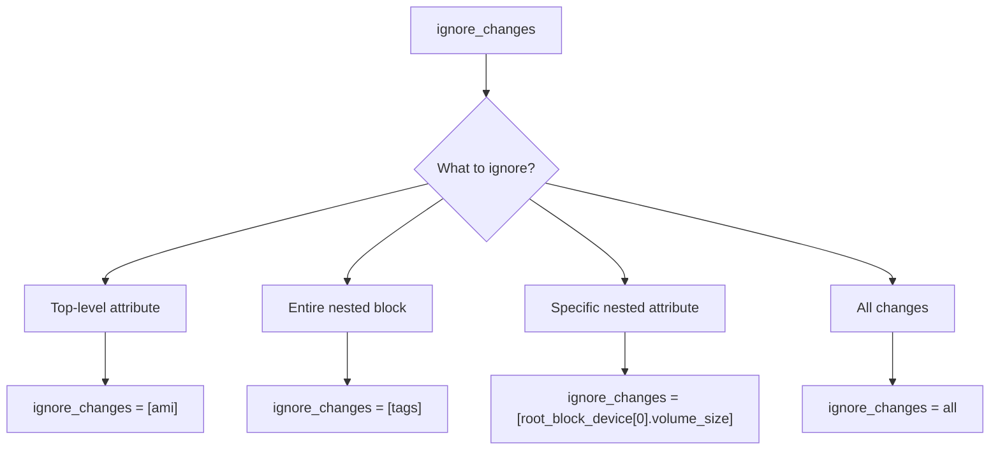

# How to Use ignore_changes with Sub-Blocks in Terraform

Author: [nawazdhandala](https://www.github.com/nawazdhandala)

Tags: Terraform, Infrastructure as Code, DevOps, Lifecycle Management

Description: Learn how to properly use ignore_changes with nested blocks and sub-attributes in Terraform, including common patterns for tags, containers, and dynamic configurations.

---

Terraform's `ignore_changes` lifecycle argument prevents specific attributes from triggering resource updates. However, using it with nested blocks and sub-attributes requires special syntax and understanding. This guide covers all the patterns you need to know.

## Basic ignore_changes Syntax

The basic syntax ignores top-level attributes:

```hcl
resource "aws_instance" "example" {
  ami           = "ami-0c55b159cbfafe1f0"
  instance_type = "t3.micro"

  lifecycle {
    ignore_changes = [
      ami,           # Ignore AMI changes
      instance_type  # Ignore instance type changes
    ]
  }
}
```

## Ignoring Entire Nested Blocks

To ignore changes to an entire nested block, reference the block name:

```hcl
resource "aws_instance" "example" {
  ami           = "ami-0c55b159cbfafe1f0"
  instance_type = "t3.micro"

  root_block_device {
    volume_size = 20
    volume_type = "gp3"
  }

  lifecycle {
    ignore_changes = [
      root_block_device  # Ignores ALL changes to the entire block
    ]
  }
}
```

## Ignoring Specific Attributes Within Nested Blocks

To ignore specific attributes inside a nested block, use dot notation:

```hcl
resource "aws_instance" "example" {
  ami           = "ami-0c55b159cbfafe1f0"
  instance_type = "t3.micro"

  root_block_device {
    volume_size = 20
    volume_type = "gp3"
    encrypted   = true
  }

  lifecycle {
    ignore_changes = [
      root_block_device[0].volume_size  # Only ignore volume_size changes
    ]
  }
}
```

## Ignoring Tags - Multiple Patterns

Tags are a common use case for `ignore_changes`. Here are different approaches:

### Ignore All Tags

```hcl
resource "aws_instance" "example" {
  ami           = "ami-0c55b159cbfafe1f0"
  instance_type = "t3.micro"

  tags = {
    Name        = "web-server"
    Environment = "production"
  }

  lifecycle {
    ignore_changes = [
      tags  # Ignore ALL tag changes
    ]
  }
}
```

### Ignore Specific Tag Keys

```hcl
resource "aws_instance" "example" {
  ami           = "ami-0c55b159cbfafe1f0"
  instance_type = "t3.micro"

  tags = {
    Name        = "web-server"
    Environment = "production"
    LastUpdated = timestamp()
  }

  lifecycle {
    ignore_changes = [
      tags["LastUpdated"]  # Only ignore the LastUpdated tag
    ]
  }
}
```

### Ignore tags_all (AWS Provider)

The AWS provider has a computed `tags_all` attribute that merges default provider tags:

```hcl
resource "aws_instance" "example" {
  ami           = "ami-0c55b159cbfafe1f0"
  instance_type = "t3.micro"

  tags = {
    Name = "web-server"
  }

  lifecycle {
    ignore_changes = [
      tags,
      tags_all  # Also ignore the computed tags_all
    ]
  }
}
```

## Ignoring List and Set Elements

For list-type attributes, use index notation:

```hcl
resource "aws_security_group" "example" {
  name        = "example"
  description = "Example security group"
  vpc_id      = aws_vpc.main.id

  ingress {
    from_port   = 443
    to_port     = 443
    protocol    = "tcp"
    cidr_blocks = ["0.0.0.0/0"]
  }

  ingress {
    from_port   = 80
    to_port     = 80
    protocol    = "tcp"
    cidr_blocks = ["0.0.0.0/0"]
  }

  lifecycle {
    ignore_changes = [
      ingress  # Ignore ALL ingress rules
      # OR
      # ingress[0]  # Ignore only the first ingress rule
    ]
  }
}
```

## ECS Task Definition Container Example

ECS task definitions have deeply nested container definitions:

```hcl
resource "aws_ecs_task_definition" "app" {
  family                   = "app"
  network_mode             = "awsvpc"
  requires_compatibilities = ["FARGATE"]
  cpu                      = "256"
  memory                   = "512"

  container_definitions = jsonencode([
    {
      name      = "app"
      image     = "nginx:latest"
      cpu       = 256
      memory    = 512
      essential = true

      portMappings = [
        {
          containerPort = 80
          hostPort      = 80
          protocol      = "tcp"
        }
      ]

      environment = [
        {
          name  = "DEPLOY_TIME"
          value = timestamp()
        }
      ]
    }
  ])

  lifecycle {
    ignore_changes = [
      container_definitions  # Ignore all container definition changes
    ]
  }
}
```

## Auto Scaling Group Launch Template Version

A common pattern is ignoring launch template version changes:

```hcl
resource "aws_autoscaling_group" "example" {
  name                = "example-asg"
  min_size            = 1
  max_size            = 10
  desired_capacity    = 2
  vpc_zone_identifier = [aws_subnet.private.id]

  launch_template {
    id      = aws_launch_template.example.id
    version = aws_launch_template.example.latest_version
  }

  lifecycle {
    ignore_changes = [
      launch_template[0].version,  # Ignore version changes
      desired_capacity             # Ignore capacity (managed by scaling)
    ]
  }
}
```

## Kubernetes Deployment Example

For Kubernetes resources, you often ignore fields managed by controllers:

```hcl
resource "kubernetes_deployment" "app" {
  metadata {
    name      = "app"
    namespace = "default"

    labels = {
      app = "app"
    }
  }

  spec {
    replicas = 3

    selector {
      match_labels = {
        app = "app"
      }
    }

    template {
      metadata {
        labels = {
          app = "app"
        }
      }

      spec {
        container {
          name  = "app"
          image = "nginx:1.21"

          resources {
            limits = {
              cpu    = "500m"
              memory = "512Mi"
            }
          }
        }
      }
    }
  }

  lifecycle {
    ignore_changes = [
      spec[0].replicas,                              # Managed by HPA
      spec[0].template[0].metadata[0].annotations,   # Added by controllers
      spec[0].template[0].spec[0].container[0].image # Updated by CI/CD
    ]
  }
}
```

## Azure Resource Manager Example

Azure resources often have nested properties:

```hcl
resource "azurerm_linux_virtual_machine" "example" {
  name                = "example-vm"
  resource_group_name = azurerm_resource_group.example.name
  location            = azurerm_resource_group.example.location
  size                = "Standard_B2s"
  admin_username      = "adminuser"

  network_interface_ids = [
    azurerm_network_interface.example.id
  ]

  admin_ssh_key {
    username   = "adminuser"
    public_key = file("~/.ssh/id_rsa.pub")
  }

  os_disk {
    caching              = "ReadWrite"
    storage_account_type = "Standard_LRS"
    disk_size_gb         = 30
  }

  source_image_reference {
    publisher = "Canonical"
    offer     = "0001-com-ubuntu-server-jammy"
    sku       = "22_04-lts"
    version   = "latest"
  }

  lifecycle {
    ignore_changes = [
      os_disk[0].disk_size_gb,              # Disk may be expanded manually
      source_image_reference[0].version,    # Don't update image automatically
      admin_ssh_key                         # SSH keys managed externally
    ]
  }
}
```

## Using ignore_changes with all

You can ignore all changes with the special `all` keyword:

```hcl
resource "aws_instance" "managed_externally" {
  ami           = "ami-0c55b159cbfafe1f0"
  instance_type = "t3.micro"

  lifecycle {
    ignore_changes = all  # Ignore ALL attribute changes
  }
}
```

This is useful for resources created by Terraform but managed externally afterward.

## Common Patterns Diagram



## Troubleshooting Common Issues

### Issue 1: Syntax Errors with Nested Paths

```hcl
# WRONG - missing index for list blocks
lifecycle {
  ignore_changes = [root_block_device.volume_size]
}

# CORRECT - include the index
lifecycle {
  ignore_changes = [root_block_device[0].volume_size]
}
```

### Issue 2: ignore_changes Not Working

If changes are still detected, check:

1. The attribute path is correct
2. You are referencing the right block index
3. The change is not from a different attribute

```bash
# Use terraform plan to see which attribute is changing
terraform plan -out=plan.out
terraform show -json plan.out | jq '.resource_changes'
```

### Issue 3: Computed Attributes

Some attributes are computed and cannot be ignored:

```hcl
# This may not work for computed attributes
lifecycle {
  ignore_changes = [arn]  # ARN is computed, not settable
}
```

## Best Practices

1. **Document why you are ignoring changes** - Future maintainers need context:

```hcl
lifecycle {
  # Ignore image changes - deployments are handled by CI/CD pipeline
  # See: https://wiki.example.com/deployment-process
  ignore_changes = [
    spec[0].template[0].spec[0].container[0].image
  ]
}
```

2. **Be specific** - Ignore only what you need to:

```hcl
# Prefer this
ignore_changes = [tags["LastUpdated"]]

# Over this
ignore_changes = [tags]
```

3. **Consider alternatives** - Sometimes restructuring is better than ignoring:

```hcl
# Instead of ignoring, use a data source for external values
data "aws_ami" "latest" {
  most_recent = true
  owners      = ["amazon"]
  # ...
}
```

---

Understanding `ignore_changes` syntax for nested blocks helps you manage resources that are partially controlled by external systems. Use specific paths when possible, document your reasoning, and remember that the syntax varies between single blocks (use index `[0]`) and maps (use key `["key"]`).
