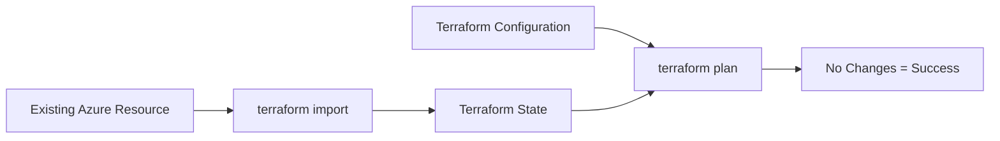

# How to Import Existing Azure Resources into Terraform State

Author: [nawazdhandala](https://www.github.com/nawazdhandala)

Tags: Terraform, Azure, Import, State Management, Migration, Infrastructure as Code

Description: Learn how to import existing Azure resources into Terraform state, including the new import block syntax, handling complex resources, and strategies for large-scale migrations.

Migrating existing Azure infrastructure to Terraform management is a common challenge. This guide covers various approaches to import Azure resources into Terraform state, from single resources to large-scale migrations.

## Understanding Terraform Import



When you import a resource:
1. Terraform adds the resource to its state file
2. You write the corresponding HCL configuration
3. Running `terraform plan` should show no changes if configuration matches reality

## Method 1: CLI Import Command

The traditional method uses the `terraform import` command.

### Basic Import Syntax

```bash
terraform import <resource_type>.<resource_name> <azure_resource_id>
```

### Example: Import Resource Group

```hcl
# First, write the resource configuration
resource "azurerm_resource_group" "main" {
  name     = "existing-rg"
  location = "eastus"

  tags = {
    Environment = "Production"
  }
}
```

```bash
# Then import the existing resource
terraform import azurerm_resource_group.main /subscriptions/00000000-0000-0000-0000-000000000000/resourceGroups/existing-rg
```

### Example: Import Virtual Network

```hcl
resource "azurerm_virtual_network" "main" {
  name                = "existing-vnet"
  resource_group_name = "existing-rg"
  location            = "eastus"
  address_space       = ["10.0.0.0/16"]
}
```

```bash
terraform import azurerm_virtual_network.main /subscriptions/00000000-0000-0000-0000-000000000000/resourceGroups/existing-rg/providers/Microsoft.Network/virtualNetworks/existing-vnet
```

## Method 2: Import Blocks (Terraform 1.5+)

The newer, declarative approach uses `import` blocks in your configuration:

```hcl
# imports.tf
import {
  to = azurerm_resource_group.main
  id = "/subscriptions/00000000-0000-0000-0000-000000000000/resourceGroups/existing-rg"
}

import {
  to = azurerm_virtual_network.main
  id = "/subscriptions/00000000-0000-0000-0000-000000000000/resourceGroups/existing-rg/providers/Microsoft.Network/virtualNetworks/existing-vnet"
}

import {
  to = azurerm_subnet.app
  id = "/subscriptions/00000000-0000-0000-0000-000000000000/resourceGroups/existing-rg/providers/Microsoft.Network/virtualNetworks/existing-vnet/subnets/app-subnet"
}

# resources.tf
resource "azurerm_resource_group" "main" {
  name     = "existing-rg"
  location = "eastus"
}

resource "azurerm_virtual_network" "main" {
  name                = "existing-vnet"
  resource_group_name = azurerm_resource_group.main.name
  location            = azurerm_resource_group.main.location
  address_space       = ["10.0.0.0/16"]
}

resource "azurerm_subnet" "app" {
  name                 = "app-subnet"
  resource_group_name  = azurerm_resource_group.main.name
  virtual_network_name = azurerm_virtual_network.main.name
  address_prefixes     = ["10.0.1.0/24"]
}
```

Run the import:

```bash
terraform plan   # Shows import actions
terraform apply  # Performs imports and any necessary updates
```

## Generating Configuration from Imports

Terraform 1.5+ can generate configuration stubs:

```bash
# Generate config for import blocks
terraform plan -generate-config-out=generated.tf
```

This creates a `generated.tf` file with resource configurations that match the imported resources.

## Finding Azure Resource IDs

### Using Azure CLI

```bash
# Resource group
az group show --name existing-rg --query id -o tsv

# Virtual network
az network vnet show --resource-group existing-rg --name existing-vnet --query id -o tsv

# Storage account
az storage account show --resource-group existing-rg --name existingstorage --query id -o tsv

# Key Vault
az keyvault show --name existing-keyvault --query id -o tsv

# App Service
az webapp show --resource-group existing-rg --name existing-webapp --query id -o tsv
```

### Using Azure Portal

Navigate to the resource > Properties > Resource ID

## Importing Complex Resources

### Storage Account with Containers

```hcl
# imports.tf
import {
  to = azurerm_storage_account.main
  id = "/subscriptions/00000000-0000-0000-0000-000000000000/resourceGroups/existing-rg/providers/Microsoft.Storage/storageAccounts/existingstorage"
}

import {
  to = azurerm_storage_container.data
  id = "https://existingstorage.blob.core.windows.net/data"
}

# resources.tf
resource "azurerm_storage_account" "main" {
  name                     = "existingstorage"
  resource_group_name      = azurerm_resource_group.main.name
  location                 = azurerm_resource_group.main.location
  account_tier             = "Standard"
  account_replication_type = "LRS"
  min_tls_version          = "TLS1_2"
}

resource "azurerm_storage_container" "data" {
  name                  = "data"
  storage_account_name  = azurerm_storage_account.main.name
  container_access_type = "private"
}
```

### AKS Cluster

```hcl
import {
  to = azurerm_kubernetes_cluster.main
  id = "/subscriptions/00000000-0000-0000-0000-000000000000/resourceGroups/existing-rg/providers/Microsoft.ContainerService/managedClusters/existing-aks"
}

resource "azurerm_kubernetes_cluster" "main" {
  name                = "existing-aks"
  location            = azurerm_resource_group.main.location
  resource_group_name = azurerm_resource_group.main.name
  dns_prefix          = "existing-aks"

  default_node_pool {
    name       = "default"
    node_count = 3
    vm_size    = "Standard_D2_v2"
  }

  identity {
    type = "SystemAssigned"
  }
}
```

### App Service with App Service Plan

```hcl
import {
  to = azurerm_service_plan.main
  id = "/subscriptions/00000000-0000-0000-0000-000000000000/resourceGroups/existing-rg/providers/Microsoft.Web/serverfarms/existing-plan"
}

import {
  to = azurerm_linux_web_app.main
  id = "/subscriptions/00000000-0000-0000-0000-000000000000/resourceGroups/existing-rg/providers/Microsoft.Web/sites/existing-webapp"
}

resource "azurerm_service_plan" "main" {
  name                = "existing-plan"
  resource_group_name = azurerm_resource_group.main.name
  location            = azurerm_resource_group.main.location
  os_type             = "Linux"
  sku_name            = "P1v2"
}

resource "azurerm_linux_web_app" "main" {
  name                = "existing-webapp"
  resource_group_name = azurerm_resource_group.main.name
  location            = azurerm_resource_group.main.location
  service_plan_id     = azurerm_service_plan.main.id

  site_config {
    application_stack {
      node_version = "18-lts"
    }
  }
}
```

## Bulk Import Script

For large migrations, create a script to generate import blocks:

```bash
#!/bin/bash
# generate-imports.sh

SUBSCRIPTION_ID="00000000-0000-0000-0000-000000000000"
RESOURCE_GROUP="existing-rg"

echo "# Auto-generated import blocks" > imports.tf

# Import all VNets
for vnet in $(az network vnet list -g $RESOURCE_GROUP --query "[].name" -o tsv); do
  id="/subscriptions/$SUBSCRIPTION_ID/resourceGroups/$RESOURCE_GROUP/providers/Microsoft.Network/virtualNetworks/$vnet"
  name=$(echo $vnet | tr '-' '_')
  cat >> imports.tf << EOF

import {
  to = azurerm_virtual_network.$name
  id = "$id"
}
EOF
done

# Import all Storage Accounts
for sa in $(az storage account list -g $RESOURCE_GROUP --query "[].name" -o tsv); do
  id="/subscriptions/$SUBSCRIPTION_ID/resourceGroups/$RESOURCE_GROUP/providers/Microsoft.Storage/storageAccounts/$sa"
  name=$(echo $sa | tr '-' '_')
  cat >> imports.tf << EOF

import {
  to = azurerm_storage_account.$name
  id = "$id"
}
EOF
done

echo "Generated imports.tf"
```

## Using for_each with Imports

Import resources that will use `for_each`:

```hcl
# For resources using for_each
import {
  to = azurerm_subnet.subnets["app"]
  id = "/subscriptions/.../subnets/app-subnet"
}

import {
  to = azurerm_subnet.subnets["data"]
  id = "/subscriptions/.../subnets/data-subnet"
}

# Resource definition
variable "subnets" {
  default = {
    app = {
      name           = "app-subnet"
      address_prefix = "10.0.1.0/24"
    }
    data = {
      name           = "data-subnet"
      address_prefix = "10.0.2.0/24"
    }
  }
}

resource "azurerm_subnet" "subnets" {
  for_each = var.subnets

  name                 = each.value.name
  resource_group_name  = azurerm_resource_group.main.name
  virtual_network_name = azurerm_virtual_network.main.name
  address_prefixes     = [each.value.address_prefix]
}
```

## Handling Import Errors

### Configuration Mismatch

If `terraform plan` shows changes after import:

1. Check the actual resource configuration in Azure
2. Update your Terraform configuration to match
3. Run `terraform plan` again until no changes

```bash
# Use -refresh-only to see current state
terraform plan -refresh-only

# Show specific resource state
terraform state show azurerm_virtual_network.main
```

### Missing Required Arguments

Some resources have required arguments not returned by the API:

```hcl
# After import, you may need to add required but not-imported values
resource "azurerm_key_vault" "main" {
  name                = "existing-keyvault"
  location            = azurerm_resource_group.main.location
  resource_group_name = azurerm_resource_group.main.name
  tenant_id           = data.azurerm_client_config.current.tenant_id
  sku_name            = "standard"

  # These might need to be added manually
  soft_delete_retention_days = 90
  purge_protection_enabled   = true
}

data "azurerm_client_config" "current" {}
```

## Best Practices

### 1. Import in Stages

```hcl
# Stage 1: Core infrastructure
import { to = azurerm_resource_group.main ... }
import { to = azurerm_virtual_network.main ... }

# Stage 2: Compute resources
import { to = azurerm_kubernetes_cluster.main ... }

# Stage 3: Data resources
import { to = azurerm_storage_account.main ... }
```

### 2. Version Control Import Blocks

Keep import blocks in version control until migration is complete, then remove them:

```hcl
# imports.tf - Remove after successful import
# These imports were completed on 2024-01-15
```

### 3. Use Data Sources for References

```hcl
# Reference existing resources not yet imported
data "azurerm_virtual_network" "existing" {
  name                = "legacy-vnet"
  resource_group_name = "legacy-rg"
}

resource "azurerm_subnet" "new" {
  name                 = "new-subnet"
  resource_group_name  = data.azurerm_virtual_network.existing.resource_group_name
  virtual_network_name = data.azurerm_virtual_network.existing.name
  address_prefixes     = ["10.0.100.0/24"]
}
```

### 4. Backup State Before Import

```bash
# Backup current state
cp terraform.tfstate terraform.tfstate.backup

# Or for remote state
terraform state pull > state-backup.json
```

## Conclusion

Importing existing Azure resources into Terraform requires careful planning and attention to detail. The new import blocks in Terraform 1.5+ simplify the process and make imports declarative and reviewable. Start with a small set of resources, ensure your configuration matches reality, and gradually expand. Always backup your state before major import operations, and consider using the configuration generation feature to speed up the process.
