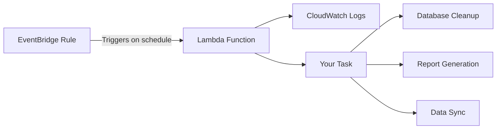

# How to Set Up Lambda with Scheduled Events in Terraform

Author: [nawazdhandala](https://www.github.com/nawazdhandala)

Tags: Terraform, AWS, Lambda, EventBridge, CloudWatch Events, Serverless

Description: Learn how to create AWS Lambda functions triggered by scheduled events using Terraform. This guide covers cron expressions, rate expressions, EventBridge rules, and complete working examples.

Scheduled Lambda functions are perfect for automated tasks like database cleanup, report generation, health checks, or data synchronization. AWS EventBridge (formerly CloudWatch Events) provides the scheduling capability, and Terraform makes it easy to set up the entire infrastructure as code.

## Architecture Overview



## Basic Scheduled Lambda Setup

Here's a complete example of a Lambda function that runs every 5 minutes:

```hcl
# Provider configuration
terraform {
  required_providers {
    aws = {
      source  = "hashicorp/aws"
      version = "~> 5.0"
    }
  }
}

provider "aws" {
  region = "us-east-1"
}

# Lambda execution role
resource "aws_iam_role" "lambda" {
  name = "scheduled-lambda-role"

  assume_role_policy = jsonencode({
    Version = "2012-10-17"
    Statement = [{
      Action = "sts:AssumeRole"
      Effect = "Allow"
      Principal = {
        Service = "lambda.amazonaws.com"
      }
    }]
  })
}

# Attach basic execution policy
resource "aws_iam_role_policy_attachment" "lambda_basic" {
  role       = aws_iam_role.lambda.name
  policy_arn = "arn:aws:iam::aws:policy/service-role/AWSLambdaBasicExecutionRole"
}

# Lambda function
resource "aws_lambda_function" "scheduled" {
  function_name = "scheduled-task"
  role          = aws_iam_role.lambda.arn
  handler       = "index.handler"
  runtime       = "nodejs18.x"
  timeout       = 60
  memory_size   = 128

  filename         = data.archive_file.lambda.output_path
  source_code_hash = data.archive_file.lambda.output_base64sha256

  environment {
    variables = {
      ENVIRONMENT = "production"
    }
  }
}

# Lambda source code
data "archive_file" "lambda" {
  type        = "zip"
  output_path = "${path.module}/lambda.zip"

  source {
    content  = <<-EOF
      exports.handler = async (event) => {
        console.log('Scheduled event received:', JSON.stringify(event));
        console.log('Running scheduled task at:', new Date().toISOString());

        // Your task logic here
        const result = await performTask();

        return {
          statusCode: 200,
          body: JSON.stringify({ message: 'Task completed', result })
        };
      };

      async function performTask() {
        // Simulate task execution
        return { processed: true, timestamp: Date.now() };
      }
    EOF
    filename = "index.js"
  }
}

# CloudWatch Log Group
resource "aws_cloudwatch_log_group" "lambda" {
  name              = "/aws/lambda/${aws_lambda_function.scheduled.function_name}"
  retention_in_days = 14
}

# EventBridge rule (schedule)
resource "aws_cloudwatch_event_rule" "schedule" {
  name                = "scheduled-task-trigger"
  description         = "Triggers the scheduled Lambda every 5 minutes"
  schedule_expression = "rate(5 minutes)"
}

# EventBridge target (Lambda)
resource "aws_cloudwatch_event_target" "lambda" {
  rule      = aws_cloudwatch_event_rule.schedule.name
  target_id = "scheduled-lambda"
  arn       = aws_lambda_function.scheduled.arn
}

# Permission for EventBridge to invoke Lambda
resource "aws_lambda_permission" "eventbridge" {
  statement_id  = "AllowExecutionFromEventBridge"
  action        = "lambda:InvokeFunction"
  function_name = aws_lambda_function.scheduled.function_name
  principal     = "events.amazonaws.com"
  source_arn    = aws_cloudwatch_event_rule.schedule.arn
}
```

## Schedule Expression Formats

### Rate Expressions

Use rate expressions for fixed intervals:

```hcl
# Every minute
schedule_expression = "rate(1 minute)"

# Every 5 minutes
schedule_expression = "rate(5 minutes)"

# Every hour
schedule_expression = "rate(1 hour)"

# Every 12 hours
schedule_expression = "rate(12 hours)"

# Every day
schedule_expression = "rate(1 day)"

# Every 7 days
schedule_expression = "rate(7 days)"
```

### Cron Expressions

Use cron expressions for precise scheduling:

```hcl
# Format: cron(minutes hours day-of-month month day-of-week year)

# Every day at midnight UTC
schedule_expression = "cron(0 0 * * ? *)"

# Every weekday at 9 AM UTC
schedule_expression = "cron(0 9 ? * MON-FRI *)"

# First day of every month at 6 AM UTC
schedule_expression = "cron(0 6 1 * ? *)"

# Every Monday at 10:30 AM UTC
schedule_expression = "cron(30 10 ? * MON *)"

# Every 15 minutes
schedule_expression = "cron(0/15 * * * ? *)"

# Every hour from 9 AM to 5 PM UTC on weekdays
schedule_expression = "cron(0 9-17 ? * MON-FRI *)"
```

## Multiple Schedules for One Lambda

Create different schedules with different inputs:

```hcl
# Morning schedule
resource "aws_cloudwatch_event_rule" "morning" {
  name                = "morning-task"
  description         = "Morning task at 8 AM UTC"
  schedule_expression = "cron(0 8 * * ? *)"
}

resource "aws_cloudwatch_event_target" "morning" {
  rule      = aws_cloudwatch_event_rule.morning.name
  target_id = "morning-task"
  arn       = aws_lambda_function.scheduled.arn

  input = jsonencode({
    task_type = "morning_report"
    priority  = "high"
  })
}

resource "aws_lambda_permission" "morning" {
  statement_id  = "AllowMorningSchedule"
  action        = "lambda:InvokeFunction"
  function_name = aws_lambda_function.scheduled.function_name
  principal     = "events.amazonaws.com"
  source_arn    = aws_cloudwatch_event_rule.morning.arn
}

# Evening schedule
resource "aws_cloudwatch_event_rule" "evening" {
  name                = "evening-task"
  description         = "Evening task at 6 PM UTC"
  schedule_expression = "cron(0 18 * * ? *)"
}

resource "aws_cloudwatch_event_target" "evening" {
  rule      = aws_cloudwatch_event_rule.evening.name
  target_id = "evening-task"
  arn       = aws_lambda_function.scheduled.arn

  input = jsonencode({
    task_type = "evening_cleanup"
    priority  = "normal"
  })
}

resource "aws_lambda_permission" "evening" {
  statement_id  = "AllowEveningSchedule"
  action        = "lambda:InvokeFunction"
  function_name = aws_lambda_function.scheduled.function_name
  principal     = "events.amazonaws.com"
  source_arn    = aws_cloudwatch_event_rule.evening.arn
}
```

## Lambda with Dynamic Schedules

Use variables to configure schedules:

```hcl
variable "schedules" {
  type = map(object({
    description = string
    expression  = string
    enabled     = bool
    input       = map(string)
  }))
  default = {
    hourly_cleanup = {
      description = "Hourly cleanup task"
      expression  = "rate(1 hour)"
      enabled     = true
      input       = { task = "cleanup" }
    }
    daily_report = {
      description = "Daily report generation"
      expression  = "cron(0 6 * * ? *)"
      enabled     = true
      input       = { task = "report" }
    }
    weekly_audit = {
      description = "Weekly security audit"
      expression  = "cron(0 0 ? * SUN *)"
      enabled     = true
      input       = { task = "audit" }
    }
  }
}

resource "aws_cloudwatch_event_rule" "schedules" {
  for_each = var.schedules

  name                = each.key
  description         = each.value.description
  schedule_expression = each.value.expression
  is_enabled          = each.value.enabled
}

resource "aws_cloudwatch_event_target" "schedules" {
  for_each = var.schedules

  rule      = aws_cloudwatch_event_rule.schedules[each.key].name
  target_id = each.key
  arn       = aws_lambda_function.scheduled.arn
  input     = jsonencode(each.value.input)
}

resource "aws_lambda_permission" "schedules" {
  for_each = var.schedules

  statement_id  = "Allow-${each.key}"
  action        = "lambda:InvokeFunction"
  function_name = aws_lambda_function.scheduled.function_name
  principal     = "events.amazonaws.com"
  source_arn    = aws_cloudwatch_event_rule.schedules[each.key].arn
}
```

## Complete Example: Database Cleanup Lambda

A practical example that cleans up old records:

```hcl
# Lambda for database cleanup
resource "aws_lambda_function" "db_cleanup" {
  function_name = "database-cleanup"
  role          = aws_iam_role.db_cleanup.arn
  handler       = "cleanup.handler"
  runtime       = "python3.11"
  timeout       = 300
  memory_size   = 256

  filename         = data.archive_file.db_cleanup.output_path
  source_code_hash = data.archive_file.db_cleanup.output_base64sha256

  environment {
    variables = {
      DB_HOST              = aws_db_instance.main.endpoint
      DB_NAME              = "myapp"
      RETENTION_DAYS       = "90"
      SECRETS_ARN          = aws_secretsmanager_secret.db_credentials.arn
    }
  }

  vpc_config {
    subnet_ids         = aws_subnet.private[*].id
    security_group_ids = [aws_security_group.lambda.id]
  }
}

data "archive_file" "db_cleanup" {
  type        = "zip"
  output_path = "${path.module}/db_cleanup.zip"

  source {
    content  = <<-EOF
      import json
      import os
      import boto3
      import psycopg2
      from datetime import datetime, timedelta

      def handler(event, context):
          print(f"Cleanup event: {json.dumps(event)}")

          # Get database credentials from Secrets Manager
          secrets_client = boto3.client('secretsmanager')
          secret = secrets_client.get_secret_value(SecretId=os.environ['SECRETS_ARN'])
          credentials = json.loads(secret['SecretString'])

          # Connect to database
          conn = psycopg2.connect(
              host=os.environ['DB_HOST'].split(':')[0],
              database=os.environ['DB_NAME'],
              user=credentials['username'],
              password=credentials['password']
          )

          retention_days = int(os.environ['RETENTION_DAYS'])
          cutoff_date = datetime.now() - timedelta(days=retention_days)

          try:
              with conn.cursor() as cursor:
                  # Delete old audit logs
                  cursor.execute(
                      "DELETE FROM audit_logs WHERE created_at < %s",
                      (cutoff_date,)
                  )
                  audit_deleted = cursor.rowcount

                  # Delete old sessions
                  cursor.execute(
                      "DELETE FROM sessions WHERE last_activity < %s",
                      (cutoff_date,)
                  )
                  sessions_deleted = cursor.rowcount

                  conn.commit()

                  result = {
                      'audit_logs_deleted': audit_deleted,
                      'sessions_deleted': sessions_deleted,
                      'cutoff_date': cutoff_date.isoformat()
                  }
                  print(f"Cleanup result: {json.dumps(result)}")
                  return result

          finally:
              conn.close()
    EOF
    filename = "cleanup.py"
  }
}

# IAM role for cleanup Lambda
resource "aws_iam_role" "db_cleanup" {
  name = "db-cleanup-lambda-role"

  assume_role_policy = jsonencode({
    Version = "2012-10-17"
    Statement = [{
      Action = "sts:AssumeRole"
      Effect = "Allow"
      Principal = {
        Service = "lambda.amazonaws.com"
      }
    }]
  })
}

resource "aws_iam_role_policy" "db_cleanup" {
  name = "db-cleanup-policy"
  role = aws_iam_role.db_cleanup.id

  policy = jsonencode({
    Version = "2012-10-17"
    Statement = [
      {
        Effect = "Allow"
        Action = [
          "logs:CreateLogGroup",
          "logs:CreateLogStream",
          "logs:PutLogEvents"
        ]
        Resource = "arn:aws:logs:*:*:*"
      },
      {
        Effect = "Allow"
        Action = [
          "secretsmanager:GetSecretValue"
        ]
        Resource = aws_secretsmanager_secret.db_credentials.arn
      },
      {
        Effect = "Allow"
        Action = [
          "ec2:CreateNetworkInterface",
          "ec2:DescribeNetworkInterfaces",
          "ec2:DeleteNetworkInterface"
        ]
        Resource = "*"
      }
    ]
  })
}

# Schedule: Run daily at 2 AM UTC
resource "aws_cloudwatch_event_rule" "db_cleanup" {
  name                = "database-cleanup-schedule"
  description         = "Daily database cleanup at 2 AM UTC"
  schedule_expression = "cron(0 2 * * ? *)"
}

resource "aws_cloudwatch_event_target" "db_cleanup" {
  rule      = aws_cloudwatch_event_rule.db_cleanup.name
  target_id = "database-cleanup"
  arn       = aws_lambda_function.db_cleanup.arn
}

resource "aws_lambda_permission" "db_cleanup" {
  statement_id  = "AllowDatabaseCleanupSchedule"
  action        = "lambda:InvokeFunction"
  function_name = aws_lambda_function.db_cleanup.function_name
  principal     = "events.amazonaws.com"
  source_arn    = aws_cloudwatch_event_rule.db_cleanup.arn
}
```

## Monitoring Scheduled Lambda

Add alarms for failed executions:

```hcl
resource "aws_cloudwatch_metric_alarm" "lambda_errors" {
  alarm_name          = "${aws_lambda_function.scheduled.function_name}-errors"
  comparison_operator = "GreaterThanThreshold"
  evaluation_periods  = 1
  metric_name         = "Errors"
  namespace           = "AWS/Lambda"
  period              = 300
  statistic           = "Sum"
  threshold           = 0
  alarm_description   = "Lambda function error rate"

  dimensions = {
    FunctionName = aws_lambda_function.scheduled.function_name
  }

  alarm_actions = [aws_sns_topic.alerts.arn]
}

resource "aws_cloudwatch_metric_alarm" "lambda_duration" {
  alarm_name          = "${aws_lambda_function.scheduled.function_name}-duration"
  comparison_operator = "GreaterThanThreshold"
  evaluation_periods  = 3
  metric_name         = "Duration"
  namespace           = "AWS/Lambda"
  period              = 300
  statistic           = "Average"
  threshold           = 50000  # 50 seconds (function timeout is 60)
  alarm_description   = "Lambda approaching timeout"

  dimensions = {
    FunctionName = aws_lambda_function.scheduled.function_name
  }

  alarm_actions = [aws_sns_topic.alerts.arn]
}
```

## Enabling and Disabling Schedules

Control schedule state through Terraform:

```hcl
variable "schedule_enabled" {
  type        = bool
  default     = true
  description = "Enable or disable the scheduled rule"
}

resource "aws_cloudwatch_event_rule" "schedule" {
  name                = "scheduled-task-trigger"
  schedule_expression = "rate(5 minutes)"
  is_enabled          = var.schedule_enabled
}
```

## Conclusion

Setting up scheduled Lambda functions with Terraform is straightforward once you understand the three key resources: the Lambda function, the EventBridge rule, and the Lambda permission. Use rate expressions for simple intervals and cron expressions for complex schedules. Remember to add monitoring and alerting to catch failed executions, and use variables to make schedules configurable across environments.
