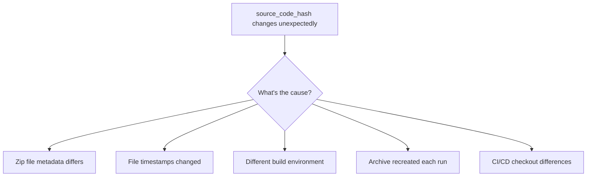

# How to Fix Lambda source_code_hash Updating with Same Code

Author: [nawazdhandala](https://www.github.com/nawazdhandala)

Tags: Terraform, AWS, Lambda, DevOps, Serverless

Description: Fix the frustrating issue where Terraform detects changes to your Lambda function's source_code_hash even when the code has not changed, with solutions for different deployment patterns.

---

One of the most frustrating Terraform issues is when `terraform plan` shows changes to your Lambda function's `source_code_hash` even though you have not modified any code. This guide explains why this happens and provides multiple solutions.

## Understanding the Problem

The `source_code_hash` attribute tells Terraform when to update a Lambda function. When it changes, Terraform redeploys the function. But sometimes this hash changes unexpectedly:

```
# aws_lambda_function.my_function will be updated in-place
~ resource "aws_lambda_function" "my_function" {
    ~ source_code_hash = "abc123..." -> "xyz789..."
      # (other attributes unchanged)
  }
```

## Why Does This Happen?



Common causes include:

1. **File timestamps** - Git checkout or file copy changes modification times
2. **Archive metadata** - Different zip tools include different metadata
3. **Build artifacts** - Compiled code differs between machines
4. **Hidden files** - `.DS_Store`, `__pycache__`, etc.
5. **Line endings** - CRLF vs LF differences

## Solution 1: Use archive_file Data Source Correctly

The `archive_file` data source creates consistent zips when configured properly:

```hcl
# Create zip from source directory
data "archive_file" "lambda_zip" {
  type        = "zip"
  source_dir  = "${path.module}/src"
  output_path = "${path.module}/lambda.zip"

  # Exclude files that cause hash instability
  excludes = [
    "__pycache__",
    "*.pyc",
    ".DS_Store",
    ".git",
    "*.swp",
    ".env"
  ]
}

resource "aws_lambda_function" "my_function" {
  function_name    = "my-function"
  filename         = data.archive_file.lambda_zip.output_path
  source_code_hash = data.archive_file.lambda_zip.output_base64sha256
  handler          = "index.handler"
  runtime          = "python3.11"
  role             = aws_iam_role.lambda_role.arn
}
```

## Solution 2: Use filebase64sha256 with Pre-built Zips

If you build the zip externally (CI/CD pipeline), use the file hash directly:

```hcl
resource "aws_lambda_function" "my_function" {
  function_name    = "my-function"
  filename         = "${path.module}/dist/lambda.zip"
  source_code_hash = filebase64sha256("${path.module}/dist/lambda.zip")
  handler          = "index.handler"
  runtime          = "nodejs18.x"
  role             = aws_iam_role.lambda_role.arn
}
```

Build the zip consistently in your CI pipeline:

```bash
#!/bin/bash
# build-lambda.sh - Consistent zip creation

cd src

# Remove files that cause hash changes
find . -name "*.pyc" -delete
find . -name "__pycache__" -type d -exec rm -rf {} + 2>/dev/null
find . -name ".DS_Store" -delete
find . -name "*.swp" -delete

# Create zip with consistent settings
# -X: exclude extra file attributes
# -r: recursive
# -9: maximum compression
zip -X -r -9 ../dist/lambda.zip . -x "*.git*" -x "*.env*"
```

## Solution 3: Use S3 for Lambda Deployment

For larger functions or more control, deploy via S3:

```hcl
resource "aws_s3_object" "lambda_code" {
  bucket = aws_s3_bucket.lambda_bucket.id
  key    = "functions/my-function/${var.lambda_version}.zip"
  source = "${path.module}/dist/lambda.zip"
  etag   = filemd5("${path.module}/dist/lambda.zip")
}

resource "aws_lambda_function" "my_function" {
  function_name = "my-function"

  s3_bucket         = aws_s3_bucket.lambda_bucket.id
  s3_key            = aws_s3_object.lambda_code.key
  s3_object_version = aws_s3_object.lambda_code.version_id

  # source_code_hash triggers update when S3 object changes
  source_code_hash = filebase64sha256("${path.module}/dist/lambda.zip")

  handler = "index.handler"
  runtime = "nodejs18.x"
  role    = aws_iam_role.lambda_role.arn
}
```

## Solution 4: Ignore source_code_hash Changes

If deploying Lambda code outside Terraform (separate CI/CD process):

```hcl
resource "aws_lambda_function" "my_function" {
  function_name = "my-function"
  filename      = "${path.module}/placeholder.zip"  # Initial deployment only
  handler       = "index.handler"
  runtime       = "python3.11"
  role          = aws_iam_role.lambda_role.arn

  lifecycle {
    ignore_changes = [
      filename,
      source_code_hash,
      s3_bucket,
      s3_key,
      s3_object_version
    ]
  }
}
```

This pattern works when:
- CI/CD updates Lambda code directly via AWS CLI/SDK
- Terraform only manages Lambda configuration (memory, timeout, etc.)

## Solution 5: Content-Based Hashing

Hash the actual source files, not the zip:

```hcl
# Hash all Python files in the source directory
locals {
  source_files = fileset("${path.module}/src", "**/*.py")

  # Create a hash of all file contents
  source_hash = base64sha256(join("", [
    for f in local.source_files : filebase64sha256("${path.module}/src/${f}")
  ]))
}

data "archive_file" "lambda_zip" {
  type        = "zip"
  source_dir  = "${path.module}/src"
  output_path = "${path.module}/.terraform/lambda-${local.source_hash}.zip"
}

resource "aws_lambda_function" "my_function" {
  function_name    = "my-function"
  filename         = data.archive_file.lambda_zip.output_path
  source_code_hash = local.source_hash  # Use our computed hash
  handler          = "index.handler"
  runtime          = "python3.11"
  role             = aws_iam_role.lambda_role.arn
}
```

## Solution 6: Docker-Based Consistent Builds

For complex dependencies, use Docker for reproducible builds:

```dockerfile
# Dockerfile.lambda-build
FROM public.ecr.aws/lambda/python:3.11

WORKDIR /build

COPY requirements.txt .
RUN pip install -r requirements.txt -t .

COPY src/ .

# Create consistent zip
RUN find . -name "*.pyc" -delete && \
    find . -name "__pycache__" -exec rm -rf {} + 2>/dev/null || true && \
    zip -X -r -9 /output/lambda.zip .
```

Build script:

```bash
#!/bin/bash
# Build Lambda package consistently across environments

docker build -f Dockerfile.lambda-build -t lambda-builder .
docker run --rm -v $(pwd)/dist:/output lambda-builder
```

Terraform configuration:

```hcl
resource "null_resource" "lambda_build" {
  triggers = {
    # Rebuild when source files change
    source_hash = sha256(join("", [
      for f in fileset("${path.module}/src", "**/*.py") :
        filesha256("${path.module}/src/${f}")
    ]))
    requirements_hash = filesha256("${path.module}/requirements.txt")
  }

  provisioner "local-exec" {
    command     = "./build-lambda.sh"
    working_dir = path.module
  }
}

data "archive_file" "lambda_zip" {
  depends_on  = [null_resource.lambda_build]
  type        = "zip"
  source_file = "${path.module}/dist/lambda.zip"
  output_path = "${path.module}/dist/lambda-upload.zip"
}
```

## Solution 7: Version-Based Deployment

Track versions explicitly instead of relying on hashes:

```hcl
variable "lambda_version" {
  description = "Version of the Lambda function code"
  type        = string
  default     = "1.0.0"
}

resource "aws_lambda_function" "my_function" {
  function_name    = "my-function"
  filename         = "${path.module}/dist/lambda-${var.lambda_version}.zip"
  source_code_hash = filebase64sha256("${path.module}/dist/lambda-${var.lambda_version}.zip")
  handler          = "index.handler"
  runtime          = "nodejs18.x"
  role             = aws_iam_role.lambda_role.arn

  environment {
    variables = {
      VERSION = var.lambda_version
    }
  }
}
```

Deploy with:

```bash
terraform apply -var="lambda_version=1.0.1"
```

## Debugging Hash Changes

When you need to understand why the hash changed:

```bash
# Compare zip contents
unzip -l old-lambda.zip > old-contents.txt
unzip -l new-lambda.zip > new-contents.txt
diff old-contents.txt new-contents.txt

# Compare file hashes within zips
unzip -d old old-lambda.zip
unzip -d new new-lambda.zip
find old -type f -exec sha256sum {} \; | sort > old-hashes.txt
find new -type f -exec sha256sum {} \; | sort > new-hashes.txt
diff old-hashes.txt new-hashes.txt
```

## Best Practices Summary

| Scenario | Recommended Solution |
|----------|---------------------|
| Simple Python/Node functions | archive_file with excludes |
| CI/CD pipeline builds | Pre-built zips with filebase64sha256 |
| Large functions with dependencies | S3 deployment |
| Code deployed outside Terraform | ignore_changes lifecycle |
| Complex build requirements | Docker-based builds |
| Strict version control | Version-based deployment |

---

The key to stable `source_code_hash` values is ensuring your zip file is created consistently every time. Use the `archive_file` data source with proper excludes for simple cases, or implement a controlled build process for complex scenarios. When Lambda code is deployed outside Terraform, use `ignore_changes` to prevent unnecessary drift detection.
