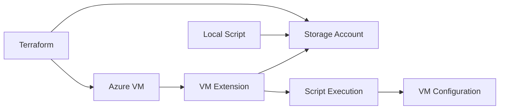

# How to Run Local PowerShell Scripts with Terraform VM Extension

Author: [nawazdhandala](https://www.github.com/nawazdhandala)

Tags: Terraform, Azure, PowerShell, VM Extension, Windows Server, DevOps

Description: Learn how to execute local PowerShell scripts on Azure VMs using Terraform's VM extension resource. This guide covers script deployment, parameter passing, and troubleshooting techniques.

Azure VM Extensions provide a powerful way to automate post-deployment configuration on virtual machines. When combined with Terraform, you can manage both infrastructure and configuration as code. This guide shows you how to run local PowerShell scripts on Azure Windows VMs using the Custom Script Extension.

## Understanding VM Extensions

Azure VM Extensions are small applications that provide post-deployment configuration and automation. The Custom Script Extension downloads and executes scripts on Azure VMs:



## Basic Setup

First, create the foundational Azure resources:

```hcl
# Provider configuration
terraform {
  required_providers {
    azurerm = {
      source  = "hashicorp/azurerm"
      version = "~> 3.0"
    }
  }
}

provider "azurerm" {
  features {}
}

# Resource group
resource "azurerm_resource_group" "main" {
  name     = "vm-extension-demo-rg"
  location = "East US"
}

# Virtual network
resource "azurerm_virtual_network" "main" {
  name                = "demo-vnet"
  address_space       = ["10.0.0.0/16"]
  location            = azurerm_resource_group.main.location
  resource_group_name = azurerm_resource_group.main.name
}

# Subnet
resource "azurerm_subnet" "main" {
  name                 = "demo-subnet"
  resource_group_name  = azurerm_resource_group.main.name
  virtual_network_name = azurerm_virtual_network.main.name
  address_prefixes     = ["10.0.1.0/24"]
}

# Network interface
resource "azurerm_network_interface" "main" {
  name                = "demo-nic"
  location            = azurerm_resource_group.main.location
  resource_group_name = azurerm_resource_group.main.name

  ip_configuration {
    name                          = "internal"
    subnet_id                     = azurerm_subnet.main.id
    private_ip_address_allocation = "Dynamic"
  }
}
```

## Creating the Windows VM

```hcl
# Windows Virtual Machine
resource "azurerm_windows_virtual_machine" "main" {
  name                = "demo-vm"
  resource_group_name = azurerm_resource_group.main.name
  location            = azurerm_resource_group.main.location
  size                = "Standard_B2s"
  admin_username      = "adminuser"
  admin_password      = var.admin_password

  network_interface_ids = [
    azurerm_network_interface.main.id
  ]

  os_disk {
    caching              = "ReadWrite"
    storage_account_type = "Standard_LRS"
  }

  source_image_reference {
    publisher = "MicrosoftWindowsServer"
    offer     = "WindowsServer"
    sku       = "2022-Datacenter"
    version   = "latest"
  }
}

variable "admin_password" {
  type        = string
  sensitive   = true
  description = "Administrator password for the VM"
}
```

## Method 1: Inline Script Execution

For simple scripts, you can include the PowerShell code directly:

```hcl
resource "azurerm_virtual_machine_extension" "configure_iis" {
  name                 = "configure-iis"
  virtual_machine_id   = azurerm_windows_virtual_machine.main.id
  publisher            = "Microsoft.Compute"
  type                 = "CustomScriptExtension"
  type_handler_version = "1.10"

  settings = jsonencode({
    commandToExecute = "powershell -ExecutionPolicy Unrestricted -Command \"Install-WindowsFeature -Name Web-Server -IncludeManagementTools; New-Item -Path C:\\inetpub\\wwwroot\\index.html -Value '<h1>Hello from Terraform</h1>' -Force\""
  })

  tags = {
    environment = "demo"
  }
}
```

## Method 2: Script from Storage Account

For larger scripts, upload to Azure Storage and reference them:

```hcl
# Storage account for scripts
resource "azurerm_storage_account" "scripts" {
  name                     = "vmscripts${random_string.suffix.result}"
  resource_group_name      = azurerm_resource_group.main.name
  location                 = azurerm_resource_group.main.location
  account_tier             = "Standard"
  account_replication_type = "LRS"
}

resource "random_string" "suffix" {
  length  = 8
  special = false
  upper   = false
}

# Container for scripts
resource "azurerm_storage_container" "scripts" {
  name                  = "scripts"
  storage_account_name  = azurerm_storage_account.scripts.name
  container_access_type = "private"
}

# Upload the local script
resource "azurerm_storage_blob" "setup_script" {
  name                   = "setup-server.ps1"
  storage_account_name   = azurerm_storage_account.scripts.name
  storage_container_name = azurerm_storage_container.scripts.name
  type                   = "Block"
  source                 = "${path.module}/scripts/setup-server.ps1"
  content_md5            = filemd5("${path.module}/scripts/setup-server.ps1")
}

# Generate SAS token for secure access
data "azurerm_storage_account_sas" "scripts" {
  connection_string = azurerm_storage_account.scripts.primary_connection_string
  https_only        = true
  signed_version    = "2019-12-12"

  resource_types {
    service   = false
    container = false
    object    = true
  }

  services {
    blob  = true
    queue = false
    table = false
    file  = false
  }

  start  = timestamp()
  expiry = timeadd(timestamp(), "1h")

  permissions {
    read    = true
    write   = false
    delete  = false
    list    = false
    add     = false
    create  = false
    update  = false
    process = false
    tag     = false
    filter  = false
  }
}

# VM Extension using script from storage
resource "azurerm_virtual_machine_extension" "setup" {
  name                 = "setup-server"
  virtual_machine_id   = azurerm_windows_virtual_machine.main.id
  publisher            = "Microsoft.Compute"
  type                 = "CustomScriptExtension"
  type_handler_version = "1.10"

  settings = jsonencode({
    fileUris = [
      "${azurerm_storage_blob.setup_script.url}${data.azurerm_storage_account_sas.scripts.sas}"
    ]
  })

  protected_settings = jsonencode({
    commandToExecute = "powershell -ExecutionPolicy Unrestricted -File setup-server.ps1 -Environment ${var.environment} -AppName ${var.app_name}"
  })

  tags = {
    environment = var.environment
  }

  depends_on = [azurerm_storage_blob.setup_script]
}

variable "environment" {
  type    = string
  default = "development"
}

variable "app_name" {
  type    = string
  default = "myapp"
}
```

## The PowerShell Script

Create your PowerShell script in `scripts/setup-server.ps1`:

```powershell
# setup-server.ps1
param(
    [Parameter(Mandatory=$true)]
    [string]$Environment,

    [Parameter(Mandatory=$true)]
    [string]$AppName,

    [Parameter(Mandatory=$false)]
    [string]$LogPath = "C:\Logs"
)

# Create log directory
New-Item -ItemType Directory -Force -Path $LogPath | Out-Null
$LogFile = Join-Path $LogPath "setup-$(Get-Date -Format 'yyyyMMdd-HHmmss').log"

function Write-Log {
    param([string]$Message)
    $Timestamp = Get-Date -Format "yyyy-MM-dd HH:mm:ss"
    "$Timestamp - $Message" | Tee-Object -FilePath $LogFile -Append
}

try {
    Write-Log "Starting server configuration for $AppName in $Environment environment"

    # Install IIS
    Write-Log "Installing IIS..."
    Install-WindowsFeature -Name Web-Server -IncludeManagementTools

    # Install additional features
    Write-Log "Installing additional Windows features..."
    Install-WindowsFeature -Name Web-Asp-Net45
    Install-WindowsFeature -Name Web-Net-Ext45

    # Configure IIS
    Write-Log "Configuring IIS..."
    Import-Module WebAdministration

    # Create application directory
    $AppPath = "C:\inetpub\$AppName"
    New-Item -ItemType Directory -Force -Path $AppPath | Out-Null

    # Create application pool
    $PoolName = "$AppName-Pool"
    if (-not (Test-Path "IIS:\AppPools\$PoolName")) {
        New-WebAppPool -Name $PoolName
        Set-ItemProperty "IIS:\AppPools\$PoolName" -Name "managedRuntimeVersion" -Value "v4.0"
        Set-ItemProperty "IIS:\AppPools\$PoolName" -Name "startMode" -Value "AlwaysRunning"
    }

    # Create website
    if (-not (Get-Website -Name $AppName -ErrorAction SilentlyContinue)) {
        New-Website -Name $AppName -Port 80 -PhysicalPath $AppPath -ApplicationPool $PoolName
        Stop-Website -Name "Default Web Site" -ErrorAction SilentlyContinue
    }

    # Create default page
    $IndexContent = @"
<!DOCTYPE html>
<html>
<head>
    <title>$AppName - $Environment</title>
</head>
<body>
    <h1>Welcome to $AppName</h1>
    <p>Environment: $Environment</p>
    <p>Server: $env:COMPUTERNAME</p>
    <p>Deployed: $(Get-Date -Format 'yyyy-MM-dd HH:mm:ss')</p>
</body>
</html>
"@
    Set-Content -Path "$AppPath\index.html" -Value $IndexContent

    # Configure firewall
    Write-Log "Configuring firewall..."
    New-NetFirewallRule -DisplayName "HTTP" -Direction Inbound -Protocol TCP -LocalPort 80 -Action Allow -ErrorAction SilentlyContinue
    New-NetFirewallRule -DisplayName "HTTPS" -Direction Inbound -Protocol TCP -LocalPort 443 -Action Allow -ErrorAction SilentlyContinue

    # Environment-specific configuration
    switch ($Environment) {
        "production" {
            Write-Log "Applying production settings..."
            # Enable compression
            Set-WebConfigurationProperty -Filter "system.webServer/urlCompression" -PSPath "IIS:\Sites\$AppName" -Name "doStaticCompression" -Value $true
            Set-WebConfigurationProperty -Filter "system.webServer/urlCompression" -PSPath "IIS:\Sites\$AppName" -Name "doDynamicCompression" -Value $true
        }
        "development" {
            Write-Log "Applying development settings..."
            # Enable detailed errors
            Set-WebConfigurationProperty -Filter "system.webServer/httpErrors" -PSPath "IIS:\Sites\$AppName" -Name "errorMode" -Value "Detailed"
        }
    }

    Write-Log "Server configuration completed successfully"
    exit 0
}
catch {
    Write-Log "ERROR: $($_.Exception.Message)"
    Write-Log "Stack Trace: $($_.ScriptStackTrace)"
    exit 1
}
```

## Method 3: Using Template Files

For dynamic script content, use Terraform's templatefile function:

```hcl
# Template the script with variables
resource "azurerm_virtual_machine_extension" "templated" {
  name                 = "templated-config"
  virtual_machine_id   = azurerm_windows_virtual_machine.main.id
  publisher            = "Microsoft.Compute"
  type                 = "CustomScriptExtension"
  type_handler_version = "1.10"

  settings = jsonencode({
    commandToExecute = "powershell -ExecutionPolicy Unrestricted -EncodedCommand ${base64encode(local.script_content)}"
  })
}

locals {
  script_content = templatefile("${path.module}/scripts/configure.ps1.tftpl", {
    environment      = var.environment
    app_name         = var.app_name
    database_server  = var.database_server
    connection_string = var.connection_string
    features         = var.windows_features
  })
}
```

Script template `scripts/configure.ps1.tftpl`:

```powershell
# Auto-generated configuration script
$Environment = "${environment}"
$AppName = "${app_name}"
$DatabaseServer = "${database_server}"
$ConnectionString = "${connection_string}"

# Install Windows features
$Features = @(
%{ for feature in features ~}
    "${feature}",
%{ endfor ~}
)

foreach ($Feature in $Features) {
    Install-WindowsFeature -Name $Feature -ErrorAction Stop
}

# Configure application settings
$ConfigPath = "C:\inetpub\$AppName\web.config"
# ... rest of configuration
```

## Handling Script Dependencies

When scripts depend on other files:

```hcl
# Upload multiple files
locals {
  script_files = {
    "setup-server.ps1"     = "${path.module}/scripts/setup-server.ps1"
    "install-modules.ps1"  = "${path.module}/scripts/install-modules.ps1"
    "config.json"          = "${path.module}/scripts/config.json"
  }
}

resource "azurerm_storage_blob" "scripts" {
  for_each = local.script_files

  name                   = each.key
  storage_account_name   = azurerm_storage_account.scripts.name
  storage_container_name = azurerm_storage_container.scripts.name
  type                   = "Block"
  source                 = each.value
  content_md5            = filemd5(each.value)
}

resource "azurerm_virtual_machine_extension" "multi_file" {
  name                 = "multi-file-setup"
  virtual_machine_id   = azurerm_windows_virtual_machine.main.id
  publisher            = "Microsoft.Compute"
  type                 = "CustomScriptExtension"
  type_handler_version = "1.10"

  settings = jsonencode({
    fileUris = [
      for name, _ in local.script_files :
      "${azurerm_storage_account.scripts.primary_blob_endpoint}${azurerm_storage_container.scripts.name}/${name}${data.azurerm_storage_account_sas.scripts.sas}"
    ]
  })

  protected_settings = jsonencode({
    commandToExecute = "powershell -ExecutionPolicy Unrestricted -File setup-server.ps1"
  })

  depends_on = [azurerm_storage_blob.scripts]
}
```

## Troubleshooting

### Check Extension Status

```hcl
# Output extension provisioning state
output "extension_status" {
  value = azurerm_virtual_machine_extension.setup.id
}
```

Check status via Azure CLI:

```bash
az vm extension show \
  --resource-group vm-extension-demo-rg \
  --vm-name demo-vm \
  --name setup-server \
  --query "provisioningState"
```

### View Script Output Logs

Scripts log to:
- `C:\WindowsAzure\Logs\Plugins\Microsoft.Compute.CustomScriptExtension\<version>\`
- `C:\Packages\Plugins\Microsoft.Compute.CustomScriptExtension\<version>\Status\`

### Common Issues and Solutions

**Issue: Script times out**
```hcl
resource "azurerm_virtual_machine_extension" "long_running" {
  # ... other settings

  settings = jsonencode({
    commandToExecute = "powershell -ExecutionPolicy Unrestricted -File long-script.ps1"
  })

  timeouts {
    create = "60m"
    update = "60m"
    delete = "30m"
  }
}
```

**Issue: Script fails silently**

Add error handling to your script:
```powershell
$ErrorActionPreference = "Stop"
try {
    # Your script code
} catch {
    Write-Error $_.Exception.Message
    exit 1
}
```

**Issue: Extension won't update**

Force recreation with a trigger:
```hcl
resource "azurerm_virtual_machine_extension" "setup" {
  # ... other settings

  # Force update when script changes
  settings = jsonencode({
    commandToExecute = "powershell -ExecutionPolicy Unrestricted -File setup.ps1"
    timestamp        = filemd5("${path.module}/scripts/setup.ps1")
  })
}
```

## Conclusion

Running local PowerShell scripts on Azure VMs through Terraform VM Extensions enables powerful automation scenarios. Whether you use inline scripts for simple tasks or upload complex scripts to Azure Storage, Terraform provides the flexibility to manage both infrastructure and configuration. Remember to implement proper error handling, logging, and use protected settings for sensitive data like connection strings and passwords.
