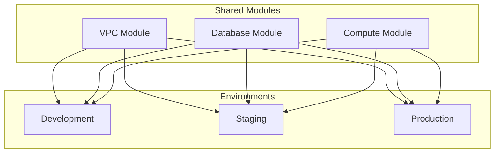

# How to Organize Terraform Modules for Multiple Environments

Author: [nawazdhandala](https://www.github.com/nawazdhandala)

Tags: Terraform, Modules, Environments, Best Practices, DRY, Infrastructure as Code

Description: Learn how to structure Terraform modules for multi-environment deployments, including directory organization, environment-specific configurations, and patterns for development, staging, and production.

Managing infrastructure across multiple environments (development, staging, production) is a fundamental challenge in Terraform. This guide covers proven patterns for organizing modules to maximize code reuse while maintaining environment-specific flexibility.

## Understanding Multi-Environment Challenges



Key challenges include:
- Avoiding code duplication across environments
- Managing environment-specific configurations
- Maintaining consistent infrastructure patterns
- Enabling independent environment deployments

## Recommended Directory Structure

```
terraform/
  modules/                    # Reusable modules
    vpc/
      main.tf
      variables.tf
      outputs.tf
    database/
      main.tf
      variables.tf
      outputs.tf
    compute/
      main.tf
      variables.tf
      outputs.tf
    monitoring/
      main.tf
      variables.tf
      outputs.tf

  environments/               # Environment configurations
    development/
      main.tf
      variables.tf
      terraform.tfvars
      backend.tf
    staging/
      main.tf
      variables.tf
      terraform.tfvars
      backend.tf
    production/
      main.tf
      variables.tf
      terraform.tfvars
      backend.tf

  shared/                     # Shared infrastructure
    dns/
    iam/
    networking/
```

## Creating Reusable Modules

### VPC Module Example

```hcl
# modules/vpc/variables.tf
variable "environment" {
  type        = string
  description = "Environment name"
}

variable "vpc_cidr" {
  type        = string
  description = "CIDR block for VPC"
}

variable "availability_zones" {
  type        = list(string)
  description = "List of availability zones"
}

variable "enable_nat_gateway" {
  type        = bool
  description = "Enable NAT gateway for private subnets"
  default     = true
}

variable "single_nat_gateway" {
  type        = bool
  description = "Use single NAT gateway (cost saving for non-prod)"
  default     = false
}

variable "tags" {
  type        = map(string)
  description = "Tags to apply to resources"
  default     = {}
}

# modules/vpc/main.tf
locals {
  subnet_count = length(var.availability_zones)

  public_subnets = [
    for i, az in var.availability_zones :
    cidrsubnet(var.vpc_cidr, 8, i)
  ]

  private_subnets = [
    for i, az in var.availability_zones :
    cidrsubnet(var.vpc_cidr, 8, i + local.subnet_count)
  ]

  common_tags = merge(var.tags, {
    Environment = var.environment
    Module      = "vpc"
  })
}

resource "aws_vpc" "main" {
  cidr_block           = var.vpc_cidr
  enable_dns_hostnames = true
  enable_dns_support   = true

  tags = merge(local.common_tags, {
    Name = "${var.environment}-vpc"
  })
}

resource "aws_subnet" "public" {
  count = local.subnet_count

  vpc_id                  = aws_vpc.main.id
  cidr_block              = local.public_subnets[count.index]
  availability_zone       = var.availability_zones[count.index]
  map_public_ip_on_launch = true

  tags = merge(local.common_tags, {
    Name = "${var.environment}-public-${var.availability_zones[count.index]}"
    Type = "public"
  })
}

resource "aws_subnet" "private" {
  count = local.subnet_count

  vpc_id            = aws_vpc.main.id
  cidr_block        = local.private_subnets[count.index]
  availability_zone = var.availability_zones[count.index]

  tags = merge(local.common_tags, {
    Name = "${var.environment}-private-${var.availability_zones[count.index]}"
    Type = "private"
  })
}

resource "aws_internet_gateway" "main" {
  vpc_id = aws_vpc.main.id

  tags = merge(local.common_tags, {
    Name = "${var.environment}-igw"
  })
}

resource "aws_eip" "nat" {
  count  = var.enable_nat_gateway ? (var.single_nat_gateway ? 1 : local.subnet_count) : 0
  domain = "vpc"

  tags = merge(local.common_tags, {
    Name = "${var.environment}-nat-eip-${count.index + 1}"
  })
}

resource "aws_nat_gateway" "main" {
  count = var.enable_nat_gateway ? (var.single_nat_gateway ? 1 : local.subnet_count) : 0

  allocation_id = aws_eip.nat[count.index].id
  subnet_id     = aws_subnet.public[count.index].id

  tags = merge(local.common_tags, {
    Name = "${var.environment}-nat-${count.index + 1}"
  })
}

# modules/vpc/outputs.tf
output "vpc_id" {
  value = aws_vpc.main.id
}

output "vpc_cidr" {
  value = aws_vpc.main.cidr_block
}

output "public_subnet_ids" {
  value = aws_subnet.public[*].id
}

output "private_subnet_ids" {
  value = aws_subnet.private[*].id
}

output "nat_gateway_ids" {
  value = aws_nat_gateway.main[*].id
}
```

### Database Module Example

```hcl
# modules/database/variables.tf
variable "environment" {
  type = string
}

variable "instance_class" {
  type    = string
  default = "db.t3.micro"
}

variable "allocated_storage" {
  type    = number
  default = 20
}

variable "engine_version" {
  type    = string
  default = "15"
}

variable "multi_az" {
  type    = bool
  default = false
}

variable "backup_retention_period" {
  type    = number
  default = 7
}

variable "deletion_protection" {
  type    = bool
  default = false
}

variable "vpc_id" {
  type = string
}

variable "subnet_ids" {
  type = list(string)
}

variable "allowed_security_group_ids" {
  type    = list(string)
  default = []
}

# modules/database/main.tf
resource "aws_db_subnet_group" "main" {
  name       = "${var.environment}-db-subnet-group"
  subnet_ids = var.subnet_ids

  tags = {
    Name        = "${var.environment}-db-subnet-group"
    Environment = var.environment
  }
}

resource "aws_security_group" "db" {
  name        = "${var.environment}-db-sg"
  description = "Security group for ${var.environment} database"
  vpc_id      = var.vpc_id

  ingress {
    from_port       = 5432
    to_port         = 5432
    protocol        = "tcp"
    security_groups = var.allowed_security_group_ids
  }

  tags = {
    Name        = "${var.environment}-db-sg"
    Environment = var.environment
  }
}

resource "aws_db_instance" "main" {
  identifier = "${var.environment}-postgres"

  engine         = "postgres"
  engine_version = var.engine_version
  instance_class = var.instance_class

  allocated_storage     = var.allocated_storage
  max_allocated_storage = var.allocated_storage * 2

  db_subnet_group_name   = aws_db_subnet_group.main.name
  vpc_security_group_ids = [aws_security_group.db.id]

  multi_az            = var.multi_az
  publicly_accessible = false

  backup_retention_period = var.backup_retention_period
  backup_window           = "03:00-04:00"
  maintenance_window      = "Mon:04:00-Mon:05:00"

  deletion_protection = var.deletion_protection
  skip_final_snapshot = var.environment != "production"

  tags = {
    Name        = "${var.environment}-postgres"
    Environment = var.environment
  }
}

# modules/database/outputs.tf
output "endpoint" {
  value = aws_db_instance.main.endpoint
}

output "security_group_id" {
  value = aws_security_group.db.id
}
```

## Environment Configurations

### Development Environment

```hcl
# environments/development/main.tf
terraform {
  required_version = ">= 1.0.0"
  required_providers {
    aws = {
      source  = "hashicorp/aws"
      version = "~> 5.0"
    }
  }
}

provider "aws" {
  region = var.aws_region
}

locals {
  environment = "development"
  common_tags = {
    Environment = local.environment
    ManagedBy   = "terraform"
    Project     = var.project_name
  }
}

module "vpc" {
  source = "../../modules/vpc"

  environment        = local.environment
  vpc_cidr           = var.vpc_cidr
  availability_zones = var.availability_zones

  # Cost saving: single NAT gateway in dev
  enable_nat_gateway = true
  single_nat_gateway = true

  tags = local.common_tags
}

module "database" {
  source = "../../modules/database"

  environment = local.environment
  vpc_id      = module.vpc.vpc_id
  subnet_ids  = module.vpc.private_subnet_ids

  # Minimal resources for dev
  instance_class          = "db.t3.micro"
  allocated_storage       = 20
  multi_az                = false
  backup_retention_period = 1
  deletion_protection     = false

  allowed_security_group_ids = [module.compute.security_group_id]
}

module "compute" {
  source = "../../modules/compute"

  environment = local.environment
  vpc_id      = module.vpc.vpc_id
  subnet_ids  = module.vpc.private_subnet_ids

  instance_type = "t3.small"
  min_size      = 1
  max_size      = 2
  desired_size  = 1

  tags = local.common_tags
}

# environments/development/terraform.tfvars
aws_region         = "us-east-1"
project_name       = "myapp"
vpc_cidr           = "10.0.0.0/16"
availability_zones = ["us-east-1a", "us-east-1b"]
```

### Production Environment

```hcl
# environments/production/main.tf
terraform {
  required_version = ">= 1.0.0"
  required_providers {
    aws = {
      source  = "hashicorp/aws"
      version = "~> 5.0"
    }
  }
}

provider "aws" {
  region = var.aws_region
}

locals {
  environment = "production"
  common_tags = {
    Environment = local.environment
    ManagedBy   = "terraform"
    Project     = var.project_name
    CostCenter  = "production"
  }
}

module "vpc" {
  source = "../../modules/vpc"

  environment        = local.environment
  vpc_cidr           = var.vpc_cidr
  availability_zones = var.availability_zones

  # High availability: NAT per AZ
  enable_nat_gateway = true
  single_nat_gateway = false

  tags = local.common_tags
}

module "database" {
  source = "../../modules/database"

  environment = local.environment
  vpc_id      = module.vpc.vpc_id
  subnet_ids  = module.vpc.private_subnet_ids

  # Production-grade resources
  instance_class          = "db.r6g.large"
  allocated_storage       = 100
  multi_az                = true
  backup_retention_period = 30
  deletion_protection     = true

  allowed_security_group_ids = [module.compute.security_group_id]
}

module "compute" {
  source = "../../modules/compute"

  environment = local.environment
  vpc_id      = module.vpc.vpc_id
  subnet_ids  = module.vpc.private_subnet_ids

  instance_type = "m6i.large"
  min_size      = 3
  max_size      = 20
  desired_size  = 6

  tags = local.common_tags
}

# Additional production resources
module "monitoring" {
  source = "../../modules/monitoring"

  environment      = local.environment
  enable_alarms    = true
  enable_dashboard = true
  slack_webhook    = var.slack_webhook

  resources_to_monitor = {
    database = module.database.endpoint
    asg      = module.compute.asg_name
  }
}

# environments/production/terraform.tfvars
aws_region         = "us-east-1"
project_name       = "myapp"
vpc_cidr           = "10.1.0.0/16"
availability_zones = ["us-east-1a", "us-east-1b", "us-east-1c"]
```

## Pattern: Environment Configuration Files

Use `.tfvars` files for environment-specific values:

```hcl
# environments/development/config.tfvars
environment = "development"
vpc_cidr    = "10.0.0.0/16"

database = {
  instance_class    = "db.t3.micro"
  allocated_storage = 20
  multi_az          = false
}

compute = {
  instance_type = "t3.small"
  min_size      = 1
  max_size      = 2
}

# environments/production/config.tfvars
environment = "production"
vpc_cidr    = "10.1.0.0/16"

database = {
  instance_class    = "db.r6g.large"
  allocated_storage = 100
  multi_az          = true
}

compute = {
  instance_type = "m6i.large"
  min_size      = 3
  max_size      = 20
}
```

Then in your main configuration:

```hcl
# environments/shared/main.tf
variable "environment" {
  type = string
}

variable "vpc_cidr" {
  type = string
}

variable "database" {
  type = object({
    instance_class    = string
    allocated_storage = number
    multi_az          = bool
  })
}

variable "compute" {
  type = object({
    instance_type = string
    min_size      = number
    max_size      = number
  })
}

module "infrastructure" {
  source = "../../modules/complete-stack"

  environment = var.environment
  vpc_cidr    = var.vpc_cidr
  database    = var.database
  compute     = var.compute
}
```

## Using Terragrunt for Environments

Terragrunt simplifies multi-environment management:

```
terraform/
  terragrunt.hcl              # Root config
  modules/
    vpc/
    database/
    compute/
  environments/
    development/
      terragrunt.hcl
    staging/
      terragrunt.hcl
    production/
      terragrunt.hcl
```

### Root Terragrunt Configuration

```hcl
# terragrunt.hcl
remote_state {
  backend = "s3"
  generate = {
    path      = "backend.tf"
    if_exists = "overwrite_terragrunt"
  }
  config = {
    bucket         = "company-terraform-state"
    key            = "${path_relative_to_include()}/terraform.tfstate"
    region         = "us-east-1"
    encrypt        = true
    dynamodb_table = "terraform-locks"
  }
}

generate "provider" {
  path      = "provider.tf"
  if_exists = "overwrite_terragrunt"
  contents  = <<EOF
provider "aws" {
  region = "us-east-1"
}
EOF
}
```

### Environment Terragrunt Configurations

```hcl
# environments/development/terragrunt.hcl
include "root" {
  path = find_in_parent_folders()
}

terraform {
  source = "../../modules/complete-stack"
}

inputs = {
  environment = "development"
  vpc_cidr    = "10.0.0.0/16"

  database_config = {
    instance_class = "db.t3.micro"
    multi_az       = false
  }

  compute_config = {
    instance_type = "t3.small"
    min_size      = 1
    max_size      = 2
  }
}

# environments/production/terragrunt.hcl
include "root" {
  path = find_in_parent_folders()
}

terraform {
  source = "../../modules/complete-stack"
}

inputs = {
  environment = "production"
  vpc_cidr    = "10.1.0.0/16"

  database_config = {
    instance_class = "db.r6g.large"
    multi_az       = true
  }

  compute_config = {
    instance_type = "m6i.large"
    min_size      = 3
    max_size      = 20
  }
}
```

## Deployment Workflow

### Makefile for Operations

```makefile
# Makefile
ENVIRONMENT ?= development

.PHONY: init plan apply destroy

init:
	cd environments/$(ENVIRONMENT) && terraform init

plan:
	cd environments/$(ENVIRONMENT) && terraform plan

apply:
	cd environments/$(ENVIRONMENT) && terraform apply

destroy:
	cd environments/$(ENVIRONMENT) && terraform destroy

# Deploy all environments
deploy-all:
	@for env in development staging production; do \
		echo "Deploying $$env..."; \
		$(MAKE) ENVIRONMENT=$$env apply; \
	done

# Validate all environments
validate-all:
	@for env in development staging production; do \
		echo "Validating $$env..."; \
		cd environments/$$env && terraform validate; \
	done
```

## Best Practices

### 1. Module Versioning

```hcl
module "vpc" {
  source  = "git::https://github.com/company/terraform-modules.git//vpc?ref=v1.2.0"
  # or
  source  = "app.terraform.io/company/vpc/aws"
  version = "1.2.0"
}
```

### 2. Environment Parity

Keep environments as similar as possible, varying only size and redundancy:

```hcl
locals {
  environment_configs = {
    development = {
      instance_class = "db.t3.micro"
      multi_az       = false
      min_size       = 1
    }
    staging = {
      instance_class = "db.t3.small"
      multi_az       = false
      min_size       = 2
    }
    production = {
      instance_class = "db.r6g.large"
      multi_az       = true
      min_size       = 3
    }
  }

  config = local.environment_configs[var.environment]
}
```

### 3. Separate State per Environment

Always use separate state files:

```hcl
# environments/production/backend.tf
terraform {
  backend "s3" {
    bucket = "company-terraform-state"
    key    = "production/terraform.tfstate"  # Environment-specific key
    region = "us-east-1"
  }
}
```

## Conclusion

Organizing Terraform modules for multiple environments requires balancing code reuse with environment-specific flexibility. Use shared modules for common infrastructure patterns, environment-specific configurations for size and redundancy settings, and separate state files for isolation. Whether you use plain Terraform with directory structures or Terragrunt for advanced DRY configurations, the key is maintaining consistency across environments while allowing appropriate variations for development, staging, and production needs.
