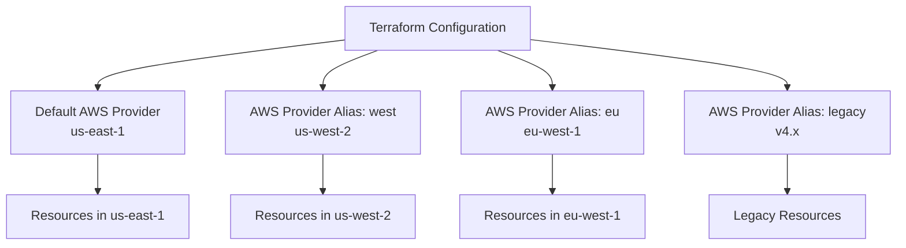

# How to Use Multiple Provider Versions in Terraform

Author: [nawazdhandala](https://www.github.com/nawazdhandala)

Tags: Terraform, Providers, Infrastructure as Code, DevOps, Configuration Management

Description: Learn how to configure and manage multiple versions of the same Terraform provider in a single configuration. This guide covers provider aliases, version constraints, and practical use cases for multi-version setups.

Managing infrastructure often requires working with multiple AWS accounts, different Azure subscriptions, or even different versions of the same provider. Terraform's provider aliasing system allows you to configure multiple instances of the same provider with different settings or versions, enabling complex multi-account and multi-region deployments.

## Understanding Provider Aliases

Provider aliases let you create multiple configurations of the same provider. Each alias can have different credentials, regions, or even versions:



## Basic Provider Alias Configuration

Here's how to set up multiple provider configurations:

```hcl
# Default provider configuration
provider "aws" {
  region = "us-east-1"
}

# Provider alias for US West region
provider "aws" {
  alias  = "west"
  region = "us-west-2"
}

# Provider alias for EU region
provider "aws" {
  alias  = "europe"
  region = "eu-west-1"
}

# Use the default provider
resource "aws_s3_bucket" "primary" {
  bucket = "my-primary-bucket"
}

# Use the west alias
resource "aws_s3_bucket" "west_replica" {
  provider = aws.west
  bucket   = "my-west-replica-bucket"
}

# Use the europe alias
resource "aws_s3_bucket" "eu_replica" {
  provider = aws.europe
  bucket   = "my-eu-replica-bucket"
}
```

## Multi-Account Setup with Different Credentials

For organizations managing multiple AWS accounts:

```hcl
# Production account
provider "aws" {
  alias   = "production"
  region  = "us-east-1"
  profile = "production-admin"

  default_tags {
    tags = {
      Environment = "production"
      ManagedBy   = "terraform"
    }
  }
}

# Development account
provider "aws" {
  alias   = "development"
  region  = "us-east-1"
  profile = "dev-admin"

  default_tags {
    tags = {
      Environment = "development"
      ManagedBy   = "terraform"
    }
  }
}

# Shared services account
provider "aws" {
  alias   = "shared"
  region  = "us-east-1"

  assume_role {
    role_arn     = "arn:aws:iam::SHARED_ACCOUNT_ID:role/TerraformRole"
    session_name = "terraform-shared-services"
  }
}

# VPC in production
resource "aws_vpc" "production" {
  provider   = aws.production
  cidr_block = "10.0.0.0/16"
}

# VPC in development
resource "aws_vpc" "development" {
  provider   = aws.development
  cidr_block = "10.1.0.0/16"
}

# Transit gateway in shared services
resource "aws_ec2_transit_gateway" "main" {
  provider    = aws.shared
  description = "Central transit gateway"
}
```

## Using Different Provider Versions

Sometimes you need to use different provider versions, typically during migrations or when working with legacy configurations:

```hcl
terraform {
  required_providers {
    # Current AWS provider
    aws = {
      source  = "hashicorp/aws"
      version = "~> 5.0"
    }

    # Legacy AWS provider with different configuration name
    awslegacy = {
      source  = "hashicorp/aws"
      version = "~> 4.0"
      configuration_aliases = [awslegacy.main]
    }
  }
}

# Modern provider configuration
provider "aws" {
  region = "us-east-1"
}

# Legacy provider for resources requiring older version
provider "awslegacy" {
  alias  = "main"
  region = "us-east-1"
}
```

Note: Terraform doesn't natively support different versions of the exact same provider. The workaround above uses provider aliasing with different source names, but both point to the same underlying provider. For true version separation, you'll need to split resources into separate configurations.

## Practical Multi-Version Strategy

For managing resources that require different provider versions, use separate Terraform configurations with data sources for cross-referencing:

```hcl
# Configuration A: Modern resources (aws provider v5.x)
# config-modern/main.tf

terraform {
  required_providers {
    aws = {
      source  = "hashicorp/aws"
      version = "~> 5.0"
    }
  }

  backend "s3" {
    bucket = "terraform-state"
    key    = "modern/terraform.tfstate"
    region = "us-east-1"
  }
}

provider "aws" {
  region = "us-east-1"
}

resource "aws_vpc" "main" {
  cidr_block           = "10.0.0.0/16"
  enable_dns_hostnames = true
}

output "vpc_id" {
  value = aws_vpc.main.id
}
```

```hcl
# Configuration B: Legacy resources (aws provider v4.x)
# config-legacy/main.tf

terraform {
  required_providers {
    aws = {
      source  = "hashicorp/aws"
      version = "~> 4.0"
    }
  }

  backend "s3" {
    bucket = "terraform-state"
    key    = "legacy/terraform.tfstate"
    region = "us-east-1"
  }
}

provider "aws" {
  region = "us-east-1"
}

# Reference the VPC from the modern configuration
data "terraform_remote_state" "modern" {
  backend = "s3"
  config = {
    bucket = "terraform-state"
    key    = "modern/terraform.tfstate"
    region = "us-east-1"
  }
}

# Use the VPC ID from modern configuration
resource "aws_security_group" "legacy_app" {
  name        = "legacy-application"
  description = "Security group for legacy application"
  vpc_id      = data.terraform_remote_state.modern.outputs.vpc_id

  ingress {
    from_port   = 443
    to_port     = 443
    protocol    = "tcp"
    cidr_blocks = ["0.0.0.0/0"]
  }
}
```

## Provider Aliases in Modules

Modules can accept provider configurations through the `providers` argument:

```hcl
# Module definition: modules/regional-deployment/main.tf
terraform {
  required_providers {
    aws = {
      source                = "hashicorp/aws"
      version               = ">= 4.0"
      configuration_aliases = [aws.primary, aws.secondary]
    }
  }
}

variable "app_name" {
  type = string
}

# Primary region resources
resource "aws_s3_bucket" "primary" {
  provider = aws.primary
  bucket   = "${var.app_name}-primary"
}

# Secondary region resources
resource "aws_s3_bucket" "secondary" {
  provider = aws.secondary
  bucket   = "${var.app_name}-secondary"
}

# Cross-region replication
resource "aws_s3_bucket_replication_configuration" "primary_to_secondary" {
  provider   = aws.primary
  depends_on = [aws_s3_bucket_versioning.primary]

  bucket = aws_s3_bucket.primary.id
  role   = aws_iam_role.replication.arn

  rule {
    id     = "replicate-all"
    status = "Enabled"

    destination {
      bucket        = aws_s3_bucket.secondary.arn
      storage_class = "STANDARD"
    }
  }
}
```

Using the module:

```hcl
# Root configuration
provider "aws" {
  region = "us-east-1"
}

provider "aws" {
  alias  = "west"
  region = "us-west-2"
}

module "regional_app" {
  source = "./modules/regional-deployment"

  providers = {
    aws.primary   = aws
    aws.secondary = aws.west
  }

  app_name = "my-application"
}
```

## Dynamic Provider Selection with for_each

Create resources across multiple regions dynamically:

```hcl
locals {
  regions = {
    primary   = "us-east-1"
    secondary = "us-west-2"
    tertiary  = "eu-west-1"
  }
}

# Generate provider configurations
provider "aws" {
  alias  = "us_east_1"
  region = "us-east-1"
}

provider "aws" {
  alias  = "us_west_2"
  region = "us-west-2"
}

provider "aws" {
  alias  = "eu_west_1"
  region = "eu-west-1"
}

# Map region names to provider aliases
module "regional_resources" {
  source   = "./modules/regional-base"
  for_each = local.regions

  providers = {
    aws = aws.${replace(each.value, "-", "_")}
  }

  region_name = each.key
  vpc_cidr    = cidrsubnet("10.0.0.0/8", 8, index(keys(local.regions), each.key))
}
```

## Best Practices for Multiple Provider Versions

### 1. Document Provider Requirements

```hcl
terraform {
  required_version = ">= 1.5.0"

  required_providers {
    aws = {
      source  = "hashicorp/aws"
      version = ">= 5.0, < 6.0"  # Be explicit about version ranges
    }
  }
}
```

### 2. Use Dependency Lock Files

Always commit `.terraform.lock.hcl` to ensure consistent provider versions across team members and CI/CD:

```bash
# Generate or update lock file
terraform init -upgrade

# Verify providers match lock file
terraform init
```

### 3. Implement Provider Version Testing

```yaml
# .github/workflows/terraform-test.yml
jobs:
  test-provider-versions:
    strategy:
      matrix:
        aws_provider: ["4.67.0", "5.0.0", "5.31.0"]
    steps:
      - uses: actions/checkout@v4
      - uses: hashicorp/setup-terraform@v3
      - run: |
          cat > versions_override.tf << EOF
          terraform {
            required_providers {
              aws = {
                source  = "hashicorp/aws"
                version = "= ${{ matrix.aws_provider }}"
              }
            }
          }
          EOF
      - run: terraform init
      - run: terraform validate
```

### 4. Handle Provider-Specific Behavior

```hcl
# Check provider version and adjust behavior
locals {
  # AWS provider v5 changed some resource behaviors
  use_new_s3_syntax = tonumber(split(".", data.aws_provider_version.current.version)[0]) >= 5
}

resource "aws_s3_bucket" "example" {
  bucket = "my-bucket"

  # Use dynamic blocks for version-specific configuration
  dynamic "website" {
    for_each = local.use_new_s3_syntax ? [] : [1]
    content {
      index_document = "index.html"
    }
  }
}

# For v5+, use separate resource
resource "aws_s3_bucket_website_configuration" "example" {
  count  = local.use_new_s3_syntax ? 1 : 0
  bucket = aws_s3_bucket.example.id

  index_document {
    suffix = "index.html"
  }
}
```

## Troubleshooting Common Issues

**Error: "Provider configuration not present"**

This usually means a module expects a provider alias that wasn't passed:

```hcl
# Ensure all required aliases are provided
module "example" {
  source = "./modules/example"

  providers = {
    aws         = aws           # Default provider
    aws.replica = aws.west      # Aliased provider
  }
}
```

**Error: "Duplicate provider configuration"**

Each alias must be unique. Check for duplicate alias names:

```hcl
# Wrong - duplicate alias
provider "aws" {
  alias  = "west"
  region = "us-west-1"
}

provider "aws" {
  alias  = "west"  # Error: duplicate
  region = "us-west-2"
}
```

**State migration between provider versions**

When upgrading provider versions with breaking changes:

```bash
# 1. Backup state
terraform state pull > backup.tfstate

# 2. Update provider version in configuration

# 3. Run refresh to update state format
terraform refresh

# 4. Verify resources
terraform plan
```

## Conclusion

Managing multiple provider versions and configurations in Terraform enables sophisticated multi-region, multi-account, and hybrid infrastructure setups. By using provider aliases effectively, splitting configurations when necessary, and following version management best practices, you can maintain complex infrastructure while ensuring consistency and reliability across your deployments.
