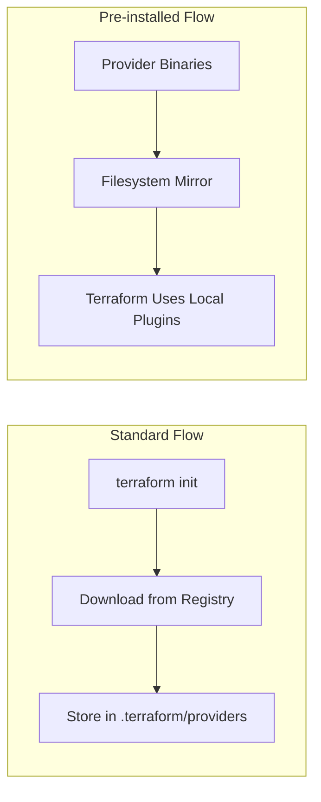

# How to Use Pre-Installed Terraform Plugins Without terraform init

Author: [nawazdhandala](https://www.github.com/nawazdhandala)

Tags: Terraform, Plugins, Providers, Offline, Air-Gapped, CI/CD

Description: Learn how to configure Terraform to use pre-installed plugins and providers without running terraform init, essential for air-gapped environments, CI/CD optimization, and custom provider management.

Running `terraform init` downloads providers from the internet, which can be problematic in air-gapped environments, slow CI/CD pipelines, or situations where you need strict control over provider versions. This guide shows you how to use pre-installed Terraform plugins.

## Understanding Terraform Plugin Architecture



Terraform plugins (providers and provisioners) are standalone binaries that Terraform downloads during initialization. However, you can configure Terraform to use locally available plugins instead.

## Method 1: Filesystem Mirror

The filesystem mirror is the recommended approach for pre-installed providers.

### Creating the Mirror Directory Structure

Terraform expects a specific directory structure:

```
/terraform-plugins/
  registry.terraform.io/
    hashicorp/
      aws/
        5.31.0/
          linux_amd64/
            terraform-provider-aws_v5.31.0_x5
      azurerm/
        3.85.0/
          linux_amd64/
            terraform-provider-azurerm_v3.85.0_x5
```

### Download Providers for Mirror

Create a script to download providers:

```bash
#!/bin/bash
# download-providers.sh

PLUGIN_DIR="/terraform-plugins"
OS="linux"
ARCH="amd64"

# List of providers to download
declare -A PROVIDERS=(
    ["hashicorp/aws"]="5.31.0"
    ["hashicorp/azurerm"]="3.85.0"
    ["hashicorp/google"]="5.10.0"
    ["hashicorp/kubernetes"]="2.24.0"
)

for provider in "${!PROVIDERS[@]}"; do
    version="${PROVIDERS[$provider]}"
    namespace=$(echo $provider | cut -d'/' -f1)
    name=$(echo $provider | cut -d'/' -f2)

    # Create directory structure
    dir="${PLUGIN_DIR}/registry.terraform.io/${namespace}/${name}/${version}/${OS}_${ARCH}"
    mkdir -p "$dir"

    # Download provider
    url="https://releases.hashicorp.com/terraform-provider-${name}/${version}/terraform-provider-${name}_${version}_${OS}_${ARCH}.zip"

    echo "Downloading $provider v$version..."
    curl -sL "$url" -o "/tmp/provider.zip"
    unzip -q "/tmp/provider.zip" -d "$dir"
    rm "/tmp/provider.zip"
done

echo "Providers downloaded to $PLUGIN_DIR"
```

### Configuring the CLI to Use the Mirror

Create or modify the Terraform CLI configuration file:

```hcl
# ~/.terraformrc (Linux/macOS) or %APPDATA%/terraform.rc (Windows)

provider_installation {
  filesystem_mirror {
    path    = "/terraform-plugins"
    include = ["registry.terraform.io/*/*"]
  }

  # Fallback to direct download if not found locally (optional)
  # Remove this block for strict air-gapped environments
  direct {
    exclude = ["registry.terraform.io/*/*"]
  }
}
```

For strict air-gapped environments:

```hcl
# ~/.terraformrc
provider_installation {
  filesystem_mirror {
    path    = "/terraform-plugins"
    include = ["*/*/*"]
  }
}
```

## Method 2: Plugin Cache Directory

Terraform can cache downloaded plugins for reuse:

```hcl
# ~/.terraformrc
plugin_cache_dir = "$HOME/.terraform.d/plugin-cache"
```

Or set the environment variable:

```bash
export TF_PLUGIN_CACHE_DIR="$HOME/.terraform.d/plugin-cache"
```

This doesn't skip `terraform init` but speeds up subsequent runs by reusing cached providers.

## Method 3: Implied Local Mirror (Legacy)

For older Terraform versions or simple setups, place providers in a local directory:

```bash
# Create local plugins directory
mkdir -p ~/.terraform.d/plugins/linux_amd64/

# Copy provider binaries
cp terraform-provider-aws_v5.31.0_x5 ~/.terraform.d/plugins/linux_amd64/
```

## Method 4: Using terraform providers mirror

Terraform has a built-in command to create a mirror:

```bash
# Create a mirror of all providers required by current configuration
terraform providers mirror /terraform-plugins

# Specify platform
terraform providers mirror -platform=linux_amd64 /terraform-plugins
terraform providers mirror -platform=darwin_arm64 /terraform-plugins
```

This reads your configuration and downloads all required providers to the specified directory.

## Setting Up for CI/CD

### Docker Image with Pre-installed Providers

```dockerfile
# Dockerfile
FROM hashicorp/terraform:1.6

# Create plugin directory
RUN mkdir -p /terraform-plugins/registry.terraform.io/hashicorp

# Copy pre-downloaded providers
COPY providers/ /terraform-plugins/registry.terraform.io/hashicorp/

# Configure Terraform to use local plugins
RUN cat > /root/.terraformrc << 'EOF'
provider_installation {
  filesystem_mirror {
    path    = "/terraform-plugins"
    include = ["registry.terraform.io/*/*"]
  }
}
EOF

WORKDIR /workspace
```

### GitHub Actions Example

```yaml
# .github/workflows/terraform.yml
name: Terraform Deploy

on:
  push:
    branches: [main]

jobs:
  terraform:
    runs-on: ubuntu-latest

    steps:
      - uses: actions/checkout@v4

      - name: Setup Terraform
        uses: hashicorp/setup-terraform@v3
        with:
          terraform_version: 1.6.0

      # Cache providers
      - name: Cache Terraform Providers
        uses: actions/cache@v3
        with:
          path: ~/.terraform.d/plugin-cache
          key: terraform-providers-${{ hashFiles('**/.terraform.lock.hcl') }}
          restore-keys: |
            terraform-providers-

      - name: Configure Provider Cache
        run: |
          mkdir -p ~/.terraform.d/plugin-cache
          echo 'plugin_cache_dir = "$HOME/.terraform.d/plugin-cache"' > ~/.terraformrc

      - name: Terraform Init
        run: terraform init

      - name: Terraform Apply
        run: terraform apply -auto-approve
```

### GitLab CI with Pre-built Image

```yaml
# .gitlab-ci.yml
variables:
  TF_PLUGIN_CACHE_DIR: ${CI_PROJECT_DIR}/.terraform-plugins

stages:
  - validate
  - plan
  - apply

.terraform-base:
  image: company/terraform-with-providers:1.6
  cache:
    key: terraform-plugins
    paths:
      - .terraform-plugins/

validate:
  extends: .terraform-base
  stage: validate
  script:
    - terraform init -backend=false
    - terraform validate

plan:
  extends: .terraform-base
  stage: plan
  script:
    - terraform init
    - terraform plan -out=tfplan
  artifacts:
    paths:
      - tfplan
```

## Network Mirror for Private Registry

For organizations with a private Terraform registry:

```hcl
# ~/.terraformrc
provider_installation {
  network_mirror {
    url = "https://terraform-mirror.company.com/v1/providers/"
  }
}
```

### Setting Up a Network Mirror

You can use tools like `terraform-registry-mirror` to create your own:

```bash
# Using HashiCorp's mirror protocol
# Create mirror server that serves providers via HTTP

# Example nginx configuration
server {
    listen 443 ssl;
    server_name terraform-mirror.company.com;

    location /v1/providers/ {
        alias /var/www/terraform-providers/;
        autoindex on;
    }
}
```

## Handling Provider Dependencies

Some providers have dependencies. Create a complete provider bundle:

```hcl
# versions.tf - Define all required providers
terraform {
  required_providers {
    aws = {
      source  = "hashicorp/aws"
      version = "5.31.0"
    }
    kubernetes = {
      source  = "hashicorp/kubernetes"
      version = "2.24.0"
    }
    helm = {
      source  = "hashicorp/helm"
      version = "2.12.1"
    }
  }
}
```

Then mirror all of them:

```bash
terraform providers mirror -platform=linux_amd64 /terraform-plugins
```

## Validating Pre-installed Plugins

Verify your mirror is set up correctly:

```bash
# List available providers
find /terraform-plugins -name "terraform-provider-*" -type f

# Verify provider works
terraform version
terraform providers

# Check provider hash
sha256sum /terraform-plugins/registry.terraform.io/hashicorp/aws/5.31.0/linux_amd64/terraform-provider-aws_v5.31.0_x5
```

## Handling Lock Files

The `.terraform.lock.hcl` file records provider checksums. When using pre-installed providers, ensure the checksums match:

```bash
# Regenerate lock file for your platforms
terraform providers lock \
  -platform=linux_amd64 \
  -platform=darwin_amd64 \
  -platform=darwin_arm64
```

## Troubleshooting

### Provider Not Found

If Terraform can't find a provider:

```bash
# Check TF_CLI_CONFIG_FILE is set
echo $TF_CLI_CONFIG_FILE

# Verify directory structure
tree /terraform-plugins

# Enable debug logging
TF_LOG=DEBUG terraform init
```

### Checksum Mismatch

If you get checksum errors:

```bash
# Remove lock file and regenerate
rm .terraform.lock.hcl
terraform init -upgrade
```

## Conclusion

Pre-installing Terraform plugins is essential for air-gapped environments, CI/CD optimization, and maintaining strict control over infrastructure tooling. The filesystem mirror approach provides the most flexibility and is well-supported by HashiCorp. Combined with provider caching in CI/CD pipelines, you can significantly reduce initialization times and eliminate external dependencies during deployments. Always ensure your pre-installed providers match the versions specified in your configurations and lock files.
