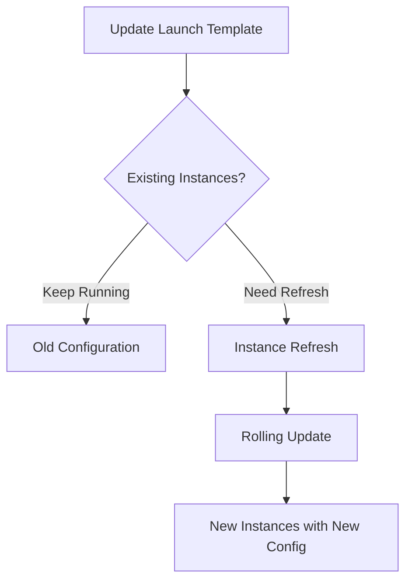

# How to Recreate EC2 Instances in Auto Scaling Group with Terraform

Author: [nawazdhandala](https://www.github.com/nawazdhandala)

Tags: Terraform, AWS, EC2, Auto Scaling, DevOps

Description: Learn how to properly trigger EC2 instance refresh in Auto Scaling Groups when updating launch templates with Terraform, including rolling updates and zero-downtime strategies.

---

When you update an Auto Scaling Group's launch template in Terraform, existing EC2 instances do not automatically update. This guide shows you how to trigger instance replacement safely with various strategies.

## The Problem

By default, updating a launch template does not replace running instances:

```hcl
resource "aws_launch_template" "app" {
  name_prefix   = "app-"
  image_id      = "ami-new123"  # Changed AMI
  instance_type = "t3.medium"   # Changed instance type
  # ... existing instances still run old AMI
}

resource "aws_autoscaling_group" "app" {
  launch_template {
    id      = aws_launch_template.app.id
    version = aws_launch_template.app.latest_version
  }
  # Instances keep running until manually terminated
}
```



## Solution 1: Instance Refresh (Recommended)

Use AWS Instance Refresh for controlled rolling updates:

```hcl
resource "aws_launch_template" "app" {
  name_prefix   = "app-"
  image_id      = var.ami_id
  instance_type = var.instance_type

  user_data = base64encode(templatefile("${path.module}/userdata.sh", {
    environment = var.environment
  }))

  tag_specifications {
    resource_type = "instance"
    tags = {
      Name = "app-instance"
    }
  }
}

resource "aws_autoscaling_group" "app" {
  name                = "app-asg"
  desired_capacity    = 4
  max_size            = 8
  min_size            = 2
  vpc_zone_identifier = var.subnet_ids

  launch_template {
    id      = aws_launch_template.app.id
    version = aws_launch_template.app.latest_version
  }

  # Configure instance refresh
  instance_refresh {
    strategy = "Rolling"

    preferences {
      min_healthy_percentage = 75  # Keep 75% healthy during refresh
      instance_warmup        = 300 # Wait 5 minutes for instance to be ready

      # Optional: Skip instances that match the new launch template
      skip_matching = true
    }

    # Triggers that start instance refresh
    triggers = ["tag", "launch_template"]
  }

  tag {
    key                 = "Environment"
    value               = var.environment
    propagate_at_launch = true
  }

  # This tag change triggers refresh when var.ami_id changes
  tag {
    key                 = "LaunchTemplateVersion"
    value               = aws_launch_template.app.latest_version
    propagate_at_launch = true
  }

  lifecycle {
    create_before_destroy = true
  }
}
```

## Solution 2: Using null_resource to Trigger Refresh

For more control over when refresh happens:

```hcl
resource "aws_launch_template" "app" {
  name_prefix   = "app-"
  image_id      = var.ami_id
  instance_type = var.instance_type
}

resource "aws_autoscaling_group" "app" {
  name                = "app-asg"
  desired_capacity    = 4
  max_size            = 8
  min_size            = 2
  vpc_zone_identifier = var.subnet_ids

  launch_template {
    id      = aws_launch_template.app.id
    version = aws_launch_template.app.latest_version
  }
}

# Trigger refresh when launch template changes
resource "null_resource" "asg_instance_refresh" {
  triggers = {
    launch_template_version = aws_launch_template.app.latest_version
    launch_template_id      = aws_launch_template.app.id
  }

  provisioner "local-exec" {
    command = <<-EOT
      aws autoscaling start-instance-refresh \
        --auto-scaling-group-name ${aws_autoscaling_group.app.name} \
        --preferences '{"MinHealthyPercentage": 75, "InstanceWarmup": 300}' \
        --region ${var.region}
    EOT
  }

  depends_on = [aws_autoscaling_group.app]
}
```

## Solution 3: Replace ASG Entirely

For major changes, replace the entire ASG:

```hcl
resource "aws_launch_template" "app" {
  name_prefix   = "app-"
  image_id      = var.ami_id
  instance_type = var.instance_type
}

resource "aws_autoscaling_group" "app" {
  # Include version in name to force replacement
  name = "app-asg-${aws_launch_template.app.latest_version}"

  desired_capacity    = 4
  max_size            = 8
  min_size            = 2
  vpc_zone_identifier = var.subnet_ids

  launch_template {
    id      = aws_launch_template.app.id
    version = aws_launch_template.app.latest_version
  }

  # Ensure new ASG is created before old one is destroyed
  lifecycle {
    create_before_destroy = true
  }

  # Wait for instances to be healthy before considering ASG ready
  wait_for_capacity_timeout = "10m"

  tag {
    key                 = "Name"
    value               = "app-instance"
    propagate_at_launch = true
  }
}
```

## Solution 4: Blue-Green Deployment

Maintain two ASGs and switch traffic:

```hcl
locals {
  active_color = var.active_color  # "blue" or "green"
}

resource "aws_launch_template" "blue" {
  name_prefix   = "app-blue-"
  image_id      = var.blue_ami_id
  instance_type = var.instance_type
}

resource "aws_launch_template" "green" {
  name_prefix   = "app-green-"
  image_id      = var.green_ami_id
  instance_type = var.instance_type
}

resource "aws_autoscaling_group" "blue" {
  name                = "app-blue-asg"
  desired_capacity    = local.active_color == "blue" ? var.desired_capacity : 0
  max_size            = var.max_size
  min_size            = local.active_color == "blue" ? var.min_size : 0
  vpc_zone_identifier = var.subnet_ids
  target_group_arns   = local.active_color == "blue" ? [aws_lb_target_group.app.arn] : []

  launch_template {
    id      = aws_launch_template.blue.id
    version = aws_launch_template.blue.latest_version
  }
}

resource "aws_autoscaling_group" "green" {
  name                = "app-green-asg"
  desired_capacity    = local.active_color == "green" ? var.desired_capacity : 0
  max_size            = var.max_size
  min_size            = local.active_color == "green" ? var.min_size : 0
  vpc_zone_identifier = var.subnet_ids
  target_group_arns   = local.active_color == "green" ? [aws_lb_target_group.app.arn] : []

  launch_template {
    id      = aws_launch_template.green.id
    version = aws_launch_template.green.latest_version
  }
}

# Switch by changing var.active_color
variable "active_color" {
  type        = string
  default     = "blue"
  description = "Which ASG is active (blue or green)"

  validation {
    condition     = contains(["blue", "green"], var.active_color)
    error_message = "active_color must be blue or green"
  }
}
```

## Solution 5: Gradual Rollout with Mixed Instances

Use mixed instances policy for gradual updates:

```hcl
resource "aws_launch_template" "app" {
  name_prefix   = "app-"
  image_id      = var.ami_id
  instance_type = var.instance_type
}

resource "aws_autoscaling_group" "app" {
  name                = "app-asg"
  desired_capacity    = 4
  max_size            = 8
  min_size            = 2
  vpc_zone_identifier = var.subnet_ids

  mixed_instances_policy {
    launch_template {
      launch_template_specification {
        launch_template_id = aws_launch_template.app.id
        version            = aws_launch_template.app.latest_version
      }

      override {
        instance_type = "t3.medium"
      }

      override {
        instance_type = "t3.large"
      }
    }

    instances_distribution {
      on_demand_base_capacity                  = 2
      on_demand_percentage_above_base_capacity = 50
      spot_allocation_strategy                 = "capacity-optimized"
    }
  }

  instance_refresh {
    strategy = "Rolling"

    preferences {
      min_healthy_percentage = 90
      instance_warmup        = 300
    }

    triggers = ["launch_template"]
  }
}
```

## Complete Example with Load Balancer Integration

```hcl
# Launch Template
resource "aws_launch_template" "app" {
  name_prefix = "app-"

  image_id      = var.ami_id
  instance_type = var.instance_type

  vpc_security_group_ids = [aws_security_group.app.id]

  iam_instance_profile {
    name = aws_iam_instance_profile.app.name
  }

  user_data = base64encode(<<-EOF
    #!/bin/bash
    echo "Starting application..."
    # Application startup script
  EOF
  )

  tag_specifications {
    resource_type = "instance"
    tags = {
      Name        = "app-${var.environment}"
      Environment = var.environment
    }
  }

  lifecycle {
    create_before_destroy = true
  }
}

# Auto Scaling Group
resource "aws_autoscaling_group" "app" {
  name                = "app-${var.environment}-asg"
  desired_capacity    = var.desired_capacity
  max_size            = var.max_size
  min_size            = var.min_size
  vpc_zone_identifier = var.private_subnet_ids
  target_group_arns   = [aws_lb_target_group.app.arn]
  health_check_type   = "ELB"
  health_check_grace_period = 300

  launch_template {
    id      = aws_launch_template.app.id
    version = aws_launch_template.app.latest_version
  }

  instance_refresh {
    strategy = "Rolling"

    preferences {
      min_healthy_percentage = 75
      instance_warmup        = 300
      skip_matching          = true

      # Checkpoint for large deployments
      checkpoint_delay       = 3600
      checkpoint_percentages = [25, 50, 75, 100]
    }

    triggers = ["tag", "launch_template"]
  }

  # Force refresh when AMI changes
  tag {
    key                 = "AMI"
    value               = var.ami_id
    propagate_at_launch = true
  }

  tag {
    key                 = "LaunchTemplateVersion"
    value               = aws_launch_template.app.latest_version
    propagate_at_launch = true
  }

  tag {
    key                 = "Name"
    value               = "app-${var.environment}"
    propagate_at_launch = true
  }

  lifecycle {
    create_before_destroy = true
    ignore_changes = [
      desired_capacity  # Let Auto Scaling manage this
    ]
  }
}

# Target Group
resource "aws_lb_target_group" "app" {
  name     = "app-${var.environment}-tg"
  port     = 8080
  protocol = "HTTP"
  vpc_id   = var.vpc_id

  health_check {
    enabled             = true
    healthy_threshold   = 2
    interval            = 30
    matcher             = "200"
    path                = "/health"
    port                = "traffic-port"
    protocol            = "HTTP"
    timeout             = 5
    unhealthy_threshold = 3
  }
}

# Scaling Policies
resource "aws_autoscaling_policy" "scale_up" {
  name                   = "app-scale-up"
  scaling_adjustment     = 2
  adjustment_type        = "ChangeInCapacity"
  cooldown               = 300
  autoscaling_group_name = aws_autoscaling_group.app.name
}

resource "aws_autoscaling_policy" "scale_down" {
  name                   = "app-scale-down"
  scaling_adjustment     = -1
  adjustment_type        = "ChangeInCapacity"
  cooldown               = 300
  autoscaling_group_name = aws_autoscaling_group.app.name
}
```

## Monitoring Instance Refresh

Track refresh progress:

```bash
# Check instance refresh status
aws autoscaling describe-instance-refreshes \
  --auto-scaling-group-name app-asg \
  --query 'InstanceRefreshes[0]' \
  --output table

# Cancel in-progress refresh
aws autoscaling cancel-instance-refresh \
  --auto-scaling-group-name app-asg

# Watch refresh progress
watch -n 30 "aws autoscaling describe-instance-refreshes \
  --auto-scaling-group-name app-asg \
  --query 'InstanceRefreshes[0].{Status:Status,Progress:PercentageComplete}' \
  --output table"
```

## Terraform Output for Monitoring

```hcl
output "asg_name" {
  value = aws_autoscaling_group.app.name
}

output "launch_template_version" {
  value = aws_launch_template.app.latest_version
}

output "refresh_command" {
  value = "aws autoscaling describe-instance-refreshes --auto-scaling-group-name ${aws_autoscaling_group.app.name}"
}
```

## Best Practices

1. **Always use health checks** - Ensure unhealthy instances are replaced
2. **Set appropriate warmup time** - Allow applications to fully start
3. **Use min_healthy_percentage** - Maintain capacity during refresh
4. **Monitor refresh progress** - Watch for failures
5. **Test in non-production first** - Validate refresh behavior
6. **Use skip_matching** - Avoid unnecessary replacements

---

Instance refresh is the recommended way to update EC2 instances in an Auto Scaling Group. It provides controlled rolling updates while maintaining application availability. For major changes or when you need more control, consider blue-green deployments or ASG replacement strategies.
