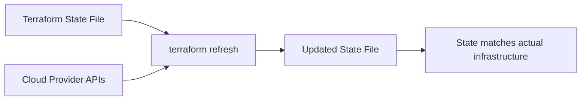

# How to Understand What terraform refresh Actually Does

Author: [nawazdhandala](https://www.github.com/nawazdhandala)

Tags: Terraform, Infrastructure as Code, AWS, DevOps, State Management

Description: Learn what terraform refresh does under the hood, when to use it, why it was deprecated as a standalone command, and how to handle state drift in modern Terraform workflows.

---

The `terraform refresh` command is one of the most misunderstood commands in Terraform. Many engineers use it without fully understanding what happens behind the scenes. This guide explains exactly what refresh does, when you need it, and how modern Terraform handles state synchronization.

## What terraform refresh Actually Does

At its core, `terraform refresh` reconciles the Terraform state file with the actual infrastructure. It queries your cloud provider APIs to get the current state of resources and updates the local state file to match reality.



Here's what happens step by step:

1. Terraform reads the current state file
2. For each resource in state, it queries the provider API
3. It compares the actual infrastructure attributes with stored state
4. The state file is updated to reflect real-world values

## The Refresh Command Syntax

The standalone refresh command was deprecated in Terraform 0.15.4 but still works:

```bash
# Deprecated standalone command
terraform refresh

# Refresh with variable file
terraform refresh -var-file="production.tfvars"

# Refresh specific target
terraform refresh -target=aws_instance.web_server
```

Modern Terraform uses the `-refresh-only` flag with plan and apply:

```bash
# View what would change (recommended approach)
terraform plan -refresh-only

# Apply refresh changes to state
terraform apply -refresh-only
```

## Why Was Standalone Refresh Deprecated?

The standalone `terraform refresh` command was deprecated because it modifies state without showing you what changed. This is dangerous in production environments. The new `-refresh-only` mode provides a plan output showing exactly what state changes will occur.

```bash
# Old way - dangerous, no preview
terraform refresh

# New way - safe, shows changes first
terraform plan -refresh-only
```

## Understanding State Drift

State drift occurs when infrastructure changes outside of Terraform. Common causes include:

- Manual changes in the cloud console
- Other automation tools modifying resources
- Auto-scaling events
- Provider-side updates (security patches, etc.)

```hcl
# Example: Your Terraform config says
resource "aws_instance" "web" {
  instance_type = "t3.micro"
  tags = {
    Name = "web-server"
  }
}

# But someone manually changed instance_type to t3.small
# State drift has occurred
```

## Detecting State Drift

Use `terraform plan -refresh-only` to detect drift:

```bash
terraform plan -refresh-only

# Output shows drift
# aws_instance.web:
#   ~ instance_type = "t3.micro" -> "t3.small"
#
# Note: Objects have changed outside of Terraform
```

## Handling Detected Drift

You have three options when drift is detected:

### Option 1: Accept the Drift

Update your state to match reality:

```bash
# Accept the current infrastructure state
terraform apply -refresh-only -auto-approve
```

### Option 2: Revert to Terraform Config

Run a normal plan/apply to enforce your configuration:

```bash
# This will change infrastructure back to match your config
terraform plan
terraform apply
```

### Option 3: Update Your Configuration

Modify your Terraform code to match the new reality:

```hcl
# Update config to match what exists
resource "aws_instance" "web" {
  instance_type = "t3.small"  # Changed to match drift
  tags = {
    Name = "web-server"
  }
}
```

## When Refresh Happens Automatically

Every `terraform plan` and `terraform apply` performs a refresh by default. This is why you see Terraform "Reading..." resources at the start:

```bash
terraform plan

# Output:
# aws_instance.web: Refreshing state... [id=i-1234567890abcdef0]
# aws_security_group.web: Refreshing state... [id=sg-0123456789abcdef0]
```

## Disabling Automatic Refresh

In large infrastructures, refresh can be slow. You can skip it:

```bash
# Skip refresh during plan (use cached state)
terraform plan -refresh=false

# Skip refresh during apply
terraform apply -refresh=false
```

Use this cautiously - your state might not reflect reality.

## Refresh Behavior with Remote State

When using remote backends like S3 or Terraform Cloud, refresh behaves the same but with additional considerations:

```hcl
terraform {
  backend "s3" {
    bucket         = "my-terraform-state"
    key            = "prod/terraform.tfstate"
    region         = "us-east-1"
    dynamodb_table = "terraform-locks"
  }
}
```

The refresh operation:
1. Acquires state lock (if using DynamoDB)
2. Downloads current state from S3
3. Queries provider APIs
4. Updates state
5. Uploads new state to S3
6. Releases lock

## Partial Refresh with Targets

For large infrastructures, refresh specific resources:

```bash
# Refresh only the web instance
terraform plan -refresh-only -target=aws_instance.web

# Refresh an entire module
terraform plan -refresh-only -target=module.networking
```

## Common Refresh Scenarios

### Scenario 1: Import Existing Resources

After importing resources, refresh ensures complete state:

```bash
# Import existing resource
terraform import aws_instance.imported i-1234567890abcdef0

# Refresh to get all attributes
terraform apply -refresh-only
```

### Scenario 2: After Provider Upgrades

Provider upgrades may change how attributes are stored:

```bash
# After upgrading AWS provider
terraform init -upgrade
terraform plan -refresh-only
```

### Scenario 3: Debugging State Issues

When state seems corrupted or outdated:

```bash
# Check what Terraform thinks vs reality
terraform plan -refresh-only

# Review specific resource
terraform state show aws_instance.web
```

## Best Practices for State Management

1. **Always preview refresh changes** - Use `-refresh-only` mode instead of deprecated `refresh`

2. **Run in CI/CD pipelines** - Schedule regular drift detection:

```yaml
# Example GitHub Actions workflow
- name: Check for drift
  run: |
    terraform plan -refresh-only -detailed-exitcode
  continue-on-error: true
```

3. **Use state locking** - Prevent concurrent state modifications:

```hcl
terraform {
  backend "s3" {
    bucket         = "terraform-state"
    key            = "prod/terraform.tfstate"
    region         = "us-east-1"
    dynamodb_table = "terraform-locks"  # Enable locking
    encrypt        = true
  }
}
```

4. **Document drift handling procedures** - Your team should know when to accept vs revert drift

## Troubleshooting Refresh Issues

### API Rate Limiting

Large infrastructures may hit rate limits:

```bash
# Add parallelism limit
terraform plan -refresh-only -parallelism=5
```

### Timeout Issues

Some resources take time to query:

```hcl
provider "aws" {
  region = "us-east-1"

  # Increase timeouts for slow APIs
  default_tags {
    tags = {
      ManagedBy = "Terraform"
    }
  }
}
```

### Permission Errors

Ensure your credentials have read access to all resources in state.

---

Understanding what `terraform refresh` does helps you maintain accurate state and handle drift effectively. Use the modern `-refresh-only` mode with plan and apply for safe, predictable state management. Regular drift detection in CI/CD pipelines catches manual changes early before they cause issues.
