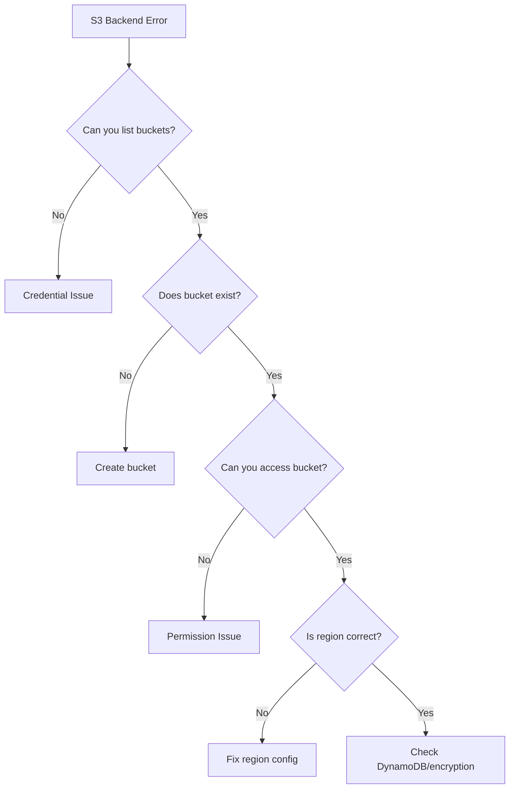

# How to Fix "Error configuring Terraform S3 Backend"

Author: [nawazdhandala](https://www.github.com/nawazdhandala)

Tags: Terraform, AWS, S3, Backend, State Management

Description: Troubleshoot and fix the common "Error configuring Terraform S3 Backend" issues including credential problems, bucket access, and region mismatches.

---

The "Error configuring Terraform S3 Backend" message appears when Terraform cannot connect to your S3 bucket for remote state storage. This guide walks through every common cause and provides solutions for each scenario.

## Understanding the Error

The full error typically looks like one of these:

```
Error: Error configuring Terraform S3 Backend: Error creating AWS session: NoCredentialProviders

Error: Error configuring the backend "s3": No valid credential sources for S3 Backend found.

Error: Error configuring the backend "s3": AccessDenied: Access Denied

Error: Error configuring the backend "s3": The specified bucket does not exist
```

## Diagnostic Flowchart



## Fix 1: AWS Credentials Not Configured

The most common cause is missing or incorrect credentials.

### Check Current Credentials

```bash
# Verify AWS CLI can authenticate
aws sts get-caller-identity

# Check which credentials are being used
aws configure list
```

### Configure Credentials

```bash
# Option 1: Configure via CLI
aws configure

# Option 2: Export environment variables
export AWS_ACCESS_KEY_ID="your-access-key"
export AWS_SECRET_ACCESS_KEY="your-secret-key"
export AWS_REGION="us-east-1"

# Option 3: Use AWS profile
export AWS_PROFILE="production"
```

### Backend Configuration with Profile

```hcl
terraform {
  backend "s3" {
    bucket  = "my-terraform-state"
    key     = "prod/terraform.tfstate"
    region  = "us-east-1"
    profile = "production"  # Use specific AWS profile
  }
}
```

## Fix 2: S3 Bucket Does Not Exist

Create the bucket before initializing Terraform:

```bash
# Create the S3 bucket
aws s3api create-bucket \
  --bucket my-terraform-state \
  --region us-east-1

# For regions other than us-east-1, add location constraint
aws s3api create-bucket \
  --bucket my-terraform-state \
  --region us-west-2 \
  --create-bucket-configuration LocationConstraint=us-west-2

# Enable versioning (recommended)
aws s3api put-bucket-versioning \
  --bucket my-terraform-state \
  --versioning-configuration Status=Enabled

# Enable encryption
aws s3api put-bucket-encryption \
  --bucket my-terraform-state \
  --server-side-encryption-configuration '{
    "Rules": [
      {
        "ApplyServerSideEncryptionByDefault": {
          "SSEAlgorithm": "aws:kms"
        }
      }
    ]
  }'
```

## Fix 3: Insufficient IAM Permissions

Your IAM user or role needs specific permissions for the S3 backend.

### Minimum Required Permissions

```json
{
  "Version": "2012-10-17",
  "Statement": [
    {
      "Sid": "S3StateAccess",
      "Effect": "Allow",
      "Action": [
        "s3:GetObject",
        "s3:PutObject",
        "s3:DeleteObject",
        "s3:ListBucket",
        "s3:GetBucketVersioning"
      ],
      "Resource": [
        "arn:aws:s3:::my-terraform-state",
        "arn:aws:s3:::my-terraform-state/*"
      ]
    }
  ]
}
```

### With DynamoDB Locking

```json
{
  "Version": "2012-10-17",
  "Statement": [
    {
      "Sid": "S3StateAccess",
      "Effect": "Allow",
      "Action": [
        "s3:GetObject",
        "s3:PutObject",
        "s3:DeleteObject",
        "s3:ListBucket",
        "s3:GetBucketVersioning"
      ],
      "Resource": [
        "arn:aws:s3:::my-terraform-state",
        "arn:aws:s3:::my-terraform-state/*"
      ]
    },
    {
      "Sid": "DynamoDBLocking",
      "Effect": "Allow",
      "Action": [
        "dynamodb:GetItem",
        "dynamodb:PutItem",
        "dynamodb:DeleteItem",
        "dynamodb:DescribeTable"
      ],
      "Resource": "arn:aws:dynamodb:us-east-1:123456789012:table/terraform-locks"
    }
  ]
}
```

### With KMS Encryption

```json
{
  "Version": "2012-10-17",
  "Statement": [
    {
      "Sid": "KMSAccess",
      "Effect": "Allow",
      "Action": [
        "kms:Encrypt",
        "kms:Decrypt",
        "kms:GenerateDataKey"
      ],
      "Resource": "arn:aws:kms:us-east-1:123456789012:key/your-key-id"
    }
  ]
}
```

## Fix 4: Region Mismatch

The region in your backend configuration must match the bucket's region:

```hcl
# Check bucket region first
# aws s3api get-bucket-location --bucket my-terraform-state

terraform {
  backend "s3" {
    bucket = "my-terraform-state"
    key    = "prod/terraform.tfstate"
    region = "us-west-2"  # Must match actual bucket region
  }
}
```

## Fix 5: DynamoDB Table Issues

If using state locking, the DynamoDB table must exist:

```bash
# Create DynamoDB table for locking
aws dynamodb create-table \
  --table-name terraform-locks \
  --attribute-definitions AttributeName=LockID,AttributeType=S \
  --key-schema AttributeName=LockID,KeyType=HASH \
  --billing-mode PAY_PER_REQUEST \
  --region us-east-1
```

Backend configuration with locking:

```hcl
terraform {
  backend "s3" {
    bucket         = "my-terraform-state"
    key            = "prod/terraform.tfstate"
    region         = "us-east-1"
    dynamodb_table = "terraform-locks"
    encrypt        = true
  }
}
```

## Fix 6: Bucket Policy Blocking Access

Check if a bucket policy is restricting access:

```bash
# View bucket policy
aws s3api get-bucket-policy --bucket my-terraform-state

# View bucket ACL
aws s3api get-bucket-acl --bucket my-terraform-state
```

Example permissive bucket policy for Terraform:

```json
{
  "Version": "2012-10-17",
  "Statement": [
    {
      "Sid": "TerraformStateAccess",
      "Effect": "Allow",
      "Principal": {
        "AWS": [
          "arn:aws:iam::123456789012:user/terraform",
          "arn:aws:iam::123456789012:role/terraform-role"
        ]
      },
      "Action": [
        "s3:GetObject",
        "s3:PutObject",
        "s3:DeleteObject"
      ],
      "Resource": "arn:aws:s3:::my-terraform-state/*"
    },
    {
      "Sid": "TerraformStateBucketAccess",
      "Effect": "Allow",
      "Principal": {
        "AWS": [
          "arn:aws:iam::123456789012:user/terraform",
          "arn:aws:iam::123456789012:role/terraform-role"
        ]
      },
      "Action": "s3:ListBucket",
      "Resource": "arn:aws:s3:::my-terraform-state"
    }
  ]
}
```

## Fix 7: S3 Public Access Block Settings

Modern S3 buckets have public access blocked by default. This is good for security but ensure your IAM permissions are correct:

```bash
# Check public access block settings
aws s3api get-public-access-block --bucket my-terraform-state
```

The settings should look like this for a secure but accessible bucket:

```json
{
  "PublicAccessBlockConfiguration": {
    "BlockPublicAcls": true,
    "IgnorePublicAcls": true,
    "BlockPublicPolicy": true,
    "RestrictPublicBuckets": true
  }
}
```

## Fix 8: Assume Role Configuration

If using cross-account access or assume role:

```hcl
terraform {
  backend "s3" {
    bucket         = "my-terraform-state"
    key            = "prod/terraform.tfstate"
    region         = "us-east-1"
    role_arn       = "arn:aws:iam::123456789012:role/TerraformStateRole"
    session_name   = "terraform"
    external_id    = "unique-external-id"
  }
}
```

Ensure the role trust policy allows your identity to assume it:

```json
{
  "Version": "2012-10-17",
  "Statement": [
    {
      "Effect": "Allow",
      "Principal": {
        "AWS": "arn:aws:iam::111111111111:user/terraform-user"
      },
      "Action": "sts:AssumeRole",
      "Condition": {
        "StringEquals": {
          "sts:ExternalId": "unique-external-id"
        }
      }
    }
  ]
}
```

## Fix 9: Reinitialize Backend

After fixing configuration issues, reinitialize:

```bash
# Remove existing backend configuration
rm -rf .terraform

# Reinitialize
terraform init

# If migrating from local to S3
terraform init -migrate-state

# Force reconfiguration
terraform init -reconfigure
```

## Fix 10: Network and Endpoint Issues

### VPC Endpoints

If running in a VPC without internet access, you need S3 and DynamoDB VPC endpoints:

```hcl
resource "aws_vpc_endpoint" "s3" {
  vpc_id       = aws_vpc.main.id
  service_name = "com.amazonaws.us-east-1.s3"
}

resource "aws_vpc_endpoint" "dynamodb" {
  vpc_id       = aws_vpc.main.id
  service_name = "com.amazonaws.us-east-1.dynamodb"
}
```

### Proxy Configuration

If behind a proxy:

```bash
export HTTP_PROXY="http://proxy.example.com:8080"
export HTTPS_PROXY="http://proxy.example.com:8080"
export NO_PROXY="169.254.169.254"

terraform init
```

## Complete Working Backend Setup

Here is a complete example that avoids common issues:

```hcl
terraform {
  required_version = ">= 1.0.0"

  required_providers {
    aws = {
      source  = "hashicorp/aws"
      version = "~> 5.0"
    }
  }

  backend "s3" {
    bucket         = "my-terraform-state-123456789012"  # Globally unique name
    key            = "environments/prod/terraform.tfstate"
    region         = "us-east-1"
    encrypt        = true
    dynamodb_table = "terraform-locks"

    # Optional: Use specific profile
    # profile = "terraform"

    # Optional: Use assume role
    # role_arn = "arn:aws:iam::123456789012:role/TerraformRole"
  }
}

provider "aws" {
  region = "us-east-1"
}
```

---

Most S3 backend errors come down to three issues: missing credentials, incorrect permissions, or misconfigured bucket settings. Work through the diagnostic flowchart, check each potential cause, and ensure your IAM policy grants all required S3 and DynamoDB actions. Once properly configured, the S3 backend provides reliable, collaborative state management for your Terraform projects.
