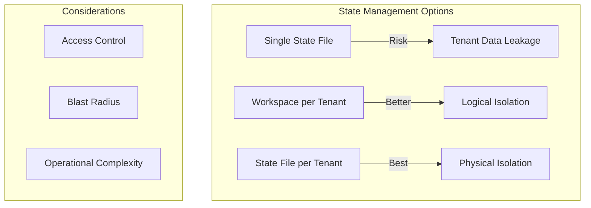

# How to Manage Terraform State for Multi-Tenancy

Author: [nawazdhandala](https://www.github.com/nawazdhandala)

Tags: Terraform, Multi-Tenancy, State Management, SaaS, Workspaces, Best Practices

Description: Learn strategies for managing Terraform state in multi-tenant environments, including state isolation patterns, workspace strategies, and secure tenant data handling for SaaS platforms.

Multi-tenant architectures present unique challenges for Terraform state management. Whether you're deploying infrastructure per customer, per environment, or per team, proper state isolation is critical for security and operational efficiency. This guide covers proven patterns for multi-tenant Terraform deployments.

## Understanding Multi-Tenant State Challenges



Key concerns include:
- **Isolation**: Preventing cross-tenant access
- **Blast radius**: Limiting impact of mistakes
- **Scalability**: Managing hundreds of tenants
- **Operations**: Maintaining and updating infrastructure

## Pattern 1: Workspaces for Tenant Isolation

Terraform workspaces provide logical separation within a single backend:

```hcl
# backend.tf
terraform {
  backend "s3" {
    bucket         = "company-terraform-state"
    key            = "multi-tenant/terraform.tfstate"
    region         = "us-east-1"
    encrypt        = true
    dynamodb_table = "terraform-locks"
  }
}

# variables.tf
variable "tenant_id" {
  description = "Unique tenant identifier"
  type        = string
}

variable "tenant_config" {
  description = "Tenant-specific configuration"
  type = object({
    name         = string
    environment  = string
    instance_size = string
    features     = map(bool)
  })
}

# main.tf
locals {
  # Use workspace name as tenant identifier
  tenant_id = terraform.workspace

  # Load tenant-specific config
  tenant_config = var.tenant_config
}

resource "aws_vpc" "tenant" {
  cidr_block = "10.${local.tenant_index}.0.0/16"

  tags = {
    Name     = "${local.tenant_id}-vpc"
    TenantId = local.tenant_id
  }
}

# Calculate tenant index for CIDR allocation
locals {
  tenant_index = index(var.all_tenant_ids, local.tenant_id)
}
```

### Managing Workspaces

```bash
# Create workspace for new tenant
terraform workspace new tenant-abc123

# Switch to tenant
terraform workspace select tenant-abc123

# Apply tenant-specific configuration
terraform apply -var-file="tenants/abc123.tfvars"

# List all tenant workspaces
terraform workspace list
```

### Limitations of Workspaces

- All tenants share the same backend configuration
- No built-in access control between workspaces
- State file grows with tenant count
- Difficult to manage at scale (100+ tenants)

## Pattern 2: Separate State Files per Tenant

For stronger isolation, use separate state files:

```hcl
# backend.tf
terraform {
  backend "s3" {
    bucket         = "company-terraform-state"
    key            = "tenants/${var.tenant_id}/terraform.tfstate"
    region         = "us-east-1"
    encrypt        = true
    dynamodb_table = "terraform-locks"
  }
}
```

Since backend configuration doesn't support variables, use partial configuration:

```hcl
# backend.tf
terraform {
  backend "s3" {
    bucket         = "company-terraform-state"
    region         = "us-east-1"
    encrypt        = true
    dynamodb_table = "terraform-locks"
    # key is set via -backend-config
  }
}
```

```bash
# Initialize with tenant-specific key
terraform init \
  -backend-config="key=tenants/abc123/terraform.tfstate" \
  -reconfigure

# Apply for this tenant
terraform apply -var="tenant_id=abc123"
```

### Automation Script

```bash
#!/bin/bash
# deploy-tenant.sh

TENANT_ID=$1
ACTION=${2:-plan}

if [ -z "$TENANT_ID" ]; then
  echo "Usage: $0 <tenant_id> [plan|apply|destroy]"
  exit 1
fi

# Initialize backend for this tenant
terraform init \
  -backend-config="key=tenants/${TENANT_ID}/terraform.tfstate" \
  -reconfigure

# Load tenant-specific variables
TENANT_VARS="tenants/${TENANT_ID}.tfvars"
if [ ! -f "$TENANT_VARS" ]; then
  echo "Tenant config not found: $TENANT_VARS"
  exit 1
fi

# Execute action
case $ACTION in
  plan)
    terraform plan -var="tenant_id=${TENANT_ID}" -var-file="$TENANT_VARS"
    ;;
  apply)
    terraform apply -var="tenant_id=${TENANT_ID}" -var-file="$TENANT_VARS" -auto-approve
    ;;
  destroy)
    terraform destroy -var="tenant_id=${TENANT_ID}" -var-file="$TENANT_VARS" -auto-approve
    ;;
esac
```

## Pattern 3: Terragrunt for Multi-Tenancy

Terragrunt excels at multi-tenant state management:

```
infrastructure/
  terragrunt.hcl          # Root configuration
  modules/
    tenant-stack/         # Shared module
      main.tf
      variables.tf
  tenants/
    abc123/
      terragrunt.hcl
      tenant.tfvars
    def456/
      terragrunt.hcl
      tenant.tfvars
    ghi789/
      terragrunt.hcl
      tenant.tfvars
```

### Root Terragrunt Configuration

```hcl
# terragrunt.hcl (root)
remote_state {
  backend = "s3"
  generate = {
    path      = "backend.tf"
    if_exists = "overwrite_terragrunt"
  }
  config = {
    bucket         = "company-terraform-state"
    key            = "${path_relative_to_include()}/terraform.tfstate"
    region         = "us-east-1"
    encrypt        = true
    dynamodb_table = "terraform-locks"
  }
}

# Generate provider configuration
generate "provider" {
  path      = "provider.tf"
  if_exists = "overwrite_terragrunt"
  contents  = <<EOF
provider "aws" {
  region = "us-east-1"
}
EOF
}
```

### Tenant-Specific Configuration

```hcl
# tenants/abc123/terragrunt.hcl
include "root" {
  path = find_in_parent_folders()
}

terraform {
  source = "../../modules/tenant-stack"
}

inputs = {
  tenant_id = "abc123"
  tenant_name = "Acme Corporation"
  environment = "production"
  instance_size = "large"
  features = {
    advanced_analytics = true
    custom_domain = true
  }
}
```

### Bulk Operations with Terragrunt

```bash
# Plan all tenants
terragrunt run-all plan

# Apply to all tenants
terragrunt run-all apply

# Apply to specific tenants matching pattern
cd tenants
for tenant in abc* def*; do
  cd $tenant
  terragrunt apply -auto-approve
  cd ..
done
```

## Pattern 4: Tenant Isolation with Separate AWS Accounts

For maximum isolation, deploy each tenant to a separate AWS account:

```hcl
# providers.tf
variable "tenant_account_id" {
  type = string
}

provider "aws" {
  region = "us-east-1"

  assume_role {
    role_arn = "arn:aws:iam::${var.tenant_account_id}:role/TerraformDeployRole"
  }
}

# backend per tenant account
terraform {
  backend "s3" {
    bucket         = "tenant-terraform-state"
    key            = "infrastructure/terraform.tfstate"
    region         = "us-east-1"
    encrypt        = true
    # Backend is in tenant's account
    role_arn       = "arn:aws:iam::${var.tenant_account_id}:role/TerraformStateRole"
  }
}
```

## State Access Control

### IAM Policy for Tenant Isolation

```hcl
# Create IAM policy that restricts state access to specific tenant
resource "aws_iam_policy" "tenant_state_access" {
  name = "terraform-state-tenant-${var.tenant_id}"

  policy = jsonencode({
    Version = "2012-10-17"
    Statement = [
      {
        Effect = "Allow"
        Action = [
          "s3:GetObject",
          "s3:PutObject",
          "s3:DeleteObject"
        ]
        Resource = [
          "arn:aws:s3:::company-terraform-state/tenants/${var.tenant_id}/*"
        ]
      },
      {
        Effect = "Allow"
        Action = [
          "s3:ListBucket"
        ]
        Resource = "arn:aws:s3:::company-terraform-state"
        Condition = {
          StringLike = {
            "s3:prefix" = "tenants/${var.tenant_id}/*"
          }
        }
      },
      {
        Effect = "Allow"
        Action = [
          "dynamodb:GetItem",
          "dynamodb:PutItem",
          "dynamodb:DeleteItem"
        ]
        Resource = "arn:aws:dynamodb:*:*:table/terraform-locks"
        Condition = {
          "ForAllValues:StringLike" = {
            "dynamodb:LeadingKeys" = "tenants/${var.tenant_id}/*"
          }
        }
      }
    ]
  })
}
```

## Tenant Onboarding Automation

### Tenant Configuration Schema

```hcl
# tenant-config/schema.tf
variable "tenant" {
  type = object({
    id           = string
    name         = string
    email        = string
    plan         = string  # free, starter, professional, enterprise
    region       = string
    custom_domain = optional(string)
    features = optional(object({
      sso              = optional(bool, false)
      audit_logs       = optional(bool, false)
      dedicated_compute = optional(bool, false)
    }), {})
  })

  validation {
    condition     = can(regex("^[a-z0-9-]+$", var.tenant.id))
    error_message = "Tenant ID must contain only lowercase letters, numbers, and hyphens."
  }
}
```

### Onboarding Module

```hcl
# modules/tenant-onboarding/main.tf
variable "tenant" {
  type = any
}

# Create tenant state bucket prefix
resource "aws_s3_object" "tenant_state_prefix" {
  bucket  = var.state_bucket
  key     = "tenants/${var.tenant.id}/.keep"
  content = "Tenant state directory"
}

# Create tenant-specific resources
module "tenant_infrastructure" {
  source = "../tenant-stack"

  tenant_id   = var.tenant.id
  tenant_name = var.tenant.name
  plan        = var.tenant.plan
  region      = var.tenant.region
  features    = var.tenant.features
}

# Output tenant details
output "tenant_details" {
  value = {
    id         = var.tenant.id
    endpoint   = module.tenant_infrastructure.endpoint
    created_at = timestamp()
  }
}
```

## Monitoring and Observability

Track state operations across tenants:

```hcl
# Enable S3 access logging
resource "aws_s3_bucket_logging" "state_logging" {
  bucket = aws_s3_bucket.terraform_state.id

  target_bucket = aws_s3_bucket.logs.id
  target_prefix = "terraform-state-access/"
}

# CloudWatch alarm for state modifications
resource "aws_cloudwatch_metric_alarm" "state_changes" {
  alarm_name          = "terraform-state-modifications"
  comparison_operator = "GreaterThanThreshold"
  evaluation_periods  = 1
  metric_name         = "NumberOfObjects"
  namespace           = "AWS/S3"
  period              = 300
  statistic           = "Average"
  threshold           = var.expected_tenant_count * 2

  dimensions = {
    BucketName = aws_s3_bucket.terraform_state.id
    StorageType = "AllStorageTypes"
  }
}
```

## Best Practices

### 1. Naming Conventions

```hcl
locals {
  # Consistent resource naming
  name_prefix = "${var.company}-${var.tenant_id}-${var.environment}"

  common_tags = {
    TenantId    = var.tenant_id
    Environment = var.environment
    ManagedBy   = "terraform"
  }
}
```

### 2. State File Encryption

```hcl
# Use customer-managed KMS key per tenant
resource "aws_kms_key" "tenant_state" {
  description = "KMS key for tenant ${var.tenant_id} state encryption"

  tags = {
    TenantId = var.tenant_id
  }
}

# Backend configuration with KMS
terraform {
  backend "s3" {
    bucket         = "company-terraform-state"
    key            = "tenants/TENANT_ID/terraform.tfstate"
    region         = "us-east-1"
    encrypt        = true
    kms_key_id     = "alias/tenant-TENANT_ID-state"
    dynamodb_table = "terraform-locks"
  }
}
```

### 3. Regular State Cleanup

```bash
#!/bin/bash
# cleanup-tenant.sh - Remove departed tenant

TENANT_ID=$1

# Remove Terraform resources
./deploy-tenant.sh $TENANT_ID destroy

# Remove state file
aws s3 rm "s3://company-terraform-state/tenants/${TENANT_ID}/" --recursive

# Remove workspace if using workspaces
terraform workspace select default
terraform workspace delete $TENANT_ID
```

## Conclusion

Managing Terraform state in multi-tenant environments requires careful consideration of isolation, security, and operational complexity. For smaller deployments, workspaces provide a simple solution. As you scale, separate state files with Terragrunt automation offers better isolation. For enterprise SaaS with strict compliance requirements, consider separate AWS accounts per tenant. Always implement proper access controls on state storage and maintain comprehensive logging for audit purposes.
