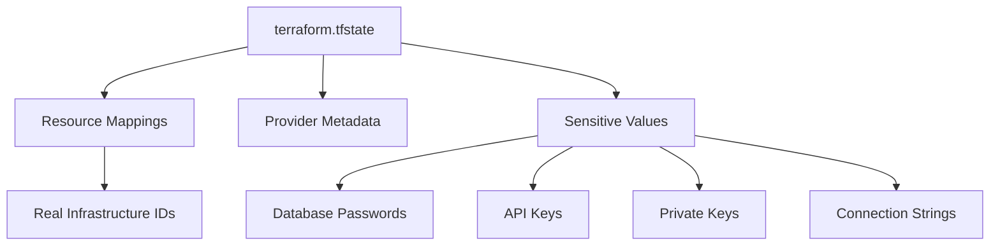
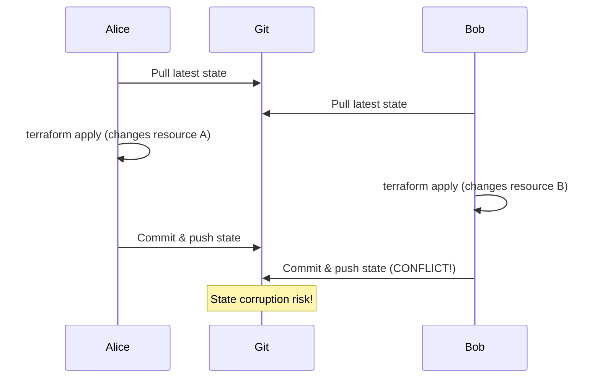
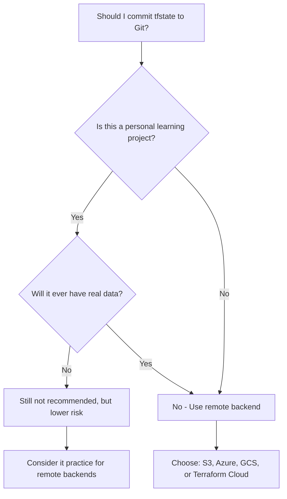

# How to Decide Whether to Commit .tfstate Files to Git

Author: [nawazdhandala](https://www.github.com/nawazdhandala)

Tags: Terraform, Git, State Management, Infrastructure as Code, DevOps, Security

Description: Should you commit Terraform state files to Git? Learn the security risks, team collaboration challenges, and proper state management strategies using remote backends.

One of the most common questions from teams starting with Terraform is whether to commit `.tfstate` files to version control. The short answer is **no** - you should almost never commit Terraform state to Git. This guide explains why and shows you the proper alternatives.

## Understanding Terraform State

Terraform state is a JSON file that maps your configuration to real-world resources. It contains:

- Resource IDs and attributes
- Dependency information
- Metadata about providers and modules
- **Sensitive data** like passwords, API keys, and certificates



## Why NOT to Commit State to Git

### 1. Security Risks

State files contain sensitive data in plaintext:

```json
{
  "resources": [
    {
      "type": "aws_db_instance",
      "name": "main",
      "instances": [
        {
          "attributes": {
            "password": "SuperSecretPassword123!",
            "username": "admin",
            "endpoint": "mydb.abc123.us-east-1.rds.amazonaws.com"
          }
        }
      ]
    }
  ]
}
```

Once committed, this data persists in Git history forever, even if you delete the file later.

### 2. Concurrent Modification Conflicts

When multiple team members run Terraform simultaneously:



### 3. State Locking Not Possible

Git doesn't provide state locking. Two simultaneous `terraform apply` operations can corrupt your state or create duplicate resources.

### 4. Large File Sizes

State files grow with infrastructure complexity. A state file for a medium-sized deployment can be several megabytes, bloating your repository over time.

### 5. No Encryption at Rest

Git repositories (even private ones) don't encrypt file contents. State files with sensitive data remain readable to anyone with repository access.

## When Committing State Might Seem Okay

Some scenarios where teams consider committing state:

- **Solo developer** working on a personal project
- **Learning/experimenting** with Terraform
- **Ephemeral infrastructure** recreated from scratch each time

Even in these cases, the habit builds bad practices. Better to learn proper state management from the start.

## The Right Way: Remote State Backends

Terraform supports remote backends that solve all the problems with local state:

### AWS S3 Backend

```hcl
terraform {
  backend "s3" {
    bucket         = "my-terraform-state"
    key            = "production/infrastructure.tfstate"
    region         = "us-east-1"
    encrypt        = true
    dynamodb_table = "terraform-locks"
  }
}
```

Setup the backend infrastructure:

```hcl
# state-backend/main.tf - Run this first with local state

resource "aws_s3_bucket" "terraform_state" {
  bucket = "my-terraform-state"

  lifecycle {
    prevent_destroy = true
  }
}

resource "aws_s3_bucket_versioning" "terraform_state" {
  bucket = aws_s3_bucket.terraform_state.id

  versioning_configuration {
    status = "Enabled"
  }
}

resource "aws_s3_bucket_server_side_encryption_configuration" "terraform_state" {
  bucket = aws_s3_bucket.terraform_state.id

  rule {
    apply_server_side_encryption_by_default {
      sse_algorithm     = "aws:kms"
      kms_master_key_id = aws_kms_key.terraform_state.arn
    }
  }
}

resource "aws_s3_bucket_public_access_block" "terraform_state" {
  bucket = aws_s3_bucket.terraform_state.id

  block_public_acls       = true
  block_public_policy     = true
  ignore_public_acls      = true
  restrict_public_buckets = true
}

resource "aws_kms_key" "terraform_state" {
  description             = "KMS key for Terraform state encryption"
  deletion_window_in_days = 30
  enable_key_rotation     = true
}

resource "aws_dynamodb_table" "terraform_locks" {
  name         = "terraform-locks"
  billing_mode = "PAY_PER_REQUEST"
  hash_key     = "LockID"

  attribute {
    name = "LockID"
    type = "S"
  }
}
```

### Azure Backend

```hcl
terraform {
  backend "azurerm" {
    resource_group_name  = "terraform-state-rg"
    storage_account_name = "tfstateaccount"
    container_name       = "tfstate"
    key                  = "production.tfstate"
  }
}
```

### Google Cloud Storage Backend

```hcl
terraform {
  backend "gcs" {
    bucket = "my-terraform-state"
    prefix = "production"
  }
}
```

### Terraform Cloud Backend

```hcl
terraform {
  cloud {
    organization = "my-organization"

    workspaces {
      name = "production-infrastructure"
    }
  }
}
```

## Remote Backend Benefits

| Feature | Local State + Git | Remote Backend |
|---------|-------------------|----------------|
| State Locking | No | Yes |
| Encryption at Rest | No | Yes |
| Access Control | Repository level | Fine-grained IAM |
| Versioning | Git history | Native versioning |
| Team Collaboration | Conflict-prone | Safe concurrent access |
| Sensitive Data Protection | Exposed | Encrypted |

## Setting Up Your .gitignore

Always configure `.gitignore` to exclude state files:

```gitignore
# Terraform state files
*.tfstate
*.tfstate.*

# Terraform state backup files
*.tfstate.backup

# Terraform lock file (sometimes you want this)
# .terraform.lock.hcl

# Local .terraform directories
**/.terraform/*

# Crash log files
crash.log
crash.*.log

# Override files
override.tf
override.tf.json
*_override.tf
*_override.tf.json

# CLI configuration files
.terraformrc
terraform.rc

# Sensitive variable files
*.tfvars
!example.tfvars
```

## Migrating from Local to Remote State

If you already have state in Git, migrate to a remote backend:

```bash
# 1. Configure the remote backend in your terraform block

# 2. Initialize with migration
terraform init -migrate-state

# 3. Verify the state was migrated
terraform state list

# 4. Remove local state files
rm -f terraform.tfstate terraform.tfstate.backup

# 5. Remove from Git history (optional but recommended)
git filter-branch --force --index-filter \
  'git rm --cached --ignore-unmatch terraform.tfstate terraform.tfstate.backup' \
  --prune-empty --tag-name-filter cat -- --all

# 6. Force push (coordinate with team!)
git push --force --all
git push --force --tags

# 7. Update .gitignore
echo "*.tfstate" >> .gitignore
echo "*.tfstate.*" >> .gitignore
git add .gitignore
git commit -m "Add tfstate to gitignore"
```

## State Access for Different Environments

Structure your state for multiple environments:

```hcl
# Use workspace-based state
terraform {
  backend "s3" {
    bucket         = "my-terraform-state"
    key            = "infrastructure.tfstate"
    region         = "us-east-1"
    encrypt        = true
    dynamodb_table = "terraform-locks"

    # State path: s3://my-terraform-state/env:/dev/infrastructure.tfstate
    workspace_key_prefix = "env:"
  }
}
```

Or use separate state files per environment:

```hcl
# environments/production/main.tf
terraform {
  backend "s3" {
    bucket = "my-terraform-state"
    key    = "production/infrastructure.tfstate"
    region = "us-east-1"
  }
}

# environments/staging/main.tf
terraform {
  backend "s3" {
    bucket = "my-terraform-state"
    key    = "staging/infrastructure.tfstate"
    region = "us-east-1"
  }
}
```

## Accessing State from Other Configurations

Use `terraform_remote_state` data source:

```hcl
# In the application configuration
data "terraform_remote_state" "network" {
  backend = "s3"

  config = {
    bucket = "my-terraform-state"
    key    = "network/infrastructure.tfstate"
    region = "us-east-1"
  }
}

resource "aws_instance" "app" {
  subnet_id = data.terraform_remote_state.network.outputs.private_subnet_id
  # ...
}
```

## Decision Framework

Use this flowchart to decide:



## Summary

**Never commit Terraform state files to Git in any production or team environment.**

Remote backends provide:
- State locking preventing concurrent modification
- Encryption for sensitive data
- Access control through IAM policies
- Versioning for rollback capability
- Safe team collaboration

The small effort to set up a remote backend pays dividends in security, reliability, and team productivity. Start with the habit of using remote state from day one, even for personal projects.
