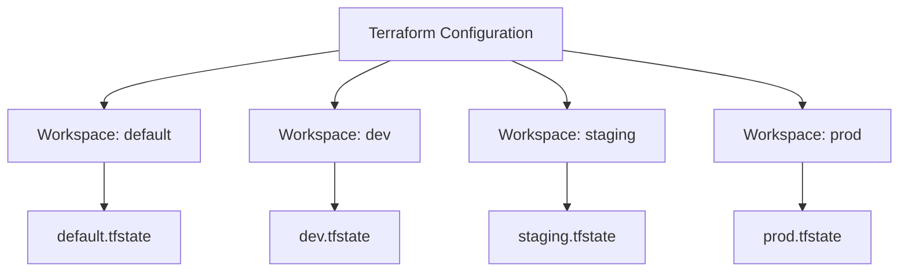

# How to Structure Terraform Workspaces Properly

Author: [nawazdhandala](https://www.github.com/nawazdhandala)

Tags: Terraform, Infrastructure as Code, DevOps, Best Practices

Description: Learn how to structure Terraform workspaces effectively for managing multiple environments, including when to use workspaces vs directories and best practices for state management.

---

Terraform workspaces allow you to manage multiple environments (dev, staging, production) with a single configuration. However, improper workspace usage leads to complexity and risk. This guide shows you how to structure workspaces effectively.

## Understanding Terraform Workspaces

Workspaces create separate state files for the same configuration:



## Basic Workspace Commands

```bash
# List workspaces
terraform workspace list

# Create new workspace
terraform workspace new dev

# Select workspace
terraform workspace select prod

# Show current workspace
terraform workspace show

# Delete workspace (must switch first)
terraform workspace select default
terraform workspace delete dev
```

## When to Use Workspaces

Workspaces work best when environments share identical infrastructure structure:

**Good use cases:**
- Multiple AWS accounts with same resource structure
- Dev/staging/prod environments with identical architecture
- Multi-region deployments of the same stack

**Bad use cases:**
- Environments with different resource types
- Significantly different configurations between environments
- When team members need different access per environment

## Project Structure for Workspaces

### Simple Workspace Structure

```
terraform/
├── main.tf
├── variables.tf
├── outputs.tf
├── providers.tf
├── terraform.tf
└── environments/
    ├── dev.tfvars
    ├── staging.tfvars
    └── prod.tfvars
```

### Module-Based Workspace Structure

```
terraform/
├── environments/
│   ├── dev.tfvars
│   ├── staging.tfvars
│   └── prod.tfvars
├── modules/
│   ├── networking/
│   │   ├── main.tf
│   │   ├── variables.tf
│   │   └── outputs.tf
│   ├── compute/
│   │   ├── main.tf
│   │   ├── variables.tf
│   │   └── outputs.tf
│   └── database/
│       ├── main.tf
│       ├── variables.tf
│       └── outputs.tf
├── main.tf
├── variables.tf
├── outputs.tf
└── backend.tf
```

## Workspace-Aware Configuration

### Using terraform.workspace

```hcl
# main.tf
locals {
  environment = terraform.workspace

  # Environment-specific settings
  instance_counts = {
    default = 1
    dev     = 1
    staging = 2
    prod    = 5
  }

  instance_types = {
    default = "t3.micro"
    dev     = "t3.micro"
    staging = "t3.small"
    prod    = "t3.large"
  }
}

resource "aws_instance" "app" {
  count         = local.instance_counts[local.environment]
  ami           = var.ami_id
  instance_type = local.instance_types[local.environment]

  tags = {
    Name        = "app-${local.environment}-${count.index}"
    Environment = local.environment
  }
}
```

### Environment-Specific Variables Files

```hcl
# variables.tf
variable "region" {
  type = string
}

variable "instance_type" {
  type = string
}

variable "instance_count" {
  type = number
}

variable "enable_monitoring" {
  type    = bool
  default = false
}
```

```hcl
# environments/dev.tfvars
region            = "us-east-1"
instance_type     = "t3.micro"
instance_count    = 1
enable_monitoring = false
```

```hcl
# environments/prod.tfvars
region            = "us-east-1"
instance_type     = "t3.large"
instance_count    = 5
enable_monitoring = true
```

### Makefile for Workspace Operations

```makefile
# Makefile
WORKSPACE ?= dev

.PHONY: init plan apply destroy

init:
	terraform init
	terraform workspace select $(WORKSPACE) || terraform workspace new $(WORKSPACE)

plan:
	terraform workspace select $(WORKSPACE)
	terraform plan -var-file=environments/$(WORKSPACE).tfvars

apply:
	terraform workspace select $(WORKSPACE)
	terraform apply -var-file=environments/$(WORKSPACE).tfvars

destroy:
	terraform workspace select $(WORKSPACE)
	terraform destroy -var-file=environments/$(WORKSPACE).tfvars

# Usage: make plan WORKSPACE=prod
```

## Backend Configuration for Workspaces

### S3 Backend with Workspace Prefix

```hcl
# backend.tf
terraform {
  backend "s3" {
    bucket         = "my-terraform-state"
    key            = "infrastructure/terraform.tfstate"
    region         = "us-east-1"
    dynamodb_table = "terraform-locks"
    encrypt        = true

    # Each workspace gets its own state file:
    # infrastructure/env:/dev/terraform.tfstate
    # infrastructure/env:/staging/terraform.tfstate
    # infrastructure/env:/prod/terraform.tfstate
    workspace_key_prefix = "env:"
  }
}
```

### Azure Backend with Workspaces

```hcl
terraform {
  backend "azurerm" {
    resource_group_name  = "terraform-state-rg"
    storage_account_name = "tfstate12345"
    container_name       = "tfstate"
    key                  = "infrastructure.tfstate"

    # State files:
    # tfstate/infrastructureenv:dev
    # tfstate/infrastructureenv:staging
    # tfstate/infrastructureenv:prod
  }
}
```

## Workspace vs Directory Structure

Compare these two approaches:

### Approach 1: Workspaces (Single Configuration)

```
terraform/
├── main.tf
├── variables.tf
└── environments/
    ├── dev.tfvars
    └── prod.tfvars

# Commands:
terraform workspace select dev
terraform apply -var-file=environments/dev.tfvars
```

### Approach 2: Directories (Separate Configurations)

```
terraform/
├── modules/
│   └── app/
├── environments/
│   ├── dev/
│   │   ├── main.tf
│   │   ├── backend.tf
│   │   └── terraform.tfvars
│   └── prod/
│       ├── main.tf
│       ├── backend.tf
│       └── terraform.tfvars

# Commands:
cd terraform/environments/dev
terraform apply
```

### Decision Matrix

| Factor | Workspaces | Directories |
|--------|-----------|-------------|
| Infrastructure similarity | High | Can differ |
| State isolation | Within bucket | Complete |
| Access control | Shared | Separate IAM |
| Code duplication | None | Some |
| Complexity | Lower | Higher |
| CI/CD complexity | Lower | Higher |

## Advanced Workspace Patterns

### Pattern 1: Workspace with Account Mapping

```hcl
# Map workspaces to AWS accounts
locals {
  account_ids = {
    dev     = "111111111111"
    staging = "222222222222"
    prod    = "333333333333"
  }

  account_id = local.account_ids[terraform.workspace]
}

provider "aws" {
  region = var.region

  assume_role {
    role_arn = "arn:aws:iam::${local.account_id}:role/TerraformRole"
  }
}
```

### Pattern 2: Conditional Resources by Workspace

```hcl
# Create resources only in certain workspaces
resource "aws_cloudwatch_dashboard" "main" {
  count = terraform.workspace == "prod" ? 1 : 0

  dashboard_name = "production-metrics"
  dashboard_body = jsonencode({
    widgets = [
      # Dashboard configuration
    ]
  })
}

# Different replica counts
resource "aws_rds_cluster" "main" {
  cluster_identifier = "app-${terraform.workspace}"

  # More replicas in production
  dynamic "serverless_v2_scaling_configuration" {
    for_each = terraform.workspace == "prod" ? [1] : []
    content {
      min_capacity = 2
      max_capacity = 16
    }
  }
}
```

### Pattern 3: Workspace Validation

```hcl
# Ensure workspace is valid
variable "valid_workspaces" {
  default = ["dev", "staging", "prod"]
}

resource "null_resource" "workspace_check" {
  count = contains(var.valid_workspaces, terraform.workspace) ? 0 : 1

  provisioner "local-exec" {
    command = "echo 'Invalid workspace: ${terraform.workspace}' && exit 1"
  }
}
```

## CI/CD Integration

### GitHub Actions with Workspaces

```yaml
# .github/workflows/terraform.yml
name: Terraform

on:
  push:
    branches: [main]
  pull_request:
    branches: [main]

jobs:
  terraform:
    runs-on: ubuntu-latest
    strategy:
      matrix:
        workspace: [dev, staging]
      fail-fast: false

    steps:
      - uses: actions/checkout@v4

      - name: Setup Terraform
        uses: hashicorp/setup-terraform@v3

      - name: Terraform Init
        run: terraform init

      - name: Select Workspace
        run: |
          terraform workspace select ${{ matrix.workspace }} || \
          terraform workspace new ${{ matrix.workspace }}

      - name: Terraform Plan
        run: terraform plan -var-file=environments/${{ matrix.workspace }}.tfvars

      - name: Terraform Apply
        if: github.ref == 'refs/heads/main'
        run: terraform apply -auto-approve -var-file=environments/${{ matrix.workspace }}.tfvars

  # Production requires approval
  terraform-prod:
    runs-on: ubuntu-latest
    needs: terraform
    if: github.ref == 'refs/heads/main'
    environment: production

    steps:
      - uses: actions/checkout@v4

      - name: Setup Terraform
        uses: hashicorp/setup-terraform@v3

      - name: Deploy to Production
        run: |
          terraform init
          terraform workspace select prod || terraform workspace new prod
          terraform apply -auto-approve -var-file=environments/prod.tfvars
```

## Best Practices

### 1. Never Use Default Workspace for Real Infrastructure

```hcl
# Protect against accidental default workspace usage
locals {
  is_valid_workspace = terraform.workspace != "default"
}

resource "null_resource" "check_workspace" {
  count = local.is_valid_workspace ? 0 : 1

  provisioner "local-exec" {
    command = "echo 'ERROR: Do not use default workspace' && exit 1"
  }
}
```

### 2. Document Workspace Expectations

```hcl
# variables.tf
variable "workspace_config" {
  description = <<-EOT
    This module expects the following workspaces:
    - dev: Development environment (us-east-1)
    - staging: Staging environment (us-east-1)
    - prod: Production environment (us-east-1, us-west-2)

    Create workspace: terraform workspace new <name>
    Switch workspace: terraform workspace select <name>
  EOT
  default = null
}
```

### 3. Use Workspace-Prefixed Resource Names

```hcl
locals {
  name_prefix = "${var.project}-${terraform.workspace}"
}

resource "aws_s3_bucket" "data" {
  bucket = "${local.name_prefix}-data-bucket"
}
```

### 4. Separate State Per Workspace

Always use remote state with workspace support to prevent state file confusion.

---

Terraform workspaces provide a clean way to manage multiple environments from a single configuration. Use them when environments are structurally similar, combine with environment-specific variable files, and implement proper CI/CD guards. For significantly different environments or strict access control requirements, consider separate directories instead of workspaces.
