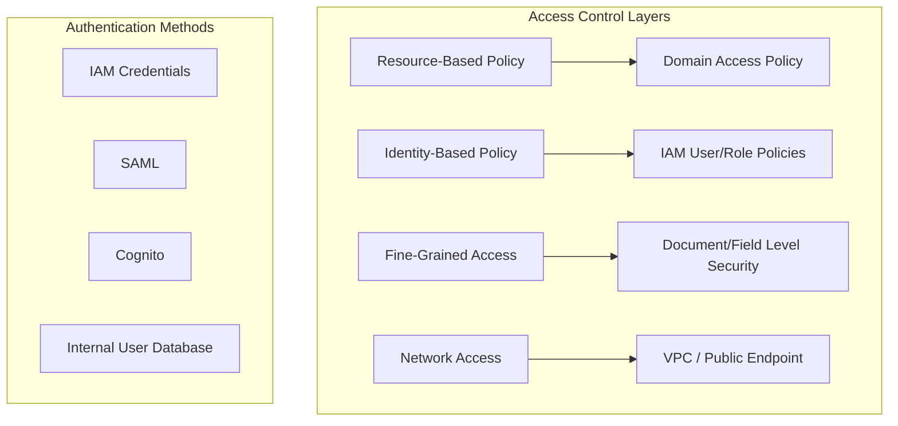
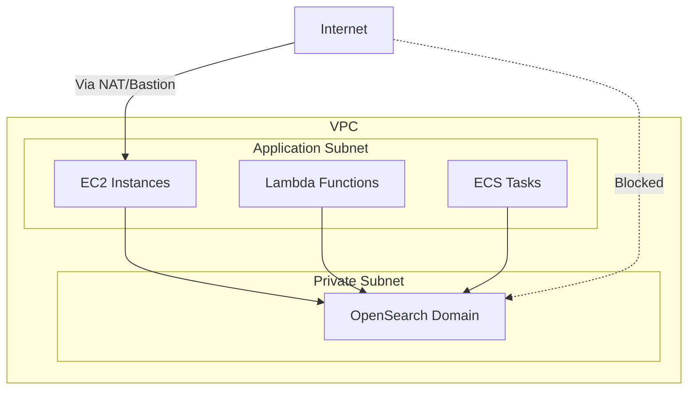

# How to Set Up Proper Access Policy for Amazon Elasticsearch

Author: [nawazdhandala](https://www.github.com/nawazdhandala)

Tags: Elasticsearch, AWS, Amazon OpenSearch, Security, IAM, Access Policy, Cloud Security

Description: Learn how to configure secure access policies for Amazon Elasticsearch Service (OpenSearch) using IAM policies, resource-based policies, and VPC configurations.

---

Amazon Elasticsearch Service (now Amazon OpenSearch Service) provides managed Elasticsearch clusters, but configuring access correctly is critical for security. An overly permissive policy exposes your data; an overly restrictive one breaks your applications. This guide walks through proper access policy configuration.

## Access Control Options

Amazon OpenSearch supports multiple layers of access control:



## Resource-Based Access Policies

### Allow Access from Specific IAM Role

This policy allows an IAM role to access the domain:

```json
{
  "Version": "2012-10-17",
  "Statement": [
    {
      "Effect": "Allow",
      "Principal": {
        "AWS": "arn:aws:iam::123456789012:role/MyApplicationRole"
      },
      "Action": "es:*",
      "Resource": "arn:aws:es:us-east-1:123456789012:domain/my-domain/*"
    }
  ]
}
```

### Allow Access from Multiple Sources

```json
{
  "Version": "2012-10-17",
  "Statement": [
    {
      "Effect": "Allow",
      "Principal": {
        "AWS": [
          "arn:aws:iam::123456789012:role/ApplicationRole",
          "arn:aws:iam::123456789012:role/AdminRole",
          "arn:aws:iam::123456789012:user/developer"
        ]
      },
      "Action": "es:*",
      "Resource": "arn:aws:es:us-east-1:123456789012:domain/my-domain/*"
    }
  ]
}
```

### IP-Based Access Policy

For public endpoints, restrict access by IP address:

```json
{
  "Version": "2012-10-17",
  "Statement": [
    {
      "Effect": "Allow",
      "Principal": {
        "AWS": "*"
      },
      "Action": "es:*",
      "Resource": "arn:aws:es:us-east-1:123456789012:domain/my-domain/*",
      "Condition": {
        "IpAddress": {
          "aws:SourceIp": [
            "192.168.1.0/24",
            "10.0.0.0/8",
            "203.0.113.50/32"
          ]
        }
      }
    }
  ]
}
```

### Combined IAM and IP Restriction

```json
{
  "Version": "2012-10-17",
  "Statement": [
    {
      "Effect": "Allow",
      "Principal": {
        "AWS": "arn:aws:iam::123456789012:role/ApplicationRole"
      },
      "Action": "es:*",
      "Resource": "arn:aws:es:us-east-1:123456789012:domain/my-domain/*",
      "Condition": {
        "IpAddress": {
          "aws:SourceIp": "10.0.0.0/8"
        }
      }
    }
  ]
}
```

## Identity-Based IAM Policies

Attach these policies to IAM users or roles:

### Read-Only Access

```json
{
  "Version": "2012-10-17",
  "Statement": [
    {
      "Effect": "Allow",
      "Action": [
        "es:ESHttpGet",
        "es:ESHttpHead"
      ],
      "Resource": "arn:aws:es:us-east-1:123456789012:domain/my-domain/*"
    }
  ]
}
```

### Read-Write Access

```json
{
  "Version": "2012-10-17",
  "Statement": [
    {
      "Effect": "Allow",
      "Action": [
        "es:ESHttpGet",
        "es:ESHttpHead",
        "es:ESHttpPost",
        "es:ESHttpPut",
        "es:ESHttpDelete"
      ],
      "Resource": "arn:aws:es:us-east-1:123456789012:domain/my-domain/*"
    }
  ]
}
```

### Index-Specific Permissions

```json
{
  "Version": "2012-10-17",
  "Statement": [
    {
      "Effect": "Allow",
      "Action": [
        "es:ESHttpGet",
        "es:ESHttpPost"
      ],
      "Resource": [
        "arn:aws:es:us-east-1:123456789012:domain/my-domain/logs-*",
        "arn:aws:es:us-east-1:123456789012:domain/my-domain/metrics-*"
      ]
    },
    {
      "Effect": "Deny",
      "Action": "es:*",
      "Resource": "arn:aws:es:us-east-1:123456789012:domain/my-domain/sensitive-*"
    }
  ]
}
```

## VPC Configuration

For production workloads, deploy OpenSearch within a VPC:



### VPC Security Group Configuration

```bash
# Create security group for OpenSearch
aws ec2 create-security-group \
  --group-name opensearch-sg \
  --description "Security group for OpenSearch domain" \
  --vpc-id vpc-12345678

# Allow inbound from application security group
aws ec2 authorize-security-group-ingress \
  --group-id sg-opensearch \
  --protocol tcp \
  --port 443 \
  --source-group sg-application
```

### Terraform Configuration

```hcl
resource "aws_elasticsearch_domain" "main" {
  domain_name           = "my-domain"
  elasticsearch_version = "OpenSearch_2.5"

  cluster_config {
    instance_type  = "r6g.large.elasticsearch"
    instance_count = 3
  }

  vpc_options {
    subnet_ids         = [aws_subnet.private_a.id, aws_subnet.private_b.id]
    security_group_ids = [aws_security_group.opensearch.id]
  }

  ebs_options {
    ebs_enabled = true
    volume_size = 100
    volume_type = "gp3"
  }

  encrypt_at_rest {
    enabled = true
  }

  node_to_node_encryption {
    enabled = true
  }

  domain_endpoint_options {
    enforce_https       = true
    tls_security_policy = "Policy-Min-TLS-1-2-2019-07"
  }

  access_policies = jsonencode({
    Version = "2012-10-17"
    Statement = [
      {
        Effect = "Allow"
        Principal = {
          AWS = aws_iam_role.application.arn
        }
        Action   = "es:*"
        Resource = "arn:aws:es:${data.aws_region.current.name}:${data.aws_caller_identity.current.account_id}:domain/my-domain/*"
      }
    ]
  })
}

resource "aws_security_group" "opensearch" {
  name        = "opensearch-sg"
  description = "Security group for OpenSearch"
  vpc_id      = aws_vpc.main.id

  ingress {
    from_port       = 443
    to_port         = 443
    protocol        = "tcp"
    security_groups = [aws_security_group.application.id]
  }

  egress {
    from_port   = 0
    to_port     = 0
    protocol    = "-1"
    cidr_blocks = ["0.0.0.0/0"]
  }
}
```

## Fine-Grained Access Control

Enable fine-grained access control for document-level security:

### Enable via AWS Console or CLI

```bash
aws opensearch update-domain-config \
  --domain-name my-domain \
  --advanced-security-options '{
    "Enabled": true,
    "InternalUserDatabaseEnabled": true,
    "MasterUserOptions": {
      "MasterUserName": "admin",
      "MasterUserPassword": "SecurePassword123!"
    }
  }'
```

### Role Mapping with IAM

Map IAM roles to OpenSearch security roles:

```bash
curl -X PUT "https://my-domain.us-east-1.es.amazonaws.com/_plugins/_security/api/rolesmapping/all_access" \
  -H "Content-Type: application/json" \
  --aws-sigv4 "aws:amz:us-east-1:es" \
  -d '{
    "backend_roles": [
      "arn:aws:iam::123456789012:role/AdminRole"
    ]
  }'
```

### Create Custom Security Roles

```bash
# Create a read-only role for logs
curl -X PUT "https://my-domain.us-east-1.es.amazonaws.com/_plugins/_security/api/roles/logs_reader" \
  -H "Content-Type: application/json" \
  --aws-sigv4 "aws:amz:us-east-1:es" \
  -d '{
    "cluster_permissions": [
      "cluster_composite_ops_ro"
    ],
    "index_permissions": [
      {
        "index_patterns": ["logs-*"],
        "allowed_actions": ["read", "search"]
      }
    ]
  }'

# Map IAM role to security role
curl -X PUT "https://my-domain.us-east-1.es.amazonaws.com/_plugins/_security/api/rolesmapping/logs_reader" \
  -H "Content-Type: application/json" \
  --aws-sigv4 "aws:amz:us-east-1:es" \
  -d '{
    "backend_roles": [
      "arn:aws:iam::123456789012:role/LogViewerRole"
    ]
  }'
```

## Signing Requests with AWS SDK

Applications must sign requests with AWS credentials:

### Python with boto3 and requests-aws4auth

```python
from elasticsearch import Elasticsearch, RequestsHttpConnection
from requests_aws4auth import AWS4Auth
import boto3

# Get credentials
credentials = boto3.Session().get_credentials()
region = 'us-east-1'
service = 'es'

awsauth = AWS4Auth(
    credentials.access_key,
    credentials.secret_key,
    region,
    service,
    session_token=credentials.token
)

es = Elasticsearch(
    hosts=[{'host': 'my-domain.us-east-1.es.amazonaws.com', 'port': 443}],
    http_auth=awsauth,
    use_ssl=True,
    verify_certs=True,
    connection_class=RequestsHttpConnection
)

# Now use es client normally
response = es.search(index="my-index", body={"query": {"match_all": {}}})
```

### Node.js with AWS SDK

```javascript
const { Client } = require('@opensearch-project/opensearch');
const { AwsSigv4Signer } = require('@opensearch-project/opensearch/aws');
const { defaultProvider } = require('@aws-sdk/credential-provider-node');

const client = new Client({
  ...AwsSigv4Signer({
    region: 'us-east-1',
    service: 'es',
    getCredentials: () => {
      const credentialsProvider = defaultProvider();
      return credentialsProvider();
    },
  }),
  node: 'https://my-domain.us-east-1.es.amazonaws.com',
});

async function search() {
  const response = await client.search({
    index: 'my-index',
    body: {
      query: { match_all: {} }
    }
  });
  return response;
}
```

## Common Policy Mistakes

### Mistake 1: Open Access Policy

```json
{
  "Version": "2012-10-17",
  "Statement": [
    {
      "Effect": "Allow",
      "Principal": "*",
      "Action": "es:*",
      "Resource": "*"
    }
  ]
}
```

This allows anyone to access your domain - never use this.

### Mistake 2: Forgetting Index-Level Resource

```json
{
  "Resource": "arn:aws:es:us-east-1:123456789012:domain/my-domain"
}
```

Should be:

```json
{
  "Resource": "arn:aws:es:us-east-1:123456789012:domain/my-domain/*"
}
```

The trailing `/*` is required for index-level access.

## Troubleshooting Access Issues

### Check IAM Policy Simulator

```bash
aws iam simulate-principal-policy \
  --policy-source-arn arn:aws:iam::123456789012:role/MyRole \
  --action-names es:ESHttpGet \
  --resource-arns arn:aws:es:us-east-1:123456789012:domain/my-domain/my-index
```

### Verify Credentials Are Being Used

```bash
curl -X GET "https://my-domain.us-east-1.es.amazonaws.com/" \
  --aws-sigv4 "aws:amz:us-east-1:es" \
  -v
```

## Summary

Proper access policy configuration for Amazon OpenSearch requires:

1. Use resource-based policies to control domain-level access
2. Apply identity-based IAM policies to users and roles
3. Deploy in VPC for production workloads
4. Enable fine-grained access control for document-level security
5. Sign all requests with AWS credentials
6. Follow principle of least privilege
7. Never use open access policies

By layering these controls appropriately, you can secure your OpenSearch domain while maintaining the access your applications need.
