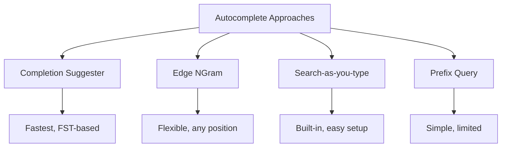

# How to Build Autocomplete with Elasticsearch

Author: [nawazdhandala](https://www.github.com/nawazdhandala)

Tags: Elasticsearch, Autocomplete, Search, UX, Completion Suggester, Edge NGram

Description: Learn how to build fast, user-friendly autocomplete functionality with Elasticsearch using completion suggesters, edge ngrams, and search-as-you-type fields. Includes practical code examples and performance tips.

---

## Why Autocomplete Matters

Autocomplete helps users find what they want faster by suggesting results as they type. A good autocomplete system should be:

- **Fast** - Respond in under 100ms
- **Relevant** - Show the most useful suggestions first
- **Typo-tolerant** - Handle minor spelling mistakes
- **Context-aware** - Consider user history or popularity

## Autocomplete Methods in Elasticsearch



## Method 1: Completion Suggester

The completion suggester uses an in-memory data structure (FST) for extremely fast prefix lookups.

### Create Index

```json
PUT /products
{
  "mappings": {
    "properties": {
      "name": {
        "type": "text"
      },
      "suggest": {
        "type": "completion",
        "analyzer": "simple",
        "preserve_separators": true,
        "preserve_position_increments": true,
        "max_input_length": 50
      }
    }
  }
}
```

### Index Documents

```json
POST /products/_bulk
{"index":{}}
{"name":"Apple iPhone 15 Pro","suggest":{"input":["Apple iPhone 15 Pro","iPhone 15 Pro","iPhone 15","iPhone"],"weight":100}}
{"index":{}}
{"name":"Samsung Galaxy S24","suggest":{"input":["Samsung Galaxy S24","Galaxy S24","Samsung S24"],"weight":90}}
{"index":{}}
{"name":"Google Pixel 8","suggest":{"input":["Google Pixel 8","Pixel 8","Google Pixel"],"weight":80}}
```

The `weight` field controls ranking - higher weights appear first.

### Query Suggestions

```json
POST /products/_search
{
  "suggest": {
    "product-suggest": {
      "prefix": "iph",
      "completion": {
        "field": "suggest",
        "size": 5,
        "skip_duplicates": true,
        "fuzzy": {
          "fuzziness": "AUTO"
        }
      }
    }
  }
}
```

Response:
```json
{
  "suggest": {
    "product-suggest": [
      {
        "text": "iph",
        "offset": 0,
        "length": 3,
        "options": [
          {
            "text": "iPhone 15 Pro",
            "_source": {"name": "Apple iPhone 15 Pro"},
            "_score": 100
          },
          {
            "text": "iPhone 15",
            "_source": {"name": "Apple iPhone 15 Pro"},
            "_score": 100
          }
        ]
      }
    ]
  }
}
```

### Completion Suggester with Context

Add context for personalized suggestions:

```json
PUT /products_with_context
{
  "mappings": {
    "properties": {
      "name": {"type": "text"},
      "suggest": {
        "type": "completion",
        "contexts": [
          {
            "name": "category",
            "type": "category"
          }
        ]
      }
    }
  }
}

POST /products_with_context/_doc
{
  "name": "Apple iPhone 15",
  "suggest": {
    "input": ["iPhone 15", "Apple iPhone"],
    "contexts": {
      "category": ["phones", "electronics"]
    }
  }
}
```

Query with context:

```json
POST /products_with_context/_search
{
  "suggest": {
    "product-suggest": {
      "prefix": "iph",
      "completion": {
        "field": "suggest",
        "contexts": {
          "category": ["phones"]
        }
      }
    }
  }
}
```

## Method 2: Search-as-you-type Field

Elasticsearch 7.2+ includes a dedicated field type for autocomplete:

```json
PUT /products_sayt
{
  "mappings": {
    "properties": {
      "name": {
        "type": "search_as_you_type",
        "max_shingle_size": 3
      }
    }
  }
}
```

This creates these sub-fields automatically:
- `name` - Standard analyzed text
- `name._2gram` - 2-word shingles
- `name._3gram` - 3-word shingles
- `name._index_prefix` - Edge ngrams for prefix matching

### Query Search-as-you-type

```json
POST /products_sayt/_search
{
  "query": {
    "multi_match": {
      "query": "iphone pro",
      "type": "bool_prefix",
      "fields": [
        "name",
        "name._2gram",
        "name._3gram"
      ]
    }
  }
}
```

## Method 3: Edge NGram Analyzer

For maximum flexibility, use custom edge ngram analysis:

```json
PUT /products_ngram
{
  "settings": {
    "analysis": {
      "filter": {
        "autocomplete_filter": {
          "type": "edge_ngram",
          "min_gram": 1,
          "max_gram": 20
        }
      },
      "analyzer": {
        "autocomplete": {
          "type": "custom",
          "tokenizer": "standard",
          "filter": [
            "lowercase",
            "autocomplete_filter"
          ]
        },
        "autocomplete_search": {
          "type": "custom",
          "tokenizer": "standard",
          "filter": ["lowercase"]
        }
      }
    },
    "index": {
      "max_ngram_diff": 19
    }
  },
  "mappings": {
    "properties": {
      "name": {
        "type": "text",
        "analyzer": "autocomplete",
        "search_analyzer": "autocomplete_search"
      },
      "popularity": {
        "type": "integer"
      }
    }
  }
}
```

### Query with Popularity Boost

```json
POST /products_ngram/_search
{
  "query": {
    "function_score": {
      "query": {
        "match": {
          "name": "iph"
        }
      },
      "functions": [
        {
          "field_value_factor": {
            "field": "popularity",
            "factor": 1.2,
            "modifier": "sqrt",
            "missing": 1
          }
        }
      ],
      "boost_mode": "multiply"
    }
  }
}
```

## Complete Autocomplete Implementation

Here is a full implementation combining multiple approaches:

### Index Setup

```json
PUT /autocomplete_demo
{
  "settings": {
    "analysis": {
      "filter": {
        "edge_ngram_filter": {
          "type": "edge_ngram",
          "min_gram": 2,
          "max_gram": 15
        }
      },
      "analyzer": {
        "edge_ngram_analyzer": {
          "type": "custom",
          "tokenizer": "standard",
          "filter": ["lowercase", "edge_ngram_filter"]
        },
        "search_analyzer": {
          "type": "custom",
          "tokenizer": "standard",
          "filter": ["lowercase"]
        }
      }
    }
  },
  "mappings": {
    "properties": {
      "name": {
        "type": "text",
        "analyzer": "edge_ngram_analyzer",
        "search_analyzer": "search_analyzer",
        "fields": {
          "keyword": {"type": "keyword"},
          "completion": {
            "type": "completion",
            "analyzer": "simple"
          }
        }
      },
      "category": {"type": "keyword"},
      "popularity": {"type": "integer"}
    }
  }
}
```

### Backend Implementation (Python)

```python
from elasticsearch import Elasticsearch
from typing import List, Dict

class AutocompleteService:
    def __init__(self, es_host: str = "http://localhost:9200"):
        self.es = Elasticsearch([es_host])
        self.index = "autocomplete_demo"

    def suggest(self, query: str, size: int = 10) -> List[Dict]:
        """
        Hybrid autocomplete using completion suggester
        with edge ngram fallback.
        """
        # Try completion suggester first (fastest)
        completion_results = self._completion_suggest(query, size)

        if len(completion_results) >= size:
            return completion_results[:size]

        # Fall back to edge ngram for more results
        ngram_results = self._ngram_search(query, size)

        # Merge and deduplicate
        seen = {r['name'] for r in completion_results}
        for result in ngram_results:
            if result['name'] not in seen:
                completion_results.append(result)
                seen.add(result['name'])

        return completion_results[:size]

    def _completion_suggest(self, query: str, size: int) -> List[Dict]:
        """Use completion suggester for prefix matching."""
        response = self.es.search(
            index=self.index,
            body={
                "suggest": {
                    "name-suggest": {
                        "prefix": query,
                        "completion": {
                            "field": "name.completion",
                            "size": size,
                            "skip_duplicates": True,
                            "fuzzy": {
                                "fuzziness": "AUTO"
                            }
                        }
                    }
                },
                "_source": ["name", "category", "popularity"]
            }
        )

        suggestions = response.get("suggest", {}).get("name-suggest", [])
        if not suggestions:
            return []

        return [
            {
                "name": opt["_source"]["name"],
                "category": opt["_source"].get("category"),
                "score": opt["_score"]
            }
            for opt in suggestions[0].get("options", [])
        ]

    def _ngram_search(self, query: str, size: int) -> List[Dict]:
        """Use edge ngram for flexible matching."""
        response = self.es.search(
            index=self.index,
            body={
                "size": size,
                "query": {
                    "function_score": {
                        "query": {
                            "match": {
                                "name": {
                                    "query": query,
                                    "operator": "and"
                                }
                            }
                        },
                        "functions": [
                            {
                                "field_value_factor": {
                                    "field": "popularity",
                                    "factor": 1.2,
                                    "modifier": "log1p",
                                    "missing": 1
                                }
                            }
                        ]
                    }
                },
                "_source": ["name", "category", "popularity"]
            }
        )

        return [
            {
                "name": hit["_source"]["name"],
                "category": hit["_source"].get("category"),
                "score": hit["_score"]
            }
            for hit in response["hits"]["hits"]
        ]

# Usage
autocomplete = AutocompleteService()
results = autocomplete.suggest("iphone")
for r in results:
    print(f"{r['name']} ({r['category']})")
```

### Frontend Integration

```javascript
// Debounced autocomplete with fetch
class Autocomplete {
  constructor(inputElement, resultsElement, options = {}) {
    this.input = inputElement;
    this.results = resultsElement;
    this.debounceMs = options.debounceMs || 150;
    this.minChars = options.minChars || 2;
    this.timer = null;

    this.input.addEventListener('input', () => this.onInput());
  }

  onInput() {
    clearTimeout(this.timer);
    const query = this.input.value.trim();

    if (query.length < this.minChars) {
      this.hideResults();
      return;
    }

    this.timer = setTimeout(() => this.fetchSuggestions(query), this.debounceMs);
  }

  async fetchSuggestions(query) {
    try {
      const response = await fetch(`/api/autocomplete?q=${encodeURIComponent(query)}`);
      const suggestions = await response.json();
      this.renderResults(suggestions);
    } catch (error) {
      console.error('Autocomplete error:', error);
    }
  }

  renderResults(suggestions) {
    this.results.innerHTML = suggestions
      .map(s => `<div class="suggestion" data-value="${s.name}">${s.name}</div>`)
      .join('');
    this.results.style.display = 'block';
  }

  hideResults() {
    this.results.style.display = 'none';
  }
}
```

## Performance Comparison

| Method | Latency | Index Size | Flexibility |
|--------|---------|------------|-------------|
| Completion Suggester | < 1ms | Small | Limited |
| Search-as-you-type | 5-20ms | Medium | Good |
| Edge NGram | 10-50ms | Large | Maximum |
| Prefix Query | 20-100ms | Normal | Minimal |

## Best Practices

1. **Use completion suggester for speed** - Best for simple prefix matching
2. **Debounce frontend requests** - Wait 100-200ms after typing stops
3. **Limit suggestions** - Return 5-10 results maximum
4. **Boost by popularity** - Show frequently selected items first
5. **Track selections** - Use click data to improve rankings
6. **Handle edge cases** - Empty queries, special characters, very long input

## Conclusion

Building autocomplete with Elasticsearch offers multiple approaches depending on your needs. The completion suggester provides the fastest lookups but limited flexibility. Edge ngrams offer maximum flexibility at the cost of index size. Search-as-you-type provides a good middle ground with minimal configuration. For production systems, consider combining multiple approaches for the best user experience.
