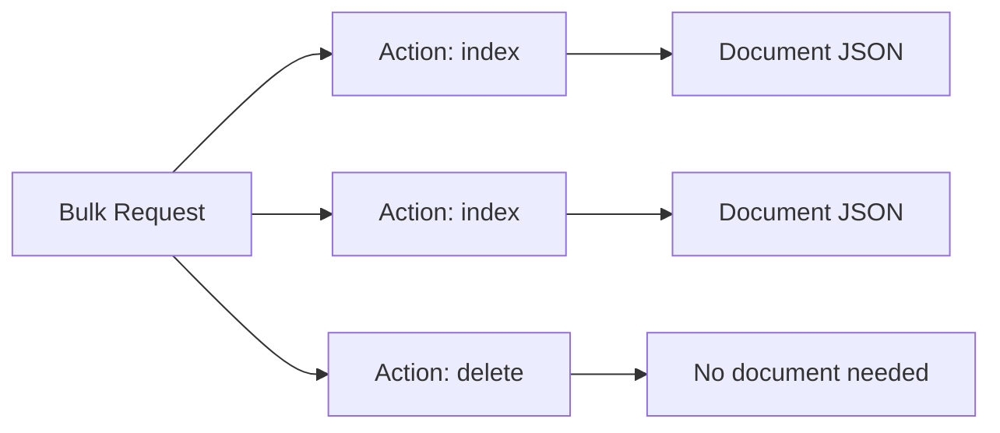
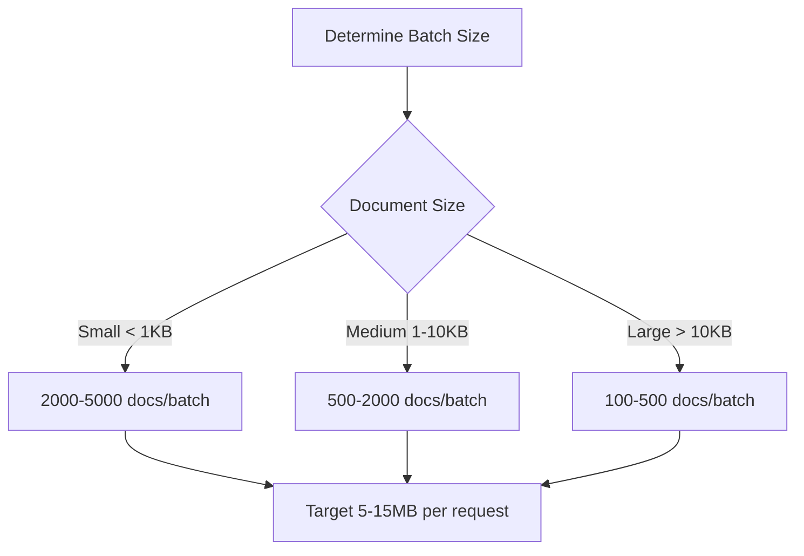

# How to Bulk Index JSON Data in Elasticsearch

Author: [nawazdhandala](https://www.github.com/nawazdhandala)

Tags: Elasticsearch, Bulk API, Data Ingestion, Performance, JSON

Description: Learn how to efficiently bulk index JSON data into Elasticsearch using the Bulk API. This guide covers optimal batch sizes, error handling, performance tuning, and practical examples in multiple languages.

The Bulk API is essential for efficiently indexing large amounts of data into Elasticsearch. Instead of making individual requests for each document, bulk indexing sends multiple operations in a single request, dramatically improving throughput.

## Understanding the Bulk API Format

The Bulk API uses a specific newline-delimited JSON (NDJSON) format:

```
{"action": {"_index": "index_name", "_id": "doc_id"}}
{"field1": "value1", "field2": "value2"}
{"action": {"_index": "index_name", "_id": "doc_id"}}
{"field1": "value1", "field2": "value2"}
```

Each operation consists of two lines:
1. **Action line**: Specifies the operation type and metadata
2. **Document line**: Contains the actual document (for index/create/update)



## Basic Bulk Index Request

```json
POST /_bulk
{"index": {"_index": "products", "_id": "1"}}
{"name": "Laptop", "price": 999.99, "category": "electronics"}
{"index": {"_index": "products", "_id": "2"}}
{"name": "Mouse", "price": 29.99, "category": "electronics"}
{"index": {"_index": "products", "_id": "3"}}
{"name": "Keyboard", "price": 79.99, "category": "electronics"}
```

Note: Each line must end with a newline character, including the last line.

### Index-Specific Bulk

When all documents go to the same index:

```json
POST /products/_bulk
{"index": {"_id": "1"}}
{"name": "Laptop", "price": 999.99}
{"index": {"_id": "2"}}
{"name": "Mouse", "price": 29.99}
{"index": {"_id": "3"}}
{"name": "Keyboard", "price": 79.99}
```

### Auto-Generated IDs

Let Elasticsearch generate IDs:

```json
POST /products/_bulk
{"index": {}}
{"name": "Laptop", "price": 999.99}
{"index": {}}
{"name": "Mouse", "price": 29.99}
```

## Bulk Operation Types

### Index Operation

Creates or replaces documents:

```json
{"index": {"_index": "products", "_id": "1"}}
{"name": "Product", "price": 99.99}
```

### Create Operation

Creates only if document doesn't exist (fails if exists):

```json
{"create": {"_index": "products", "_id": "1"}}
{"name": "Product", "price": 99.99}
```

### Update Operation

Updates existing documents:

```json
{"update": {"_index": "products", "_id": "1"}}
{"doc": {"price": 89.99}}
```

### Delete Operation

Removes documents (no document line needed):

```json
{"delete": {"_index": "products", "_id": "1"}}
```

### Mixed Operations

```json
POST /_bulk
{"index": {"_index": "products", "_id": "1"}}
{"name": "Laptop", "price": 999.99}
{"update": {"_index": "products", "_id": "2"}}
{"doc": {"price": 24.99}}
{"delete": {"_index": "products", "_id": "3"}}
{"create": {"_index": "products", "_id": "4"}}
{"name": "Headphones", "price": 149.99}
```

## Python Implementation

### Using elasticsearch-py

```python
from elasticsearch import Elasticsearch
from elasticsearch.helpers import bulk, streaming_bulk
import json

es = Elasticsearch("http://localhost:9200")

def index_json_file(filepath, index_name, batch_size=1000):
    """Index documents from a JSON file."""

    def generate_actions(filepath):
        with open(filepath, 'r') as f:
            for line in f:
                doc = json.loads(line)
                yield {
                    "_index": index_name,
                    "_source": doc
                }

    success, failed = bulk(
        es,
        generate_actions(filepath),
        chunk_size=batch_size,
        raise_on_error=False
    )

    return success, failed

# Usage
success, failed = index_json_file("products.jsonl", "products")
print(f"Indexed {success} documents, {len(failed)} failures")
```

### Streaming Bulk with Progress

```python
from elasticsearch import Elasticsearch
from elasticsearch.helpers import streaming_bulk
import json

es = Elasticsearch("http://localhost:9200")

def index_with_progress(filepath, index_name, batch_size=1000):
    """Index with progress reporting."""

    def generate_actions():
        with open(filepath, 'r') as f:
            for line in f:
                doc = json.loads(line)
                yield {
                    "_index": index_name,
                    "_source": doc
                }

    success = 0
    failed = 0

    for ok, result in streaming_bulk(
        es,
        generate_actions(),
        chunk_size=batch_size,
        raise_on_error=False
    ):
        if ok:
            success += 1
        else:
            failed += 1
            print(f"Failed to index: {result}")

        if (success + failed) % 10000 == 0:
            print(f"Progress: {success + failed} documents processed")

    return success, failed

# Usage
success, failed = index_with_progress("products.jsonl", "products")
```

### Parallel Bulk Indexing

```python
from elasticsearch import Elasticsearch
from elasticsearch.helpers import parallel_bulk
import json

es = Elasticsearch("http://localhost:9200")

def parallel_index(filepath, index_name, thread_count=4, batch_size=500):
    """Index using multiple threads."""

    def generate_actions():
        with open(filepath, 'r') as f:
            for i, line in enumerate(f):
                doc = json.loads(line)
                yield {
                    "_index": index_name,
                    "_id": doc.get("id", i),
                    "_source": doc
                }

    success = 0
    failed = []

    for ok, result in parallel_bulk(
        es,
        generate_actions(),
        thread_count=thread_count,
        chunk_size=batch_size,
        raise_on_error=False
    ):
        if ok:
            success += 1
        else:
            failed.append(result)

    return success, failed

# Usage
success, failed = parallel_index("large_dataset.jsonl", "products", thread_count=8)
```

## Node.js Implementation

### Using @elastic/elasticsearch

```javascript
const { Client } = require('@elastic/elasticsearch');
const fs = require('fs');
const readline = require('readline');

const client = new Client({ node: 'http://localhost:9200' });

async function bulkIndexFromFile(filepath, indexName, batchSize = 1000) {
  const fileStream = fs.createReadStream(filepath);
  const rl = readline.createInterface({
    input: fileStream,
    crlfDelay: Infinity
  });

  let batch = [];
  let totalIndexed = 0;
  let totalFailed = 0;

  for await (const line of rl) {
    const doc = JSON.parse(line);

    batch.push({ index: { _index: indexName } });
    batch.push(doc);

    if (batch.length >= batchSize * 2) {
      const result = await processBatch(batch);
      totalIndexed += result.indexed;
      totalFailed += result.failed;
      batch = [];

      console.log(`Progress: ${totalIndexed} indexed, ${totalFailed} failed`);
    }
  }

  // Process remaining documents
  if (batch.length > 0) {
    const result = await processBatch(batch);
    totalIndexed += result.indexed;
    totalFailed += result.failed;
  }

  return { indexed: totalIndexed, failed: totalFailed };
}

async function processBatch(batch) {
  const response = await client.bulk({ body: batch });

  let indexed = 0;
  let failed = 0;

  if (response.errors) {
    for (const item of response.items) {
      if (item.index.error) {
        failed++;
        console.error(`Error: ${item.index.error.reason}`);
      } else {
        indexed++;
      }
    }
  } else {
    indexed = response.items.length;
  }

  return { indexed, failed };
}

// Usage
bulkIndexFromFile('products.jsonl', 'products')
  .then(result => console.log(`Done: ${result.indexed} indexed`))
  .catch(console.error);
```

### With Retry Logic

```javascript
async function bulkWithRetry(client, batch, maxRetries = 3) {
  let retries = 0;

  while (retries < maxRetries) {
    try {
      const response = await client.bulk({
        body: batch,
        refresh: false
      });

      if (!response.errors) {
        return { success: true, items: response.items };
      }

      // Handle partial failures
      const failedItems = [];
      const succeededItems = [];

      response.items.forEach((item, index) => {
        if (item.index.error) {
          const status = item.index.status;
          // Retry on 429 (too many requests) or 5xx errors
          if (status === 429 || status >= 500) {
            failedItems.push(batch[index * 2]);
            failedItems.push(batch[index * 2 + 1]);
          }
        } else {
          succeededItems.push(item);
        }
      });

      if (failedItems.length === 0) {
        return { success: true, items: succeededItems };
      }

      batch = failedItems;
      retries++;

      // Exponential backoff
      await new Promise(resolve =>
        setTimeout(resolve, Math.pow(2, retries) * 1000)
      );

    } catch (error) {
      retries++;
      if (retries >= maxRetries) throw error;

      await new Promise(resolve =>
        setTimeout(resolve, Math.pow(2, retries) * 1000)
      );
    }
  }

  throw new Error(`Failed after ${maxRetries} retries`);
}
```

## cURL Bulk Indexing

### From File

```bash
# Create NDJSON file
cat > products.ndjson << 'EOF'
{"index": {"_index": "products", "_id": "1"}}
{"name": "Laptop", "price": 999.99}
{"index": {"_index": "products", "_id": "2"}}
{"name": "Mouse", "price": 29.99}
EOF

# Bulk index
curl -X POST "localhost:9200/_bulk" \
  -H "Content-Type: application/x-ndjson" \
  --data-binary @products.ndjson
```

### Transform and Index

```bash
# Convert JSON array to NDJSON for bulk indexing
cat products.json | jq -c '.[] | {"index": {"_index": "products"}}, .' > products.ndjson

# Index the transformed file
curl -X POST "localhost:9200/_bulk" \
  -H "Content-Type: application/x-ndjson" \
  --data-binary @products.ndjson
```

## Performance Optimization

### Optimal Batch Size



### Index Settings for Bulk Loading

```json
// Before bulk loading - optimize for write speed
PUT /products/_settings
{
  "index": {
    "refresh_interval": "-1",
    "number_of_replicas": 0
  }
}

// Perform bulk indexing...

// After bulk loading - restore settings
PUT /products/_settings
{
  "index": {
    "refresh_interval": "1s",
    "number_of_replicas": 1
  }
}

// Force merge for optimal search performance
POST /products/_forcemerge?max_num_segments=5
```

### Thread Pool Configuration

Monitor bulk thread pool:

```json
GET /_nodes/stats/thread_pool/bulk

// Response shows queue and rejections
{
  "nodes": {
    "node_id": {
      "thread_pool": {
        "bulk": {
          "threads": 8,
          "queue": 25,
          "active": 8,
          "rejected": 0,
          "completed": 12345
        }
      }
    }
  }
}
```

## Error Handling

### Response Structure

```json
{
  "took": 30,
  "errors": true,
  "items": [
    {
      "index": {
        "_index": "products",
        "_id": "1",
        "_version": 1,
        "result": "created",
        "status": 201
      }
    },
    {
      "index": {
        "_index": "products",
        "_id": "2",
        "status": 400,
        "error": {
          "type": "mapper_parsing_exception",
          "reason": "failed to parse field [price]"
        }
      }
    }
  ]
}
```

### Handling Errors in Python

```python
def bulk_with_error_handling(es, actions, batch_size=1000):
    """Bulk index with comprehensive error handling."""

    success_docs = []
    failed_docs = []

    for ok, result in streaming_bulk(
        es,
        actions,
        chunk_size=batch_size,
        raise_on_error=False,
        raise_on_exception=False
    ):
        if ok:
            success_docs.append(result)
        else:
            action = result.get('index') or result.get('create') or result.get('update')

            error_type = action.get('error', {}).get('type', 'unknown')
            error_reason = action.get('error', {}).get('reason', 'unknown')
            doc_id = action.get('_id', 'unknown')

            failed_docs.append({
                'id': doc_id,
                'error_type': error_type,
                'error_reason': error_reason
            })

            # Log specific error types
            if error_type == 'mapper_parsing_exception':
                print(f"Mapping error for doc {doc_id}: {error_reason}")
            elif error_type == 'version_conflict_engine_exception':
                print(f"Version conflict for doc {doc_id}")
            else:
                print(f"Error indexing {doc_id}: {error_type} - {error_reason}")

    return success_docs, failed_docs
```

## Data Transformation Pipeline

```python
import json
from elasticsearch import Elasticsearch
from elasticsearch.helpers import bulk

es = Elasticsearch("http://localhost:9200")

def transform_and_index(source_file, index_name, transform_func):
    """Transform data during bulk indexing."""

    def generate_transformed_actions():
        with open(source_file, 'r') as f:
            for line in f:
                raw_doc = json.loads(line)

                # Apply transformation
                transformed_doc = transform_func(raw_doc)

                if transformed_doc is not None:
                    yield {
                        "_index": index_name,
                        "_id": transformed_doc.get("id"),
                        "_source": transformed_doc
                    }

    return bulk(es, generate_transformed_actions(), raise_on_error=False)

# Example transformation function
def transform_product(raw):
    """Transform raw product data."""

    # Skip invalid records
    if not raw.get("name"):
        return None

    return {
        "id": raw.get("product_id"),
        "name": raw["name"].strip(),
        "price": float(raw.get("price", 0)),
        "category": raw.get("category", "").lower(),
        "in_stock": raw.get("quantity", 0) > 0,
        "indexed_at": datetime.utcnow().isoformat()
    }

# Usage
success, failed = transform_and_index(
    "raw_products.jsonl",
    "products",
    transform_product
)
```

## Monitoring Bulk Operations

### Track Progress

```python
import time
from datetime import datetime

class BulkIndexMonitor:
    def __init__(self, total_expected=None):
        self.total_expected = total_expected
        self.processed = 0
        self.success = 0
        self.failed = 0
        self.start_time = datetime.now()

    def update(self, batch_success, batch_failed):
        self.processed += batch_success + batch_failed
        self.success += batch_success
        self.failed += batch_failed

        elapsed = (datetime.now() - self.start_time).total_seconds()
        rate = self.processed / elapsed if elapsed > 0 else 0

        progress = ""
        if self.total_expected:
            pct = (self.processed / self.total_expected) * 100
            eta = (self.total_expected - self.processed) / rate if rate > 0 else 0
            progress = f" ({pct:.1f}%, ETA: {eta:.0f}s)"

        print(f"Processed: {self.processed}{progress} | "
              f"Rate: {rate:.0f} docs/s | "
              f"Success: {self.success} | "
              f"Failed: {self.failed}")

    def summary(self):
        elapsed = (datetime.now() - self.start_time).total_seconds()
        rate = self.processed / elapsed if elapsed > 0 else 0

        return {
            "total_processed": self.processed,
            "success": self.success,
            "failed": self.failed,
            "elapsed_seconds": elapsed,
            "docs_per_second": rate
        }
```

## Best Practices Summary

| Aspect | Recommendation |
|--------|---------------|
| Batch Size | 500-2000 documents or 5-15MB per request |
| Refresh | Disable during bulk load, enable after |
| Replicas | Set to 0 during load, increase after |
| Retries | Implement exponential backoff for 429/5xx |
| Monitoring | Track progress and error rates |
| Memory | Monitor JVM heap and bulk queue size |

## Conclusion

Bulk indexing is essential for efficient data ingestion into Elasticsearch. Key takeaways:

1. **Use the Bulk API** - Never index documents one at a time in production
2. **Optimize batch size** - Balance between throughput and memory usage
3. **Handle errors gracefully** - Implement retry logic for transient failures
4. **Tune index settings** - Disable refresh and replicas during bulk loading
5. **Monitor progress** - Track rates and errors for large operations
6. **Transform in stream** - Don't load entire datasets into memory

With proper bulk indexing practices, you can achieve indexing rates of thousands to tens of thousands of documents per second.

---

**Related Reading:**

- [How to Return Only Certain Fields in Elasticsearch](https://oneuptime.com/blog/post/2025-12-19-return-certain-fields-elasticsearch/view)
- [How to Update Multiple Documents by Query in Elasticsearch](https://oneuptime.com/blog/post/2025-12-19-update-multiple-documents-query-elasticsearch/view)
- [How to Handle Unassigned Shards in Elasticsearch](https://oneuptime.com/blog/post/2025-12-19-handle-unassigned-shards-elasticsearch/view)
