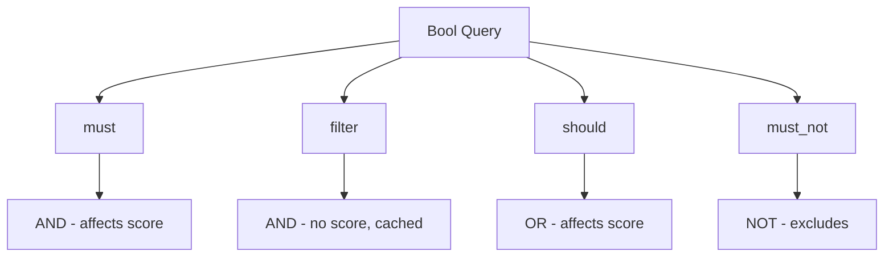
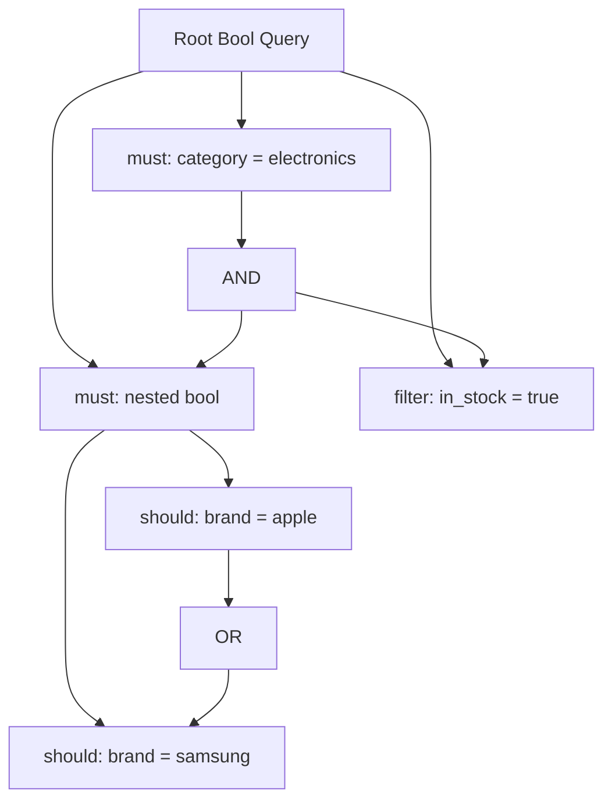

# How to Combine must with OR in Elasticsearch Bool Query

Author: [nawazdhandala](https://www.github.com/nawazdhandala)

Tags: Elasticsearch, Bool Query, Query DSL, Search, Boolean Logic, Filters

Description: Learn how to combine must (AND) clauses with OR logic in Elasticsearch bool queries. Covers nested bool queries, should with minimum_should_match, and practical examples for complex search requirements.

---

## Understanding Bool Query Structure

The Elasticsearch bool query has four clause types:



The challenge: **must** clauses are always ANDed together. To combine must with OR logic, you need nested bool queries.

## Basic Problem: AND vs OR

Suppose you want: `(category = "electronics") AND (brand = "apple" OR brand = "samsung")`

This won't work as expected:

```json
{
  "query": {
    "bool": {
      "must": [
        {"term": {"category": "electronics"}},
        {"term": {"brand": "apple"}},
        {"term": {"brand": "samsung"}}
      ]
    }
  }
}
```

This requires documents to have BOTH brands (impossible) - it's AND for all clauses.

## Solution 1: Nested Bool Query

Nest a bool query inside must to create OR groups:

```json
GET /products/_search
{
  "query": {
    "bool": {
      "must": [
        {"term": {"category": "electronics"}},
        {
          "bool": {
            "should": [
              {"term": {"brand": "apple"}},
              {"term": {"brand": "samsung"}}
            ]
          }
        }
      ]
    }
  }
}
```

This correctly means: category is electronics AND (brand is apple OR brand is samsung).

## Solution 2: Terms Query for Simple OR

For OR on the same field, use `terms` query:

```json
GET /products/_search
{
  "query": {
    "bool": {
      "must": [
        {"term": {"category": "electronics"}},
        {"terms": {"brand": ["apple", "samsung", "google"]}}
      ]
    }
  }
}
```

This is cleaner and more efficient than nested should clauses.

## Complex Boolean Logic Examples

### Example 1: Multiple OR Groups

Query: `(category = electronics OR category = computers) AND (brand = apple OR price < 500)`

```json
GET /products/_search
{
  "query": {
    "bool": {
      "must": [
        {
          "bool": {
            "should": [
              {"term": {"category": "electronics"}},
              {"term": {"category": "computers"}}
            ]
          }
        },
        {
          "bool": {
            "should": [
              {"term": {"brand": "apple"}},
              {"range": {"price": {"lt": 500}}}
            ]
          }
        }
      ]
    }
  }
}
```

### Example 2: OR with Different Fields

Query: `status = active AND (title contains "laptop" OR description contains "laptop")`

```json
GET /products/_search
{
  "query": {
    "bool": {
      "must": [
        {"term": {"status": "active"}}
      ],
      "should": [
        {"match": {"title": "laptop"}},
        {"match": {"description": "laptop"}}
      ],
      "minimum_should_match": 1
    }
  }
}
```

The `minimum_should_match: 1` makes at least one should clause required.

### Example 3: Mixed AND/OR with Exclusion

Query: `(category = phones) AND (brand = apple OR brand = samsung) AND NOT (status = discontinued)`

```json
GET /products/_search
{
  "query": {
    "bool": {
      "must": [
        {"term": {"category": "phones"}},
        {
          "bool": {
            "should": [
              {"term": {"brand": "apple"}},
              {"term": {"brand": "samsung"}}
            ]
          }
        }
      ],
      "must_not": [
        {"term": {"status": "discontinued"}}
      ]
    }
  }
}
```

### Example 4: Complex E-Commerce Filter

Query: `(in_stock = true) AND (price between 100 and 500) AND ((category = laptops AND RAM >= 16) OR (category = tablets AND screen >= 10))`

```json
GET /products/_search
{
  "query": {
    "bool": {
      "must": [
        {"term": {"in_stock": true}},
        {"range": {"price": {"gte": 100, "lte": 500}}}
      ],
      "filter": [
        {
          "bool": {
            "should": [
              {
                "bool": {
                  "must": [
                    {"term": {"category": "laptops"}},
                    {"range": {"ram_gb": {"gte": 16}}}
                  ]
                }
              },
              {
                "bool": {
                  "must": [
                    {"term": {"category": "tablets"}},
                    {"range": {"screen_inches": {"gte": 10}}}
                  ]
                }
              }
            ]
          }
        }
      ]
    }
  }
}
```

## Using minimum_should_match

Control how many should clauses must match:

### At Least N Matches

```json
GET /products/_search
{
  "query": {
    "bool": {
      "should": [
        {"term": {"tag": "sale"}},
        {"term": {"tag": "new"}},
        {"term": {"tag": "featured"}},
        {"term": {"tag": "popular"}}
      ],
      "minimum_should_match": 2
    }
  }
}
```

Documents must have at least 2 of these tags.

### Percentage-Based Matching

```json
GET /products/_search
{
  "query": {
    "bool": {
      "should": [
        {"term": {"feature": "wireless"}},
        {"term": {"feature": "bluetooth"}},
        {"term": {"feature": "waterproof"}},
        {"term": {"feature": "fast_charging"}}
      ],
      "minimum_should_match": "50%"
    }
  }
}
```

### Combined with Must

```json
GET /products/_search
{
  "query": {
    "bool": {
      "must": [
        {"term": {"category": "headphones"}}
      ],
      "should": [
        {"term": {"brand": "sony"}},
        {"term": {"brand": "bose"}},
        {"term": {"brand": "apple"}}
      ],
      "minimum_should_match": 1
    }
  }
}
```

When must is present, should clauses are optional by default. Add minimum_should_match to make at least one required.

## Visualizing Query Logic

Here is how to think about nested bool queries:



## Common Patterns

### Pattern 1: Required Category with Optional Brands

```json
{
  "query": {
    "bool": {
      "must": [{"term": {"category": "electronics"}}],
      "should": [
        {"term": {"brand": "apple"}},
        {"term": {"brand": "samsung"}}
      ]
    }
  }
}
```

Note: Without minimum_should_match, brands boost score but are not required.

### Pattern 2: Either/Or Required

```json
{
  "query": {
    "bool": {
      "must": [
        {
          "bool": {
            "should": [
              {"term": {"status": "published"}},
              {"term": {"status": "featured"}}
            ],
            "minimum_should_match": 1
          }
        }
      ]
    }
  }
}
```

### Pattern 3: All Conditions with OR Alternative

```json
{
  "query": {
    "bool": {
      "should": [
        {
          "bool": {
            "must": [
              {"term": {"premium": true}},
              {"term": {"verified": true}}
            ]
          }
        },
        {"term": {"staff_pick": true}}
      ],
      "minimum_should_match": 1
    }
  }
}
```

Matches: (premium AND verified) OR staff_pick

## Filter vs Must for Non-Scoring Clauses

Use filter instead of must when you do not need scoring:

```json
GET /products/_search
{
  "query": {
    "bool": {
      "must": [
        {"match": {"title": "laptop"}}
      ],
      "filter": [
        {"term": {"in_stock": true}},
        {
          "bool": {
            "should": [
              {"term": {"brand": "apple"}},
              {"term": {"brand": "dell"}}
            ]
          }
        },
        {"range": {"price": {"lte": 2000}}}
      ]
    }
  }
}
```

Filter clauses are cached and faster for repeated queries.

## Debugging Bool Queries

Use the explain API to understand query matching:

```json
GET /products/_explain/1
{
  "query": {
    "bool": {
      "must": [
        {"term": {"category": "electronics"}},
        {
          "bool": {
            "should": [
              {"term": {"brand": "apple"}},
              {"term": {"brand": "samsung"}}
            ]
          }
        }
      ]
    }
  }
}
```

## Best Practices

1. **Use terms for same-field OR** - More efficient than nested should
2. **Put filters in filter clause** - Enable caching for repeated queries
3. **Set minimum_should_match explicitly** - Avoid unexpected behavior
4. **Nest bool for complex logic** - Keep queries readable and maintainable
5. **Test with explain API** - Verify query behavior before production
6. **Consider query complexity** - Deeply nested queries impact performance

## Conclusion

Combining must (AND) with OR logic in Elasticsearch requires understanding bool query nesting. The key techniques are: nesting bool queries inside must clauses, using minimum_should_match to make should clauses required, and leveraging the terms query for simple same-field OR conditions. With these patterns, you can express any boolean logic in your Elasticsearch queries.
