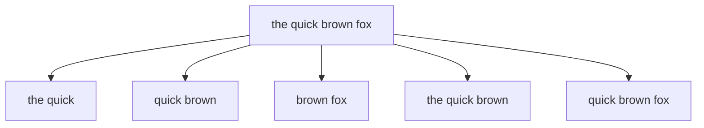
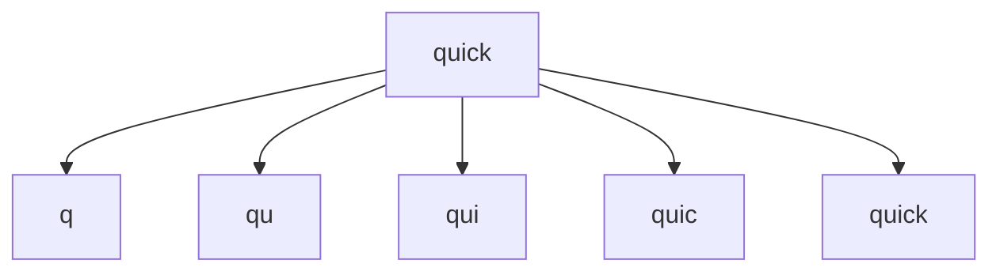

# How to Combine Shingles and edgeNgram for Flexible Search

Author: [nawazdhandala](https://www.github.com/nawazdhandala)

Tags: Elasticsearch, Shingles, edgeNgram, Search, Text Analysis, Autocomplete

Description: Learn how to combine shingles and edge ngrams in Elasticsearch to create a powerful search experience that handles both phrase matching and prefix-based autocomplete effectively.

---

## Understanding Shingles and Edge NGrams

Before combining these techniques, let's understand what each does.

### What are Shingles?

Shingles create token combinations from adjacent words - essentially word-level ngrams.



Shingles help match phrases and word combinations even when the query is slightly different from the indexed text.

### What are Edge NGrams?

Edge ngrams create character-level prefixes from the start of words.



Edge ngrams enable prefix matching - typing "qui" matches "quick".

## Why Combine Them?

Each technique solves different problems:

| Feature | Shingles | Edge NGrams |
|---------|----------|-------------|
| Partial word matching | No | Yes |
| Phrase matching | Yes | No |
| Word order flexibility | Yes | No |
| Autocomplete | Poor | Excellent |
| Typo tolerance | No | No |

Combining them gives you:
- Autocomplete that works on partial words
- Phrase matching that handles word combinations
- Better relevance scoring for multi-word queries

## Creating the Combined Analyzer

Here's a complete index configuration that combines both techniques:

```json
PUT /search_index
{
  "settings": {
    "analysis": {
      "filter": {
        "edge_ngram_filter": {
          "type": "edge_ngram",
          "min_gram": 1,
          "max_gram": 20
        },
        "shingle_filter": {
          "type": "shingle",
          "min_shingle_size": 2,
          "max_shingle_size": 3,
          "output_unigrams": true
        }
      },
      "analyzer": {
        "edge_ngram_analyzer": {
          "type": "custom",
          "tokenizer": "standard",
          "filter": [
            "lowercase",
            "edge_ngram_filter"
          ]
        },
        "shingle_analyzer": {
          "type": "custom",
          "tokenizer": "standard",
          "filter": [
            "lowercase",
            "shingle_filter"
          ]
        },
        "combined_analyzer": {
          "type": "custom",
          "tokenizer": "standard",
          "filter": [
            "lowercase",
            "shingle_filter",
            "edge_ngram_filter"
          ]
        },
        "search_analyzer": {
          "type": "custom",
          "tokenizer": "standard",
          "filter": [
            "lowercase"
          ]
        }
      }
    },
    "index": {
      "max_ngram_diff": 19
    }
  },
  "mappings": {
    "properties": {
      "title": {
        "type": "text",
        "analyzer": "standard",
        "fields": {
          "edge": {
            "type": "text",
            "analyzer": "edge_ngram_analyzer",
            "search_analyzer": "search_analyzer"
          },
          "shingle": {
            "type": "text",
            "analyzer": "shingle_analyzer",
            "search_analyzer": "shingle_analyzer"
          },
          "combined": {
            "type": "text",
            "analyzer": "combined_analyzer",
            "search_analyzer": "search_analyzer"
          }
        }
      }
    }
  }
}
```

## Understanding Token Output

Let's analyze how "quick brown fox" is tokenized by each analyzer:

```json
POST /search_index/_analyze
{
  "analyzer": "edge_ngram_analyzer",
  "text": "quick brown fox"
}
```

**Edge NGram output:**
```
q, qu, qui, quic, quick, b, br, bro, brow, brown, f, fo, fox
```

```json
POST /search_index/_analyze
{
  "analyzer": "shingle_analyzer",
  "text": "quick brown fox"
}
```

**Shingle output:**
```
quick, quick brown, quick brown fox, brown, brown fox, fox
```

```json
POST /search_index/_analyze
{
  "analyzer": "combined_analyzer",
  "text": "quick brown fox"
}
```

**Combined output:**
```
q, qu, qui, quic, quick,
q, qu, qui, quic, quick, quick , quick b, quick br, quick bro, quick brow, quick brown,
... (many more combinations)
```

## Indexing Sample Data

```json
POST /search_index/_bulk
{"index":{}}
{"title":"The Quick Brown Fox Jumps"}
{"index":{}}
{"title":"Quick Start Guide for Beginners"}
{"index":{}}
{"title":"Brown Rice Cooking Tips"}
{"index":{}}
{"title":"Firefox Browser Extensions"}
```

## Search Strategies

### Strategy 1: Multi-Field Search with Boosting

```json
GET /search_index/_search
{
  "query": {
    "multi_match": {
      "query": "qui bro",
      "fields": [
        "title^4",
        "title.shingle^3",
        "title.edge^2",
        "title.combined"
      ],
      "type": "most_fields"
    }
  }
}
```

This prioritizes:
1. Exact matches (title)
2. Phrase combinations (shingle)
3. Prefix matches (edge)
4. Combined partial phrases (combined)

### Strategy 2: Bool Query with Should Clauses

For more control over scoring:

```json
GET /search_index/_search
{
  "query": {
    "bool": {
      "should": [
        {
          "match": {
            "title": {
              "query": "quick brown",
              "boost": 4
            }
          }
        },
        {
          "match_phrase": {
            "title.shingle": {
              "query": "quick brown",
              "boost": 3
            }
          }
        },
        {
          "match": {
            "title.edge": {
              "query": "quick brown",
              "boost": 2
            }
          }
        },
        {
          "match": {
            "title.combined": {
              "query": "quick brown",
              "boost": 1
            }
          }
        }
      ],
      "minimum_should_match": 1
    }
  }
}
```

### Strategy 3: Autocomplete with Phrase Awareness

For autocomplete that respects phrase context:

```json
GET /search_index/_search
{
  "query": {
    "bool": {
      "must": [
        {
          "match": {
            "title.edge": "qui"
          }
        }
      ],
      "should": [
        {
          "match_phrase": {
            "title.shingle": {
              "query": "quick brown",
              "boost": 2
            }
          }
        }
      ]
    }
  }
}
```

## Practical Autocomplete Implementation

Here's a complete autocomplete endpoint pattern:

```python
from elasticsearch import Elasticsearch

es = Elasticsearch(['http://localhost:9200'])

def autocomplete(query, size=10):
    """
    Autocomplete that combines edge ngrams for prefix matching
    with shingles for phrase relevance.
    """
    body = {
        "size": size,
        "query": {
            "bool": {
                "must": [
                    {
                        "multi_match": {
                            "query": query,
                            "fields": [
                                "title.edge^2",
                                "title.combined"
                            ],
                            "type": "most_fields"
                        }
                    }
                ],
                "should": [
                    {
                        "match": {
                            "title": {
                                "query": query,
                                "boost": 5
                            }
                        }
                    },
                    {
                        "match_phrase": {
                            "title.shingle": {
                                "query": query,
                                "boost": 3
                            }
                        }
                    }
                ]
            }
        },
        "_source": ["title"],
        "highlight": {
            "fields": {
                "title": {}
            }
        }
    }

    results = es.search(index="search_index", body=body)

    return [
        {
            "title": hit["_source"]["title"],
            "score": hit["_score"],
            "highlight": hit.get("highlight", {}).get("title", [])
        }
        for hit in results["hits"]["hits"]
    ]

# Usage
results = autocomplete("qui bro")
for r in results:
    print(f"{r['title']} (score: {r['score']:.2f})")
```

## Performance Considerations

### Index Size Impact

The combined analyzer significantly increases index size:

| Analyzer | Relative Index Size |
|----------|-------------------|
| Standard | 1x |
| Edge NGram | 3-5x |
| Shingle | 2-3x |
| Combined | 8-15x |

### Optimization Tips

1. **Limit max_gram size** - 20 characters is usually sufficient
2. **Limit shingle size** - 2-3 word shingles cover most use cases
3. **Use separate fields** - Index once, query multiple ways
4. **Consider query-time analysis** - Use search_analyzer to avoid over-matching
5. **Disable positions for ngrams** - Reduces index size if phrase queries are not needed

```json
{
  "title.edge": {
    "type": "text",
    "analyzer": "edge_ngram_analyzer",
    "search_analyzer": "search_analyzer",
    "index_options": "freqs"
  }
}
```

## When to Use This Approach

**Good fit:**
- E-commerce product search
- Document search with autocomplete
- Search-as-you-type interfaces
- Multi-word phrase matching

**Consider alternatives:**
- Simple prefix-only autocomplete (use completion suggester)
- Typo-tolerant search (add fuzziness)
- Very large indices with storage constraints

## Conclusion

Combining shingles and edge ngrams creates a powerful search experience that handles both partial word matching and phrase awareness. The key is using multi-field mappings with appropriate boosting to balance exact matches, phrase combinations, and prefix matches. While this approach increases index size, the improved search quality often justifies the trade-off for user-facing search applications.
