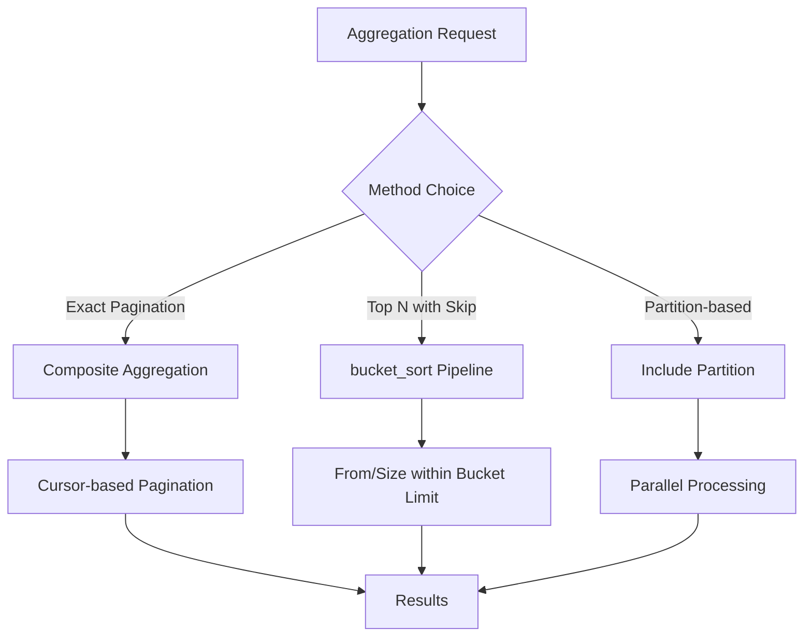

# How to Implement Aggregation with Sorting and Pagination

Author: [nawazdhandala](https://www.github.com/nawazdhandala)

Tags: Elasticsearch, Aggregations, Pagination, Sorting, Analytics, Performance

Description: Learn how to implement sorted and paginated aggregations in Elasticsearch using composite aggregations, bucket_sort, and partition-based approaches for large-scale analytics.

---

Standard Elasticsearch terms aggregations return only the top N buckets and cannot be easily paginated. This guide covers multiple techniques for implementing proper sorting and pagination on aggregation results for analytics dashboards and reports.

## The Challenge

Default terms aggregation limitations:

```bash
# Default behavior - only returns top 10
curl -X GET "https://localhost:9200/orders/_search" \
  -H "Content-Type: application/json" \
  -u elastic:password \
  -d '{
    "size": 0,
    "aggs": {
      "by_customer": {
        "terms": {
          "field": "customer_id.keyword"
        }
      }
    }
  }'
```

Problems:
- Limited to top N buckets
- No true pagination (offset)
- Approximate counts for high cardinality

## Solution Architecture



## Method 1: Composite Aggregation (Recommended)

Composite aggregations provide true pagination with cursor-based navigation.

### Basic Composite Aggregation

```bash
curl -X GET "https://localhost:9200/orders/_search" \
  -H "Content-Type: application/json" \
  -u elastic:password \
  -d '{
    "size": 0,
    "aggs": {
      "customers_paginated": {
        "composite": {
          "size": 10,
          "sources": [
            { "customer_id": { "terms": { "field": "customer_id.keyword" } } }
          ]
        }
      }
    }
  }'
```

Response includes `after_key` for pagination:

```json
{
  "aggregations": {
    "customers_paginated": {
      "after_key": { "customer_id": "customer_010" },
      "buckets": [
        { "key": { "customer_id": "customer_001" }, "doc_count": 50 },
        { "key": { "customer_id": "customer_002" }, "doc_count": 45 }
      ]
    }
  }
}
```

### Next Page with After Key

```bash
curl -X GET "https://localhost:9200/orders/_search" \
  -H "Content-Type: application/json" \
  -u elastic:password \
  -d '{
    "size": 0,
    "aggs": {
      "customers_paginated": {
        "composite": {
          "size": 10,
          "sources": [
            { "customer_id": { "terms": { "field": "customer_id.keyword" } } }
          ],
          "after": { "customer_id": "customer_010" }
        }
      }
    }
  }'
```

### Composite with Sorting

Sort by a metric within the aggregation:

```bash
curl -X GET "https://localhost:9200/orders/_search" \
  -H "Content-Type: application/json" \
  -u elastic:password \
  -d '{
    "size": 0,
    "aggs": {
      "customers_by_revenue": {
        "composite": {
          "size": 10,
          "sources": [
            { "customer_id": { "terms": { "field": "customer_id.keyword", "order": "asc" } } }
          ]
        },
        "aggs": {
          "total_revenue": { "sum": { "field": "amount" } },
          "order_count": { "value_count": { "field": "_id" } }
        }
      }
    }
  }'
```

### Multiple Sort Keys

```bash
curl -X GET "https://localhost:9200/orders/_search" \
  -H "Content-Type: application/json" \
  -u elastic:password \
  -d '{
    "size": 0,
    "aggs": {
      "by_category_and_status": {
        "composite": {
          "size": 20,
          "sources": [
            { "category": { "terms": { "field": "category.keyword", "order": "asc" } } },
            { "status": { "terms": { "field": "status.keyword", "order": "asc" } } }
          ]
        },
        "aggs": {
          "total": { "sum": { "field": "amount" } }
        }
      }
    }
  }'
```

## Method 2: bucket_sort Pipeline Aggregation

For top-N scenarios where you need offset-based pagination within a limited set.

### Basic bucket_sort

```bash
curl -X GET "https://localhost:9200/orders/_search" \
  -H "Content-Type: application/json" \
  -u elastic:password \
  -d '{
    "size": 0,
    "aggs": {
      "by_customer": {
        "terms": {
          "field": "customer_id.keyword",
          "size": 1000
        },
        "aggs": {
          "total_revenue": { "sum": { "field": "amount" } },
          "pagination": {
            "bucket_sort": {
              "sort": [{ "total_revenue": { "order": "desc" } }],
              "from": 0,
              "size": 10
            }
          }
        }
      }
    }
  }'
```

### Page 2 with bucket_sort

```bash
curl -X GET "https://localhost:9200/orders/_search" \
  -H "Content-Type: application/json" \
  -u elastic:password \
  -d '{
    "size": 0,
    "aggs": {
      "by_customer": {
        "terms": {
          "field": "customer_id.keyword",
          "size": 1000
        },
        "aggs": {
          "total_revenue": { "sum": { "field": "amount" } },
          "avg_order": { "avg": { "field": "amount" } },
          "pagination": {
            "bucket_sort": {
              "sort": [
                { "total_revenue": { "order": "desc" } },
                { "_key": { "order": "asc" } }
              ],
              "from": 10,
              "size": 10
            }
          }
        }
      }
    }
  }'
```

### Multi-level Sorting

```bash
curl -X GET "https://localhost:9200/orders/_search" \
  -H "Content-Type: application/json" \
  -u elastic:password \
  -d '{
    "size": 0,
    "aggs": {
      "by_category": {
        "terms": {
          "field": "category.keyword",
          "size": 100
        },
        "aggs": {
          "revenue": { "sum": { "field": "amount" } },
          "order_count": { "value_count": { "field": "_id" } },
          "avg_order_value": {
            "bucket_script": {
              "buckets_path": {
                "revenue": "revenue",
                "count": "order_count"
              },
              "script": "params.revenue / params.count"
            }
          },
          "sort_and_page": {
            "bucket_sort": {
              "sort": [
                { "revenue": { "order": "desc" } },
                { "order_count": { "order": "desc" } }
              ],
              "from": 0,
              "size": 10
            }
          }
        }
      }
    }
  }'
```

## Method 3: Partition-based Aggregation

For parallel processing of large aggregations:

```bash
# Partition 0 of 4
curl -X GET "https://localhost:9200/orders/_search" \
  -H "Content-Type: application/json" \
  -u elastic:password \
  -d '{
    "size": 0,
    "aggs": {
      "by_customer": {
        "terms": {
          "field": "customer_id.keyword",
          "include": {
            "partition": 0,
            "num_partitions": 4
          },
          "size": 1000
        },
        "aggs": {
          "total_revenue": { "sum": { "field": "amount" } }
        }
      }
    }
  }'
```

## Complete Python Implementation

```python
from elasticsearch import Elasticsearch
from typing import Iterator, Dict, Any, List, Optional

es = Elasticsearch(
    ["https://localhost:9200"],
    basic_auth=("elastic", "password"),
    verify_certs=False
)

class PaginatedAggregation:
    """Handle paginated aggregations in Elasticsearch."""

    def __init__(self, es_client, index: str):
        self.es = es_client
        self.index = index

    def composite_paginate(
        self,
        field: str,
        page_size: int = 100,
        sub_aggs: Optional[Dict] = None
    ) -> Iterator[List[Dict]]:
        """Yield pages of aggregation results using composite aggregation."""
        after_key = None

        while True:
            body = {
                "size": 0,
                "aggs": {
                    "paginated": {
                        "composite": {
                            "size": page_size,
                            "sources": [
                                {"key": {"terms": {"field": field}}}
                            ]
                        }
                    }
                }
            }

            if after_key:
                body["aggs"]["paginated"]["composite"]["after"] = after_key

            if sub_aggs:
                body["aggs"]["paginated"]["aggs"] = sub_aggs

            response = self.es.search(index=self.index, body=body)
            buckets = response["aggregations"]["paginated"]["buckets"]

            if not buckets:
                break

            yield buckets

            after_key = response["aggregations"]["paginated"].get("after_key")
            if not after_key:
                break

    def get_all_composite(
        self,
        field: str,
        sub_aggs: Optional[Dict] = None
    ) -> List[Dict]:
        """Get all aggregation results."""
        all_results = []
        for page in self.composite_paginate(field, sub_aggs=sub_aggs):
            all_results.extend(page)
        return all_results

    def bucket_sort_paginate(
        self,
        field: str,
        sort_field: str,
        sort_order: str = "desc",
        page: int = 1,
        page_size: int = 10,
        max_buckets: int = 1000,
        sub_aggs: Optional[Dict] = None
    ) -> Dict[str, Any]:
        """Paginate aggregations using bucket_sort."""

        offset = (page - 1) * page_size

        aggs = {
            "by_field": {
                "terms": {
                    "field": field,
                    "size": max_buckets
                },
                "aggs": {
                    "sort_metric": {"sum": {"field": sort_field}},
                    "pagination": {
                        "bucket_sort": {
                            "sort": [{"sort_metric": {"order": sort_order}}],
                            "from": offset,
                            "size": page_size
                        }
                    }
                }
            },
            "total_buckets": {
                "cardinality": {"field": field}
            }
        }

        if sub_aggs:
            aggs["by_field"]["aggs"].update(sub_aggs)

        response = self.es.search(
            index=self.index,
            body={"size": 0, "aggs": aggs}
        )

        total = response["aggregations"]["total_buckets"]["value"]
        buckets = response["aggregations"]["by_field"]["buckets"]

        return {
            "data": buckets,
            "pagination": {
                "page": page,
                "page_size": page_size,
                "total_items": total,
                "total_pages": (total + page_size - 1) // page_size,
                "has_next": offset + page_size < total,
                "has_previous": page > 1
            }
        }

    def sorted_aggregation(
        self,
        group_field: str,
        sort_by: str,
        order: str = "desc",
        size: int = 10,
        metrics: Optional[Dict] = None
    ) -> List[Dict]:
        """Get sorted aggregation with multiple metrics."""

        default_metrics = {
            "total": {"sum": {"field": "amount"}},
            "count": {"value_count": {"field": "_id"}},
            "average": {"avg": {"field": "amount"}}
        }

        metrics = metrics or default_metrics

        body = {
            "size": 0,
            "aggs": {
                "sorted_groups": {
                    "terms": {
                        "field": group_field,
                        "size": size,
                        "order": {sort_by: order}
                    },
                    "aggs": metrics
                }
            }
        }

        response = self.es.search(index=self.index, body=body)
        return response["aggregations"]["sorted_groups"]["buckets"]


# Usage examples
paginator = PaginatedAggregation(es, "orders")

# Composite pagination - iterate through all customers
print("All customers with revenue:")
for page_num, page in enumerate(paginator.composite_paginate(
    "customer_id.keyword",
    page_size=100,
    sub_aggs={"revenue": {"sum": {"field": "amount"}}}
), 1):
    print(f"Page {page_num}: {len(page)} customers")
    for bucket in page[:3]:  # Show first 3 of each page
        print(f"  {bucket['key']['key']}: ${bucket.get('revenue', {}).get('value', 0):.2f}")

# Bucket sort pagination - page 2 of top customers by revenue
print("\nPage 2 of top customers by revenue:")
result = paginator.bucket_sort_paginate(
    field="customer_id.keyword",
    sort_field="amount",
    page=2,
    page_size=10
)
print(f"Showing {len(result['data'])} of {result['pagination']['total_items']} customers")
for bucket in result["data"]:
    print(f"  {bucket['key']}: ${bucket['sort_metric']['value']:.2f}")

# Sorted aggregation - top categories by total revenue
print("\nTop 5 categories by revenue:")
top_categories = paginator.sorted_aggregation(
    group_field="category.keyword",
    sort_by="total",
    order="desc",
    size=5
)
for cat in top_categories:
    print(f"  {cat['key']}: ${cat['total']['value']:.2f} ({cat['count']['value']} orders)")
```

## Date Histogram with Pagination

Paginate time-based aggregations:

```bash
curl -X GET "https://localhost:9200/orders/_search" \
  -H "Content-Type: application/json" \
  -u elastic:password \
  -d '{
    "size": 0,
    "aggs": {
      "by_date": {
        "composite": {
          "size": 30,
          "sources": [
            {
              "date": {
                "date_histogram": {
                  "field": "order_date",
                  "calendar_interval": "day"
                }
              }
            }
          ]
        },
        "aggs": {
          "daily_revenue": { "sum": { "field": "amount" } },
          "order_count": { "value_count": { "field": "_id" } }
        }
      }
    }
  }'
```

## Performance Considerations

| Method | Pros | Cons |
|--------|------|------|
| Composite | True pagination, memory efficient | Cursor-based only, no random access |
| bucket_sort | Offset pagination, flexible sorting | Limited by parent bucket size |
| Partition | Parallel processing | Requires multiple queries |

## Best Practices

1. **Use composite for large datasets** - Most memory efficient
2. **Set reasonable bucket sizes** - Balance between accuracy and performance
3. **Cache pagination cursors** - Store after_key for user sessions
4. **Add secondary sort key** - Ensure consistent ordering
5. **Monitor memory usage** - Large aggregations consume heap

## Conclusion

Elasticsearch provides several methods for sorting and paginating aggregations:

1. **Composite aggregation** - Best for complete enumeration with cursor-based pagination
2. **bucket_sort** - Best for top-N scenarios with offset pagination
3. **Partition** - Best for parallel processing of very large datasets

Choose based on your access pattern: sequential scanning versus random page access.
