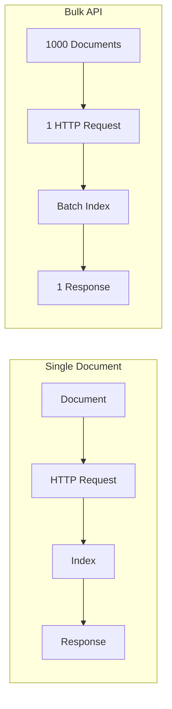

# How to Use Bulk API with Python for Elasticsearch

Author: [nawazdhandala](https://www.github.com/nawazdhandala)

Tags: Elasticsearch, Python, Bulk API, Performance, Indexing, Data Import

Description: A comprehensive guide to using Elasticsearch Bulk API with Python for efficient indexing, including parallel processing, error handling, and performance optimization techniques.

---

The Elasticsearch Bulk API enables indexing thousands of documents in a single request, dramatically improving performance compared to individual document operations. This guide covers Python implementation patterns for efficient bulk operations.

## Why Use Bulk API?

Single document indexing creates significant overhead:



Performance comparison:

| Method | 10,000 Documents | Network Requests |
|--------|-----------------|------------------|
| Individual | 5-10 minutes | 10,000 |
| Bulk (1000/batch) | 5-10 seconds | 10 |

## Basic Bulk Operations

### Setup

```python
from elasticsearch import Elasticsearch
from elasticsearch.helpers import bulk, streaming_bulk, parallel_bulk
from typing import Generator, Dict, Any, List
import json

es = Elasticsearch(
    ["https://localhost:9200"],
    basic_auth=("elastic", "password"),
    verify_certs=False
)
```

### Simple Bulk Index

```python
def bulk_index_simple(documents: List[Dict], index_name: str) -> tuple:
    """Basic bulk indexing."""

    actions = [
        {
            "_index": index_name,
            "_source": doc
        }
        for doc in documents
    ]

    success, errors = bulk(es, actions)
    return success, errors


# Usage
documents = [
    {"name": "Product 1", "price": 100},
    {"name": "Product 2", "price": 200},
    {"name": "Product 3", "price": 300},
]

success, errors = bulk_index_simple(documents, "products")
print(f"Indexed {success} documents, {len(errors)} errors")
```

### With Document IDs

```python
def bulk_index_with_ids(documents: List[Dict], index_name: str, id_field: str) -> tuple:
    """Bulk index with specific document IDs."""

    actions = [
        {
            "_index": index_name,
            "_id": doc[id_field],
            "_source": doc
        }
        for doc in documents
    ]

    return bulk(es, actions)


# Usage
products = [
    {"product_id": "SKU001", "name": "Laptop", "price": 999},
    {"product_id": "SKU002", "name": "Mouse", "price": 29},
]

bulk_index_with_ids(products, "products", "product_id")
```

## Generator Pattern for Large Datasets

Generators prevent loading entire datasets into memory:

```python
def generate_actions(filepath: str, index_name: str) -> Generator[Dict, None, None]:
    """Generate bulk actions from a file."""

    with open(filepath, 'r') as f:
        for line_num, line in enumerate(f):
            try:
                doc = json.loads(line.strip())
                yield {
                    "_index": index_name,
                    "_source": doc
                }
            except json.JSONDecodeError as e:
                print(f"Line {line_num}: Invalid JSON - {e}")


def bulk_from_file(filepath: str, index_name: str, chunk_size: int = 1000):
    """Bulk index from file using generator."""

    success, errors = bulk(
        es,
        generate_actions(filepath, index_name),
        chunk_size=chunk_size,
        raise_on_error=False
    )

    print(f"Success: {success}, Errors: {len(errors)}")
    return success, errors


bulk_from_file("data.ndjson", "events", chunk_size=500)
```

## Streaming Bulk for Progress Tracking

```python
def streaming_bulk_with_progress(
    documents: Generator,
    index_name: str,
    chunk_size: int = 1000
):
    """Bulk index with progress tracking."""

    success = 0
    failed = 0

    for ok, result in streaming_bulk(
        es,
        documents,
        index=index_name,
        chunk_size=chunk_size,
        raise_on_error=False,
        raise_on_exception=False
    ):
        if ok:
            success += 1
        else:
            failed += 1
            action, error = result.popitem()
            print(f"Failed: {error}")

        # Progress update every 10000 documents
        if (success + failed) % 10000 == 0:
            print(f"Progress: {success} success, {failed} failed")

    print(f"Complete: {success} success, {failed} failed")
    return success, failed


# Usage with generator
def doc_generator():
    for i in range(100000):
        yield {
            "_source": {
                "id": i,
                "name": f"Item {i}",
                "value": i * 1.5
            }
        }

streaming_bulk_with_progress(doc_generator(), "items")
```

## Parallel Bulk for Maximum Performance

```python
from elasticsearch.helpers import parallel_bulk
import multiprocessing

def parallel_bulk_index(
    documents: Generator,
    index_name: str,
    thread_count: int = 4,
    chunk_size: int = 500
):
    """Parallel bulk indexing for maximum throughput."""

    success = 0
    failed = 0
    errors_list = []

    for ok, result in parallel_bulk(
        es,
        documents,
        index=index_name,
        thread_count=thread_count,
        chunk_size=chunk_size,
        raise_on_error=False,
        raise_on_exception=False
    ):
        if ok:
            success += 1
        else:
            failed += 1
            errors_list.append(result)

    print(f"Parallel bulk complete: {success} success, {failed} failed")
    return success, failed, errors_list


# Usage
def generate_docs(count: int):
    for i in range(count):
        yield {
            "_source": {
                "id": i,
                "timestamp": "2024-03-15T10:00:00Z",
                "value": i
            }
        }

# Use CPU count for thread_count
thread_count = min(multiprocessing.cpu_count(), 8)
parallel_bulk_index(generate_docs(500000), "metrics", thread_count=thread_count)
```

## Bulk Operations: Index, Update, Delete

```python
def mixed_bulk_operations(operations: List[Dict]):
    """Execute mixed bulk operations."""

    actions = []

    for op in operations:
        op_type = op.get("type")

        if op_type == "index":
            actions.append({
                "_op_type": "index",
                "_index": op["index"],
                "_id": op.get("id"),
                "_source": op["document"]
            })

        elif op_type == "update":
            actions.append({
                "_op_type": "update",
                "_index": op["index"],
                "_id": op["id"],
                "doc": op["document"],
                "doc_as_upsert": op.get("upsert", False)
            })

        elif op_type == "delete":
            actions.append({
                "_op_type": "delete",
                "_index": op["index"],
                "_id": op["id"]
            })

    return bulk(es, actions, raise_on_error=False)


# Usage
operations = [
    {"type": "index", "index": "products", "id": "1", "document": {"name": "New Product"}},
    {"type": "update", "index": "products", "id": "2", "document": {"price": 299}},
    {"type": "delete", "index": "products", "id": "3"},
    {"type": "update", "index": "products", "id": "4", "document": {"name": "Upserted"}, "upsert": True}
]

mixed_bulk_operations(operations)
```

## Error Handling and Retry Logic

```python
from elasticsearch.helpers import BulkIndexError
import time

def bulk_with_retry(
    actions: Generator,
    max_retries: int = 3,
    initial_backoff: float = 1.0
):
    """Bulk index with retry logic for failures."""

    failed_actions = []

    def index_with_error_handling(actions_batch):
        try:
            success, errors = bulk(
                es,
                actions_batch,
                raise_on_error=False,
                raise_on_exception=False
            )
            return success, errors
        except BulkIndexError as e:
            return 0, e.errors

    # First attempt
    actions_list = list(actions)
    success, errors = index_with_error_handling(actions_list)

    if not errors:
        return success, []

    # Retry failed actions
    retry_actions = []
    for error in errors:
        # Extract the failed action
        for action_type, error_detail in error.items():
            if error_detail.get("status", 0) >= 500:  # Retry server errors
                # Reconstruct action (you may need to adjust based on your action format)
                retry_actions.append(error_detail.get("data", {}))

    for retry in range(max_retries):
        if not retry_actions:
            break

        backoff = initial_backoff * (2 ** retry)
        print(f"Retry {retry + 1}/{max_retries} after {backoff}s for {len(retry_actions)} actions")
        time.sleep(backoff)

        retry_success, retry_errors = index_with_error_handling(retry_actions)
        success += retry_success

        # Update retry_actions with still-failing actions
        retry_actions = []
        for error in retry_errors:
            for action_type, error_detail in error.items():
                if error_detail.get("status", 0) >= 500:
                    retry_actions.append(error_detail.get("data", {}))

    return success, retry_actions


# Usage
def generate_actions_for_retry():
    for i in range(1000):
        yield {
            "_index": "products",
            "_source": {"id": i, "name": f"Product {i}"}
        }

success, failures = bulk_with_retry(generate_actions_for_retry())
```

## Optimized Bulk Class

```python
from elasticsearch import Elasticsearch
from elasticsearch.helpers import streaming_bulk
from typing import Generator, Dict, Any, Optional, Callable
from dataclasses import dataclass
import time
import logging

logging.basicConfig(level=logging.INFO)
logger = logging.getLogger(__name__)

@dataclass
class BulkResult:
    success: int
    failed: int
    errors: list
    duration: float

class OptimizedBulkIndexer:
    """Optimized bulk indexer with all features."""

    def __init__(
        self,
        es_client: Elasticsearch,
        index_name: str,
        chunk_size: int = 1000,
        max_retries: int = 3,
        initial_backoff: float = 1.0
    ):
        self.es = es_client
        self.index_name = index_name
        self.chunk_size = chunk_size
        self.max_retries = max_retries
        self.initial_backoff = initial_backoff

    def prepare_index(self, mapping: Optional[Dict] = None):
        """Create or update index before bulk operation."""
        if not self.es.indices.exists(index=self.index_name):
            body = {
                "settings": {
                    "number_of_shards": 1,
                    "number_of_replicas": 0,
                    "refresh_interval": "-1"  # Disable during bulk
                }
            }
            if mapping:
                body["mappings"] = mapping

            self.es.indices.create(index=self.index_name, body=body)
            logger.info(f"Created index {self.index_name}")
        else:
            # Optimize for bulk loading
            self.es.indices.put_settings(
                index=self.index_name,
                body={"refresh_interval": "-1"}
            )

    def finalize_index(self, replicas: int = 1):
        """Restore index settings after bulk operation."""
        self.es.indices.put_settings(
            index=self.index_name,
            body={
                "refresh_interval": "1s",
                "number_of_replicas": replicas
            }
        )
        self.es.indices.refresh(index=self.index_name)
        logger.info(f"Finalized index {self.index_name}")

    def index(
        self,
        documents: Generator[Dict, None, None],
        transform: Optional[Callable[[Dict], Dict]] = None,
        id_field: Optional[str] = None
    ) -> BulkResult:
        """Index documents with optimizations."""

        start_time = time.time()
        success = 0
        failed = 0
        errors = []

        def generate_actions():
            for doc in documents:
                if transform:
                    doc = transform(doc)

                action = {
                    "_index": self.index_name,
                    "_source": doc
                }

                if id_field and id_field in doc:
                    action["_id"] = doc[id_field]

                yield action

        for ok, result in streaming_bulk(
            self.es,
            generate_actions(),
            chunk_size=self.chunk_size,
            max_retries=self.max_retries,
            initial_backoff=self.initial_backoff,
            raise_on_error=False,
            raise_on_exception=False
        ):
            if ok:
                success += 1
            else:
                failed += 1
                errors.append(result)

            if (success + failed) % 10000 == 0:
                logger.info(f"Progress: {success:,} indexed, {failed:,} failed")

        duration = time.time() - start_time
        logger.info(f"Completed in {duration:.2f}s: {success:,} success, {failed:,} failed")

        return BulkResult(
            success=success,
            failed=failed,
            errors=errors,
            duration=duration
        )


# Usage
es = Elasticsearch(
    ["https://localhost:9200"],
    basic_auth=("elastic", "password"),
    verify_certs=False
)

indexer = OptimizedBulkIndexer(
    es,
    "products",
    chunk_size=1000,
    max_retries=3
)

# Prepare index
indexer.prepare_index(mapping={
    "properties": {
        "name": {"type": "text"},
        "price": {"type": "float"},
        "category": {"type": "keyword"}
    }
})

# Index with transformation
def transform(doc):
    doc["indexed_at"] = "2024-03-15T10:00:00Z"
    return doc

def load_documents():
    for i in range(50000):
        yield {
            "product_id": f"SKU{i:06d}",
            "name": f"Product {i}",
            "price": (i % 100) * 10.99,
            "category": ["electronics", "clothing", "home"][i % 3]
        }

result = indexer.index(
    load_documents(),
    transform=transform,
    id_field="product_id"
)

# Finalize
indexer.finalize_index(replicas=1)

print(f"Result: {result.success} docs in {result.duration:.2f}s")
print(f"Throughput: {result.success / result.duration:.0f} docs/sec")
```

## Performance Benchmarking

```python
import time
from contextlib import contextmanager

@contextmanager
def timer(name: str):
    start = time.time()
    yield
    elapsed = time.time() - start
    print(f"{name}: {elapsed:.2f}s")

def benchmark_bulk_sizes(documents: list, index_name: str):
    """Benchmark different chunk sizes."""

    chunk_sizes = [100, 500, 1000, 2000, 5000]
    results = {}

    for chunk_size in chunk_sizes:
        # Clean index
        es.indices.delete(index=index_name, ignore=[404])
        es.indices.create(index=index_name)

        start = time.time()

        success, _ = bulk(
            es,
            [{"_index": index_name, "_source": d} for d in documents],
            chunk_size=chunk_size
        )

        elapsed = time.time() - start
        rate = success / elapsed

        results[chunk_size] = {
            "time": elapsed,
            "rate": rate,
            "success": success
        }

        print(f"Chunk size {chunk_size}: {elapsed:.2f}s, {rate:.0f} docs/sec")

    return results


# Run benchmark
test_docs = [{"id": i, "value": i} for i in range(50000)]
results = benchmark_bulk_sizes(test_docs, "benchmark_test")
```

## Best Practices Summary

| Setting | Recommendation |
|---------|----------------|
| Chunk size | 500-2000 documents |
| Refresh interval | Disable during bulk |
| Replicas | Set to 0 during bulk |
| Retries | 3 with exponential backoff |
| Threading | 4-8 threads for parallel_bulk |
| Memory | Use generators for large datasets |

## Conclusion

Efficient bulk indexing in Python requires:

1. **Use generators** - Avoid loading everything into memory
2. **Optimize chunk size** - Test to find optimal batch size
3. **Disable refresh** - Re-enable after bulk completes
4. **Handle errors gracefully** - Implement retry logic
5. **Use parallel_bulk** - For maximum throughput
6. **Monitor progress** - Use streaming_bulk for visibility

These patterns can achieve indexing speeds of 10,000+ documents per second depending on hardware and document complexity.
