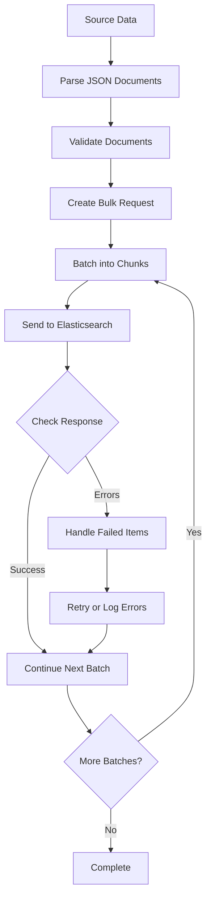

# How to Bulk Index Nested JSON in Elasticsearch

Author: [nawazdhandala](https://www.github.com/nawazdhandala)

Tags: Elasticsearch, Bulk Indexing, Nested JSON, Data Ingestion, Performance, Search

Description: Learn how to efficiently bulk index complex nested JSON documents in Elasticsearch with proper mapping, batching strategies, and error handling for optimal performance.

---

Indexing individual documents in Elasticsearch works fine for small datasets, but when you need to ingest thousands or millions of documents containing nested structures, you need the bulk API. This guide covers everything you need to know about bulk indexing nested JSON data efficiently.

## Understanding Nested JSON in Elasticsearch

Nested objects in Elasticsearch require special handling. By default, Elasticsearch flattens object arrays, which can lead to incorrect query results. Consider this document:

```json
{
  "product": "Laptop",
  "reviews": [
    { "author": "Alice", "rating": 5 },
    { "author": "Bob", "rating": 3 }
  ]
}
```

Without proper mapping, Elasticsearch flattens this to:
- `reviews.author`: ["Alice", "Bob"]
- `reviews.rating`: [5, 3]

This means a query for "reviews by Alice with rating 3" would incorrectly match this document because the relationship between author and rating is lost.

## Setting Up Nested Mappings

Before bulk indexing, create an index with proper nested field mappings:

```bash
curl -X PUT "localhost:9200/products" -H 'Content-Type: application/json' -d'
{
  "mappings": {
    "properties": {
      "product": { "type": "text" },
      "sku": { "type": "keyword" },
      "price": { "type": "float" },
      "reviews": {
        "type": "nested",
        "properties": {
          "author": { "type": "keyword" },
          "rating": { "type": "integer" },
          "comment": { "type": "text" },
          "date": { "type": "date" }
        }
      },
      "specifications": {
        "type": "nested",
        "properties": {
          "name": { "type": "keyword" },
          "value": { "type": "keyword" },
          "unit": { "type": "keyword" }
        }
      }
    }
  }
}'
```

## The Bulk API Format

The bulk API uses a newline-delimited JSON format (NDJSON). Each operation requires two lines: an action metadata line and the document source:

```
{"index": {"_index": "products", "_id": "1"}}
{"product": "Laptop", "reviews": [{"author": "Alice", "rating": 5}]}
{"index": {"_index": "products", "_id": "2"}}
{"product": "Phone", "reviews": [{"author": "Bob", "rating": 4}]}
```

## Bulk Indexing Workflow



## Python Implementation

Here is a complete Python script for bulk indexing nested JSON:

```python
from elasticsearch import Elasticsearch, helpers
import json

# Connect to Elasticsearch
es = Elasticsearch(['http://localhost:9200'])

def prepare_documents(source_data):
    """Generator that yields documents for bulk indexing."""
    for doc in source_data:
        yield {
            '_index': 'products',
            '_id': doc.get('sku'),
            '_source': {
                'product': doc['product'],
                'sku': doc['sku'],
                'price': doc['price'],
                'reviews': doc.get('reviews', []),
                'specifications': doc.get('specifications', [])
            }
        }

def bulk_index_with_nested(source_file, batch_size=500):
    """Bulk index documents from a JSON file."""

    # Load source data
    with open(source_file, 'r') as f:
        documents = json.load(f)

    # Use the helpers.bulk function
    success, failed = helpers.bulk(
        es,
        prepare_documents(documents),
        chunk_size=batch_size,
        raise_on_error=False,
        raise_on_exception=False
    )

    print(f"Successfully indexed: {success}")
    print(f"Failed: {len(failed)}")

    # Log failures for investigation
    for item in failed:
        print(f"Failed document: {item}")

    return success, failed

# Example usage
bulk_index_with_nested('products.json', batch_size=1000)
```

## Handling Complex Nested Structures

For deeply nested JSON with multiple levels, ensure your mapping reflects the structure:

```bash
curl -X PUT "localhost:9200/orders" -H 'Content-Type: application/json' -d'
{
  "mappings": {
    "properties": {
      "order_id": { "type": "keyword" },
      "customer": {
        "properties": {
          "id": { "type": "keyword" },
          "name": { "type": "text" },
          "address": {
            "properties": {
              "street": { "type": "text" },
              "city": { "type": "keyword" },
              "zip": { "type": "keyword" }
            }
          }
        }
      },
      "items": {
        "type": "nested",
        "properties": {
          "product_id": { "type": "keyword" },
          "name": { "type": "text" },
          "quantity": { "type": "integer" },
          "price": { "type": "float" },
          "attributes": {
            "type": "nested",
            "properties": {
              "key": { "type": "keyword" },
              "value": { "type": "keyword" }
            }
          }
        }
      }
    }
  }
}'
```

## Bulk Request Using cURL

For shell-based workflows, use cURL with a properly formatted bulk file:

```bash
# Create bulk.ndjson file
cat << 'EOF' > bulk.ndjson
{"index": {"_index": "products", "_id": "SKU001"}}
{"product": "Laptop Pro", "sku": "SKU001", "price": 1299.99, "reviews": [{"author": "Alice", "rating": 5, "comment": "Excellent performance"}, {"author": "Bob", "rating": 4, "comment": "Good value"}], "specifications": [{"name": "RAM", "value": "16", "unit": "GB"}, {"name": "Storage", "value": "512", "unit": "GB"}]}
{"index": {"_index": "products", "_id": "SKU002"}}
{"product": "Wireless Mouse", "sku": "SKU002", "price": 49.99, "reviews": [{"author": "Charlie", "rating": 5, "comment": "Very comfortable"}], "specifications": [{"name": "Battery", "value": "AA", "unit": "type"}, {"name": "DPI", "value": "1600", "unit": "dpi"}]}
EOF

# Send bulk request
curl -X POST "localhost:9200/_bulk" \
  -H 'Content-Type: application/x-ndjson' \
  --data-binary @bulk.ndjson
```

## Performance Optimization

### Optimal Batch Size

The ideal batch size depends on document size and cluster resources:

```python
def calculate_batch_size(avg_doc_size_kb, target_request_mb=5):
    """Calculate optimal batch size based on document size."""
    target_request_kb = target_request_mb * 1024
    return int(target_request_kb / avg_doc_size_kb)

# For 2KB average documents, targeting 5MB requests
batch_size = calculate_batch_size(2)  # Returns 2560
```

### Parallel Bulk Indexing

Use parallel helpers for faster ingestion:

```python
from elasticsearch import helpers
import concurrent.futures

def parallel_bulk_index(es, documents, thread_count=4, chunk_size=500):
    """Index documents using parallel threads."""

    results = helpers.parallel_bulk(
        es,
        documents,
        thread_count=thread_count,
        chunk_size=chunk_size,
        raise_on_error=False
    )

    success_count = 0
    error_count = 0

    for success, info in results:
        if success:
            success_count += 1
        else:
            error_count += 1
            print(f"Error: {info}")

    return success_count, error_count
```

### Index Settings for Bulk Operations

Temporarily adjust index settings during bulk operations:

```bash
# Before bulk indexing - optimize for write
curl -X PUT "localhost:9200/products/_settings" -H 'Content-Type: application/json' -d'
{
  "index": {
    "refresh_interval": "-1",
    "number_of_replicas": 0
  }
}'

# After bulk indexing - restore settings
curl -X PUT "localhost:9200/products/_settings" -H 'Content-Type: application/json' -d'
{
  "index": {
    "refresh_interval": "1s",
    "number_of_replicas": 1
  }
}'

# Force refresh to make documents searchable
curl -X POST "localhost:9200/products/_refresh"
```

## Error Handling and Retry Logic

Implement robust error handling for production systems:

```python
from elasticsearch import helpers, ConnectionError, TransportError
import time

def bulk_index_with_retry(es, documents, max_retries=3, backoff=2):
    """Bulk index with retry logic for transient failures."""

    attempt = 0
    while attempt < max_retries:
        try:
            success, errors = helpers.bulk(
                es,
                documents,
                raise_on_error=False,
                raise_on_exception=False
            )

            # Check for retryable errors
            retryable = []
            permanent_failures = []

            for error in errors:
                error_type = error.get('index', {}).get('error', {}).get('type', '')
                if error_type in ['es_rejected_execution_exception', 'timeout']:
                    retryable.append(error)
                else:
                    permanent_failures.append(error)

            if not retryable:
                return success, permanent_failures

            # Retry failed documents
            documents = retryable
            attempt += 1
            time.sleep(backoff ** attempt)

        except (ConnectionError, TransportError) as e:
            attempt += 1
            if attempt >= max_retries:
                raise
            time.sleep(backoff ** attempt)

    return 0, documents
```

## Querying Nested Documents

After bulk indexing, query nested fields using nested queries:

```bash
# Find products with reviews by Alice rated 5 stars
curl -X GET "localhost:9200/products/_search" -H 'Content-Type: application/json' -d'
{
  "query": {
    "nested": {
      "path": "reviews",
      "query": {
        "bool": {
          "must": [
            { "match": { "reviews.author": "Alice" }},
            { "match": { "reviews.rating": 5 }}
          ]
        }
      }
    }
  }
}'
```

## Monitoring Bulk Operations

Track bulk indexing progress with the tasks API:

```bash
# View active bulk tasks
curl -X GET "localhost:9200/_tasks?actions=*bulk*&detailed=true"

# Check index statistics
curl -X GET "localhost:9200/products/_stats/indexing"
```

## Summary

Bulk indexing nested JSON in Elasticsearch requires:

1. Proper nested mappings defined before indexing
2. Correct NDJSON format for bulk requests
3. Appropriate batch sizes based on document size
4. Temporarily optimized index settings during bulk operations
5. Robust error handling and retry logic
6. Monitoring to track progress and performance

By following these practices, you can efficiently ingest millions of nested documents while maintaining data integrity and query accuracy. Remember to restore production settings after bulk operations complete and verify your nested queries return expected results.
