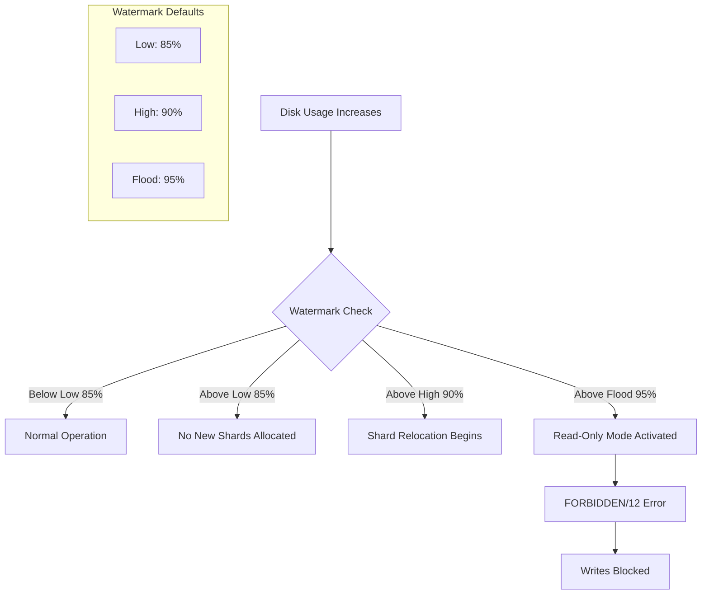
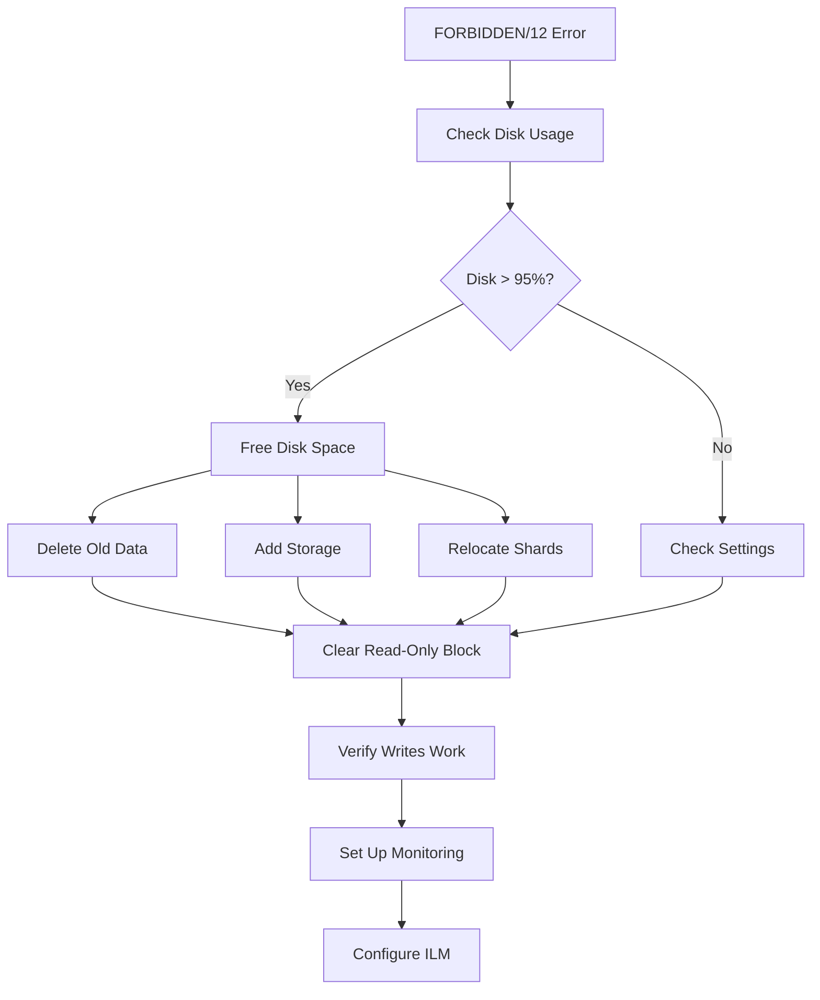

# How to Fix "cluster_block_exception: FORBIDDEN/12" Errors

Author: [nawazdhandala](https://www.github.com/nawazdhandala)

Tags: Elasticsearch, Troubleshooting, Disk Space, Cluster Management, Error Resolution, Operations

Description: Learn how to diagnose and fix the dreaded cluster_block_exception FORBIDDEN/12 error in Elasticsearch, which occurs when disk space runs low and the cluster enters read-only mode.

---

Few Elasticsearch errors cause more panic than suddenly being unable to write data. The "cluster_block_exception: FORBIDDEN/12" error means your cluster has entered a protective read-only state, typically due to low disk space. This guide explains why it happens and how to fix it quickly.

## Understanding the Error

When you see this error:

```json
{
  "error": {
    "root_cause": [
      {
        "type": "cluster_block_exception",
        "reason": "index [my-index] blocked by: [FORBIDDEN/12/index read-only / allow delete (api)];"
      }
    ],
    "type": "cluster_block_exception",
    "reason": "index [my-index] blocked by: [FORBIDDEN/12/index read-only / allow delete (api)];"
  },
  "status": 403
}
```

Elasticsearch has automatically set your indices to read-only to prevent data corruption when disk space is critically low.

## Why This Happens



Elasticsearch monitors disk usage with three watermarks:

| Watermark | Default | Effect |
|-----------|---------|--------|
| Low | 85% | Stops allocating new shards to the node |
| High | 90% | Attempts to relocate shards away from the node |
| Flood Stage | 95% | Sets indices to read-only |

## Quick Fix - Clear the Read-Only Block

Once you have resolved the disk space issue, you must manually clear the read-only block.

### Step 1: Check Current Disk Usage

```bash
curl -X GET "localhost:9200/_cat/allocation?v"

# Output example:
shards disk.indices disk.used disk.avail disk.total disk.percent host      node
    42       50gb     180gb      20gb       200gb       90  10.0.0.1  node-1
```

### Step 2: Free Up Disk Space

Before clearing the block, ensure you have adequate disk space:

```bash
# Delete old indices
curl -X DELETE "localhost:9200/logs-2023-01-*"

# Force merge to reclaim space from deleted documents
curl -X POST "localhost:9200/my-index/_forcemerge?only_expunge_deletes=true"

# Clear caches
curl -X POST "localhost:9200/_cache/clear"
```

### Step 3: Clear the Read-Only Block

For all indices:

```bash
curl -X PUT "localhost:9200/_all/_settings" -H 'Content-Type: application/json' -d'
{
  "index.blocks.read_only_allow_delete": null
}'
```

For a specific index:

```bash
curl -X PUT "localhost:9200/my-index/_settings" -H 'Content-Type: application/json' -d'
{
  "index.blocks.read_only_allow_delete": null
}'
```

### Step 4: Verify the Fix

```bash
curl -X GET "localhost:9200/_cluster/health?pretty"

# Try a write operation
curl -X POST "localhost:9200/my-index/_doc" -H 'Content-Type: application/json' -d'
{
  "test": "write successful"
}'
```

## Preventing Future Occurrences

### Adjust Watermark Settings

If you have a valid reason to operate at higher disk utilization, adjust the watermarks:

```bash
curl -X PUT "localhost:9200/_cluster/settings" -H 'Content-Type: application/json' -d'
{
  "persistent": {
    "cluster.routing.allocation.disk.watermark.low": "90%",
    "cluster.routing.allocation.disk.watermark.high": "95%",
    "cluster.routing.allocation.disk.watermark.flood_stage": "97%"
  }
}'
```

You can also use absolute values:

```bash
curl -X PUT "localhost:9200/_cluster/settings" -H 'Content-Type: application/json' -d'
{
  "persistent": {
    "cluster.routing.allocation.disk.watermark.low": "50gb",
    "cluster.routing.allocation.disk.watermark.high": "20gb",
    "cluster.routing.allocation.disk.watermark.flood_stage": "10gb"
  }
}'
```

### Automatic Index Lifecycle Management

Set up ILM to automatically manage old indices:

```bash
# Create ILM policy
curl -X PUT "localhost:9200/_ilm/policy/logs-policy" -H 'Content-Type: application/json' -d'
{
  "policy": {
    "phases": {
      "hot": {
        "min_age": "0ms",
        "actions": {
          "rollover": {
            "max_size": "50gb",
            "max_age": "7d"
          }
        }
      },
      "warm": {
        "min_age": "7d",
        "actions": {
          "shrink": {
            "number_of_shards": 1
          },
          "forcemerge": {
            "max_num_segments": 1
          }
        }
      },
      "delete": {
        "min_age": "30d",
        "actions": {
          "delete": {}
        }
      }
    }
  }
}'

# Apply policy to index template
curl -X PUT "localhost:9200/_index_template/logs-template" -H 'Content-Type: application/json' -d'
{
  "index_patterns": ["logs-*"],
  "template": {
    "settings": {
      "index.lifecycle.name": "logs-policy",
      "index.lifecycle.rollover_alias": "logs"
    }
  }
}'
```

### Monitoring Disk Usage

Create alerts before reaching critical thresholds:

```bash
# Check disk usage via API
curl -X GET "localhost:9200/_nodes/stats/fs?pretty"

# Response includes:
{
  "nodes": {
    "node-id": {
      "fs": {
        "total": {
          "total_in_bytes": 214748364800,
          "free_in_bytes": 42949672960,
          "available_in_bytes": 42949672960
        }
      }
    }
  }
}
```

Python monitoring script:

```python
from elasticsearch import Elasticsearch
import smtplib
from email.message import EmailMessage

es = Elasticsearch(['http://localhost:9200'])

def check_disk_usage(threshold=80):
    """Check disk usage and alert if above threshold."""

    stats = es.nodes.stats(metric='fs')

    alerts = []
    for node_id, node_data in stats['nodes'].items():
        fs = node_data['fs']['total']
        used_percent = ((fs['total_in_bytes'] - fs['available_in_bytes'])
                        / fs['total_in_bytes'] * 100)

        if used_percent > threshold:
            alerts.append({
                'node': node_data['name'],
                'used_percent': round(used_percent, 2),
                'available_gb': round(fs['available_in_bytes'] / 1024**3, 2)
            })

    return alerts

def send_alert(alerts):
    """Send email alert for disk usage."""

    if not alerts:
        return

    msg = EmailMessage()
    msg['Subject'] = 'Elasticsearch Disk Usage Alert'
    msg['From'] = 'alerts@example.com'
    msg['To'] = 'ops@example.com'

    body = "High disk usage detected on Elasticsearch nodes:\n\n"
    for alert in alerts:
        body += f"Node: {alert['node']}\n"
        body += f"  Used: {alert['used_percent']}%\n"
        body += f"  Available: {alert['available_gb']} GB\n\n"

    msg.set_content(body)

    with smtplib.SMTP('localhost') as smtp:
        smtp.send_message(msg)

# Run check
alerts = check_disk_usage(threshold=80)
send_alert(alerts)
```

## Troubleshooting Steps

### Check Which Indices Are Blocked

```bash
curl -X GET "localhost:9200/_all/_settings/index.blocks.*?pretty"
```

### Check Cluster Allocation Status

```bash
curl -X GET "localhost:9200/_cluster/allocation/explain?pretty" -H 'Content-Type: application/json' -d'
{
  "index": "my-index",
  "shard": 0,
  "primary": true
}'
```

### Identify Large Indices

```bash
# Sort indices by size
curl -X GET "localhost:9200/_cat/indices?v&s=store.size:desc"

# Check index storage details
curl -X GET "localhost:9200/_cat/shards?v&s=store:desc"
```

### Emergency Actions

If you cannot free disk space immediately:

```bash
# Temporarily disable flood stage block
curl -X PUT "localhost:9200/_cluster/settings" -H 'Content-Type: application/json' -d'
{
  "transient": {
    "cluster.routing.allocation.disk.threshold_enabled": false
  }
}'

# Re-enable after fixing the issue
curl -X PUT "localhost:9200/_cluster/settings" -H 'Content-Type: application/json' -d'
{
  "transient": {
    "cluster.routing.allocation.disk.threshold_enabled": null
  }
}'
```

## Recovery Workflow



## Common Mistakes to Avoid

1. **Only clearing the block without freeing space** - The block will return immediately
2. **Setting watermarks too high** - Risks data corruption if disk fills completely
3. **Not monitoring disk usage proactively** - Always set up alerts before reaching watermarks
4. **Ignoring the root cause** - Investigate why disk usage grew unexpectedly

## Summary

The FORBIDDEN/12 error is Elasticsearch protecting itself from disk exhaustion. To resolve it:

1. Free disk space by deleting old indices or adding storage
2. Clear the read-only block with `index.blocks.read_only_allow_delete: null`
3. Verify writes work correctly
4. Set up ILM policies for automatic data retention
5. Configure monitoring to alert before reaching watermarks

Understanding disk watermarks and proactively managing disk usage prevents this disruptive error from occurring in production environments.
