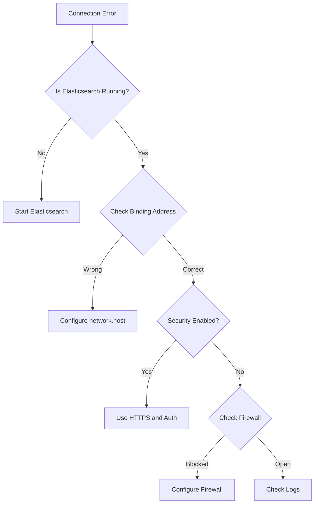

# How to Fix "Failed to connect to localhost:9200" Errors

Author: [nawazdhandala](https://www.github.com/nawazdhandala)

Tags: Elasticsearch, Troubleshooting, Connection Errors, DevOps, Configuration, Networking

Description: A comprehensive troubleshooting guide for fixing Elasticsearch localhost:9200 connection errors, covering common causes like service status, security settings, network bindings, and firewall configurations.

---

The "Failed to connect to localhost:9200" error is one of the most common issues when working with Elasticsearch. This guide walks through systematic troubleshooting steps to identify and resolve the root cause.

## Common Error Messages

You might see variations of this error:

```
curl: (7) Failed to connect to localhost port 9200: Connection refused
ConnectionError: Failed to establish a new connection
Connection refused [::1]:9200
ECONNREFUSED 127.0.0.1:9200
```

## Troubleshooting Flow



## Step 1: Check if Elasticsearch is Running

### Linux (systemd)

```bash
# Check service status
sudo systemctl status elasticsearch

# If not running, start it
sudo systemctl start elasticsearch

# Enable on boot
sudo systemctl enable elasticsearch
```

### Linux (init.d)

```bash
# Check status
sudo service elasticsearch status

# Start service
sudo service elasticsearch start
```

### macOS (Homebrew)

```bash
# Check status
brew services list | grep elasticsearch

# Start service
brew services start elastic/tap/elasticsearch-full
```

### Docker

```bash
# Check running containers
docker ps | grep elasticsearch

# If not running, check stopped containers
docker ps -a | grep elasticsearch

# Start container
docker start elasticsearch

# Or run a new container
docker run -d --name elasticsearch \
  -p 9200:9200 -p 9300:9300 \
  -e "discovery.type=single-node" \
  -e "xpack.security.enabled=false" \
  docker.elastic.co/elasticsearch/elasticsearch:8.11.0
```

### Check Process Directly

```bash
# Check if process is running
ps aux | grep elasticsearch

# Check if port is in use
lsof -i :9200
# or
netstat -tlnp | grep 9200
# or
ss -tlnp | grep 9200
```

## Step 2: Check Elasticsearch Logs

Logs reveal startup failures and errors:

```bash
# Default log location
tail -100 /var/log/elasticsearch/elasticsearch.log

# Or with journalctl
sudo journalctl -u elasticsearch -f

# Docker logs
docker logs elasticsearch --tail 100
```

Common log errors and solutions:

| Error | Solution |
|-------|----------|
| `max virtual memory areas too low` | `sysctl -w vm.max_map_count=262144` |
| `max file descriptors too low` | Increase in `/etc/security/limits.conf` |
| `Java heap space` | Adjust `-Xms` and `-Xmx` in `jvm.options` |
| `bootstrap checks failed` | Fix development mode issues or use `discovery.type: single-node` |

## Step 3: Check Network Binding

Elasticsearch 8.x defaults to localhost binding with security enabled. Verify configuration:

```bash
# Check elasticsearch.yml
cat /etc/elasticsearch/elasticsearch.yml | grep -E "network|http"
```

### For Local Development

```yaml
# /etc/elasticsearch/elasticsearch.yml
network.host: 127.0.0.1
http.port: 9200
```

### For Remote Access

```yaml
# Allow all interfaces (use with caution)
network.host: 0.0.0.0
http.port: 9200

# Or specific interface
network.host: 192.168.1.100
```

After changing configuration:

```bash
sudo systemctl restart elasticsearch
```

## Step 4: Handle Elasticsearch 8.x Security

Elasticsearch 8.x enables security by default. Connection attempts without HTTPS or authentication will fail.

### Option A: Use HTTPS with Authentication

```bash
# Use HTTPS and provide credentials
curl -X GET "https://localhost:9200" \
  -u elastic:your_password \
  --cacert /etc/elasticsearch/certs/http_ca.crt

# Or skip certificate verification (development only)
curl -X GET "https://localhost:9200" \
  -u elastic:your_password \
  -k
```

### Option B: Disable Security (Development Only)

```yaml
# /etc/elasticsearch/elasticsearch.yml
xpack.security.enabled: false
xpack.security.enrollment.enabled: false
xpack.security.http.ssl.enabled: false
xpack.security.transport.ssl.enabled: false
```

Then restart:

```bash
sudo systemctl restart elasticsearch
```

### Reset Elastic Password

```bash
# Reset the elastic user password
/usr/share/elasticsearch/bin/elasticsearch-reset-password -u elastic

# Or set a specific password
/usr/share/elasticsearch/bin/elasticsearch-reset-password -u elastic -i
```

## Step 5: Check Firewall Settings

### Linux (firewalld)

```bash
# Check firewall status
sudo firewall-cmd --state

# Allow port 9200
sudo firewall-cmd --permanent --add-port=9200/tcp
sudo firewall-cmd --reload

# Verify
sudo firewall-cmd --list-ports
```

### Linux (UFW)

```bash
# Check status
sudo ufw status

# Allow port
sudo ufw allow 9200/tcp

# Verify
sudo ufw status numbered
```

### Linux (iptables)

```bash
# Allow port 9200
sudo iptables -A INPUT -p tcp --dport 9200 -j ACCEPT

# Save rules
sudo iptables-save > /etc/iptables/rules.v4
```

## Step 6: Verify Java Installation

Elasticsearch requires Java. Check the bundled JDK or system Java:

```bash
# Check Elasticsearch's bundled Java
/usr/share/elasticsearch/jdk/bin/java -version

# Or system Java
java -version

# Verify JAVA_HOME if using system Java
echo $JAVA_HOME
```

## Step 7: Check Memory Settings

Insufficient memory causes startup failures:

```bash
# Check JVM heap settings
cat /etc/elasticsearch/jvm.options | grep -E "Xms|Xmx"

# Default values
-Xms1g
-Xmx1g
```

Adjust based on available memory:

```bash
# /etc/elasticsearch/jvm.options.d/heap.options
-Xms2g
-Xmx2g
```

Rule: Set both to the same value and no more than 50% of available RAM.

## Complete Connection Test Script

```bash
#!/bin/bash

ES_HOST="${1:-localhost}"
ES_PORT="${2:-9200}"

echo "=== Elasticsearch Connection Diagnostics ==="
echo ""

# Check if process is running
echo "1. Checking Elasticsearch process..."
if pgrep -f elasticsearch > /dev/null; then
    echo "   [OK] Elasticsearch process is running"
else
    echo "   [FAIL] Elasticsearch process not found"
    echo "   Try: sudo systemctl start elasticsearch"
fi
echo ""

# Check port binding
echo "2. Checking port $ES_PORT..."
if ss -tlnp | grep -q ":$ES_PORT"; then
    echo "   [OK] Port $ES_PORT is listening"
else
    echo "   [FAIL] Port $ES_PORT is not listening"
fi
echo ""

# Try HTTP connection
echo "3. Testing HTTP connection..."
if curl -s -o /dev/null -w "%{http_code}" "http://$ES_HOST:$ES_PORT" | grep -q "200\|401"; then
    echo "   [OK] HTTP connection successful"
else
    echo "   [INFO] HTTP failed, trying HTTPS..."

    # Try HTTPS
    if curl -s -k -o /dev/null -w "%{http_code}" "https://$ES_HOST:$ES_PORT" | grep -q "200\|401"; then
        echo "   [OK] HTTPS connection successful (security enabled)"
        echo "   Use: curl -k -u elastic:password https://$ES_HOST:$ES_PORT"
    else
        echo "   [FAIL] Both HTTP and HTTPS connections failed"
    fi
fi
echo ""

# Check logs for errors
echo "4. Recent errors in logs..."
if [ -f /var/log/elasticsearch/elasticsearch.log ]; then
    grep -i "error\|exception" /var/log/elasticsearch/elasticsearch.log | tail -5
else
    echo "   Log file not found at default location"
fi

echo ""
echo "=== Diagnostics Complete ==="
```

## Python Connection with Retry

```python
from elasticsearch import Elasticsearch
from elasticsearch.exceptions import ConnectionError
import time

def connect_with_retry(hosts, max_retries=5, retry_delay=5):
    """Connect to Elasticsearch with retry logic."""

    for attempt in range(max_retries):
        try:
            # Try HTTPS first (ES 8.x default)
            es = Elasticsearch(
                hosts,
                basic_auth=("elastic", "your_password"),
                verify_certs=False,  # Development only
                ssl_show_warn=False
            )

            if es.ping():
                print(f"Connected to Elasticsearch on attempt {attempt + 1}")
                return es

        except ConnectionError as e:
            print(f"Attempt {attempt + 1} failed: {e}")

            if attempt < max_retries - 1:
                print(f"Retrying in {retry_delay} seconds...")
                time.sleep(retry_delay)

    raise ConnectionError("Could not connect to Elasticsearch after max retries")

# Usage
try:
    es = connect_with_retry(["https://localhost:9200"])
    print(es.info())
except ConnectionError as e:
    print(f"Failed to connect: {e}")
```

## Docker Compose Setup

A working Docker Compose configuration:

```yaml
version: '3.8'

services:
  elasticsearch:
    image: docker.elastic.co/elasticsearch/elasticsearch:8.11.0
    container_name: elasticsearch
    environment:
      - discovery.type=single-node
      - xpack.security.enabled=false
      - "ES_JAVA_OPTS=-Xms512m -Xmx512m"
    ports:
      - "9200:9200"
      - "9300:9300"
    volumes:
      - esdata:/usr/share/elasticsearch/data
    healthcheck:
      test: ["CMD-SHELL", "curl -s http://localhost:9200 || exit 1"]
      interval: 10s
      timeout: 5s
      retries: 5

volumes:
  esdata:
    driver: local
```

Start and verify:

```bash
docker-compose up -d
docker-compose ps
curl http://localhost:9200
```

## Quick Reference

| Issue | Quick Fix |
|-------|-----------|
| Service not running | `sudo systemctl start elasticsearch` |
| Security enabled (401) | Use HTTPS + auth or disable security |
| Wrong binding | Set `network.host: 127.0.0.1` |
| Firewall blocking | `ufw allow 9200/tcp` |
| Memory issues | Check/adjust JVM heap in `jvm.options` |
| Bootstrap checks | Use `discovery.type: single-node` |

## Conclusion

Most localhost:9200 connection errors fall into these categories:

1. **Service not running** - Start Elasticsearch
2. **Security enabled** - Use HTTPS with authentication
3. **Wrong network binding** - Configure `network.host`
4. **Firewall blocking** - Open port 9200
5. **Resource limits** - Adjust memory and file descriptors

Follow the troubleshooting flow systematically, check logs for specific errors, and ensure your connection method matches the security configuration.
