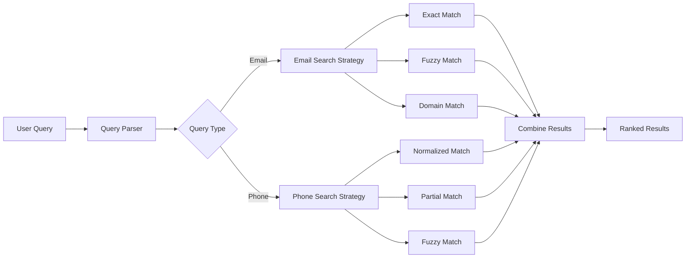

# How to Fuzzy Match Email or Phone Numbers in Elasticsearch

Author: [nawazdhandala](https://www.github.com/nawazdhandala)

Tags: Elasticsearch, Fuzzy Search, Email Search, Phone Number Search, Data Quality, Search Optimization

Description: Learn how to implement fuzzy matching for email addresses and phone numbers in Elasticsearch to handle typos, formatting variations, and data entry errors effectively.

---

Searching for exact email addresses or phone numbers seems straightforward until you encounter real-world data. Users enter "john.doe@gmial.com" instead of "john.doe@gmail.com", or record phone numbers as "555-123-4567", "(555) 123-4567", or "5551234567". This guide shows you how to handle these variations with fuzzy matching in Elasticsearch.

## The Challenge with Contact Data

Contact information rarely follows consistent formats. Your search needs to handle:

- Typos in email domains (gmial vs gmail)
- Missing or transposed characters
- Various phone number formats
- International phone prefixes
- Case sensitivity issues

## Mapping Strategy for Contact Fields

Create a mapping that supports multiple search strategies:

```bash
curl -X PUT "localhost:9200/contacts" -H 'Content-Type: application/json' -d'
{
  "settings": {
    "analysis": {
      "analyzer": {
        "email_analyzer": {
          "type": "custom",
          "tokenizer": "uax_url_email",
          "filter": ["lowercase"]
        },
        "phone_analyzer": {
          "type": "custom",
          "tokenizer": "standard",
          "char_filter": ["phone_char_filter"],
          "filter": ["lowercase"]
        },
        "phone_ngram_analyzer": {
          "type": "custom",
          "tokenizer": "standard",
          "char_filter": ["phone_char_filter"],
          "filter": ["phone_ngram"]
        }
      },
      "char_filter": {
        "phone_char_filter": {
          "type": "pattern_replace",
          "pattern": "[^0-9]",
          "replacement": ""
        }
      },
      "filter": {
        "phone_ngram": {
          "type": "ngram",
          "min_gram": 3,
          "max_gram": 10
        }
      }
    }
  },
  "mappings": {
    "properties": {
      "name": { "type": "text" },
      "email": {
        "type": "text",
        "analyzer": "email_analyzer",
        "fields": {
          "keyword": { "type": "keyword" },
          "autocomplete": {
            "type": "text",
            "analyzer": "standard"
          }
        }
      },
      "phone": {
        "type": "text",
        "analyzer": "phone_analyzer",
        "fields": {
          "keyword": { "type": "keyword" },
          "ngram": {
            "type": "text",
            "analyzer": "phone_ngram_analyzer"
          },
          "raw": { "type": "keyword" }
        }
      }
    }
  }
}'
```

## Search Architecture



## Fuzzy Email Matching

### Basic Fuzzy Query

Use the fuzziness parameter to handle typos:

```bash
curl -X GET "localhost:9200/contacts/_search" -H 'Content-Type: application/json' -d'
{
  "query": {
    "match": {
      "email": {
        "query": "john.doe@gmial.com",
        "fuzziness": "AUTO"
      }
    }
  }
}'
```

### Multi-Part Email Search

For more accurate results, search email parts separately:

```bash
curl -X GET "localhost:9200/contacts/_search" -H 'Content-Type: application/json' -d'
{
  "query": {
    "bool": {
      "should": [
        {
          "match": {
            "email": {
              "query": "john.doe@gmial.com",
              "fuzziness": "AUTO",
              "boost": 3
            }
          }
        },
        {
          "match": {
            "email.autocomplete": {
              "query": "john doe",
              "fuzziness": "AUTO",
              "boost": 1
            }
          }
        }
      ]
    }
  }
}'
```

### Email Domain Correction

Create a script that suggests domain corrections:

```python
from elasticsearch import Elasticsearch

es = Elasticsearch(['http://localhost:9200'])

COMMON_DOMAINS = ['gmail.com', 'yahoo.com', 'hotmail.com', 'outlook.com']

def search_email_fuzzy(email_query):
    """Search for email with fuzzy matching and domain suggestions."""

    # Extract domain if present
    parts = email_query.split('@')
    local_part = parts[0]
    domain = parts[1] if len(parts) > 1 else None

    should_clauses = [
        # Exact match with highest boost
        {
            "term": {
                "email.keyword": {
                    "value": email_query.lower(),
                    "boost": 10
                }
            }
        },
        # Fuzzy match on full email
        {
            "match": {
                "email": {
                    "query": email_query,
                    "fuzziness": "AUTO",
                    "boost": 5
                }
            }
        }
    ]

    # If domain looks misspelled, try common domains
    if domain and domain not in COMMON_DOMAINS:
        for common_domain in COMMON_DOMAINS:
            corrected_email = f"{local_part}@{common_domain}"
            should_clauses.append({
                "match": {
                    "email": {
                        "query": corrected_email,
                        "boost": 3
                    }
                }
            })

    query = {
        "query": {
            "bool": {
                "should": should_clauses,
                "minimum_should_match": 1
            }
        }
    }

    return es.search(index="contacts", body=query)
```

## Fuzzy Phone Number Matching

### Normalizing Phone Numbers

First, normalize phone numbers during indexing:

```python
import re

def normalize_phone(phone):
    """Remove all non-numeric characters from phone number."""
    return re.sub(r'[^0-9]', '', phone)

# Index with normalized phone
doc = {
    "name": "John Doe",
    "phone": normalize_phone("(555) 123-4567"),  # Stored as "5551234567"
    "phone_raw": "(555) 123-4567"  # Keep original format
}
```

### Phone Number Search Query

Search normalized phone numbers with fuzzy matching:

```bash
curl -X GET "localhost:9200/contacts/_search" -H 'Content-Type: application/json' -d'
{
  "query": {
    "bool": {
      "should": [
        {
          "match": {
            "phone": {
              "query": "5551234567",
              "fuzziness": 2
            }
          }
        },
        {
          "match": {
            "phone.ngram": {
              "query": "5551234567",
              "boost": 0.5
            }
          }
        }
      ]
    }
  }
}'
```

### Partial Phone Number Search

Allow searching by last 4 digits or partial numbers:

```bash
curl -X GET "localhost:9200/contacts/_search" -H 'Content-Type: application/json' -d'
{
  "query": {
    "bool": {
      "should": [
        {
          "wildcard": {
            "phone": {
              "value": "*4567",
              "boost": 2
            }
          }
        },
        {
          "match": {
            "phone.ngram": {
              "query": "4567",
              "boost": 1
            }
          }
        }
      ]
    }
  }
}'
```

## Combined Search Function

Here is a comprehensive search function for both email and phone:

```python
from elasticsearch import Elasticsearch
import re

es = Elasticsearch(['http://localhost:9200'])

def is_email(query):
    """Check if query looks like an email."""
    return '@' in query or '.' in query and not query.replace('.', '').isdigit()

def is_phone(query):
    """Check if query looks like a phone number."""
    digits = re.sub(r'[^0-9]', '', query)
    return len(digits) >= 7

def normalize_phone(phone):
    """Extract digits from phone number."""
    return re.sub(r'[^0-9]', '', phone)

def search_contact(query):
    """Intelligently search for contacts by email or phone."""

    should_clauses = []

    if is_email(query):
        # Email search strategies
        should_clauses.extend([
            {
                "term": {
                    "email.keyword": {
                        "value": query.lower(),
                        "boost": 10
                    }
                }
            },
            {
                "match": {
                    "email": {
                        "query": query,
                        "fuzziness": "AUTO",
                        "boost": 5
                    }
                }
            }
        ])

    if is_phone(query):
        # Phone search strategies
        normalized = normalize_phone(query)
        should_clauses.extend([
            {
                "term": {
                    "phone": {
                        "value": normalized,
                        "boost": 10
                    }
                }
            },
            {
                "match": {
                    "phone": {
                        "query": normalized,
                        "fuzziness": 2,
                        "boost": 5
                    }
                }
            },
            {
                "match": {
                    "phone.ngram": {
                        "query": normalized,
                        "boost": 2
                    }
                }
            }
        ])

    # Fallback to general search
    if not should_clauses:
        should_clauses.append({
            "multi_match": {
                "query": query,
                "fields": ["name", "email", "phone"],
                "fuzziness": "AUTO"
            }
        })

    response = es.search(
        index="contacts",
        body={
            "query": {
                "bool": {
                    "should": should_clauses,
                    "minimum_should_match": 1
                }
            },
            "highlight": {
                "fields": {
                    "email": {},
                    "phone": {}
                }
            }
        }
    )

    return response

# Example usage
results = search_contact("john.doe@gmial.com")  # Typo in gmail
results = search_contact("555-123-4567")        # Formatted phone
results = search_contact("5551234567")          # Raw digits
```

## Handling International Phone Numbers

For international numbers, store and search with consideration for country codes:

```bash
curl -X PUT "localhost:9200/international_contacts" -H 'Content-Type: application/json' -d'
{
  "mappings": {
    "properties": {
      "phone": {
        "properties": {
          "full": { "type": "keyword" },
          "country_code": { "type": "keyword" },
          "national": { "type": "text", "analyzer": "phone_analyzer" },
          "normalized": { "type": "keyword" }
        }
      }
    }
  }
}'
```

Search that handles international formats:

```python
def parse_international_phone(phone):
    """Parse international phone number into components."""
    normalized = re.sub(r'[^0-9+]', '', phone)

    # Common country codes
    country_codes = {'+1': 'US', '+44': 'UK', '+91': 'IN', '+86': 'CN'}

    for code, country in country_codes.items():
        if normalized.startswith(code):
            return {
                'country_code': code,
                'national': normalized[len(code):],
                'normalized': normalized,
                'country': country
            }

    return {
        'country_code': None,
        'national': normalized,
        'normalized': normalized,
        'country': 'Unknown'
    }
```

## Performance Considerations

### Use Filters for Exact Matches First

```bash
curl -X GET "localhost:9200/contacts/_search" -H 'Content-Type: application/json' -d'
{
  "query": {
    "bool": {
      "should": [
        {
          "term": {
            "email.keyword": "john.doe@gmail.com"
          }
        }
      ],
      "filter": [
        {
          "exists": { "field": "email" }
        }
      ]
    }
  }
}'
```

### Limit Fuzziness for Large Datasets

```bash
{
  "match": {
    "email": {
      "query": "john.doe@gmail.com",
      "fuzziness": 1,
      "prefix_length": 3,
      "max_expansions": 50
    }
  }
}
```

## Summary

Fuzzy matching email and phone numbers in Elasticsearch requires:

1. Custom analyzers that normalize contact data during indexing
2. Multi-field mappings that support different search strategies
3. Fuzziness parameters tuned for contact data characteristics
4. Combined queries that prioritize exact matches while allowing fuzzy fallbacks
5. Proper handling of international formats and variations

By implementing these strategies, you can build search functionality that handles real-world data quality issues while maintaining fast query performance. Users can find contacts even when they cannot remember exact email addresses or phone number formats.
