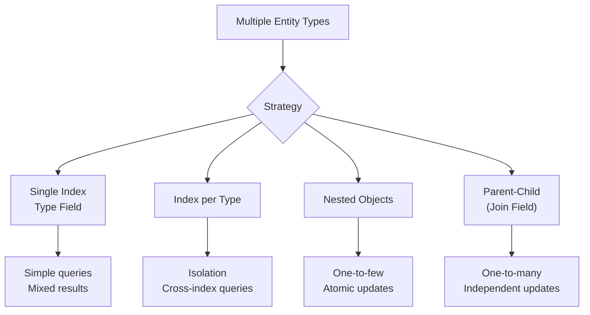
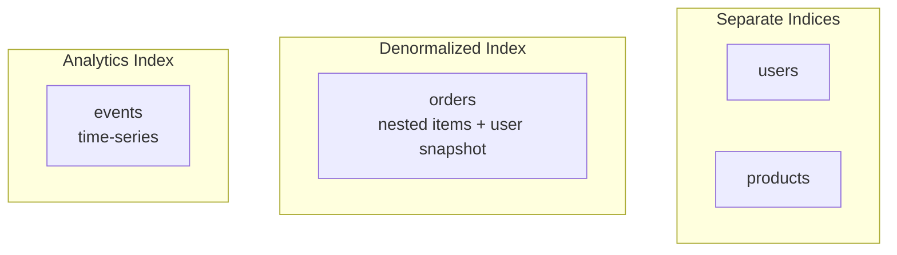

# How to Set Up Elasticsearch Index Structure for Multiple Entities

Author: [nawazdhandala](https://www.github.com/nawazdhandala)

Tags: Elasticsearch, Index Design, Data Modeling, Multi-Tenant, Schema Design, Architecture

Description: Learn how to structure Elasticsearch indices for applications with multiple entity types. Covers single index vs multiple indices, parent-child relationships, denormalization patterns, and best practices for scaling.

---

## The Multi-Entity Challenge

Most applications have multiple related entity types - users, orders, products, comments. How you structure these in Elasticsearch significantly impacts query performance, maintenance complexity, and scaling.

## Index Strategy Options



## Strategy 1: Single Index with Type Field

Store all entities in one index, distinguished by a type field.

### Index Mapping

```json
PUT /ecommerce
{
  "mappings": {
    "properties": {
      "entity_type": {
        "type": "keyword"
      },
      "created_at": {
        "type": "date"
      },
      "name": {
        "type": "text",
        "fields": {
          "keyword": {"type": "keyword"}
        }
      },
      "email": {
        "type": "keyword"
      },
      "price": {
        "type": "float"
      },
      "category": {
        "type": "keyword"
      },
      "user_id": {
        "type": "keyword"
      },
      "product_ids": {
        "type": "keyword"
      },
      "status": {
        "type": "keyword"
      }
    }
  }
}
```

### Index Documents

```json
POST /ecommerce/_bulk
{"index":{"_id":"user_1"}}
{"entity_type":"user","name":"John Doe","email":"john@example.com","created_at":"2024-01-15"}
{"index":{"_id":"product_1"}}
{"entity_type":"product","name":"Laptop Pro","price":1299.99,"category":"Electronics","created_at":"2024-01-10"}
{"index":{"_id":"order_1"}}
{"entity_type":"order","user_id":"user_1","product_ids":["product_1"],"status":"shipped","created_at":"2024-01-20"}
```

### Query by Type

```json
GET /ecommerce/_search
{
  "query": {
    "bool": {
      "must": [
        {"term": {"entity_type": "product"}},
        {"range": {"price": {"lte": 1500}}}
      ]
    }
  }
}
```

### Cross-Type Search

```json
GET /ecommerce/_search
{
  "query": {
    "bool": {
      "should": [
        {
          "bool": {
            "must": [
              {"term": {"entity_type": "user"}},
              {"match": {"name": "john"}}
            ]
          }
        },
        {
          "bool": {
            "must": [
              {"term": {"entity_type": "product"}},
              {"match": {"name": "laptop"}}
            ]
          }
        }
      ]
    }
  }
}
```

### Pros and Cons

| Pros | Cons |
|------|------|
| Simple setup | Sparse fields waste space |
| Single query for multiple types | Mapping conflicts possible |
| Easy cross-type search | Hard to tune per-type settings |

## Strategy 2: Index per Entity Type

Create separate indices for each entity type.

### Create Indices

```json
PUT /users
{
  "mappings": {
    "properties": {
      "name": {"type": "text"},
      "email": {"type": "keyword"},
      "created_at": {"type": "date"}
    }
  }
}

PUT /products
{
  "settings": {
    "analysis": {
      "analyzer": {
        "product_analyzer": {
          "type": "custom",
          "tokenizer": "standard",
          "filter": ["lowercase", "synonym_filter"]
        }
      }
    }
  },
  "mappings": {
    "properties": {
      "name": {
        "type": "text",
        "analyzer": "product_analyzer"
      },
      "price": {"type": "float"},
      "category": {"type": "keyword"}
    }
  }
}

PUT /orders
{
  "mappings": {
    "properties": {
      "user_id": {"type": "keyword"},
      "product_ids": {"type": "keyword"},
      "status": {"type": "keyword"},
      "total": {"type": "float"},
      "created_at": {"type": "date"}
    }
  }
}
```

### Cross-Index Search with Aliases

```json
POST /_aliases
{
  "actions": [
    {"add": {"index": "users", "alias": "searchable"}},
    {"add": {"index": "products", "alias": "searchable"}}
  ]
}

GET /searchable/_search
{
  "query": {
    "multi_match": {
      "query": "john laptop",
      "fields": ["name", "email"]
    }
  }
}
```

### Multi-Index Search

```json
GET /users,products,orders/_search
{
  "query": {
    "bool": {
      "should": [
        {"match": {"name": "laptop"}},
        {"match": {"email": "john"}}
      ]
    }
  }
}
```

### Pros and Cons

| Pros | Cons |
|------|------|
| Optimized mappings per type | More indices to manage |
| Independent scaling | Cross-index queries more complex |
| Clear separation | More cluster state |

## Strategy 3: Nested Objects

For one-to-few relationships, embed related data as nested objects.

### Index with Nested Mapping

```json
PUT /orders_nested
{
  "mappings": {
    "properties": {
      "order_id": {"type": "keyword"},
      "customer": {
        "properties": {
          "name": {"type": "text"},
          "email": {"type": "keyword"}
        }
      },
      "items": {
        "type": "nested",
        "properties": {
          "product_name": {"type": "text"},
          "quantity": {"type": "integer"},
          "price": {"type": "float"}
        }
      },
      "total": {"type": "float"},
      "created_at": {"type": "date"}
    }
  }
}
```

### Index Denormalized Document

```json
POST /orders_nested/_doc
{
  "order_id": "ORD-001",
  "customer": {
    "name": "John Doe",
    "email": "john@example.com"
  },
  "items": [
    {"product_name": "Laptop Pro", "quantity": 1, "price": 1299.99},
    {"product_name": "Mouse", "quantity": 2, "price": 29.99}
  ],
  "total": 1359.97,
  "created_at": "2024-01-20"
}
```

### Query Nested Objects

```json
GET /orders_nested/_search
{
  "query": {
    "nested": {
      "path": "items",
      "query": {
        "bool": {
          "must": [
            {"match": {"items.product_name": "laptop"}},
            {"range": {"items.price": {"gte": 1000}}}
          ]
        }
      }
    }
  }
}
```

### Aggregate Nested Data

```json
GET /orders_nested/_search
{
  "size": 0,
  "aggs": {
    "products": {
      "nested": {
        "path": "items"
      },
      "aggs": {
        "top_products": {
          "terms": {
            "field": "items.product_name.keyword",
            "size": 10
          }
        },
        "avg_price": {
          "avg": {
            "field": "items.price"
          }
        }
      }
    }
  }
}
```

### Pros and Cons

| Pros | Cons |
|------|------|
| Fast queries (single doc) | Updates require full reindex |
| Atomic operations | Document size limits |
| Natural data structure | Not for one-to-many |

## Strategy 4: Parent-Child with Join Field

For true one-to-many relationships where children update independently.

### Index with Join Field

```json
PUT /ecommerce_join
{
  "mappings": {
    "properties": {
      "join_field": {
        "type": "join",
        "relations": {
          "user": "order",
          "order": "order_item"
        }
      },
      "name": {"type": "text"},
      "email": {"type": "keyword"},
      "status": {"type": "keyword"},
      "product_name": {"type": "text"},
      "quantity": {"type": "integer"},
      "price": {"type": "float"}
    }
  }
}
```

### Index Parent and Children

```json
PUT /ecommerce_join/_doc/user_1
{
  "name": "John Doe",
  "email": "john@example.com",
  "join_field": "user"
}

PUT /ecommerce_join/_doc/order_1?routing=user_1
{
  "status": "shipped",
  "created_at": "2024-01-20",
  "join_field": {
    "name": "order",
    "parent": "user_1"
  }
}

PUT /ecommerce_join/_doc/item_1?routing=user_1
{
  "product_name": "Laptop Pro",
  "quantity": 1,
  "price": 1299.99,
  "join_field": {
    "name": "order_item",
    "parent": "order_1"
  }
}
```

### Query Children by Parent

```json
GET /ecommerce_join/_search
{
  "query": {
    "has_parent": {
      "parent_type": "user",
      "query": {
        "match": {
          "name": "john"
        }
      }
    }
  }
}
```

### Query Parents by Children

```json
GET /ecommerce_join/_search
{
  "query": {
    "has_child": {
      "type": "order",
      "query": {
        "term": {
          "status": "shipped"
        }
      }
    }
  }
}
```

### Pros and Cons

| Pros | Cons |
|------|------|
| Independent updates | Slower queries |
| True relationships | Routing complexity |
| Memory efficient | Same shard requirement |

## Practical Example: E-Commerce Platform

Here is a recommended structure for an e-commerce application:



### Users Index

```json
PUT /users
{
  "mappings": {
    "properties": {
      "user_id": {"type": "keyword"},
      "name": {"type": "text"},
      "email": {"type": "keyword"},
      "segment": {"type": "keyword"},
      "created_at": {"type": "date"}
    }
  }
}
```

### Products Index

```json
PUT /products
{
  "settings": {
    "analysis": {
      "analyzer": {
        "product_search": {
          "type": "custom",
          "tokenizer": "standard",
          "filter": ["lowercase", "edge_ngram_filter"]
        }
      },
      "filter": {
        "edge_ngram_filter": {
          "type": "edge_ngram",
          "min_gram": 2,
          "max_gram": 15
        }
      }
    }
  },
  "mappings": {
    "properties": {
      "product_id": {"type": "keyword"},
      "name": {
        "type": "text",
        "analyzer": "product_search",
        "search_analyzer": "standard"
      },
      "category": {"type": "keyword"},
      "price": {"type": "float"},
      "inventory": {"type": "integer"}
    }
  }
}
```

### Orders Index (Denormalized)

```json
PUT /orders
{
  "mappings": {
    "properties": {
      "order_id": {"type": "keyword"},
      "user": {
        "properties": {
          "user_id": {"type": "keyword"},
          "name": {"type": "text"},
          "email": {"type": "keyword"}
        }
      },
      "items": {
        "type": "nested",
        "properties": {
          "product_id": {"type": "keyword"},
          "name": {"type": "text"},
          "quantity": {"type": "integer"},
          "price": {"type": "float"}
        }
      },
      "status": {"type": "keyword"},
      "total": {"type": "float"},
      "created_at": {"type": "date"}
    }
  }
}
```

## Best Practices Summary

1. **Start with separate indices** - Easier to optimize and scale independently
2. **Use nested for small, stable collections** - Order items, tags, etc.
3. **Avoid parent-child unless necessary** - Performance overhead is significant
4. **Denormalize for read performance** - Accept duplicate data for faster queries
5. **Use aliases for cross-index queries** - Maintain flexibility
6. **Plan for updates** - Consider how often related data changes

## Conclusion

Choosing the right index structure depends on your query patterns, update frequency, and scaling requirements. For most applications, a combination of separate indices with strategic denormalization provides the best balance of query performance and maintainability. Use nested objects for embedded one-to-few relationships and avoid parent-child unless you have clear one-to-many relationships with independent update needs.
