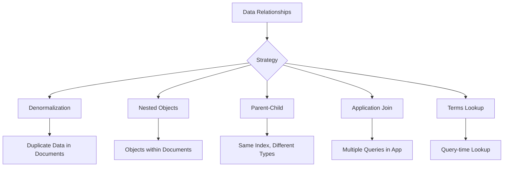

# How to Join Data in Elasticsearch

Author: [nawazdhandala](https://www.github.com/nawazdhandala)

Tags: Elasticsearch, Data Modeling, Nested Objects, Parent-Child, Denormalization, Query

Description: Learn how to handle relationships and join data in Elasticsearch using nested objects, parent-child relationships, application-side joins, and denormalization strategies.

---

Elasticsearch is not a relational database and does not support traditional SQL-style joins. However, there are several patterns to handle related data effectively. This guide covers all approaches with their trade-offs.

## The Join Challenge

In relational databases:

```sql
SELECT orders.id, customers.name
FROM orders
JOIN customers ON orders.customer_id = customers.id
```

Elasticsearch requires different approaches because:
- Documents are independent units
- Cross-index queries have limitations
- Performance degrades with complex joins

## Join Strategies Overview



## Method 1: Denormalization (Recommended for Most Cases)

Embed related data directly in documents.

### Example: Orders with Customer Data

```bash
# Instead of separate customer reference
# {"order_id": "1", "customer_id": "CUST-001"}

# Denormalize customer data into order
curl -X POST "https://localhost:9200/orders/_doc" \
  -H "Content-Type: application/json" \
  -u elastic:password \
  -d '{
    "order_id": "ORD-001",
    "amount": 299.99,
    "status": "shipped",
    "customer": {
      "id": "CUST-001",
      "name": "John Doe",
      "email": "john@example.com",
      "tier": "gold"
    },
    "items": [
      {"sku": "PROD-001", "name": "Laptop", "price": 299.99}
    ]
  }'
```

### Query Denormalized Data

```bash
curl -X GET "https://localhost:9200/orders/_search" \
  -H "Content-Type: application/json" \
  -u elastic:password \
  -d '{
    "query": {
      "bool": {
        "must": [
          { "match": { "customer.name": "John" } },
          { "term": { "customer.tier": "gold" } }
        ]
      }
    }
  }'
```

### When to Use Denormalization

- One-to-few relationships (order has one customer)
- Related data changes infrequently
- Query performance is critical
- Data duplication is acceptable

## Method 2: Nested Objects

For one-to-many relationships where you need to query individual items.

### Create Index with Nested Mapping

```bash
curl -X PUT "https://localhost:9200/orders" \
  -H "Content-Type: application/json" \
  -u elastic:password \
  -d '{
    "mappings": {
      "properties": {
        "order_id": { "type": "keyword" },
        "items": {
          "type": "nested",
          "properties": {
            "sku": { "type": "keyword" },
            "name": { "type": "text" },
            "price": { "type": "float" },
            "quantity": { "type": "integer" }
          }
        }
      }
    }
  }'
```

### Index Document with Nested Objects

```bash
curl -X POST "https://localhost:9200/orders/_doc" \
  -H "Content-Type: application/json" \
  -u elastic:password \
  -d '{
    "order_id": "ORD-001",
    "items": [
      {"sku": "SKU-A", "name": "Laptop", "price": 999, "quantity": 1},
      {"sku": "SKU-B", "name": "Mouse", "price": 29, "quantity": 2},
      {"sku": "SKU-C", "name": "Keyboard", "price": 79, "quantity": 1}
    ]
  }'
```

### Query Nested Objects

```bash
# Find orders with a specific item condition
curl -X GET "https://localhost:9200/orders/_search" \
  -H "Content-Type: application/json" \
  -u elastic:password \
  -d '{
    "query": {
      "nested": {
        "path": "items",
        "query": {
          "bool": {
            "must": [
              { "match": { "items.name": "Laptop" } },
              { "range": { "items.price": { "gte": 500 } } }
            ]
          }
        }
      }
    }
  }'
```

### Nested Aggregations

```bash
curl -X GET "https://localhost:9200/orders/_search" \
  -H "Content-Type: application/json" \
  -u elastic:password \
  -d '{
    "size": 0,
    "aggs": {
      "items": {
        "nested": {
          "path": "items"
        },
        "aggs": {
          "by_sku": {
            "terms": {
              "field": "items.sku"
            },
            "aggs": {
              "total_revenue": {
                "sum": {
                  "script": "doc[\"items.price\"].value * doc[\"items.quantity\"].value"
                }
              }
            }
          }
        }
      }
    }
  }'
```

## Method 3: Parent-Child (Join Field)

For true parent-child relationships that change independently.

### Create Index with Join Field

```bash
curl -X PUT "https://localhost:9200/company" \
  -H "Content-Type: application/json" \
  -u elastic:password \
  -d '{
    "mappings": {
      "properties": {
        "join_field": {
          "type": "join",
          "relations": {
            "department": "employee"
          }
        },
        "name": { "type": "text" },
        "department_name": { "type": "keyword" },
        "title": { "type": "keyword" },
        "salary": { "type": "integer" }
      }
    }
  }'
```

### Index Parent Documents

```bash
curl -X POST "https://localhost:9200/company/_doc/dept-engineering?routing=dept-engineering" \
  -H "Content-Type: application/json" \
  -u elastic:password \
  -d '{
    "name": "Engineering",
    "department_name": "Engineering",
    "join_field": "department"
  }'

curl -X POST "https://localhost:9200/company/_doc/dept-sales?routing=dept-sales" \
  -H "Content-Type: application/json" \
  -u elastic:password \
  -d '{
    "name": "Sales",
    "department_name": "Sales",
    "join_field": "department"
  }'
```

### Index Child Documents

```bash
curl -X POST "https://localhost:9200/company/_doc/emp-001?routing=dept-engineering" \
  -H "Content-Type: application/json" \
  -u elastic:password \
  -d '{
    "name": "Alice Smith",
    "title": "Senior Engineer",
    "salary": 120000,
    "join_field": {
      "name": "employee",
      "parent": "dept-engineering"
    }
  }'

curl -X POST "https://localhost:9200/company/_doc/emp-002?routing=dept-engineering" \
  -H "Content-Type: application/json" \
  -u elastic:password \
  -d '{
    "name": "Bob Johnson",
    "title": "Engineer",
    "salary": 90000,
    "join_field": {
      "name": "employee",
      "parent": "dept-engineering"
    }
  }'
```

### Query Children by Parent

```bash
curl -X GET "https://localhost:9200/company/_search" \
  -H "Content-Type: application/json" \
  -u elastic:password \
  -d '{
    "query": {
      "has_parent": {
        "parent_type": "department",
        "query": {
          "match": { "department_name": "Engineering" }
        }
      }
    }
  }'
```

### Query Parents by Children

```bash
curl -X GET "https://localhost:9200/company/_search" \
  -H "Content-Type: application/json" \
  -u elastic:password \
  -d '{
    "query": {
      "has_child": {
        "type": "employee",
        "query": {
          "range": { "salary": { "gte": 100000 } }
        }
      }
    }
  }'
```

### Parent-Child Aggregations

```bash
curl -X GET "https://localhost:9200/company/_search" \
  -H "Content-Type: application/json" \
  -u elastic:password \
  -d '{
    "size": 0,
    "aggs": {
      "departments": {
        "terms": {
          "field": "department_name"
        },
        "aggs": {
          "employees": {
            "children": {
              "type": "employee"
            },
            "aggs": {
              "avg_salary": {
                "avg": { "field": "salary" }
              }
            }
          }
        }
      }
    }
  }'
```

## Method 4: Application-Side Joins

Query multiple indices and join in application code.

```python
from elasticsearch import Elasticsearch

es = Elasticsearch(
    ["https://localhost:9200"],
    basic_auth=("elastic", "password"),
    verify_certs=False
)

def get_orders_with_customers(customer_ids):
    """Application-side join of orders and customers."""

    # Get customers
    customers_response = es.search(
        index="customers",
        body={
            "query": {
                "terms": { "customer_id.keyword": customer_ids }
            },
            "size": len(customer_ids)
        }
    )

    # Build customer lookup
    customers = {
        hit["_source"]["customer_id"]: hit["_source"]
        for hit in customers_response["hits"]["hits"]
    }

    # Get orders for these customers
    orders_response = es.search(
        index="orders",
        body={
            "query": {
                "terms": { "customer_id.keyword": customer_ids }
            },
            "size": 1000
        }
    )

    # Join in application
    results = []
    for hit in orders_response["hits"]["hits"]:
        order = hit["_source"]
        customer = customers.get(order["customer_id"], {})
        results.append({
            **order,
            "customer_name": customer.get("name"),
            "customer_email": customer.get("email")
        })

    return results


orders = get_orders_with_customers(["CUST-001", "CUST-002"])
for order in orders:
    print(f"Order {order['order_id']} by {order['customer_name']}")
```

## Method 5: Terms Lookup Query

Query one index based on values from another document.

```bash
# Document with list of IDs
curl -X POST "https://localhost:9200/user_preferences/_doc/user-001" \
  -H "Content-Type: application/json" \
  -u elastic:password \
  -d '{
    "user_id": "user-001",
    "favorite_products": ["PROD-001", "PROD-002", "PROD-003"]
  }'

# Query products using terms lookup
curl -X GET "https://localhost:9200/products/_search" \
  -H "Content-Type: application/json" \
  -u elastic:password \
  -d '{
    "query": {
      "terms": {
        "product_id": {
          "index": "user_preferences",
          "id": "user-001",
          "path": "favorite_products"
        }
      }
    }
  }'
```

## Comparison of Methods

| Method | Use Case | Performance | Update Complexity |
|--------|----------|-------------|-------------------|
| Denormalization | Few relationships | Excellent | High (update all) |
| Nested | One-to-many, query together | Good | Medium |
| Parent-Child | Many children, independent updates | Moderate | Low |
| Application Join | Complex joins, flexibility | Depends | Low |
| Terms Lookup | Dynamic filtering | Good | Low |

## Python Helper for Common Patterns

```python
from elasticsearch import Elasticsearch
from elasticsearch.helpers import bulk

es = Elasticsearch(
    ["https://localhost:9200"],
    basic_auth=("elastic", "password"),
    verify_certs=False
)

class ElasticsearchJoiner:
    """Helper class for common join patterns."""

    def __init__(self, es_client):
        self.es = es_client

    def denormalize_one_to_one(self, primary_index, foreign_index, join_field, foreign_key):
        """Denormalize by embedding foreign documents."""

        # Get all foreign documents as lookup
        foreign_docs = {}
        response = self.es.search(
            index=foreign_index,
            body={"size": 10000, "_source": True}
        )
        for hit in response["hits"]["hits"]:
            key = hit["_source"].get(foreign_key)
            if key:
                foreign_docs[key] = hit["_source"]

        # Update primary documents
        def generate_updates():
            response = self.es.search(
                index=primary_index,
                body={"size": 10000}
            )
            for hit in response["hits"]["hits"]:
                doc = hit["_source"]
                foreign_id = doc.get(join_field)
                if foreign_id and foreign_id in foreign_docs:
                    doc[f"_embedded_{foreign_index}"] = foreign_docs[foreign_id]
                    yield {
                        "_op_type": "index",
                        "_index": primary_index,
                        "_id": hit["_id"],
                        "_source": doc
                    }

        bulk(self.es, generate_updates())

    def query_with_join(self, parent_index, child_index, parent_query, join_field):
        """Two-query join pattern."""

        # Query parent
        parent_response = self.es.search(
            index=parent_index,
            body={"query": parent_query, "size": 100}
        )

        parent_ids = [
            hit["_source"].get(join_field)
            for hit in parent_response["hits"]["hits"]
        ]

        # Query children
        child_response = self.es.search(
            index=child_index,
            body={
                "query": {"terms": {f"{join_field}.keyword": parent_ids}},
                "size": 1000
            }
        )

        # Group children by parent
        results = {}
        for hit in parent_response["hits"]["hits"]:
            parent_id = hit["_source"].get(join_field)
            results[parent_id] = {
                "parent": hit["_source"],
                "children": []
            }

        for hit in child_response["hits"]["hits"]:
            parent_id = hit["_source"].get(join_field)
            if parent_id in results:
                results[parent_id]["children"].append(hit["_source"])

        return results


# Usage
joiner = ElasticsearchJoiner(es)

# Denormalize customers into orders
joiner.denormalize_one_to_one("orders", "customers", "customer_id", "customer_id")

# Query with join
results = joiner.query_with_join(
    "customers",
    "orders",
    {"match": {"tier": "gold"}},
    "customer_id"
)

for customer_id, data in results.items():
    print(f"Customer: {data['parent']['name']}")
    print(f"  Orders: {len(data['children'])}")
```

## Best Practices

1. **Prefer denormalization** for read-heavy workloads
2. **Use nested** when you need to query individual nested items
3. **Use parent-child** only when children update frequently
4. **Avoid deep nesting** - performance degrades
5. **Consider data size** - denormalization increases storage
6. **Plan for updates** - denormalized data needs sync logic

## Conclusion

Elasticsearch offers several join alternatives:

1. **Denormalization** - Best performance, embed related data
2. **Nested objects** - Query individual items in arrays
3. **Parent-child** - Independent updates, same index
4. **Application joins** - Maximum flexibility
5. **Terms lookup** - Dynamic filtering from other documents

Choose based on update frequency, query patterns, and performance requirements.
