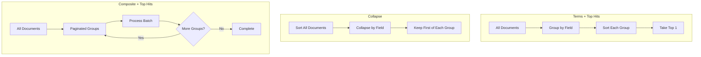

# How to Get Latest Values for Each Group in Elasticsearch

Author: [nawazdhandala](https://www.github.com/nawazdhandala)

Tags: Elasticsearch, Aggregations, Top Hits, Group By, Query Optimization, Data Analysis

Description: Learn how to retrieve the most recent document for each group in Elasticsearch using top_hits aggregation, collapse, and composite aggregations for efficient latest-value queries.

---

A common requirement is finding the latest record for each group - the most recent order per customer, the last status update per device, or the newest log entry per service. While SQL handles this with window functions, Elasticsearch requires a different approach. This guide covers multiple strategies for this pattern.

## The Challenge

Consider a sensor readings index:

```json
{"sensor_id": "sensor-1", "timestamp": "2024-01-15T10:00:00Z", "value": 23.5}
{"sensor_id": "sensor-1", "timestamp": "2024-01-15T10:05:00Z", "value": 24.1}
{"sensor_id": "sensor-2", "timestamp": "2024-01-15T10:00:00Z", "value": 18.2}
{"sensor_id": "sensor-2", "timestamp": "2024-01-15T10:03:00Z", "value": 18.8}
```

Goal: Get the latest reading for each sensor.

## Method 1: Terms Aggregation with Top Hits

The most flexible approach uses nested aggregations:

```bash
curl -X GET "localhost:9200/sensor_readings/_search" -H 'Content-Type: application/json' -d'
{
  "size": 0,
  "aggs": {
    "sensors": {
      "terms": {
        "field": "sensor_id",
        "size": 1000
      },
      "aggs": {
        "latest_reading": {
          "top_hits": {
            "size": 1,
            "sort": [
              { "timestamp": { "order": "desc" }}
            ],
            "_source": ["sensor_id", "timestamp", "value", "unit"]
          }
        }
      }
    }
  }
}'
```

Response:

```json
{
  "aggregations": {
    "sensors": {
      "buckets": [
        {
          "key": "sensor-1",
          "doc_count": 2,
          "latest_reading": {
            "hits": {
              "hits": [
                {
                  "_source": {
                    "sensor_id": "sensor-1",
                    "timestamp": "2024-01-15T10:05:00Z",
                    "value": 24.1
                  }
                }
              ]
            }
          }
        },
        {
          "key": "sensor-2",
          "doc_count": 2,
          "latest_reading": {
            "hits": {
              "hits": [
                {
                  "_source": {
                    "sensor_id": "sensor-2",
                    "timestamp": "2024-01-15T10:03:00Z",
                    "value": 18.8
                  }
                }
              ]
            }
          }
        }
      ]
    }
  }
}
```

## Method 2: Field Collapsing

For simpler cases, use the `collapse` parameter:

```bash
curl -X GET "localhost:9200/sensor_readings/_search" -H 'Content-Type: application/json' -d'
{
  "size": 100,
  "collapse": {
    "field": "sensor_id"
  },
  "sort": [
    { "timestamp": { "order": "desc" }}
  ],
  "_source": ["sensor_id", "timestamp", "value"]
}'
```

This returns one document per sensor_id, sorted by timestamp descending. Each collapsed group shows the first document after sorting.

## Method 3: Composite Aggregation for Large Datasets

For many groups, use composite aggregation with pagination:

```bash
curl -X GET "localhost:9200/sensor_readings/_search" -H 'Content-Type: application/json' -d'
{
  "size": 0,
  "aggs": {
    "sensors": {
      "composite": {
        "size": 1000,
        "sources": [
          { "sensor": { "terms": { "field": "sensor_id" }}}
        ]
      },
      "aggs": {
        "latest": {
          "top_hits": {
            "size": 1,
            "sort": [{ "timestamp": "desc" }]
          }
        }
      }
    }
  }
}'
```

Paginate using `after`:

```bash
{
  "aggs": {
    "sensors": {
      "composite": {
        "size": 1000,
        "after": { "sensor": "sensor-1000" },
        "sources": [...]
      }
    }
  }
}
```

## Query Flow Comparison



## Real-World Examples

### Example 1: Latest Order per Customer

```bash
curl -X GET "localhost:9200/orders/_search" -H 'Content-Type: application/json' -d'
{
  "size": 0,
  "aggs": {
    "customers": {
      "terms": {
        "field": "customer_id",
        "size": 10000
      },
      "aggs": {
        "latest_order": {
          "top_hits": {
            "size": 1,
            "sort": [{ "order_date": "desc" }],
            "_source": ["order_id", "order_date", "total", "status"]
          }
        },
        "total_orders": {
          "value_count": { "field": "order_id" }
        },
        "total_spent": {
          "sum": { "field": "total" }
        }
      }
    }
  }
}'
```

### Example 2: Last Login per User with Filters

```bash
curl -X GET "localhost:9200/user_activity/_search" -H 'Content-Type: application/json' -d'
{
  "size": 0,
  "query": {
    "bool": {
      "filter": [
        { "term": { "activity_type": "login" }},
        { "range": { "timestamp": { "gte": "now-30d" }}}
      ]
    }
  },
  "aggs": {
    "users": {
      "terms": {
        "field": "user_id",
        "size": 5000
      },
      "aggs": {
        "last_login": {
          "top_hits": {
            "size": 1,
            "sort": [{ "timestamp": "desc" }],
            "_source": ["user_id", "timestamp", "ip_address", "device"]
          }
        }
      }
    }
  }
}'
```

### Example 3: Latest Status per Device with Multiple Fields

```bash
curl -X GET "localhost:9200/device_status/_search" -H 'Content-Type: application/json' -d'
{
  "size": 0,
  "aggs": {
    "devices": {
      "terms": {
        "field": "device_id",
        "size": 10000
      },
      "aggs": {
        "latest_status": {
          "top_hits": {
            "size": 1,
            "sort": [{ "reported_at": "desc" }]
          }
        },
        "latest_timestamp": {
          "max": { "field": "reported_at" }
        },
        "health_score": {
          "avg": { "field": "health_score" }
        }
      }
    }
  }
}'
```

## Python Implementation

```python
from elasticsearch import Elasticsearch

es = Elasticsearch(['http://localhost:9200'])

def get_latest_per_group(index, group_field, timestamp_field,
                          source_fields=None, size=1000, filters=None):
    """Get latest document for each group."""

    query = {"match_all": {}}
    if filters:
        query = {"bool": {"filter": filters}}

    body = {
        "size": 0,
        "query": query,
        "aggs": {
            "groups": {
                "terms": {
                    "field": group_field,
                    "size": size
                },
                "aggs": {
                    "latest": {
                        "top_hits": {
                            "size": 1,
                            "sort": [{timestamp_field: {"order": "desc"}}]
                        }
                    }
                }
            }
        }
    }

    if source_fields:
        body["aggs"]["groups"]["aggs"]["latest"]["top_hits"]["_source"] = source_fields

    response = es.search(index=index, body=body)

    # Extract results
    results = []
    for bucket in response["aggregations"]["groups"]["buckets"]:
        latest_hit = bucket["latest"]["hits"]["hits"][0]
        results.append({
            "group": bucket["key"],
            "count": bucket["doc_count"],
            "latest": latest_hit["_source"]
        })

    return results

# Usage
latest_readings = get_latest_per_group(
    index="sensor_readings",
    group_field="sensor_id",
    timestamp_field="timestamp",
    source_fields=["sensor_id", "timestamp", "value"],
    filters=[{"term": {"status": "active"}}]
)
```

## Performance Considerations

### Terms Aggregation Limits

```bash
# Check cardinality before aggregating
curl -X GET "localhost:9200/logs/_search" -H 'Content-Type: application/json' -d'
{
  "size": 0,
  "aggs": {
    "unique_services": {
      "cardinality": { "field": "service_name" }
    }
  }
}'
```

If cardinality exceeds 10,000, consider:
1. Using composite aggregation with pagination
2. Pre-aggregating data into a summary index
3. Filtering to reduce groups

### Memory Usage

Top hits stores documents in memory. For large result sets:

```bash
{
  "aggs": {
    "groups": {
      "terms": {
        "field": "group_field",
        "size": 1000,
        "shard_size": 2000  # More precision, more memory
      }
    }
  }
}
```

### Pre-Aggregated Summary Index

For frequently-needed latest values, maintain a summary:

```python
def update_latest_summary(es, source_index, summary_index,
                          group_field, timestamp_field):
    """Update summary index with latest values."""

    # Get latest for each group
    latest = get_latest_per_group(source_index, group_field, timestamp_field)

    # Bulk update summary index
    actions = []
    for item in latest:
        actions.append({
            "_index": summary_index,
            "_id": item["group"],
            "_source": {
                "group_id": item["group"],
                "last_updated": item["latest"][timestamp_field],
                "latest_data": item["latest"]
            }
        })

    helpers.bulk(es, actions)
```

## Method Comparison

| Method | Best For | Limitations |
|--------|----------|-------------|
| Terms + Top Hits | Flexible, additional metrics | Memory intensive for large groups |
| Collapse | Simple cases, search results | Limited to search context |
| Composite + Top Hits | Large datasets | Requires pagination |

## Summary

Getting latest values per group in Elasticsearch:

1. **Terms + Top Hits** - Most flexible, supports additional aggregations
2. **Collapse** - Simplest for basic search results
3. **Composite aggregation** - Best for large cardinality with pagination
4. Check cardinality before choosing approach
5. Consider pre-aggregated summaries for frequent queries
6. Filter data before aggregating when possible

The right approach depends on your data volume, group cardinality, and whether you need additional metrics alongside the latest values.
