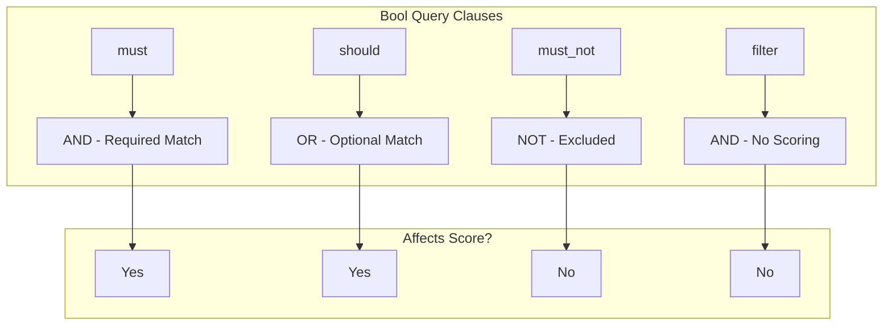
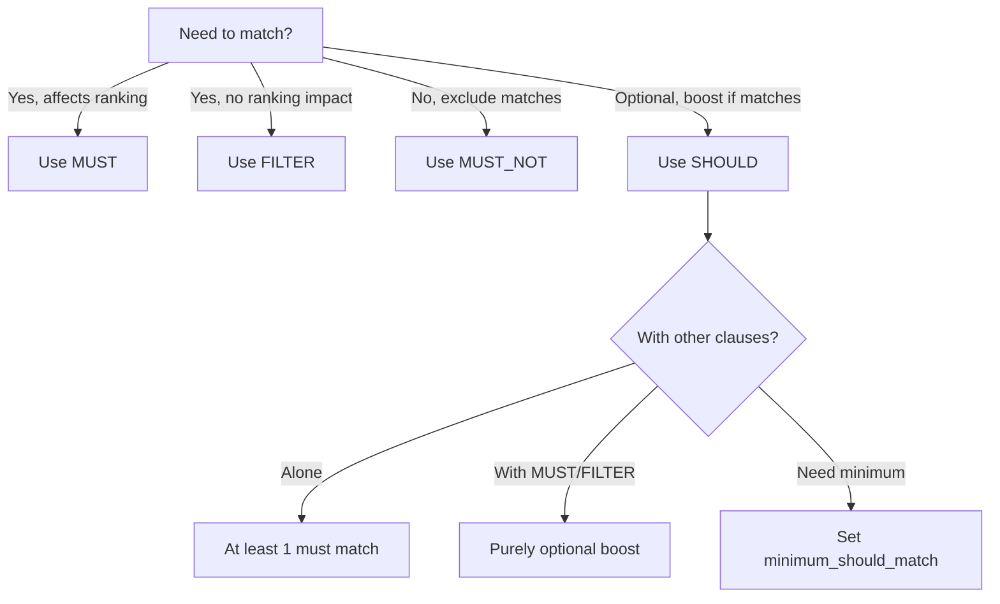

# How to Understand MUST vs SHOULD in Bool Queries

Author: [nawazdhandala](https://www.github.com/nawazdhandala)

Tags: Elasticsearch, Bool Query, Query DSL, Search, MUST, SHOULD, Query Optimization

Description: Master the difference between MUST and SHOULD clauses in Elasticsearch bool queries to build precise search queries that return exactly the results you need.

---

Bool queries are the backbone of Elasticsearch search. Understanding when to use `must`, `should`, `must_not`, and `filter` clauses determines whether your search returns precise results or frustrating mismatches. This guide clarifies these concepts with practical examples.

## The Four Bool Clauses



| Clause | Logic | Affects Score | Use When |
|--------|-------|---------------|----------|
| must | AND | Yes | Document MUST match |
| should | OR | Yes | Document SHOULD match (preferred) |
| must_not | NOT | No | Document MUST NOT match |
| filter | AND | No | Document MUST match (no scoring) |

## MUST - Required Conditions

`must` clauses work like AND in SQL. Every condition in `must` must be satisfied for a document to match.

```bash
curl -X GET "localhost:9200/products/_search" -H 'Content-Type: application/json' -d'
{
  "query": {
    "bool": {
      "must": [
        { "match": { "category": "electronics" }},
        { "match": { "brand": "Apple" }},
        { "range": { "price": { "lte": 1000 }}}
      ]
    }
  }
}'
```

This query returns only products that:
- Are in the "electronics" category AND
- Are made by "Apple" AND
- Cost $1000 or less

If any condition fails, the document is not returned.

## SHOULD - Optional Conditions

`should` clauses work like OR. At least one should clause must match (by default) for documents to be returned.

```bash
curl -X GET "localhost:9200/products/_search" -H 'Content-Type: application/json' -d'
{
  "query": {
    "bool": {
      "should": [
        { "match": { "title": "laptop" }},
        { "match": { "title": "notebook" }},
        { "match": { "title": "macbook" }}
      ]
    }
  }
}'
```

This query returns products whose title contains "laptop" OR "notebook" OR "macbook". Documents matching more terms score higher.

## The Critical Difference

The behavior of `should` changes based on context:

### SHOULD Alone - At Least One Must Match

```bash
{
  "query": {
    "bool": {
      "should": [
        { "match": { "color": "red" }},
        { "match": { "color": "blue" }}
      ]
    }
  }
}
```

Result: Returns documents matching "red" OR "blue" - at least one is required.

### SHOULD with MUST - Purely Optional

```bash
{
  "query": {
    "bool": {
      "must": [
        { "match": { "category": "shoes" }}
      ],
      "should": [
        { "match": { "color": "red" }},
        { "match": { "color": "blue" }}
      ]
    }
  }
}
```

Result: Returns ALL shoes, but ranks red or blue shoes higher. The `should` clause becomes a scoring boost, not a filter.

## Controlling SHOULD Behavior

### minimum_should_match

Control how many `should` clauses must match:

```bash
curl -X GET "localhost:9200/products/_search" -H 'Content-Type: application/json' -d'
{
  "query": {
    "bool": {
      "should": [
        { "match": { "features": "waterproof" }},
        { "match": { "features": "dustproof" }},
        { "match": { "features": "shockproof" }},
        { "match": { "features": "lightweight" }}
      ],
      "minimum_should_match": 2
    }
  }
}'
```

This requires at least 2 of the 4 features to match.

You can also use percentages:

```bash
{
  "bool": {
    "should": [...],
    "minimum_should_match": "75%"
  }
}
```

## Practical Examples

### Example 1: E-commerce Product Search

Search for laptops, preferring those with specific features:

```bash
curl -X GET "localhost:9200/products/_search" -H 'Content-Type: application/json' -d'
{
  "query": {
    "bool": {
      "must": [
        { "match": { "category": "laptops" }},
        { "range": { "price": { "gte": 500, "lte": 1500 }}}
      ],
      "should": [
        { "match": { "features": "SSD" }},
        { "match": { "features": "16GB RAM" }},
        { "match": { "brand": "Dell" }},
        { "term": { "in_stock": true }}
      ],
      "must_not": [
        { "term": { "refurbished": true }}
      ]
    }
  }
}'
```

This query:
- MUST be a laptop priced $500-$1500
- SHOULD have SSD, 16GB RAM, be Dell brand, or in stock (higher scores)
- MUST NOT be refurbished

### Example 2: Job Search

Find software engineering jobs with flexible criteria:

```bash
curl -X GET "localhost:9200/jobs/_search" -H 'Content-Type: application/json' -d'
{
  "query": {
    "bool": {
      "must": [
        { "match": { "title": "software engineer" }}
      ],
      "should": [
        { "match": { "skills": "Python" }},
        { "match": { "skills": "JavaScript" }},
        { "match": { "skills": "Go" }},
        { "term": { "remote": true }},
        { "range": { "salary_max": { "gte": 150000 }}}
      ],
      "minimum_should_match": 2,
      "filter": [
        { "term": { "status": "active" }},
        { "geo_distance": {
          "distance": "50km",
          "location": { "lat": 37.7749, "lon": -122.4194 }
        }}
      ]
    }
  }
}'
```

### Example 3: Content Relevance

Boost content that matches user preferences:

```bash
curl -X GET "localhost:9200/articles/_search" -H 'Content-Type: application/json' -d'
{
  "query": {
    "bool": {
      "must": [
        { "match": { "content": "kubernetes deployment" }}
      ],
      "should": [
        { "term": { "author": { "value": "favorite_author", "boost": 3 }}},
        { "term": { "category": { "value": "tutorials", "boost": 2 }}},
        { "range": { "publish_date": { "gte": "now-30d", "boost": 1.5 }}}
      ]
    }
  }
}'
```

## FILTER vs MUST

Both require matching, but `filter` does not affect scoring:

```bash
# Using must - affects relevance score
{
  "bool": {
    "must": [
      { "term": { "status": "published" }}
    ]
  }
}

# Using filter - no scoring impact, better performance
{
  "bool": {
    "filter": [
      { "term": { "status": "published" }}
    ]
  }
}
```

Use `filter` for:
- Yes/no criteria (status, type, category)
- Range filters on dates or numbers
- Geo filters
- Any clause where relevance scoring does not matter

## Query Structure Decision Tree



## Common Patterns

### Pattern 1: Required + Preferred

```bash
{
  "bool": {
    "must": [{ "match": { "type": "article" }}],
    "should": [
      { "match": { "topic": "user's interests" }},
      { "term": { "premium": true }}
    ]
  }
}
```

### Pattern 2: Any of Multiple Options

```bash
{
  "bool": {
    "should": [
      { "term": { "category": "A" }},
      { "term": { "category": "B" }},
      { "term": { "category": "C" }}
    ],
    "minimum_should_match": 1
  }
}
```

### Pattern 3: Complex AND/OR Logic

Find (category=A AND brand=X) OR (category=B AND brand=Y):

```bash
{
  "bool": {
    "should": [
      {
        "bool": {
          "must": [
            { "term": { "category": "A" }},
            { "term": { "brand": "X" }}
          ]
        }
      },
      {
        "bool": {
          "must": [
            { "term": { "category": "B" }},
            { "term": { "brand": "Y" }}
          ]
        }
      }
    ]
  }
}
```

## Summary

Understanding `must` vs `should` is essential for effective Elasticsearch queries:

1. **MUST** = Required (AND logic), affects scoring
2. **SHOULD** = Optional (OR logic), boosts matching documents
3. **SHOULD alone** requires at least one match by default
4. **SHOULD with MUST** becomes purely optional scoring boost
5. **minimum_should_match** controls required SHOULD matches
6. **FILTER** = Required but does not affect scoring (faster)
7. **MUST_NOT** = Exclusion filter

Master these patterns and you can express any search logic while maintaining control over both what matches and how results are ranked.
