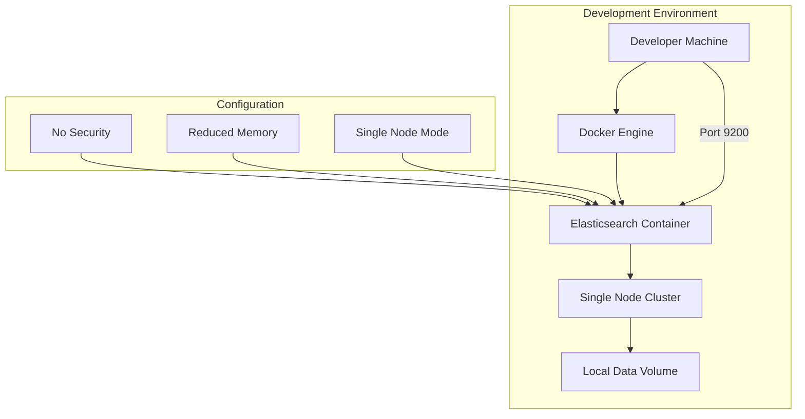

# How to Run Elasticsearch in Non-Prod Mode in Docker

Author: [nawazdhandala](https://www.github.com/nawazdhandala)

Tags: Elasticsearch, Docker, Development, DevOps, Local Development, Non-Production

Description: Learn how to run Elasticsearch in development and testing environments using Docker with non-production configurations for faster startup, reduced resource usage, and easier debugging.

---

Running Elasticsearch in production requires careful tuning for performance, reliability, and security. However, during development and testing, these configurations often get in the way. A single-node cluster with production settings consumes excessive resources, takes longer to start, and enforces security measures that complicate local debugging.

This guide shows you how to configure Elasticsearch for non-production environments in Docker, making your development workflow faster and more efficient.

## Why Non-Production Mode Matters

Production Elasticsearch clusters are designed for high availability with multiple nodes, shards, and replicas. For local development, you typically need:

- Fast startup times
- Minimal resource consumption
- Single-node operation without cluster overhead
- Disabled security for easier access
- Simplified configuration

## Basic Docker Setup for Development

Here is a minimal Docker Compose configuration for running Elasticsearch in development mode:

```yaml
version: '3.8'
services:
  elasticsearch:
    image: docker.elastic.co/elasticsearch/elasticsearch:8.11.0
    container_name: elasticsearch-dev
    environment:
      - discovery.type=single-node
      - xpack.security.enabled=false
      - xpack.security.enrollment.enabled=false
      - ES_JAVA_OPTS=-Xms512m -Xmx512m
      - cluster.name=dev-cluster
      - bootstrap.memory_lock=true
    ulimits:
      memlock:
        soft: -1
        hard: -1
    ports:
      - "9200:9200"
      - "9300:9300"
    volumes:
      - esdata:/usr/share/elasticsearch/data

volumes:
  esdata:
    driver: local
```

## Key Configuration Options Explained

### Single Node Discovery

The `discovery.type=single-node` setting tells Elasticsearch to operate as a standalone node without attempting to form a cluster with other nodes:

```yaml
environment:
  - discovery.type=single-node
```

This eliminates the cluster formation delay and removes the need for minimum master node configurations.

### Disabling Security Features

For local development where security is not a concern, disable X-Pack security:

```yaml
environment:
  - xpack.security.enabled=false
  - xpack.security.enrollment.enabled=false
  - xpack.security.http.ssl.enabled=false
  - xpack.security.transport.ssl.enabled=false
```

This allows unauthenticated access to the Elasticsearch API, making it easier to test queries without managing credentials.

### Memory Configuration

Production clusters often need significant heap memory. For development, reduce the JVM heap:

```yaml
environment:
  - ES_JAVA_OPTS=-Xms512m -Xmx512m
```

This allocates 512MB for both initial and maximum heap size. Adjust based on your workload, but 512MB to 1GB is usually sufficient for development.

## Architecture Overview



## Advanced Development Configuration

For more control over your development environment, here is an extended configuration:

```yaml
version: '3.8'
services:
  elasticsearch:
    image: docker.elastic.co/elasticsearch/elasticsearch:8.11.0
    container_name: elasticsearch-dev
    environment:
      # Cluster settings
      - discovery.type=single-node
      - cluster.name=dev-cluster
      - node.name=dev-node-1

      # Disable security
      - xpack.security.enabled=false
      - xpack.security.enrollment.enabled=false

      # Memory settings
      - ES_JAVA_OPTS=-Xms512m -Xmx512m
      - bootstrap.memory_lock=true

      # Index settings for development
      - action.auto_create_index=true
      - indices.id_field_data.enabled=true

      # Performance tuning for dev
      - index.number_of_shards=1
      - index.number_of_replicas=0

      # Logging
      - logger.level=INFO
    ulimits:
      memlock:
        soft: -1
        hard: -1
    ports:
      - "9200:9200"
      - "9300:9300"
    volumes:
      - esdata:/usr/share/elasticsearch/data
    healthcheck:
      test: ["CMD-SHELL", "curl -s http://localhost:9200/_cluster/health | grep -q '\"status\":\"green\"\\|\"status\":\"yellow\"'"]
      interval: 10s
      timeout: 5s
      retries: 5

volumes:
  esdata:
    driver: local
```

## Running Elasticsearch with Docker CLI

If you prefer not to use Docker Compose, here is the equivalent Docker command:

```bash
docker run -d \
  --name elasticsearch-dev \
  -p 9200:9200 \
  -p 9300:9300 \
  -e "discovery.type=single-node" \
  -e "xpack.security.enabled=false" \
  -e "ES_JAVA_OPTS=-Xms512m -Xmx512m" \
  -e "cluster.name=dev-cluster" \
  docker.elastic.co/elasticsearch/elasticsearch:8.11.0
```

## Index Template for Development

Create a default index template that applies development-friendly settings to all new indices:

```bash
curl -X PUT "localhost:9200/_index_template/dev-template" -H 'Content-Type: application/json' -d'
{
  "index_patterns": ["*"],
  "priority": 1,
  "template": {
    "settings": {
      "number_of_shards": 1,
      "number_of_replicas": 0,
      "refresh_interval": "1s"
    }
  }
}'
```

This ensures every index created in your development environment uses:
- A single shard (sufficient for small datasets)
- Zero replicas (no redundancy needed in development)
- Fast refresh interval for near-real-time search

## Testing Your Setup

Verify Elasticsearch is running correctly:

```bash
# Check cluster health
curl -X GET "localhost:9200/_cluster/health?pretty"

# Expected output for development
{
  "cluster_name" : "dev-cluster",
  "status" : "green",
  "timed_out" : false,
  "number_of_nodes" : 1,
  "number_of_data_nodes" : 1,
  "active_primary_shards" : 0,
  "active_shards" : 0,
  "relocating_shards" : 0,
  "initializing_shards" : 0,
  "unassigned_shards" : 0,
  "delayed_unassigned_shards" : 0,
  "number_of_pending_tasks" : 0,
  "number_of_in_flight_fetch" : 0,
  "task_max_waiting_in_queue_millis" : 0,
  "active_shards_percent_as_number" : 100.0
}
```

## Comparison: Development vs Production Settings

| Setting | Development | Production |
|---------|-------------|------------|
| discovery.type | single-node | zen/seed-hosts |
| xpack.security.enabled | false | true |
| ES_JAVA_OPTS | -Xms512m -Xmx512m | -Xms16g -Xmx16g |
| number_of_shards | 1 | 3-5 |
| number_of_replicas | 0 | 1-2 |
| bootstrap.memory_lock | true | true |

## Common Development Scenarios

### Scenario 1: Fresh Start Every Time

For CI/CD pipelines where you need a clean Elasticsearch instance:

```yaml
services:
  elasticsearch:
    image: docker.elastic.co/elasticsearch/elasticsearch:8.11.0
    environment:
      - discovery.type=single-node
      - xpack.security.enabled=false
      - ES_JAVA_OPTS=-Xms256m -Xmx256m
    tmpfs:
      - /usr/share/elasticsearch/data
```

Using `tmpfs` stores data in memory, making startup faster and ensuring a clean state on each restart.

### Scenario 2: Persistent Data Between Restarts

For ongoing development where you want to preserve indexed data:

```yaml
volumes:
  - ./elasticsearch-data:/usr/share/elasticsearch/data
```

This mounts a local directory, persisting data across container restarts.

## Cleanup Script

Create a script to reset your development environment:

```bash
#!/bin/bash
# reset-elasticsearch.sh

# Stop and remove container
docker stop elasticsearch-dev
docker rm elasticsearch-dev

# Remove volume (optional - removes all data)
docker volume rm esdata

# Restart with fresh state
docker-compose up -d elasticsearch
```

## Summary

Running Elasticsearch in non-production mode with Docker significantly improves your development workflow. Key takeaways:

1. Use `discovery.type=single-node` to skip cluster formation
2. Disable security with `xpack.security.enabled=false` for easier access
3. Reduce memory allocation with appropriate `ES_JAVA_OPTS`
4. Set `number_of_replicas=0` since redundancy is unnecessary in development
5. Use tmpfs volumes for ephemeral testing environments

These configurations let you focus on building and testing your application rather than managing infrastructure complexity. Remember to never use these settings in production environments where security, reliability, and performance are critical.
