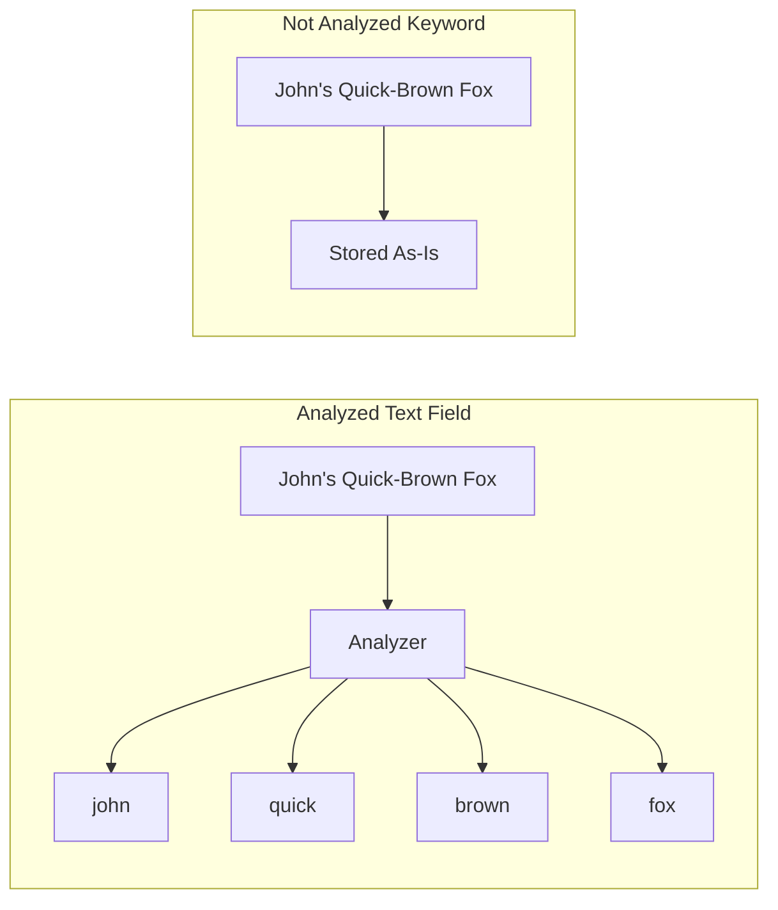

# How to Not Analyze Fields in Elasticsearch

Author: [nawazdhandala](https://www.github.com/nawazdhandala)

Tags: Elasticsearch, Mapping, Keyword Fields, Text Analysis, Index Configuration, Search Optimization

Description: Learn how to configure Elasticsearch fields to skip text analysis for exact matching, sorting, and aggregations using keyword type and index:false settings.

---

By default, Elasticsearch analyzes text fields - breaking them into tokens, lowercasing, and applying stemming. While this enables full-text search, many fields need exact matching instead. This guide shows how to disable analysis when you need precise value matching.

## Understanding Text Analysis



When Elasticsearch analyzes "John's Quick-Brown Fox":
- Tokenizes: splits into words
- Lowercases: JOHN becomes john
- Removes possessives: John's becomes john
- Result: ["john", "quick", "brown", "fox"]

For exact matching, you want the original value preserved.

## Using Keyword Type

The simplest way to skip analysis is using the `keyword` type:

```bash
curl -X PUT "localhost:9200/products" -H 'Content-Type: application/json' -d'
{
  "mappings": {
    "properties": {
      "sku": { "type": "keyword" },
      "category": { "type": "keyword" },
      "status": { "type": "keyword" },
      "brand": { "type": "keyword" },
      "tags": { "type": "keyword" },
      "name": { "type": "text" }
    }
  }
}'
```

### Keyword vs Text Comparison

| Aspect | text | keyword |
|--------|------|---------|
| Analysis | Yes | No |
| Full-text search | Yes | No |
| Exact matching | No | Yes |
| Sorting | Inefficient | Efficient |
| Aggregations | No | Yes |
| Wildcards | Limited | Yes |

## Multi-Field Mapping

Often you need both analyzed and exact versions of a field:

```bash
curl -X PUT "localhost:9200/articles" -H 'Content-Type: application/json' -d'
{
  "mappings": {
    "properties": {
      "title": {
        "type": "text",
        "fields": {
          "keyword": {
            "type": "keyword"
          },
          "autocomplete": {
            "type": "text",
            "analyzer": "autocomplete_analyzer"
          }
        }
      },
      "author": {
        "type": "text",
        "fields": {
          "keyword": { "type": "keyword" }
        }
      }
    }
  }
}'
```

Now you can:
- Full-text search: `title`
- Exact match: `title.keyword`
- Autocomplete: `title.autocomplete`

### Using Multi-Fields

```bash
# Full-text search
curl -X GET "localhost:9200/articles/_search" -H 'Content-Type: application/json' -d'
{
  "query": {
    "match": { "title": "elasticsearch basics" }
  }
}'

# Exact match
curl -X GET "localhost:9200/articles/_search" -H 'Content-Type: application/json' -d'
{
  "query": {
    "term": { "title.keyword": "Elasticsearch Basics Guide" }
  }
}'

# Sort by exact value
curl -X GET "localhost:9200/articles/_search" -H 'Content-Type: application/json' -d'
{
  "sort": [
    { "title.keyword": { "order": "asc" }}
  ]
}'

# Aggregate on exact values
curl -X GET "localhost:9200/articles/_search" -H 'Content-Type: application/json' -d'
{
  "size": 0,
  "aggs": {
    "authors": {
      "terms": { "field": "author.keyword" }
    }
  }
}'
```

## Disabling Indexing Entirely

For fields you never search but only retrieve, disable indexing:

```bash
curl -X PUT "localhost:9200/logs" -H 'Content-Type: application/json' -d'
{
  "mappings": {
    "properties": {
      "message": { "type": "text" },
      "stack_trace": {
        "type": "text",
        "index": false
      },
      "raw_payload": {
        "type": "text",
        "index": false
      },
      "metadata": {
        "type": "object",
        "enabled": false
      }
    }
  }
}'
```

- `index: false` - Field is stored but not searchable
- `enabled: false` - Object is stored but completely ignored

## Normalizers for Keyword Fields

Keywords skip analysis but you might want basic normalization:

```bash
curl -X PUT "localhost:9200/users" -H 'Content-Type: application/json' -d'
{
  "settings": {
    "analysis": {
      "normalizer": {
        "lowercase_normalizer": {
          "type": "custom",
          "filter": ["lowercase"]
        },
        "trim_normalizer": {
          "type": "custom",
          "char_filter": ["trim_whitespace"],
          "filter": ["lowercase"]
        }
      },
      "char_filter": {
        "trim_whitespace": {
          "type": "pattern_replace",
          "pattern": "^\\s+|\\s+$",
          "replacement": ""
        }
      }
    }
  },
  "mappings": {
    "properties": {
      "email": {
        "type": "keyword",
        "normalizer": "lowercase_normalizer"
      },
      "username": {
        "type": "keyword",
        "normalizer": "trim_normalizer"
      }
    }
  }
}'
```

Now:
- "John@Example.COM" becomes "john@example.com"
- " username " becomes "username"

## Common Patterns

### Pattern 1: IDs and Codes

```bash
{
  "mappings": {
    "properties": {
      "order_id": { "type": "keyword" },
      "product_sku": { "type": "keyword" },
      "tracking_code": { "type": "keyword" },
      "postal_code": { "type": "keyword" }
    }
  }
}
```

### Pattern 2: Enumerated Values

```bash
{
  "mappings": {
    "properties": {
      "status": { "type": "keyword" },
      "priority": { "type": "keyword" },
      "category": { "type": "keyword" },
      "type": { "type": "keyword" }
    }
  }
}
```

### Pattern 3: URLs and Paths

```bash
{
  "mappings": {
    "properties": {
      "url": { "type": "keyword" },
      "file_path": { "type": "keyword" },
      "api_endpoint": { "type": "keyword" }
    }
  }
}
```

### Pattern 4: Case-Insensitive Exact Match

```bash
curl -X PUT "localhost:9200/products" -H 'Content-Type: application/json' -d'
{
  "settings": {
    "analysis": {
      "normalizer": {
        "case_insensitive": {
          "filter": ["lowercase"]
        }
      }
    }
  },
  "mappings": {
    "properties": {
      "brand": {
        "type": "keyword",
        "normalizer": "case_insensitive"
      }
    }
  }
}'

# Both queries match "Apple"
# term query with "apple"
# term query with "APPLE"
```

## Dynamic Mapping Control

Prevent text fields from being auto-analyzed:

```bash
curl -X PUT "localhost:9200/events" -H 'Content-Type: application/json' -d'
{
  "mappings": {
    "dynamic_templates": [
      {
        "strings_as_keywords": {
          "match_mapping_type": "string",
          "mapping": {
            "type": "keyword"
          }
        }
      }
    ]
  }
}'
```

Or create both versions automatically:

```bash
{
  "mappings": {
    "dynamic_templates": [
      {
        "strings": {
          "match_mapping_type": "string",
          "mapping": {
            "type": "text",
            "fields": {
              "keyword": {
                "type": "keyword",
                "ignore_above": 256
              }
            }
          }
        }
      }
    ]
  }
}
```

## Query Considerations

### Term vs Match Queries

```bash
# For keyword fields - use term query
curl -X GET "localhost:9200/products/_search" -H 'Content-Type: application/json' -d'
{
  "query": {
    "term": { "status": "active" }
  }
}'

# For text fields - use match query
curl -X GET "localhost:9200/products/_search" -H 'Content-Type: application/json' -d'
{
  "query": {
    "match": { "description": "active products" }
  }
}'
```

### Common Mistake - Term on Text Field

```bash
# This often fails!
{
  "query": {
    "term": { "title": "Elasticsearch Guide" }
  }
}
```

The term query looks for exact "Elasticsearch Guide" but the text field stores ["elasticsearch", "guide"]. No match.

Use `title.keyword` or switch to a `match` query.

## Ignore Above for Long Values

Keyword fields have a default limit. Configure it:

```bash
{
  "mappings": {
    "properties": {
      "description": {
        "type": "keyword",
        "ignore_above": 512
      }
    }
  }
}
```

Values longer than `ignore_above` are:
- Stored in `_source`
- Not indexed (cannot search)
- Cannot be aggregated

## Performance Benefits

Not analyzing fields provides:

1. **Faster indexing** - No tokenization overhead
2. **Smaller index** - Single term vs multiple tokens
3. **Efficient aggregations** - Direct term access
4. **Faster sorting** - Doc values without analysis
5. **Predictable matching** - No analysis surprises

## Summary

To prevent field analysis in Elasticsearch:

1. Use `keyword` type for exact matching, sorting, and aggregations
2. Use multi-field mapping for both full-text and exact matching
3. Apply `normalizer` for case-insensitive exact matching
4. Set `index: false` for fields you only retrieve
5. Set `enabled: false` to completely ignore objects
6. Use `term` queries (not `match`) for keyword fields
7. Configure `ignore_above` for potential long values

Understanding when to analyze and when to preserve exact values is fundamental to effective Elasticsearch mapping design.
