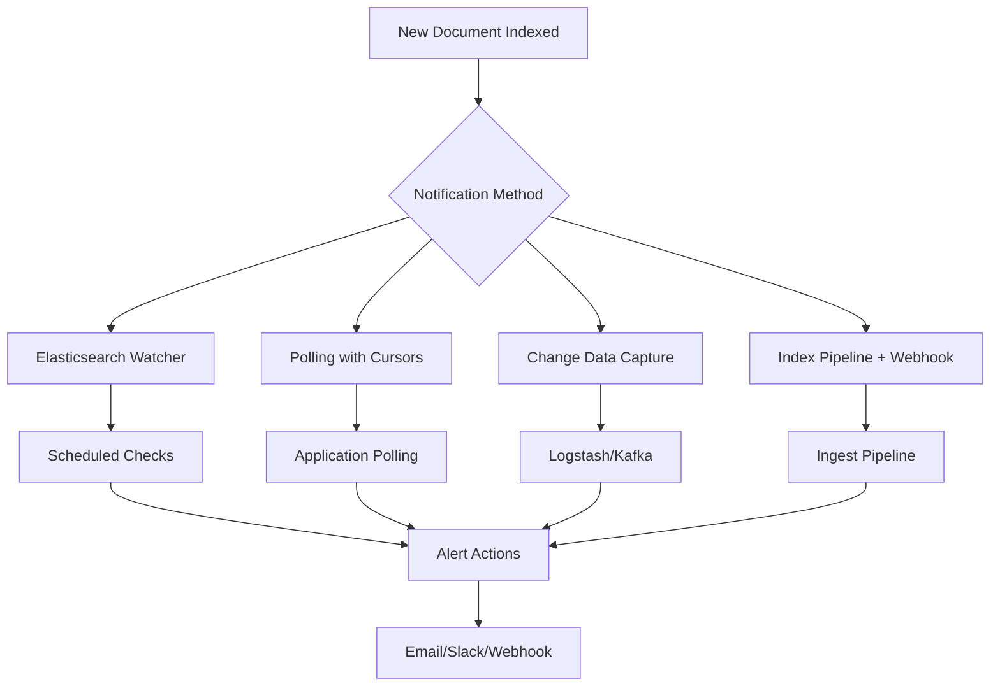

# How to Get Notified of New Indexed Documents

Author: [nawazdhandala](https://www.github.com/nawazdhandala)

Tags: Elasticsearch, Watcher, Alerts, Notifications, Real-time, Change Detection

Description: Learn how to implement notifications for newly indexed documents in Elasticsearch using Watcher, change data capture patterns, and webhook integrations.

---

Getting notified when new documents are indexed in Elasticsearch is useful for alerting systems, real-time dashboards, and event-driven architectures. This guide covers multiple approaches from built-in Watcher to custom polling solutions.

## Notification Architecture Options



## Method 1: Elasticsearch Watcher (Alerting)

Watcher is Elasticsearch's built-in alerting mechanism available in the Elastic subscription.

### Create a Watcher for New Documents

```bash
curl -X PUT "https://localhost:9200/_watcher/watch/new_document_alert" \
  -H "Content-Type: application/json" \
  -u elastic:password \
  -d '{
    "trigger": {
      "schedule": {
        "interval": "1m"
      }
    },
    "input": {
      "search": {
        "request": {
          "indices": ["orders"],
          "body": {
            "size": 0,
            "query": {
              "range": {
                "@timestamp": {
                  "gte": "now-1m"
                }
              }
            },
            "aggs": {
              "new_docs": {
                "value_count": {
                  "field": "_id"
                }
              }
            }
          }
        }
      }
    },
    "condition": {
      "compare": {
        "ctx.payload.aggregations.new_docs.value": {
          "gt": 0
        }
      }
    },
    "actions": {
      "log_action": {
        "logging": {
          "text": "{{ctx.payload.aggregations.new_docs.value}} new documents indexed in the last minute"
        }
      },
      "webhook_action": {
        "webhook": {
          "method": "POST",
          "host": "your-webhook-server.com",
          "port": 443,
          "scheme": "https",
          "path": "/webhook/elasticsearch",
          "body": "{\"count\": {{ctx.payload.aggregations.new_docs.value}}, \"timestamp\": \"{{ctx.execution_time}}\"}"
        }
      }
    }
  }'
```

### Watcher with Slack Notification

```bash
curl -X PUT "https://localhost:9200/_watcher/watch/new_order_slack_alert" \
  -H "Content-Type: application/json" \
  -u elastic:password \
  -d '{
    "trigger": {
      "schedule": {
        "interval": "5m"
      }
    },
    "input": {
      "search": {
        "request": {
          "indices": ["orders"],
          "body": {
            "query": {
              "bool": {
                "filter": [
                  { "range": { "@timestamp": { "gte": "now-5m" } } },
                  { "term": { "status": "new" } }
                ]
              }
            },
            "size": 5,
            "_source": ["order_id", "customer_name", "amount"]
          }
        }
      }
    },
    "condition": {
      "compare": {
        "ctx.payload.hits.total.value": {
          "gt": 0
        }
      }
    },
    "actions": {
      "slack_notification": {
        "slack": {
          "account": "monitoring",
          "message": {
            "to": ["#orders-alerts"],
            "text": "New Orders Alert: {{ctx.payload.hits.total.value}} new orders in the last 5 minutes",
            "attachments": [
              {
                "color": "good",
                "title": "Recent Orders",
                "text": "{{#ctx.payload.hits.hits}}Order: {{_source.order_id}} - ${{_source.amount}}\n{{/ctx.payload.hits.hits}}"
              }
            ]
          }
        }
      }
    }
  }'
```

### Monitor Watcher Status

```bash
# Get watcher stats
curl -X GET "https://localhost:9200/_watcher/stats" \
  -u elastic:password

# Get specific watch
curl -X GET "https://localhost:9200/_watcher/watch/new_document_alert" \
  -u elastic:password

# Execute watch manually
curl -X POST "https://localhost:9200/_watcher/watch/new_document_alert/_execute" \
  -u elastic:password
```

## Method 2: Polling with Timestamp Cursors

For environments without Watcher, implement polling in your application.

### Python Polling Implementation

```python
from elasticsearch import Elasticsearch
from datetime import datetime, timedelta
import time
import json
import requests

es = Elasticsearch(
    ["https://localhost:9200"],
    basic_auth=("elastic", "password"),
    verify_certs=False
)

class DocumentNotifier:
    """Poll Elasticsearch for new documents and send notifications."""

    def __init__(self, index: str, timestamp_field: str = "@timestamp"):
        self.index = index
        self.timestamp_field = timestamp_field
        self.last_check = datetime.utcnow()
        self.webhook_url = None
        self.callbacks = []

    def set_webhook(self, url: str):
        """Set webhook URL for notifications."""
        self.webhook_url = url

    def add_callback(self, callback):
        """Add a callback function for new documents."""
        self.callbacks.append(callback)

    def check_new_documents(self):
        """Check for documents indexed since last check."""
        query = {
            "bool": {
                "filter": [
                    {
                        "range": {
                            self.timestamp_field: {
                                "gt": self.last_check.isoformat() + "Z"
                            }
                        }
                    }
                ]
            }
        }

        response = es.search(
            index=self.index,
            body={
                "query": query,
                "sort": [{self.timestamp_field: "asc"}],
                "size": 100
            }
        )

        new_docs = response["hits"]["hits"]

        if new_docs:
            # Update cursor to latest document timestamp
            latest_timestamp = new_docs[-1]["_source"][self.timestamp_field]
            self.last_check = datetime.fromisoformat(
                latest_timestamp.replace("Z", "+00:00")
            ).replace(tzinfo=None)

            self._notify(new_docs)

        return new_docs

    def _notify(self, documents):
        """Send notifications for new documents."""
        notification = {
            "count": len(documents),
            "timestamp": datetime.utcnow().isoformat(),
            "documents": [doc["_source"] for doc in documents]
        }

        # Call registered callbacks
        for callback in self.callbacks:
            try:
                callback(notification)
            except Exception as e:
                print(f"Callback error: {e}")

        # Send webhook
        if self.webhook_url:
            try:
                requests.post(
                    self.webhook_url,
                    json=notification,
                    headers={"Content-Type": "application/json"},
                    timeout=10
                )
            except Exception as e:
                print(f"Webhook error: {e}")

    def run(self, interval_seconds: int = 10):
        """Run the polling loop."""
        print(f"Starting document notifier for {self.index}")
        print(f"Polling every {interval_seconds} seconds")

        while True:
            try:
                new_docs = self.check_new_documents()
                if new_docs:
                    print(f"Found {len(new_docs)} new documents")
            except Exception as e:
                print(f"Error checking documents: {e}")

            time.sleep(interval_seconds)


def print_notification(notification):
    """Example callback that prints notifications."""
    print(f"\n=== New Documents Alert ===")
    print(f"Count: {notification['count']}")
    print(f"Time: {notification['timestamp']}")
    for doc in notification['documents'][:3]:
        print(f"  - {doc}")


# Usage
notifier = DocumentNotifier("orders", "@timestamp")
notifier.add_callback(print_notification)
notifier.set_webhook("https://your-server.com/webhook")
notifier.run(interval_seconds=10)
```

## Method 3: Ingest Pipeline with Webhook

Trigger a webhook during document indexing using an ingest pipeline.

### Create Ingest Pipeline

```bash
# Note: This requires the enrich processor plugin or custom script
curl -X PUT "https://localhost:9200/_ingest/pipeline/notify_on_index" \
  -H "Content-Type: application/json" \
  -u elastic:password \
  -d '{
    "description": "Notify on new document",
    "processors": [
      {
        "set": {
          "field": "_indexed_at",
          "value": "{{_ingest.timestamp}}"
        }
      },
      {
        "script": {
          "source": """
            // Add notification metadata
            ctx._notify = true;
            ctx._notification_id = ctx._id;
          """
        }
      }
    ]
  }'

# Apply to index
curl -X PUT "https://localhost:9200/orders/_settings" \
  -H "Content-Type: application/json" \
  -u elastic:password \
  -d '{
    "index.default_pipeline": "notify_on_index"
  }'
```

## Method 4: Using Point-in-Time for Reliable Polling

```python
from elasticsearch import Elasticsearch
import time

es = Elasticsearch(
    ["https://localhost:9200"],
    basic_auth=("elastic", "password"),
    verify_certs=False
)

class ReliableDocumentPoller:
    """Poll for new documents using sequence numbers for reliability."""

    def __init__(self, index: str):
        self.index = index
        self.last_seq_no = self._get_current_seq_no()

    def _get_current_seq_no(self):
        """Get the current max sequence number."""
        response = es.search(
            index=self.index,
            body={
                "size": 1,
                "sort": [{"_seq_no": "desc"}],
                "_source": False
            }
        )

        if response["hits"]["hits"]:
            return response["hits"]["hits"][0]["_seq_no"]
        return 0

    def poll(self):
        """Poll for documents with sequence number greater than last seen."""
        response = es.search(
            index=self.index,
            body={
                "query": {
                    "range": {
                        "_seq_no": {
                            "gt": self.last_seq_no
                        }
                    }
                },
                "sort": [{"_seq_no": "asc"}],
                "size": 100,
                "seq_no_primary_term": True
            }
        )

        new_docs = response["hits"]["hits"]

        if new_docs:
            self.last_seq_no = new_docs[-1]["_seq_no"]

        return new_docs


poller = ReliableDocumentPoller("orders")

while True:
    new_docs = poller.poll()
    if new_docs:
        print(f"New documents: {len(new_docs)}")
        for doc in new_docs:
            print(f"  Seq: {doc['_seq_no']}, ID: {doc['_id']}")
    time.sleep(5)
```

## Method 5: Kibana Alerting Rules

For Kibana users, create alerts through the UI:

```bash
# Create alert rule via API
curl -X POST "https://localhost:5601/api/alerting/rule" \
  -H "Content-Type: application/json" \
  -H "kbn-xsrf: true" \
  -u elastic:password \
  -d '{
    "name": "New High-Value Orders",
    "rule_type_id": ".es-query",
    "consumer": "alerts",
    "schedule": {
      "interval": "1m"
    },
    "params": {
      "index": ["orders"],
      "timeField": "@timestamp",
      "esQuery": "{\"query\":{\"bool\":{\"filter\":[{\"range\":{\"@timestamp\":{\"gte\":\"now-1m\"}}},{\"range\":{\"amount\":{\"gte\":1000}}}]}}}",
      "threshold": [0],
      "thresholdComparator": ">",
      "size": 10
    },
    "actions": [
      {
        "group": "query matched",
        "id": "my-slack-connector",
        "params": {
          "message": "{{context.hits}} high-value orders in the last minute"
        }
      }
    ]
  }'
```

## Filtering Specific Documents

### Watch for Specific Criteria

```bash
curl -X PUT "https://localhost:9200/_watcher/watch/high_value_order_alert" \
  -H "Content-Type: application/json" \
  -u elastic:password \
  -d '{
    "trigger": {
      "schedule": { "interval": "1m" }
    },
    "input": {
      "search": {
        "request": {
          "indices": ["orders"],
          "body": {
            "query": {
              "bool": {
                "filter": [
                  { "range": { "@timestamp": { "gte": "now-1m" } } },
                  { "range": { "amount": { "gte": 10000 } } }
                ]
              }
            }
          }
        }
      }
    },
    "condition": {
      "compare": {
        "ctx.payload.hits.total.value": { "gt": 0 }
      }
    },
    "actions": {
      "email_admin": {
        "email": {
          "to": ["admin@company.com"],
          "subject": "High-Value Order Alert",
          "body": {
            "text": "{{ctx.payload.hits.total.value}} orders over $10,000 received"
          }
        }
      }
    }
  }'
```

## Comparison of Methods

| Method | Latency | Complexity | Requirements |
|--------|---------|------------|--------------|
| Watcher | 1m+ | Low | X-Pack/Elastic subscription |
| Polling | Configurable | Medium | Application code |
| Ingest Pipeline | Near real-time | High | Custom development |
| Kibana Alerts | 1m+ | Low | Kibana + X-Pack |

## Best Practices

1. **Use appropriate polling intervals** - Balance between latency and load
2. **Implement idempotent handlers** - Handle duplicate notifications gracefully
3. **Store cursor state persistently** - Survive application restarts
4. **Add error handling and retries** - Network failures happen
5. **Monitor notification system** - Alert on alert failures

## Conclusion

Elasticsearch provides several ways to get notified of new documents:

1. **Watcher** - Built-in, scheduled alerting
2. **Application polling** - Flexible, custom logic
3. **Ingest pipelines** - Near real-time, during indexing
4. **Kibana alerts** - UI-based, easy setup

Choose based on your latency requirements, infrastructure, and licensing.
