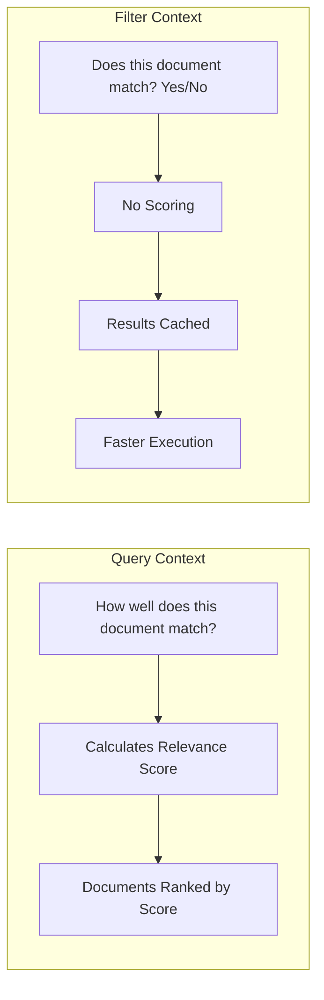
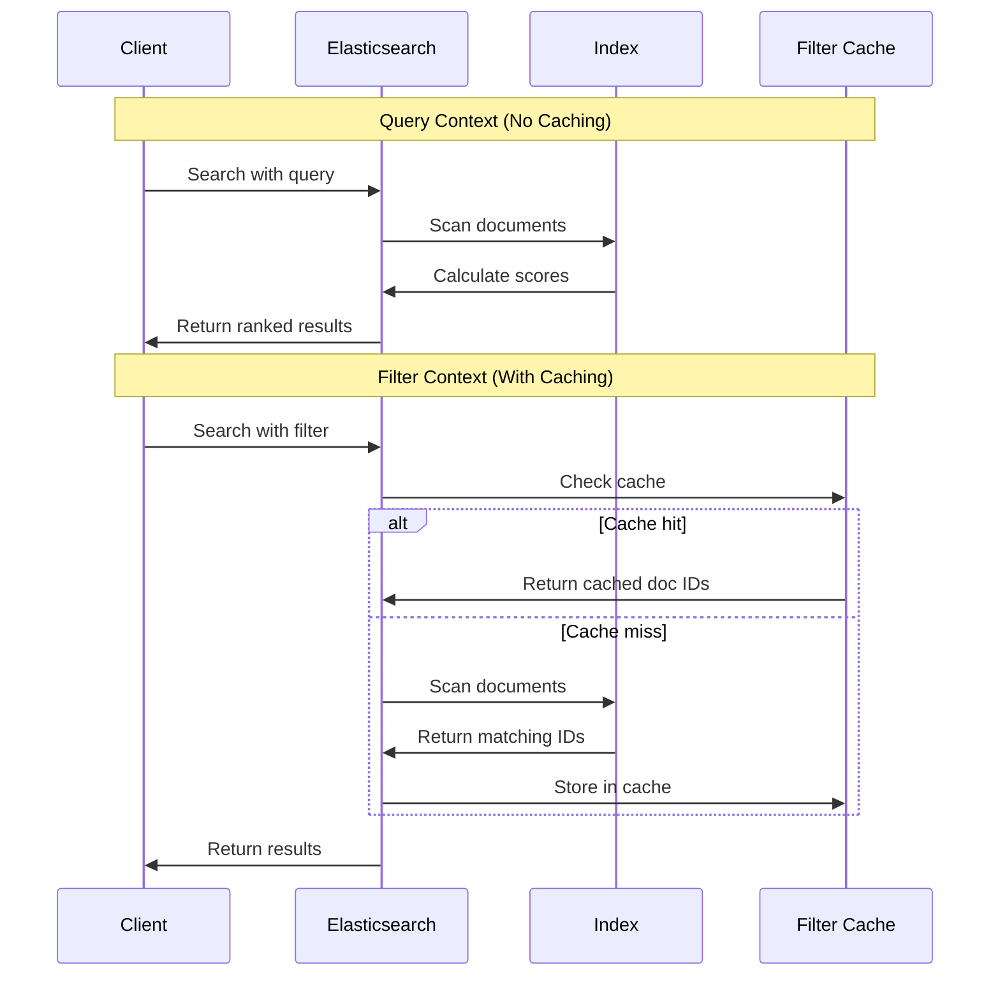

# How to Understand Queries vs Filters in Elasticsearch

Author: [nawazdhandala](https://www.github.com/nawazdhandala)

Tags: Elasticsearch, Query DSL, Filters, Search Performance, Query Optimization, Scoring

Description: Learn the fundamental difference between queries and filters in Elasticsearch to write faster, more efficient searches by using the right approach for each use case.

---

Elasticsearch newcomers often struggle to understand why some search clauses go in `query` context and others in `filter` context. This distinction is not just semantic - it has significant implications for performance and result relevance. This guide explains when to use each approach.

## The Core Difference



| Aspect | Query Context | Filter Context |
|--------|---------------|----------------|
| Question | How well does it match? | Does it match? |
| Scoring | Yes, calculates _score | No, binary yes/no |
| Caching | Not cached | Results cached |
| Performance | Slower | Faster |
| Use case | Full-text search | Exact matches, ranges |

## Query Context Examples

Use query context when relevance matters - when you want to rank results by how well they match:

```bash
curl -X GET "localhost:9200/articles/_search" -H 'Content-Type: application/json' -d'
{
  "query": {
    "match": {
      "content": "elasticsearch performance tuning"
    }
  }
}'
```

The response includes relevance scores:

```json
{
  "hits": {
    "hits": [
      {
        "_score": 12.5,
        "_source": { "title": "Elasticsearch Performance Guide" }
      },
      {
        "_score": 8.3,
        "_source": { "title": "Database Tuning Tips" }
      }
    ]
  }
}
```

## Filter Context Examples

Use filter context for binary yes/no decisions where ranking does not matter:

```bash
curl -X GET "localhost:9200/products/_search" -H 'Content-Type: application/json' -d'
{
  "query": {
    "bool": {
      "filter": [
        { "term": { "status": "active" }},
        { "range": { "price": { "gte": 100, "lte": 500 }}},
        { "term": { "category": "electronics" }}
      ]
    }
  }
}'
```

All matching documents have a score of 0 (or constant if combined with query clauses). The filter results are cached for faster subsequent queries.

## Combining Query and Filter Context

The most effective searches combine both contexts:

```bash
curl -X GET "localhost:9200/products/_search" -H 'Content-Type: application/json' -d'
{
  "query": {
    "bool": {
      "must": [
        { "match": { "description": "wireless bluetooth headphones" }}
      ],
      "filter": [
        { "term": { "in_stock": true }},
        { "range": { "price": { "lte": 200 }}},
        { "term": { "brand": "Sony" }}
      ]
    }
  }
}'
```

This query:
1. Filters to only Sony products under $200 that are in stock (fast, cached)
2. Ranks remaining products by how well they match "wireless bluetooth headphones"

## Performance Comparison



### Benchmark Example

```python
from elasticsearch import Elasticsearch
import time

es = Elasticsearch(['http://localhost:9200'])

def benchmark_query_vs_filter(index_name, iterations=100):
    """Compare query context vs filter context performance."""

    # Query context - scoring required
    query_times = []
    for _ in range(iterations):
        start = time.time()
        es.search(
            index=index_name,
            body={
                "query": {
                    "bool": {
                        "must": [
                            {"term": {"status": "active"}},
                            {"range": {"price": {"gte": 100, "lte": 500}}}
                        ]
                    }
                }
            }
        )
        query_times.append(time.time() - start)

    # Filter context - no scoring
    filter_times = []
    for _ in range(iterations):
        start = time.time()
        es.search(
            index=index_name,
            body={
                "query": {
                    "bool": {
                        "filter": [
                            {"term": {"status": "active"}},
                            {"range": {"price": {"gte": 100, "lte": 500}}}
                        ]
                    }
                }
            }
        )
        filter_times.append(time.time() - start)

    print(f"Query context avg: {sum(query_times)/len(query_times)*1000:.2f}ms")
    print(f"Filter context avg: {sum(filter_times)/len(filter_times)*1000:.2f}ms")

benchmark_query_vs_filter("products")
```

Typical results show filters being 2-10x faster, especially for repeated queries.

## Decision Guide

### Use Query Context For:

```bash
# Full-text search
{ "match": { "content": "search terms" }}

# Phrase matching
{ "match_phrase": { "title": "exact phrase" }}

# Fuzzy matching
{ "fuzzy": { "name": { "value": "searchh", "fuzziness": "AUTO" }}}

# Multi-field search
{ "multi_match": { "query": "search", "fields": ["title", "content"] }}

# Boosted relevance
{ "match": { "title": { "query": "important", "boost": 2 }}}
```

### Use Filter Context For:

```bash
# Exact value matching
{ "term": { "status": "published" }}

# Multiple exact values
{ "terms": { "category": ["A", "B", "C"] }}

# Numeric ranges
{ "range": { "price": { "gte": 100, "lte": 500 }}}

# Date ranges
{ "range": { "created_at": { "gte": "now-7d" }}}

# Existence checks
{ "exists": { "field": "email" }}

# Geo queries
{ "geo_distance": { "distance": "10km", "location": {...} }}

# Boolean fields
{ "term": { "is_active": true }}
```

## Common Patterns

### Pattern 1: Search with Constraints

```bash
curl -X GET "localhost:9200/jobs/_search" -H 'Content-Type: application/json' -d'
{
  "query": {
    "bool": {
      "must": [
        { "match": { "title": "software engineer" }}
      ],
      "filter": [
        { "term": { "remote": true }},
        { "range": { "salary_min": { "gte": 100000 }}},
        { "terms": { "location": ["San Francisco", "New York", "Austin"] }}
      ]
    }
  }
}'
```

### Pattern 2: Pure Filtering (No Ranking)

When you just need matching documents without relevance ranking:

```bash
curl -X GET "localhost:9200/logs/_search" -H 'Content-Type: application/json' -d'
{
  "query": {
    "bool": {
      "filter": [
        { "term": { "level": "error" }},
        { "range": { "timestamp": { "gte": "now-1h" }}},
        { "term": { "service": "api-gateway" }}
      ]
    }
  },
  "sort": [
    { "timestamp": { "order": "desc" }}
  ]
}'
```

### Pattern 3: Aggregations with Filters

Filters are essential for efficient aggregations:

```bash
curl -X GET "localhost:9200/sales/_search" -H 'Content-Type: application/json' -d'
{
  "size": 0,
  "query": {
    "bool": {
      "filter": [
        { "range": { "date": { "gte": "2024-01-01", "lte": "2024-12-31" }}},
        { "term": { "region": "North America" }}
      ]
    }
  },
  "aggs": {
    "monthly_sales": {
      "date_histogram": {
        "field": "date",
        "calendar_interval": "month"
      },
      "aggs": {
        "total_revenue": {
          "sum": { "field": "amount" }
        }
      }
    }
  }
}'
```

### Pattern 4: Post Filter for Faceted Search

Use `post_filter` to filter results without affecting aggregations:

```bash
curl -X GET "localhost:9200/products/_search" -H 'Content-Type: application/json' -d'
{
  "query": {
    "match": { "name": "laptop" }
  },
  "aggs": {
    "brands": {
      "terms": { "field": "brand" }
    },
    "price_ranges": {
      "range": {
        "field": "price",
        "ranges": [
          { "to": 500 },
          { "from": 500, "to": 1000 },
          { "from": 1000 }
        ]
      }
    }
  },
  "post_filter": {
    "term": { "brand": "Dell" }
  }
}'
```

The aggregations show counts for ALL laptops, while results show only Dell laptops.

## Filter Caching Behavior

Elasticsearch automatically caches filter results in the filter cache:

```bash
# Check filter cache stats
curl -X GET "localhost:9200/_nodes/stats/indices/query_cache?pretty"
```

Response shows cache utilization:

```json
{
  "nodes": {
    "node-1": {
      "indices": {
        "query_cache": {
          "memory_size_in_bytes": 52428800,
          "total_count": 15000,
          "hit_count": 12000,
          "miss_count": 3000,
          "cache_size": 500,
          "evictions": 50
        }
      }
    }
  }
}
```

## Optimizing Query Structure

### Before Optimization

```bash
{
  "query": {
    "bool": {
      "must": [
        { "match": { "content": "elasticsearch" }},
        { "term": { "status": "published" }},
        { "range": { "date": { "gte": "2024-01-01" }}},
        { "term": { "category": "technology" }}
      ]
    }
  }
}
```

### After Optimization

```bash
{
  "query": {
    "bool": {
      "must": [
        { "match": { "content": "elasticsearch" }}
      ],
      "filter": [
        { "term": { "status": "published" }},
        { "range": { "date": { "gte": "2024-01-01" }}},
        { "term": { "category": "technology" }}
      ]
    }
  }
}
```

The optimized query only calculates relevance scores for the full-text search, while the exact matches use cached filters.

## Summary

Understanding queries vs filters is fundamental to Elasticsearch performance:

1. **Query context** answers "how well" - use for full-text search requiring relevance ranking
2. **Filter context** answers "yes/no" - use for exact matches, ranges, and structured data
3. **Filters are cached** - repeated filter queries are significantly faster
4. **Combine both** - use filters to narrow the dataset, queries to rank within it
5. **Move exact matches to filter** - only text relevance needs query context
6. **Use post_filter** for faceted search to preserve aggregation counts

By consistently applying these principles, you will see significant performance improvements in your Elasticsearch queries while maintaining the search relevance your users expect.
