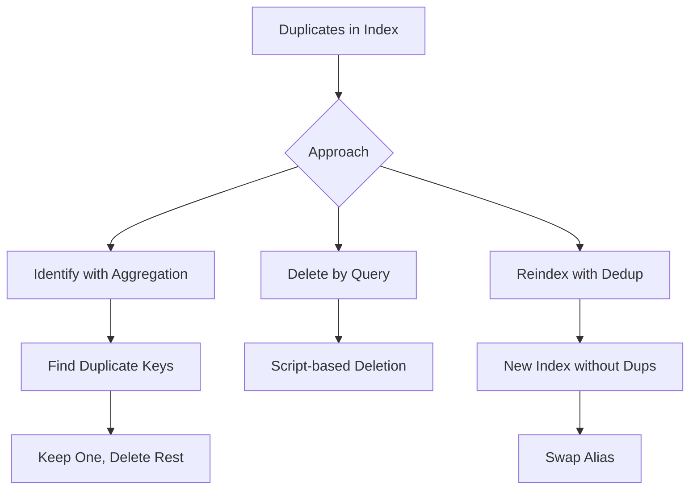

# How to Remove Duplicate Documents in Elasticsearch

Author: [nawazdhandala](https://www.github.com/nawazdhandala)

Tags: Elasticsearch, Deduplication, Data Quality, Aggregations, Data Cleaning

Description: Learn how to identify and remove duplicate documents in Elasticsearch using aggregations, scripts, and prevention strategies for maintaining clean data.

---

Duplicate documents in Elasticsearch can skew analytics, waste storage, and degrade search quality. This guide covers multiple strategies to identify, remove, and prevent duplicates.

## Why Duplicates Occur

- Application bugs causing double-writes
- Retry logic without idempotency
- Multiple data sources with overlapping data
- Failed deduplication during ETL
- Reprocessing historical data

## Deduplication Strategy Overview



## Step 1: Identify Duplicates

### Find Duplicate Field Values

```bash
curl -X GET "https://localhost:9200/orders/_search" \
  -H "Content-Type: application/json" \
  -u elastic:password \
  -d '{
    "size": 0,
    "aggs": {
      "duplicate_orders": {
        "terms": {
          "field": "order_id.keyword",
          "min_doc_count": 2,
          "size": 100
        },
        "aggs": {
          "duplicate_count": {
            "value_count": {
              "field": "_id"
            }
          },
          "duplicate_docs": {
            "top_hits": {
              "size": 10,
              "_source": ["order_id", "created_at"],
              "sort": [{"created_at": "desc"}]
            }
          }
        }
      }
    }
  }'
```

Response shows duplicated order_ids:

```json
{
  "aggregations": {
    "duplicate_orders": {
      "buckets": [
        {
          "key": "ORD-12345",
          "doc_count": 3,
          "duplicate_docs": {
            "hits": {
              "hits": [
                {"_id": "abc123", "_source": {"order_id": "ORD-12345", "created_at": "2024-03-15T12:00:00Z"}},
                {"_id": "def456", "_source": {"order_id": "ORD-12345", "created_at": "2024-03-15T11:59:00Z"}},
                {"_id": "ghi789", "_source": {"order_id": "ORD-12345", "created_at": "2024-03-15T11:58:00Z"}}
              ]
            }
          }
        }
      ]
    }
  }
}
```

### Count Total Duplicates

```bash
curl -X GET "https://localhost:9200/orders/_search" \
  -H "Content-Type: application/json" \
  -u elastic:password \
  -d '{
    "size": 0,
    "aggs": {
      "total_duplicates": {
        "cardinality": {
          "field": "order_id.keyword"
        }
      },
      "duplicate_groups": {
        "terms": {
          "field": "order_id.keyword",
          "min_doc_count": 2,
          "size": 10000
        }
      }
    }
  }'
```

## Step 2: Remove Duplicates

### Method 1: Delete by Query (Keep Latest)

```python
from elasticsearch import Elasticsearch
from elasticsearch.helpers import scan

es = Elasticsearch(
    ["https://localhost:9200"],
    basic_auth=("elastic", "password"),
    verify_certs=False
)

def remove_duplicates_keep_latest(index: str, unique_field: str, timestamp_field: str):
    """Remove duplicates, keeping the most recent document."""

    # Find all duplicate groups
    duplicates_query = {
        "size": 0,
        "aggs": {
            "duplicates": {
                "terms": {
                    "field": f"{unique_field}.keyword",
                    "min_doc_count": 2,
                    "size": 10000
                },
                "aggs": {
                    "docs": {
                        "top_hits": {
                            "size": 100,
                            "sort": [{timestamp_field: "desc"}],
                            "_source": False
                        }
                    }
                }
            }
        }
    }

    response = es.search(index=index, body=duplicates_query)
    buckets = response["aggregations"]["duplicates"]["buckets"]

    ids_to_delete = []

    for bucket in buckets:
        # Get all document IDs for this duplicate group
        hits = bucket["docs"]["hits"]["hits"]

        # Keep the first (most recent), delete the rest
        for hit in hits[1:]:
            ids_to_delete.append(hit["_id"])

    print(f"Found {len(ids_to_delete)} duplicate documents to delete")

    # Delete in batches
    if ids_to_delete:
        batch_size = 1000
        for i in range(0, len(ids_to_delete), batch_size):
            batch = ids_to_delete[i:i + batch_size]
            es.delete_by_query(
                index=index,
                body={
                    "query": {
                        "ids": {
                            "values": batch
                        }
                    }
                }
            )
            print(f"Deleted batch {i // batch_size + 1}")

    return len(ids_to_delete)


deleted = remove_duplicates_keep_latest("orders", "order_id", "created_at")
print(f"Removed {deleted} duplicates")
```

### Method 2: Reindex with Deduplication

Create a new clean index:

```python
from elasticsearch import Elasticsearch
from elasticsearch.helpers import scan, bulk

es = Elasticsearch(
    ["https://localhost:9200"],
    basic_auth=("elastic", "password"),
    verify_certs=False
)

def reindex_without_duplicates(
    source_index: str,
    target_index: str,
    unique_field: str,
    timestamp_field: str
):
    """Reindex keeping only the latest version of each unique document."""

    # Create target index with same mapping
    if es.indices.exists(index=source_index):
        mapping = es.indices.get_mapping(index=source_index)
        settings = es.indices.get_settings(index=source_index)

        if not es.indices.exists(index=target_index):
            es.indices.create(
                index=target_index,
                body={
                    "mappings": mapping[source_index]["mappings"],
                    "settings": {
                        "number_of_shards": 1,
                        "number_of_replicas": 0
                    }
                }
            )

    # Track seen unique values
    seen = {}

    def generate_unique_docs():
        for doc in scan(
            es,
            index=source_index,
            query={"sort": [{timestamp_field: "desc"}]}
        ):
            unique_value = doc["_source"].get(unique_field)

            if unique_value and unique_value not in seen:
                seen[unique_value] = True
                yield {
                    "_index": target_index,
                    "_id": doc["_id"],
                    "_source": doc["_source"]
                }

    success, errors = bulk(es, generate_unique_docs(), chunk_size=1000)
    print(f"Reindexed {success} unique documents, {len(errors)} errors")

    return success


reindex_without_duplicates("orders", "orders_clean", "order_id", "created_at")
```

### Method 3: Using Elasticsearch Transforms

```bash
# Create transform to deduplicate
curl -X PUT "https://localhost:9200/_transform/deduplicate_orders" \
  -H "Content-Type: application/json" \
  -u elastic:password \
  -d '{
    "source": {
      "index": ["orders"]
    },
    "dest": {
      "index": "orders_deduplicated"
    },
    "pivot": {
      "group_by": {
        "order_id": {
          "terms": {
            "field": "order_id.keyword"
          }
        }
      },
      "aggregations": {
        "latest_timestamp": {
          "max": { "field": "created_at" }
        },
        "customer_id": {
          "scripted_metric": {
            "init_script": "state.docs = []",
            "map_script": "state.docs.add(new HashMap(params._source))",
            "combine_script": "return state.docs",
            "reduce_script": "def all = []; for (s in states) { all.addAll(s) } all.sort((a,b) -> b.created_at.compareTo(a.created_at)); return all.size() > 0 ? all[0].customer_id : null"
          }
        },
        "amount": {
          "scripted_metric": {
            "init_script": "state.docs = []",
            "map_script": "state.docs.add(new HashMap(params._source))",
            "combine_script": "return state.docs",
            "reduce_script": "def all = []; for (s in states) { all.addAll(s) } all.sort((a,b) -> b.created_at.compareTo(a.created_at)); return all.size() > 0 ? all[0].amount : 0"
          }
        }
      }
    }
  }'

# Start transform
curl -X POST "https://localhost:9200/_transform/deduplicate_orders/_start" \
  -u elastic:password
```

## Prevention: Use Deterministic Document IDs

The best approach is preventing duplicates:

```python
import hashlib

def generate_document_id(doc, unique_fields):
    """Generate deterministic ID from document fields."""
    values = [str(doc.get(field, "")) for field in unique_fields]
    unique_string = "|".join(values)
    return hashlib.sha256(unique_string.encode()).hexdigest()


def index_with_dedup(doc, index_name, unique_fields):
    """Index document with deterministic ID for automatic deduplication."""
    doc_id = generate_document_id(doc, unique_fields)

    es.index(
        index=index_name,
        id=doc_id,  # Same content = same ID = automatic update
        document=doc
    )


# Usage
order = {
    "order_id": "ORD-12345",
    "customer_id": "CUST-001",
    "amount": 99.99
}

# Even if called multiple times, only one document exists
index_with_dedup(order, "orders", ["order_id"])
index_with_dedup(order, "orders", ["order_id"])  # Updates, not duplicates
```

## Complete Deduplication Script

```python
from elasticsearch import Elasticsearch
from elasticsearch.helpers import scan, bulk
from collections import defaultdict
import hashlib
from datetime import datetime

es = Elasticsearch(
    ["https://localhost:9200"],
    basic_auth=("elastic", "password"),
    verify_certs=False
)

class ElasticsearchDeduplicator:
    """Complete deduplication toolkit for Elasticsearch."""

    def __init__(self, es_client, index_name):
        self.es = es_client
        self.index = index_name

    def analyze_duplicates(self, unique_field):
        """Analyze duplicate distribution in the index."""
        query = {
            "size": 0,
            "aggs": {
                "total_docs": {"value_count": {"field": "_id"}},
                "unique_values": {"cardinality": {"field": f"{unique_field}.keyword"}},
                "duplicate_groups": {
                    "terms": {
                        "field": f"{unique_field}.keyword",
                        "min_doc_count": 2,
                        "size": 10
                    }
                }
            }
        }

        response = self.es.search(index=self.index, body=query)
        aggs = response["aggregations"]

        total = aggs["total_docs"]["value"]
        unique = aggs["unique_values"]["value"]
        duplicates = total - unique

        print(f"Total documents: {total:,}")
        print(f"Unique values: {unique:,}")
        print(f"Duplicate documents: {duplicates:,}")
        print(f"Duplicate ratio: {duplicates/total*100:.2f}%")

        if aggs["duplicate_groups"]["buckets"]:
            print("\nTop duplicate groups:")
            for bucket in aggs["duplicate_groups"]["buckets"][:5]:
                print(f"  {bucket['key']}: {bucket['doc_count']} copies")

        return {
            "total": total,
            "unique": unique,
            "duplicates": duplicates,
            "ratio": duplicates / total if total > 0 else 0
        }

    def find_all_duplicate_ids(self, unique_field, timestamp_field, keep="latest"):
        """Find all document IDs that should be deleted."""
        ids_to_delete = []

        # Use composite aggregation for large datasets
        after_key = None

        while True:
            query = {
                "size": 0,
                "aggs": {
                    "groups": {
                        "composite": {
                            "size": 1000,
                            "sources": [
                                {"key": {"terms": {"field": f"{unique_field}.keyword"}}}
                            ]
                        },
                        "aggs": {
                            "docs": {
                                "top_hits": {
                                    "size": 100,
                                    "sort": [{timestamp_field: "desc" if keep == "latest" else "asc"}],
                                    "_source": False
                                }
                            },
                            "count": {
                                "value_count": {"field": "_id"}
                            },
                            "has_dups": {
                                "bucket_selector": {
                                    "buckets_path": {"count": "count"},
                                    "script": "params.count > 1"
                                }
                            }
                        }
                    }
                }
            }

            if after_key:
                query["aggs"]["groups"]["composite"]["after"] = after_key

            response = self.es.search(index=self.index, body=query)
            buckets = response["aggregations"]["groups"]["buckets"]

            if not buckets:
                break

            for bucket in buckets:
                hits = bucket["docs"]["hits"]["hits"]
                # Keep first, delete rest
                for hit in hits[1:]:
                    ids_to_delete.append(hit["_id"])

            after_key = response["aggregations"]["groups"].get("after_key")
            if not after_key:
                break

        return ids_to_delete

    def delete_duplicates(self, unique_field, timestamp_field, keep="latest", dry_run=True):
        """Delete duplicate documents."""
        ids_to_delete = self.find_all_duplicate_ids(unique_field, timestamp_field, keep)

        print(f"Found {len(ids_to_delete)} documents to delete")

        if dry_run:
            print("Dry run - no documents deleted")
            return 0

        deleted = 0
        batch_size = 1000

        for i in range(0, len(ids_to_delete), batch_size):
            batch = ids_to_delete[i:i + batch_size]

            response = self.es.delete_by_query(
                index=self.index,
                body={"query": {"ids": {"values": batch}}},
                refresh=False
            )

            deleted += response.get("deleted", 0)
            print(f"Progress: {deleted}/{len(ids_to_delete)}")

        self.es.indices.refresh(index=self.index)
        return deleted

    def reindex_deduplicated(self, target_index, unique_field, timestamp_field):
        """Create new index with deduplicated data."""
        # Get source mapping
        mapping = self.es.indices.get_mapping(index=self.index)[self.index]["mappings"]

        # Create target index
        if not self.es.indices.exists(index=target_index):
            self.es.indices.create(
                index=target_index,
                body={
                    "mappings": mapping,
                    "settings": {"number_of_replicas": 0, "refresh_interval": "-1"}
                }
            )

        # Track seen keys
        seen_keys = set()

        def generate_unique():
            for doc in scan(
                self.es,
                index=self.index,
                query={"sort": [{timestamp_field: "desc"}]}
            ):
                key = doc["_source"].get(unique_field)
                if key not in seen_keys:
                    seen_keys.add(key)
                    yield {
                        "_index": target_index,
                        "_source": doc["_source"]
                    }

        success, errors = bulk(self.es, generate_unique(), chunk_size=1000)

        # Finalize index
        self.es.indices.put_settings(
            index=target_index,
            body={"refresh_interval": "1s", "number_of_replicas": 1}
        )
        self.es.indices.refresh(index=target_index)

        print(f"Reindexed {success} unique documents")
        return success


# Usage
deduplicator = ElasticsearchDeduplicator(es, "orders")

# Analyze
stats = deduplicator.analyze_duplicates("order_id")

# Delete duplicates (dry run first)
deduplicator.delete_duplicates("order_id", "created_at", keep="latest", dry_run=True)

# Actually delete
deduplicator.delete_duplicates("order_id", "created_at", keep="latest", dry_run=False)

# Or reindex
deduplicator.reindex_deduplicated("orders_clean", "order_id", "created_at")
```

## Monitoring for Duplicates

Set up a watcher to alert on new duplicates:

```bash
curl -X PUT "https://localhost:9200/_watcher/watch/duplicate_alert" \
  -H "Content-Type: application/json" \
  -u elastic:password \
  -d '{
    "trigger": { "schedule": { "interval": "1h" } },
    "input": {
      "search": {
        "request": {
          "indices": ["orders"],
          "body": {
            "size": 0,
            "aggs": {
              "recent_duplicates": {
                "filter": {
                  "range": { "created_at": { "gte": "now-1h" } }
                },
                "aggs": {
                  "by_order": {
                    "terms": {
                      "field": "order_id.keyword",
                      "min_doc_count": 2,
                      "size": 100
                    }
                  }
                }
              }
            }
          }
        }
      }
    },
    "condition": {
      "compare": {
        "ctx.payload.aggregations.recent_duplicates.by_order.buckets": {
          "not_eq": []
        }
      }
    },
    "actions": {
      "log": {
        "logging": {
          "text": "Found duplicates: {{ctx.payload.aggregations.recent_duplicates.by_order.buckets}}"
        }
      }
    }
  }'
```

## Best Practices

1. **Use deterministic IDs** - Prevent duplicates at index time
2. **Regular audits** - Schedule duplicate detection jobs
3. **Reindex for large cleanups** - More efficient than delete_by_query
4. **Monitor for new duplicates** - Set up alerts
5. **Fix root cause** - Address why duplicates are being created

## Conclusion

Removing duplicates from Elasticsearch involves:

1. **Identification** - Use aggregations to find duplicate groups
2. **Deletion** - Remove duplicates keeping desired version
3. **Prevention** - Use deterministic document IDs
4. **Monitoring** - Alert on new duplicate creation

Prevention is always better than cleanup - design your indexing pipeline with deduplication in mind.
