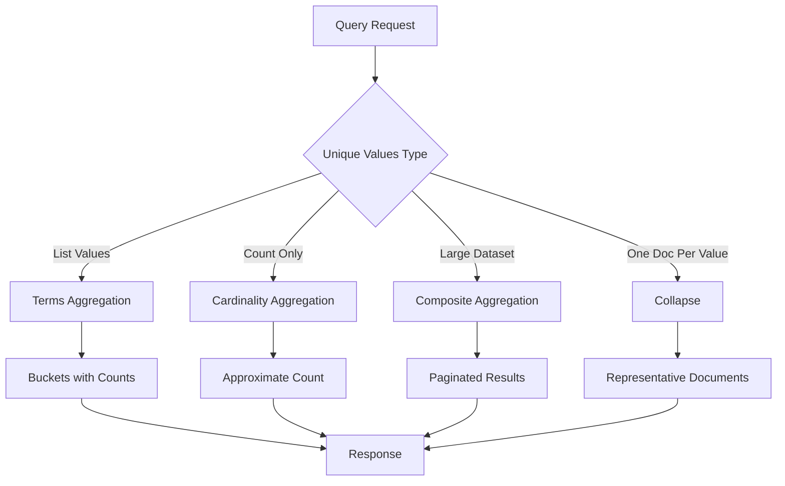

# How to Return Unique Values in Elasticsearch

Author: [nawazdhandala](https://www.github.com/nawazdhandala)

Tags: Elasticsearch, Aggregations, Cardinality, Unique Values, Search, Analytics

Description: Learn how to retrieve unique values from Elasticsearch using terms aggregations, cardinality aggregations, and composite aggregations for distinct field values across your indices.

---

Retrieving unique values from Elasticsearch is a common requirement for analytics, filtering interfaces, and data exploration. Unlike SQL's DISTINCT keyword, Elasticsearch uses aggregations to return unique field values. This guide covers multiple approaches with their trade-offs.

## Understanding the Problem

In relational databases, you would write:

```sql
SELECT DISTINCT category FROM products;
```

In Elasticsearch, you need aggregations because it is designed for full-text search and analytics rather than traditional SQL operations.

## Method 1: Terms Aggregation

The most common way to get unique values is the terms aggregation:

```bash
curl -X GET "https://localhost:9200/products/_search" \
  -H "Content-Type: application/json" \
  -u elastic:password \
  -d '{
    "size": 0,
    "aggs": {
      "unique_categories": {
        "terms": {
          "field": "category.keyword",
          "size": 100
        }
      }
    }
  }'
```

Response:

```json
{
  "aggregations": {
    "unique_categories": {
      "buckets": [
        { "key": "electronics", "doc_count": 1500 },
        { "key": "clothing", "doc_count": 1200 },
        { "key": "books", "doc_count": 800 },
        { "key": "home", "doc_count": 600 }
      ]
    }
  }
}
```

### Important Notes on Terms Aggregation

1. **Use `.keyword` suffix** for text fields to get exact values
2. **Set appropriate size** - default is 10, increase for more unique values
3. **Results are approximate** for high-cardinality fields

## Method 2: Cardinality Aggregation (Count Only)

When you only need the count of unique values, use cardinality:

```bash
curl -X GET "https://localhost:9200/products/_search" \
  -H "Content-Type: application/json" \
  -u elastic:password \
  -d '{
    "size": 0,
    "aggs": {
      "unique_category_count": {
        "cardinality": {
          "field": "category.keyword",
          "precision_threshold": 10000
        }
      }
    }
  }'
```

Response:

```json
{
  "aggregations": {
    "unique_category_count": {
      "value": 45
    }
  }
}
```

The `precision_threshold` controls accuracy versus memory usage:
- Values up to this threshold are nearly exact
- Higher values use more memory but are more accurate
- Maximum is 40000

## Method 3: Composite Aggregation for Large Datasets

For high-cardinality fields with millions of unique values, use composite aggregation with pagination:

```bash
curl -X GET "https://localhost:9200/logs/_search" \
  -H "Content-Type: application/json" \
  -u elastic:password \
  -d '{
    "size": 0,
    "aggs": {
      "unique_users": {
        "composite": {
          "size": 1000,
          "sources": [
            { "user_id": { "terms": { "field": "user_id.keyword" } } }
          ]
        }
      }
    }
  }'
```

To paginate through all values, use `after_key`:

```bash
curl -X GET "https://localhost:9200/logs/_search" \
  -H "Content-Type: application/json" \
  -u elastic:password \
  -d '{
    "size": 0,
    "aggs": {
      "unique_users": {
        "composite": {
          "size": 1000,
          "sources": [
            { "user_id": { "terms": { "field": "user_id.keyword" } } }
          ],
          "after": { "user_id": "user_1000" }
        }
      }
    }
  }'
```

## Method 4: Collapse for Unique Documents

If you need one document per unique value:

```bash
curl -X GET "https://localhost:9200/products/_search" \
  -H "Content-Type: application/json" \
  -u elastic:password \
  -d '{
    "size": 10,
    "collapse": {
      "field": "brand.keyword"
    },
    "_source": ["name", "brand", "price"],
    "sort": [{ "price": "desc" }]
  }'
```

This returns the highest-priced product for each brand.

## Multiple Unique Fields

Get unique combinations of multiple fields:

```bash
curl -X GET "https://localhost:9200/orders/_search" \
  -H "Content-Type: application/json" \
  -u elastic:password \
  -d '{
    "size": 0,
    "aggs": {
      "unique_combinations": {
        "composite": {
          "size": 1000,
          "sources": [
            { "category": { "terms": { "field": "category.keyword" } } },
            { "status": { "terms": { "field": "status.keyword" } } }
          ]
        }
      }
    }
  }'
```

## Nested Aggregations for Unique Values

Get unique values within categories:

```bash
curl -X GET "https://localhost:9200/products/_search" \
  -H "Content-Type: application/json" \
  -u elastic:password \
  -d '{
    "size": 0,
    "aggs": {
      "by_category": {
        "terms": {
          "field": "category.keyword",
          "size": 20
        },
        "aggs": {
          "unique_brands": {
            "terms": {
              "field": "brand.keyword",
              "size": 50
            }
          },
          "brand_count": {
            "cardinality": {
              "field": "brand.keyword"
            }
          }
        }
      }
    }
  }'
```

## Architecture Overview



## Python Client Example

```python
from elasticsearch import Elasticsearch

es = Elasticsearch(
    ["https://localhost:9200"],
    basic_auth=("elastic", "password"),
    verify_certs=False
)

def get_unique_values(index, field, size=100):
    """Get unique values for a field."""
    response = es.search(
        index=index,
        body={
            "size": 0,
            "aggs": {
                "unique_values": {
                    "terms": {
                        "field": f"{field}.keyword",
                        "size": size
                    }
                }
            }
        }
    )

    buckets = response["aggregations"]["unique_values"]["buckets"]
    return [bucket["key"] for bucket in buckets]

def get_all_unique_values(index, field):
    """Get all unique values using composite aggregation."""
    all_values = []
    after_key = None

    while True:
        body = {
            "size": 0,
            "aggs": {
                "unique_values": {
                    "composite": {
                        "size": 1000,
                        "sources": [
                            {"value": {"terms": {"field": f"{field}.keyword"}}}
                        ]
                    }
                }
            }
        }

        if after_key:
            body["aggs"]["unique_values"]["composite"]["after"] = after_key

        response = es.search(index=index, body=body)
        buckets = response["aggregations"]["unique_values"]["buckets"]

        if not buckets:
            break

        all_values.extend([b["key"]["value"] for b in buckets])
        after_key = response["aggregations"]["unique_values"].get("after_key")

        if not after_key:
            break

    return all_values

# Usage
categories = get_unique_values("products", "category")
print(f"Categories: {categories}")

all_users = get_all_unique_values("logs", "user_id")
print(f"Total unique users: {len(all_users)}")
```

## Filtering Before Getting Unique Values

Combine queries with aggregations:

```bash
curl -X GET "https://localhost:9200/orders/_search" \
  -H "Content-Type: application/json" \
  -u elastic:password \
  -d '{
    "size": 0,
    "query": {
      "bool": {
        "filter": [
          { "range": { "order_date": { "gte": "2024-01-01" } } },
          { "term": { "status": "completed" } }
        ]
      }
    },
    "aggs": {
      "unique_customers": {
        "terms": {
          "field": "customer_id.keyword",
          "size": 1000
        }
      }
    }
  }'
```

## Performance Considerations

| Method | Use Case | Memory | Accuracy |
|--------|----------|--------|----------|
| Terms | Up to 10K unique values | Medium | Exact up to size |
| Cardinality | Count only | Low | Approximate |
| Composite | Millions of values | Low (paginated) | Exact |
| Collapse | One doc per value | Medium | Exact |

## Best Practices

1. **Always use .keyword** for exact unique values on text fields
2. **Set reasonable size limits** to avoid memory issues
3. **Use cardinality** when you only need counts
4. **Use composite aggregation** for complete enumeration of high-cardinality fields
5. **Add filters** to reduce the dataset before aggregating
6. **Consider doc_values** - ensure they are enabled for aggregated fields

## Conclusion

Elasticsearch provides multiple ways to retrieve unique values:

1. **Terms aggregation** - Best for moderate cardinality fields
2. **Cardinality aggregation** - When you only need the count
3. **Composite aggregation** - For exhaustive enumeration of large datasets
4. **Collapse** - When you need representative documents

Choose the method based on your data cardinality and whether you need the actual values or just the count.
