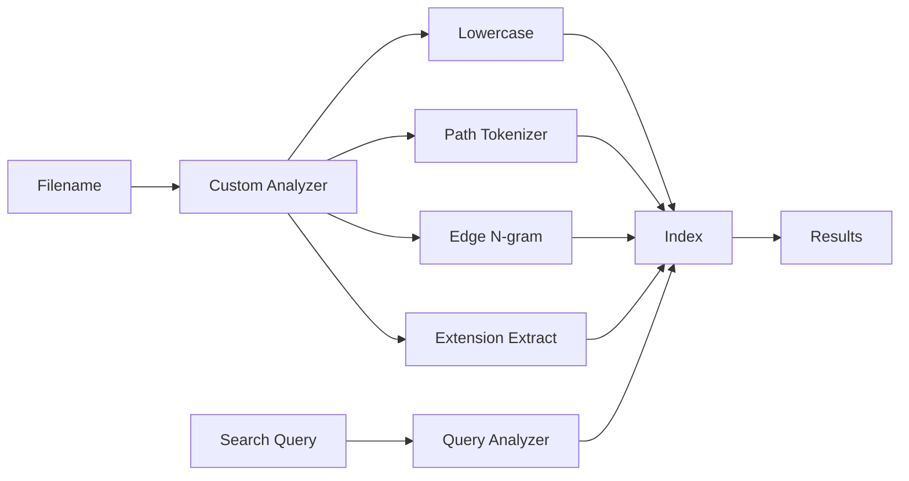

# How to Search Filenames in Elasticsearch

Author: [nawazdhandala](https://www.github.com/nawazdhandala)

Tags: Elasticsearch, Search, Filenames, Text Analysis, File Management, Custom Analyzers

Description: Learn how to effectively index and search filenames in Elasticsearch using custom analyzers, edge n-grams, and path hierarchy tokenizers for file system search functionality.

---

Searching filenames in Elasticsearch requires special handling because filenames contain patterns like extensions, path separators, and camelCase that standard analyzers do not handle well. This guide shows how to build an effective filename search system.

## The Challenge with Filenames

Standard text analyzers fail with filenames:

- `report_2024_final.pdf` becomes `[report, 2024, final, pdf]`
- Searching `report.pdf` will not match
- Path components get mixed together
- Extensions are not easily searchable

## Filename Search Architecture



## Creating a Filename-Optimized Index

### Step 1: Define Custom Analyzers

```bash
curl -X PUT "https://localhost:9200/files" \
  -H "Content-Type: application/json" \
  -u elastic:password \
  -d '{
    "settings": {
      "analysis": {
        "analyzer": {
          "filename_analyzer": {
            "type": "custom",
            "tokenizer": "filename_tokenizer",
            "filter": ["lowercase", "filename_edge_ngram"]
          },
          "filename_search_analyzer": {
            "type": "custom",
            "tokenizer": "filename_tokenizer",
            "filter": ["lowercase"]
          },
          "path_analyzer": {
            "type": "custom",
            "tokenizer": "path_tokenizer",
            "filter": ["lowercase"]
          },
          "extension_analyzer": {
            "type": "custom",
            "tokenizer": "keyword",
            "filter": ["lowercase"]
          }
        },
        "tokenizer": {
          "filename_tokenizer": {
            "type": "pattern",
            "pattern": "[\\\\/_\\-\\. ]+"
          },
          "path_tokenizer": {
            "type": "path_hierarchy",
            "delimiter": "/"
          }
        },
        "filter": {
          "filename_edge_ngram": {
            "type": "edge_ngram",
            "min_gram": 2,
            "max_gram": 20
          }
        }
      }
    },
    "mappings": {
      "properties": {
        "filename": {
          "type": "text",
          "analyzer": "filename_analyzer",
          "search_analyzer": "filename_search_analyzer",
          "fields": {
            "keyword": {
              "type": "keyword"
            },
            "raw": {
              "type": "text",
              "analyzer": "standard"
            }
          }
        },
        "path": {
          "type": "text",
          "analyzer": "path_analyzer",
          "fields": {
            "keyword": {
              "type": "keyword"
            }
          }
        },
        "extension": {
          "type": "keyword"
        },
        "size": {
          "type": "long"
        },
        "modified_date": {
          "type": "date"
        },
        "content_type": {
          "type": "keyword"
        }
      }
    }
  }'
```

### Step 2: Test the Analyzer

Verify how filenames are tokenized:

```bash
curl -X POST "https://localhost:9200/files/_analyze" \
  -H "Content-Type: application/json" \
  -u elastic:password \
  -d '{
    "analyzer": "filename_analyzer",
    "text": "quarterly_report_2024.pdf"
  }'
```

Response shows edge n-grams for autocomplete:

```json
{
  "tokens": [
    { "token": "qu", "position": 0 },
    { "token": "qua", "position": 0 },
    { "token": "quar", "position": 0 },
    { "token": "quarterly", "position": 0 },
    { "token": "re", "position": 1 },
    { "token": "rep", "position": 1 },
    { "token": "report", "position": 1 },
    { "token": "20", "position": 2 },
    { "token": "2024", "position": 2 },
    { "token": "pd", "position": 3 },
    { "token": "pdf", "position": 3 }
  ]
}
```

## Indexing Files

### Single File

```bash
curl -X POST "https://localhost:9200/files/_doc" \
  -H "Content-Type: application/json" \
  -u elastic:password \
  -d '{
    "filename": "quarterly_report_2024.pdf",
    "path": "/documents/reports/finance/quarterly_report_2024.pdf",
    "extension": "pdf",
    "size": 1048576,
    "modified_date": "2024-03-15T10:30:00Z",
    "content_type": "application/pdf"
  }'
```

### Bulk Indexing

```bash
curl -X POST "https://localhost:9200/files/_bulk" \
  -H "Content-Type: application/json" \
  -u elastic:password \
  -d '
{"index":{}}
{"filename":"project_proposal.docx","path":"/documents/projects/project_proposal.docx","extension":"docx","size":524288}
{"index":{}}
{"filename":"budget_2024.xlsx","path":"/documents/finance/budget_2024.xlsx","extension":"xlsx","size":262144}
{"index":{}}
{"filename":"team_photo.jpg","path":"/images/team/team_photo.jpg","extension":"jpg","size":2097152}
{"index":{}}
{"filename":"README.md","path":"/code/myproject/README.md","extension":"md","size":4096}
'
```

## Search Queries

### Basic Filename Search

```bash
curl -X GET "https://localhost:9200/files/_search" \
  -H "Content-Type: application/json" \
  -u elastic:password \
  -d '{
    "query": {
      "match": {
        "filename": "report"
      }
    }
  }'
```

### Autocomplete Search

```bash
curl -X GET "https://localhost:9200/files/_search" \
  -H "Content-Type: application/json" \
  -u elastic:password \
  -d '{
    "query": {
      "match": {
        "filename": {
          "query": "quar",
          "analyzer": "filename_search_analyzer"
        }
      }
    }
  }'
```

### Search by Extension

```bash
curl -X GET "https://localhost:9200/files/_search" \
  -H "Content-Type: application/json" \
  -u elastic:password \
  -d '{
    "query": {
      "term": {
        "extension": "pdf"
      }
    }
  }'
```

### Search Within Path

```bash
curl -X GET "https://localhost:9200/files/_search" \
  -H "Content-Type: application/json" \
  -u elastic:password \
  -d '{
    "query": {
      "match": {
        "path": "/documents/reports"
      }
    }
  }'
```

### Combined Search

```bash
curl -X GET "https://localhost:9200/files/_search" \
  -H "Content-Type: application/json" \
  -u elastic:password \
  -d '{
    "query": {
      "bool": {
        "must": [
          { "match": { "filename": "report" } }
        ],
        "filter": [
          { "term": { "extension": "pdf" } },
          { "range": { "modified_date": { "gte": "2024-01-01" } } }
        ]
      }
    },
    "sort": [
      { "modified_date": "desc" }
    ]
  }'
```

### Wildcard Search (Use Sparingly)

```bash
curl -X GET "https://localhost:9200/files/_search" \
  -H "Content-Type: application/json" \
  -u elastic:password \
  -d '{
    "query": {
      "wildcard": {
        "filename.keyword": {
          "value": "*report*.pdf",
          "case_insensitive": true
        }
      }
    }
  }'
```

## Python Implementation

```python
from elasticsearch import Elasticsearch
from pathlib import Path
import os
import mimetypes

es = Elasticsearch(
    ["https://localhost:9200"],
    basic_auth=("elastic", "password"),
    verify_certs=False
)

def index_file(filepath):
    """Index a file by its path."""
    path = Path(filepath)

    doc = {
        "filename": path.name,
        "path": str(path),
        "extension": path.suffix.lstrip('.').lower() if path.suffix else "",
        "size": path.stat().st_size if path.exists() else 0,
        "modified_date": path.stat().st_mtime if path.exists() else None,
        "content_type": mimetypes.guess_type(filepath)[0] or "application/octet-stream"
    }

    es.index(index="files", document=doc)
    return doc

def index_directory(directory, recursive=True):
    """Index all files in a directory."""
    from elasticsearch.helpers import bulk

    def generate_docs():
        for root, dirs, files in os.walk(directory):
            for filename in files:
                filepath = os.path.join(root, filename)
                path = Path(filepath)

                yield {
                    "_index": "files",
                    "_source": {
                        "filename": path.name,
                        "path": str(path),
                        "extension": path.suffix.lstrip('.').lower() if path.suffix else "",
                        "size": path.stat().st_size,
                        "content_type": mimetypes.guess_type(filepath)[0] or "application/octet-stream"
                    }
                }

            if not recursive:
                break

    success, errors = bulk(es, generate_docs())
    print(f"Indexed {success} files, {len(errors)} errors")

def search_files(query, extension=None, path_prefix=None, size=20):
    """Search for files with optional filters."""
    must = []
    filters = []

    if query:
        must.append({
            "multi_match": {
                "query": query,
                "fields": ["filename^3", "path"],
                "type": "best_fields"
            }
        })

    if extension:
        filters.append({"term": {"extension": extension.lower()}})

    if path_prefix:
        filters.append({"prefix": {"path.keyword": path_prefix}})

    body = {
        "size": size,
        "query": {
            "bool": {
                "must": must if must else [{"match_all": {}}],
                "filter": filters
            }
        },
        "highlight": {
            "fields": {
                "filename": {},
                "path": {}
            }
        }
    }

    response = es.search(index="files", body=body)

    results = []
    for hit in response["hits"]["hits"]:
        result = hit["_source"]
        result["score"] = hit["_score"]
        result["highlights"] = hit.get("highlight", {})
        results.append(result)

    return results

def autocomplete_filename(prefix, size=10):
    """Autocomplete filename suggestions."""
    response = es.search(
        index="files",
        body={
            "size": size,
            "query": {
                "match": {
                    "filename": {
                        "query": prefix,
                        "analyzer": "filename_search_analyzer"
                    }
                }
            },
            "_source": ["filename", "extension", "path"]
        }
    )

    return [hit["_source"] for hit in response["hits"]["hits"]]

# Usage examples
print("Searching for 'report':")
for result in search_files("report"):
    print(f"  {result['filename']} - {result['path']}")

print("\nSearching for PDF files:")
for result in search_files("", extension="pdf"):
    print(f"  {result['filename']}")

print("\nAutocomplete 'qua':")
for suggestion in autocomplete_filename("qua"):
    print(f"  {suggestion['filename']}")
```

## Aggregations for File Statistics

### Files by Extension

```bash
curl -X GET "https://localhost:9200/files/_search" \
  -H "Content-Type: application/json" \
  -u elastic:password \
  -d '{
    "size": 0,
    "aggs": {
      "by_extension": {
        "terms": {
          "field": "extension",
          "size": 20
        },
        "aggs": {
          "total_size": {
            "sum": { "field": "size" }
          }
        }
      }
    }
  }'
```

### Files by Directory

```bash
curl -X GET "https://localhost:9200/files/_search" \
  -H "Content-Type: application/json" \
  -u elastic:password \
  -d '{
    "size": 0,
    "aggs": {
      "by_path": {
        "terms": {
          "field": "path",
          "size": 20,
          "include": "/[^/]+/[^/]+/"
        }
      }
    }
  }'
```

## Handling Special Cases

### CamelCase Filenames

Add a pattern analyzer for camelCase:

```json
{
  "analyzer": {
    "camelcase_analyzer": {
      "type": "pattern",
      "pattern": "([a-z]+|[A-Z][a-z]+|[0-9]+)",
      "lowercase": true
    }
  }
}
```

### Version Numbers in Filenames

```bash
curl -X GET "https://localhost:9200/files/_search" \
  -H "Content-Type: application/json" \
  -u elastic:password \
  -d '{
    "query": {
      "bool": {
        "must": [
          { "match": { "filename": "app" } }
        ],
        "should": [
          { "match": { "filename.raw": "v2.1.0" } }
        ]
      }
    }
  }'
```

## Best Practices

1. **Extract extensions** at index time for efficient filtering
2. **Use edge n-grams** for autocomplete but not for search analyzer
3. **Store paths separately** from filenames for hierarchy searches
4. **Use keyword fields** for exact match requirements
5. **Index metadata** like size, date, and content type for filtering
6. **Avoid wildcard queries** when possible - they are expensive

## Conclusion

Building an effective filename search in Elasticsearch requires:

1. **Custom analyzers** that handle filename patterns
2. **Edge n-grams** for autocomplete functionality
3. **Path hierarchy tokenizer** for directory navigation
4. **Multiple field mappings** for different search scenarios
5. **Proper extraction** of extensions and metadata

With this setup, you can build file explorers, document management systems, and search interfaces that handle filenames naturally.
