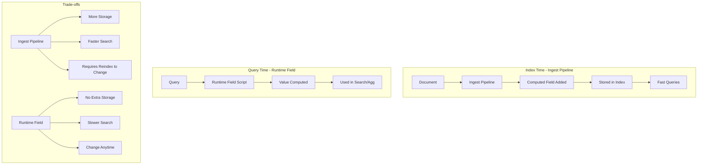

# How to Create Searchable Synthetic Fields in Elasticsearch

Author: [nawazdhandala](https://www.github.com/nawazdhandala)

Tags: Elasticsearch, Synthetic Fields, Runtime Fields, Search Optimization, Data Modeling, Ingest Pipelines

Description: Learn how to create searchable synthetic fields in Elasticsearch using runtime fields, ingest pipelines, and scripted fields to derive new data from existing fields without reindexing.

---

Sometimes the data you need to search does not exist in your documents - it needs to be computed from existing fields. Perhaps you want to search by full name when you only store first and last names separately, or filter by age when you only have birth dates. Elasticsearch provides several mechanisms to create these synthetic fields.

## What Are Synthetic Fields?

Synthetic fields are derived values computed from existing document fields. They can be created:

1. At index time using ingest pipelines
2. At query time using runtime fields
3. During aggregations using scripted fields

Each approach has trade-offs between storage, query performance, and flexibility.

## Comparison of Approaches



## Runtime Fields - Query Time Computation

Runtime fields compute values when queried, making them ideal for experimentation and dynamic use cases.

### Creating a Runtime Field in Mapping

```bash
curl -X PUT "localhost:9200/employees" -H 'Content-Type: application/json' -d'
{
  "mappings": {
    "runtime": {
      "full_name": {
        "type": "keyword",
        "script": {
          "source": "emit(doc[\"first_name\"].value + \" \" + doc[\"last_name\"].value)"
        }
      },
      "age": {
        "type": "long",
        "script": {
          "source": "emit(ChronoUnit.YEARS.between(doc[\"birth_date\"].value, ZonedDateTime.now()))"
        }
      },
      "email_domain": {
        "type": "keyword",
        "script": {
          "source": "def email = doc[\"email\"].value; def atIndex = email.indexOf(\"@\"); emit(atIndex > 0 ? email.substring(atIndex + 1) : \"unknown\")"
        }
      }
    },
    "properties": {
      "first_name": { "type": "keyword" },
      "last_name": { "type": "keyword" },
      "email": { "type": "keyword" },
      "birth_date": { "type": "date" },
      "salary": { "type": "integer" },
      "department": { "type": "keyword" }
    }
  }
}'
```

### Searching Runtime Fields

Search synthetic fields like any other field:

```bash
# Search by full name
curl -X GET "localhost:9200/employees/_search" -H 'Content-Type: application/json' -d'
{
  "query": {
    "match": {
      "full_name": "John Doe"
    }
  }
}'

# Filter by age range
curl -X GET "localhost:9200/employees/_search" -H 'Content-Type: application/json' -d'
{
  "query": {
    "range": {
      "age": {
        "gte": 25,
        "lte": 35
      }
    }
  }
}'

# Aggregate by email domain
curl -X GET "localhost:9200/employees/_search" -H 'Content-Type: application/json' -d'
{
  "size": 0,
  "aggs": {
    "domains": {
      "terms": {
        "field": "email_domain"
      }
    }
  }
}'
```

### Query-Time Runtime Fields

Define runtime fields within a specific query:

```bash
curl -X GET "localhost:9200/employees/_search" -H 'Content-Type: application/json' -d'
{
  "runtime_mappings": {
    "salary_bracket": {
      "type": "keyword",
      "script": {
        "source": "def salary = doc[\"salary\"].value; if (salary < 50000) { emit(\"entry\"); } else if (salary < 100000) { emit(\"mid\"); } else { emit(\"senior\"); }"
      }
    }
  },
  "query": {
    "term": {
      "salary_bracket": "senior"
    }
  },
  "fields": ["first_name", "last_name", "salary", "salary_bracket"]
}'
```

## Ingest Pipelines - Index Time Computation

For frequently searched synthetic fields, compute them at index time for better query performance.

### Creating an Ingest Pipeline

```bash
curl -X PUT "localhost:9200/_ingest/pipeline/employee-enrichment" -H 'Content-Type: application/json' -d'
{
  "description": "Enrich employee documents with synthetic fields",
  "processors": [
    {
      "set": {
        "field": "full_name",
        "value": "{{first_name}} {{last_name}}"
      }
    },
    {
      "script": {
        "lang": "painless",
        "source": "ctx.email_domain = ctx.email.substring(ctx.email.indexOf(\"@\") + 1)"
      }
    },
    {
      "script": {
        "lang": "painless",
        "source": "def birthDate = ZonedDateTime.parse(ctx.birth_date); def now = ZonedDateTime.now(); ctx.age = ChronoUnit.YEARS.between(birthDate, now);"
      }
    },
    {
      "set": {
        "field": "salary_bracket",
        "value": "entry",
        "if": "ctx.salary < 50000"
      }
    },
    {
      "set": {
        "field": "salary_bracket",
        "value": "mid",
        "if": "ctx.salary >= 50000 && ctx.salary < 100000"
      }
    },
    {
      "set": {
        "field": "salary_bracket",
        "value": "senior",
        "if": "ctx.salary >= 100000"
      }
    }
  ]
}'
```

### Using the Pipeline

```bash
# Index with pipeline
curl -X PUT "localhost:9200/employees/_doc/1?pipeline=employee-enrichment" -H 'Content-Type: application/json' -d'
{
  "first_name": "John",
  "last_name": "Doe",
  "email": "john.doe@example.com",
  "birth_date": "1990-05-15T00:00:00Z",
  "salary": 75000,
  "department": "Engineering"
}'

# Set default pipeline for index
curl -X PUT "localhost:9200/employees/_settings" -H 'Content-Type: application/json' -d'
{
  "index.default_pipeline": "employee-enrichment"
}'
```

## Complex Synthetic Fields

### Combining Multiple Fields

Create a searchable address field from components:

```bash
curl -X PUT "localhost:9200/_ingest/pipeline/address-synthetic" -H 'Content-Type: application/json' -d'
{
  "processors": [
    {
      "set": {
        "field": "full_address",
        "value": "{{address.street}}, {{address.city}}, {{address.state}} {{address.zip}}"
      }
    },
    {
      "set": {
        "field": "location_key",
        "value": "{{address.city}}-{{address.state}}"
      }
    }
  ]
}'
```

### Calculated Metrics

Create synthetic metrics from raw data:

```bash
curl -X PUT "localhost:9200/orders" -H 'Content-Type: application/json' -d'
{
  "mappings": {
    "runtime": {
      "profit_margin": {
        "type": "double",
        "script": {
          "source": "double revenue = doc[\"revenue\"].value; double cost = doc[\"cost\"].value; emit(revenue > 0 ? ((revenue - cost) / revenue) * 100 : 0);"
        }
      },
      "days_since_order": {
        "type": "long",
        "script": {
          "source": "emit(ChronoUnit.DAYS.between(doc[\"order_date\"].value, ZonedDateTime.now()))"
        }
      },
      "order_size_category": {
        "type": "keyword",
        "script": {
          "source": "def total = doc[\"total_items\"].value; if (total <= 3) { emit(\"small\"); } else if (total <= 10) { emit(\"medium\"); } else { emit(\"large\"); }"
        }
      }
    },
    "properties": {
      "order_id": { "type": "keyword" },
      "revenue": { "type": "double" },
      "cost": { "type": "double" },
      "order_date": { "type": "date" },
      "total_items": { "type": "integer" }
    }
  }
}'
```

### Text Transformations

Create normalized search fields:

```bash
curl -X PUT "localhost:9200/products" -H 'Content-Type: application/json' -d'
{
  "mappings": {
    "runtime": {
      "search_text": {
        "type": "text",
        "script": {
          "source": "emit(doc[\"name\"].value.toLowerCase() + \" \" + doc[\"category\"].value.toLowerCase() + \" \" + doc[\"brand\"].value.toLowerCase())"
        }
      },
      "sku_normalized": {
        "type": "keyword",
        "script": {
          "source": "emit(doc[\"sku\"].value.toUpperCase().replace(\"-\", \"\"))"
        }
      }
    },
    "properties": {
      "name": { "type": "text" },
      "category": { "type": "keyword" },
      "brand": { "type": "keyword" },
      "sku": { "type": "keyword" }
    }
  }
}'
```

## Hybrid Approach

Combine runtime fields for flexibility with indexed fields for performance:

```python
from elasticsearch import Elasticsearch

es = Elasticsearch(['http://localhost:9200'])

def create_hybrid_index():
    """Create index with both indexed and runtime synthetic fields."""

    mapping = {
        "settings": {
            "index.default_pipeline": "transaction-enrichment"
        },
        "mappings": {
            "runtime": {
                # Dynamic fields computed at query time
                "risk_score": {
                    "type": "double",
                    "script": {
                        "source": """
                            double amount = doc['amount'].value;
                            int velocity = doc['transaction_count_24h'].value;
                            boolean international = doc['is_international'].value;
                            double score = 0;
                            if (amount > 10000) score += 30;
                            if (velocity > 10) score += 20;
                            if (international) score += 15;
                            emit(score);
                        """
                    }
                }
            },
            "properties": {
                "transaction_id": {"type": "keyword"},
                "amount": {"type": "double"},
                "transaction_count_24h": {"type": "integer"},
                "is_international": {"type": "boolean"},
                # Pre-computed fields from ingest pipeline
                "amount_category": {"type": "keyword"},
                "merchant_normalized": {"type": "keyword"}
            }
        }
    }

    es.indices.create(index="transactions", body=mapping)

def create_enrichment_pipeline():
    """Create ingest pipeline for frequently searched fields."""

    pipeline = {
        "description": "Enrich transactions with synthetic fields",
        "processors": [
            {
                "script": {
                    "source": """
                        if (ctx.amount < 100) {
                            ctx.amount_category = 'small';
                        } else if (ctx.amount < 1000) {
                            ctx.amount_category = 'medium';
                        } else {
                            ctx.amount_category = 'large';
                        }
                    """
                }
            },
            {
                "lowercase": {
                    "field": "merchant_name",
                    "target_field": "merchant_normalized"
                }
            }
        ]
    }

    es.ingest.put_pipeline(id="transaction-enrichment", body=pipeline)
```

## Performance Tips

### When to Use Runtime Fields

- Experimenting with new field computations
- Infrequently searched fields
- Fields that need to reflect current time
- Avoiding reindexing during development

### When to Use Ingest Pipelines

- Frequently searched or filtered fields
- Complex computations that are slow to run repeatedly
- Fields needed in aggregations over large datasets
- Production systems with high query volumes

### Monitoring Runtime Field Performance

```bash
# Check query profile for runtime field overhead
curl -X GET "localhost:9200/employees/_search" -H 'Content-Type: application/json' -d'
{
  "profile": true,
  "query": {
    "range": {
      "age": { "gte": 30 }
    }
  }
}'
```

## Summary

Synthetic fields in Elasticsearch let you search and aggregate on computed values without restructuring your source data. Key takeaways:

1. Runtime fields offer flexibility with no storage overhead but have query-time performance costs
2. Ingest pipelines provide fast queries at the cost of additional storage and reindexing requirements
3. Use the hybrid approach - runtime for experimentation, indexed for production
4. Complex scripts can be used for text transformations, calculations, and categorizations
5. Monitor performance to decide when to promote runtime fields to indexed fields

By mastering synthetic fields, you can build more powerful search experiences without being constrained by your original data model.
