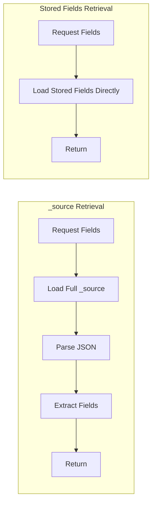

# How to Understand store:yes in Elasticsearch Mapping

Author: [nawazdhandala](https://www.github.com/nawazdhandala)

Tags: Elasticsearch, Mapping, Storage, Index Configuration, Performance, Source Field

Description: Learn when and why to use store:true in Elasticsearch field mappings to optimize storage and retrieval performance for specific use cases.

---

Elasticsearch stores documents in the `_source` field by default, so why would you ever need `store: true` on individual fields? This setting has specific use cases that can improve performance for certain retrieval patterns. This guide explains when stored fields make sense.

## How Document Storage Works


By default, when you retrieve a document:

1. Elasticsearch fetches the entire `_source` field
2. Extracts the requested fields from `_source`
3. Returns the extracted data

With `store: true`, Elasticsearch stores the field value separately, allowing direct retrieval without parsing `_source`.

## Default Behavior - _source Field

```bash
curl -X PUT "localhost:9200/articles" -H 'Content-Type: application/json' -d'
{
  "mappings": {
    "properties": {
      "title": { "type": "text" },
      "content": { "type": "text" },
      "author": { "type": "keyword" },
      "published_date": { "type": "date" }
    }
  }
}'

# Index a document
curl -X POST "localhost:9200/articles/_doc/1" -H 'Content-Type: application/json' -d'
{
  "title": "Understanding Elasticsearch Storage",
  "content": "This is a very long article content... (imagine 50KB of text)",
  "author": "John Doe",
  "published_date": "2024-01-15"
}'

# Retrieve specific fields - extracts from _source
curl -X GET "localhost:9200/articles/_doc/1?_source=title,author"
```

## Using store:true

```bash
curl -X PUT "localhost:9200/articles_optimized" -H 'Content-Type: application/json' -d'
{
  "mappings": {
    "properties": {
      "title": {
        "type": "text",
        "store": true
      },
      "content": {
        "type": "text"
      },
      "author": {
        "type": "keyword",
        "store": true
      },
      "published_date": {
        "type": "date",
        "store": true
      }
    }
  }
}'

# Retrieve stored fields directly
curl -X GET "localhost:9200/articles_optimized/_doc/1?stored_fields=title,author,published_date"
```

## When store:true Makes Sense

### Use Case 1: Large Documents with Small Retrieved Fields

When documents are large but you frequently retrieve only small fields:

```bash
curl -X PUT "localhost:9200/logs" -H 'Content-Type: application/json' -d'
{
  "mappings": {
    "_source": {
      "enabled": false
    },
    "properties": {
      "timestamp": {
        "type": "date",
        "store": true
      },
      "level": {
        "type": "keyword",
        "store": true
      },
      "service": {
        "type": "keyword",
        "store": true
      },
      "message": {
        "type": "text",
        "store": true
      },
      "full_payload": {
        "type": "text",
        "index": false
      }
    }
  }
}'
```

Here, `_source` is disabled entirely, and only specific fields are stored. This saves storage when the full payload is rarely needed.

### Use Case 2: Search Results with Highlights

Retrieve summary fields while highlighting from content:

```bash
curl -X GET "localhost:9200/articles/_search" -H 'Content-Type: application/json' -d'
{
  "stored_fields": ["title", "author", "published_date"],
  "query": {
    "match": { "content": "elasticsearch performance" }
  },
  "highlight": {
    "fields": {
      "content": {}
    }
  }
}'
```

### Use Case 3: Analytics Dashboards

When dashboards need only specific metrics:

```bash
curl -X PUT "localhost:9200/metrics" -H 'Content-Type: application/json' -d'
{
  "mappings": {
    "_source": {
      "enabled": false
    },
    "properties": {
      "timestamp": {
        "type": "date",
        "store": true
      },
      "metric_name": {
        "type": "keyword",
        "store": true
      },
      "value": {
        "type": "double",
        "store": true
      },
      "tags": {
        "type": "keyword",
        "store": true
      },
      "metadata": {
        "type": "object",
        "enabled": false
      }
    }
  }
}'
```

## Comparison: _source vs Stored Fields



### Performance Benchmark

```python
from elasticsearch import Elasticsearch
import time

es = Elasticsearch(['http://localhost:9200'])

def benchmark_retrieval(index, doc_id, iterations=1000):
    """Compare _source vs stored_fields retrieval."""

    # _source retrieval
    source_times = []
    for _ in range(iterations):
        start = time.time()
        es.get(index=index, id=doc_id, _source=['title', 'author'])
        source_times.append(time.time() - start)

    # stored_fields retrieval
    stored_times = []
    for _ in range(iterations):
        start = time.time()
        es.get(index=index, id=doc_id, stored_fields=['title', 'author'])
        stored_times.append(time.time() - start)

    print(f"_source avg: {sum(source_times)/len(source_times)*1000:.3f}ms")
    print(f"stored_fields avg: {sum(stored_times)/len(stored_times)*1000:.3f}ms")
```

For documents over 10KB where you retrieve less than 10% of fields, stored fields can be 2-5x faster.

## Trade-offs

| Aspect | _source Only | store:true |
|--------|-------------|------------|
| Storage Size | Smaller | Larger (data duplicated) |
| Index Speed | Faster | Slightly slower |
| Full Doc Retrieval | Fast | Must reconstruct from fields |
| Partial Retrieval | Parses entire _source | Direct field access |
| Flexibility | Can retrieve any field | Only stored fields available |

## Combining Approaches

### Disable _source, Store Specific Fields

```bash
curl -X PUT "localhost:9200/events" -H 'Content-Type: application/json' -d'
{
  "mappings": {
    "_source": {
      "enabled": false
    },
    "properties": {
      "event_id": { "type": "keyword", "store": true },
      "event_type": { "type": "keyword", "store": true },
      "timestamp": { "type": "date", "store": true },
      "user_id": { "type": "keyword", "store": true },
      "properties": {
        "type": "object",
        "enabled": false
      }
    }
  }
}'
```

Warning: Without `_source`, you cannot reindex documents or use the update API.

### Partial _source with Stored Fields

```bash
curl -X PUT "localhost:9200/documents" -H 'Content-Type: application/json' -d'
{
  "mappings": {
    "_source": {
      "excludes": ["large_binary_field", "raw_content"]
    },
    "properties": {
      "title": { "type": "text", "store": true },
      "summary": { "type": "text", "store": true },
      "large_binary_field": { "type": "binary" },
      "raw_content": { "type": "text" }
    }
  }
}'
```

This keeps `_source` for most fields while excluding large ones.

## Retrieving Stored Fields in Search

```bash
curl -X GET "localhost:9200/articles/_search" -H 'Content-Type: application/json' -d'
{
  "stored_fields": ["title", "author", "published_date"],
  "query": {
    "match": { "content": "elasticsearch" }
  }
}'
```

Response includes stored fields:

```json
{
  "hits": {
    "hits": [
      {
        "_id": "1",
        "fields": {
          "title": ["Understanding Elasticsearch Storage"],
          "author": ["John Doe"],
          "published_date": ["2024-01-15T00:00:00.000Z"]
        }
      }
    ]
  }
}
```

Note: Stored fields are returned as arrays.

## Script Fields Alternative

For computed values, consider script fields instead of storing:

```bash
curl -X GET "localhost:9200/products/_search" -H 'Content-Type: application/json' -d'
{
  "query": { "match_all": {} },
  "script_fields": {
    "discounted_price": {
      "script": {
        "source": "doc[\"price\"].value * 0.9"
      }
    }
  }
}'
```

## Best Practices

1. **Start without store:true** - Use `_source` until you identify performance issues
2. **Measure before optimizing** - Benchmark with realistic document sizes
3. **Consider doc values** - For sorting/aggregation fields, doc values are often sufficient
4. **Keep _source enabled** - Unless you understand the implications for reindexing
5. **Store frequently accessed fields** - Only fields used in most queries
6. **Monitor storage impact** - Stored fields increase index size

## Summary

The `store: true` setting in Elasticsearch:

1. Stores field values separately from `_source`
2. Enables direct retrieval without parsing full documents
3. Benefits large documents where few fields are retrieved
4. Increases storage requirements (data duplication)
5. Should be used selectively based on access patterns
6. Can combine with partial `_source` for optimal results

For most use cases, the default `_source` behavior is sufficient. Reserve `store: true` for specific optimization needs where profiling shows retrieval as a bottleneck.
