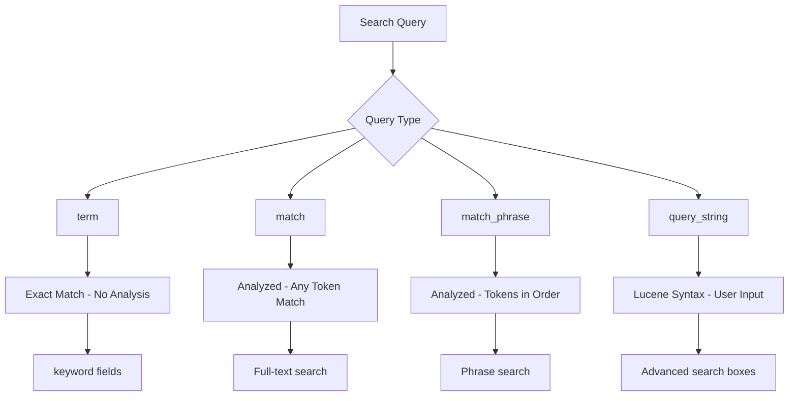

# How to Understand Term vs Match Phrase vs Query String

Author: [nawazdhandala](https://www.github.com/nawazdhandala)

Tags: Elasticsearch, Query DSL, Search, Full-Text Search, Text Analysis, Query Types

Description: A comprehensive comparison of Elasticsearch term, match, match_phrase, and query_string queries explaining when to use each type for effective search implementations.

---

Elasticsearch offers multiple query types that behave differently based on how they handle text analysis and matching. Understanding the differences between term, match, match_phrase, and query_string is essential for building effective search features.

## Query Type Overview



## Sample Data Setup

```bash
curl -X PUT "https://localhost:9200/articles" \
  -H "Content-Type: application/json" \
  -u elastic:password \
  -d '{
    "mappings": {
      "properties": {
        "title": {
          "type": "text",
          "fields": {
            "keyword": { "type": "keyword" }
          }
        },
        "content": { "type": "text" },
        "category": { "type": "keyword" },
        "status": { "type": "keyword" }
      }
    }
  }'

curl -X POST "https://localhost:9200/articles/_bulk" \
  -H "Content-Type: application/json" \
  -u elastic:password \
  -d '
{"index":{}}
{"title":"Quick Brown Fox","content":"The quick brown fox jumps over the lazy dog","category":"animals","status":"published"}
{"index":{}}
{"title":"Quick Start Guide","content":"This quick start guide helps you begin quickly","category":"tutorials","status":"published"}
{"index":{}}
{"title":"Brown Bear Facts","content":"Brown bears are found in North America","category":"animals","status":"draft"}
{"index":{}}
{"title":"The Fox and the Hound","content":"A story about a fox and a hound becoming friends","category":"stories","status":"published"}
'
```

## Term Query - Exact Match

The term query finds documents with an **exact value** in a field. It does NOT analyze the search term.

### When to Use Term Query

- Keyword fields (status, category, tags)
- IDs and codes
- Exact value matching
- Boolean and numeric fields

### Term Query Examples

```bash
# Match exact category
curl -X GET "https://localhost:9200/articles/_search" \
  -H "Content-Type: application/json" \
  -u elastic:password \
  -d '{
    "query": {
      "term": {
        "category": "animals"
      }
    }
  }'

# WRONG: term on analyzed text field
curl -X GET "https://localhost:9200/articles/_search" \
  -H "Content-Type: application/json" \
  -u elastic:password \
  -d '{
    "query": {
      "term": {
        "title": "Quick Brown Fox"
      }
    }
  }'
# Returns NO results because "Quick Brown Fox" is stored as ["quick", "brown", "fox"]

# CORRECT: use keyword subfield for exact title match
curl -X GET "https://localhost:9200/articles/_search" \
  -H "Content-Type: application/json" \
  -u elastic:password \
  -d '{
    "query": {
      "term": {
        "title.keyword": "Quick Brown Fox"
      }
    }
  }'
```

### Terms Query - Multiple Exact Values

```bash
curl -X GET "https://localhost:9200/articles/_search" \
  -H "Content-Type: application/json" \
  -u elastic:password \
  -d '{
    "query": {
      "terms": {
        "category": ["animals", "stories"]
      }
    }
  }'
```

## Match Query - Analyzed Full-Text Search

The match query **analyzes the search term** and finds documents containing ANY of the resulting tokens.

### When to Use Match Query

- Full-text search on text fields
- Natural language queries
- When word order does not matter
- Default search behavior

### Match Query Examples

```bash
# Finds documents with "quick" OR "brown"
curl -X GET "https://localhost:9200/articles/_search" \
  -H "Content-Type: application/json" \
  -u elastic:password \
  -d '{
    "query": {
      "match": {
        "title": "quick brown"
      }
    }
  }'
# Returns: "Quick Brown Fox", "Quick Start Guide", "Brown Bear Facts"

# Require ALL terms with operator
curl -X GET "https://localhost:9200/articles/_search" \
  -H "Content-Type: application/json" \
  -u elastic:password \
  -d '{
    "query": {
      "match": {
        "title": {
          "query": "quick brown",
          "operator": "and"
        }
      }
    }
  }'
# Returns only: "Quick Brown Fox"

# Minimum should match
curl -X GET "https://localhost:9200/articles/_search" \
  -H "Content-Type: application/json" \
  -u elastic:password \
  -d '{
    "query": {
      "match": {
        "content": {
          "query": "quick fox jumps lazy",
          "minimum_should_match": "75%"
        }
      }
    }
  }'
```

### Multi-Match Query

Search across multiple fields:

```bash
curl -X GET "https://localhost:9200/articles/_search" \
  -H "Content-Type: application/json" \
  -u elastic:password \
  -d '{
    "query": {
      "multi_match": {
        "query": "quick fox",
        "fields": ["title^2", "content"],
        "type": "best_fields"
      }
    }
  }'
```

## Match Phrase Query - Exact Phrase Search

The match_phrase query **analyzes the search term** and finds documents containing the tokens **in the exact order** with no gaps.

### When to Use Match Phrase Query

- Exact phrase matching
- Quoted search terms
- When word order matters
- Product names, titles

### Match Phrase Examples

```bash
# Exact phrase match
curl -X GET "https://localhost:9200/articles/_search" \
  -H "Content-Type: application/json" \
  -u elastic:password \
  -d '{
    "query": {
      "match_phrase": {
        "content": "quick brown fox"
      }
    }
  }'
# Returns: "Quick Brown Fox" (exact phrase in content)

# "brown quick" would NOT match (wrong order)
curl -X GET "https://localhost:9200/articles/_search" \
  -H "Content-Type: application/json" \
  -u elastic:password \
  -d '{
    "query": {
      "match_phrase": {
        "content": "brown quick"
      }
    }
  }'
# Returns: NO results

# Allow slop (words between)
curl -X GET "https://localhost:9200/articles/_search" \
  -H "Content-Type: application/json" \
  -u elastic:password \
  -d '{
    "query": {
      "match_phrase": {
        "content": {
          "query": "quick fox",
          "slop": 1
        }
      }
    }
  }'
# Matches "quick brown fox" (1 word between quick and fox)
```

### Match Phrase Prefix Query

For autocomplete scenarios:

```bash
curl -X GET "https://localhost:9200/articles/_search" \
  -H "Content-Type: application/json" \
  -u elastic:password \
  -d '{
    "query": {
      "match_phrase_prefix": {
        "title": {
          "query": "quick bro",
          "max_expansions": 10
        }
      }
    }
  }'
# Matches "Quick Brown Fox"
```

## Query String Query - Lucene Syntax

The query_string query supports **Lucene query syntax** including operators, wildcards, and field specifications.

### When to Use Query String Query

- Power user search interfaces
- When users need advanced syntax
- Complex boolean queries
- Be careful with untrusted input

### Query String Examples

```bash
# Boolean operators
curl -X GET "https://localhost:9200/articles/_search" \
  -H "Content-Type: application/json" \
  -u elastic:password \
  -d '{
    "query": {
      "query_string": {
        "query": "quick AND fox"
      }
    }
  }'

# Field specification
curl -X GET "https://localhost:9200/articles/_search" \
  -H "Content-Type: application/json" \
  -u elastic:password \
  -d '{
    "query": {
      "query_string": {
        "query": "title:quick OR content:bears"
      }
    }
  }'

# Wildcards
curl -X GET "https://localhost:9200/articles/_search" \
  -H "Content-Type: application/json" \
  -u elastic:password \
  -d '{
    "query": {
      "query_string": {
        "query": "qui*",
        "default_field": "title"
      }
    }
  }'

# Phrase with quotes
curl -X GET "https://localhost:9200/articles/_search" \
  -H "Content-Type: application/json" \
  -u elastic:password \
  -d '{
    "query": {
      "query_string": {
        "query": "\"quick brown\"",
        "default_field": "content"
      }
    }
  }'

# Complex query
curl -X GET "https://localhost:9200/articles/_search" \
  -H "Content-Type: application/json" \
  -u elastic:password \
  -d '{
    "query": {
      "query_string": {
        "query": "(quick OR fast) AND (fox OR dog) AND status:published",
        "default_field": "content"
      }
    }
  }'
```

### Simple Query String - Safer Alternative

For user-facing search with limited syntax:

```bash
curl -X GET "https://localhost:9200/articles/_search" \
  -H "Content-Type: application/json" \
  -u elastic:password \
  -d '{
    "query": {
      "simple_query_string": {
        "query": "quick + fox",
        "fields": ["title", "content"],
        "default_operator": "and"
      }
    }
  }'
```

## Comparison Table

| Query Type | Analyzes Query | Matches | Best For |
|------------|---------------|---------|----------|
| term | No | Exact value | Keywords, IDs, status |
| match | Yes | Any token | Full-text search |
| match_phrase | Yes | Tokens in order | Exact phrases |
| query_string | Yes | Lucene syntax | Power users |
| simple_query_string | Yes | Limited syntax | Safe user input |

## Visual Comparison


## Practical Python Implementation

```python
from elasticsearch import Elasticsearch

es = Elasticsearch(
    ["https://localhost:9200"],
    basic_auth=("elastic", "password"),
    verify_certs=False
)

def search_with_query_type(query_type, field, value, **kwargs):
    """Execute different query types and show results."""

    queries = {
        "term": {"term": {field: value}},
        "match": {"match": {field: {"query": value, **kwargs}}},
        "match_phrase": {"match_phrase": {field: {"query": value, **kwargs}}},
        "query_string": {"query_string": {"query": value, "default_field": field, **kwargs}}
    }

    body = {"query": queries[query_type]}
    response = es.search(index="articles", body=body)

    print(f"\n{query_type.upper()} query for '{value}' on '{field}':")
    print(f"  Hits: {response['hits']['total']['value']}")
    for hit in response["hits"]["hits"]:
        print(f"  - {hit['_source']['title']} (score: {hit['_score']:.2f})")

# Compare all query types
search_value = "quick brown"

search_with_query_type("term", "title", search_value)
# Returns: 0 hits (no exact match)

search_with_query_type("term", "title.keyword", "Quick Brown Fox")
# Returns: 1 hit (exact keyword match)

search_with_query_type("match", "title", search_value)
# Returns: 3 hits (quick OR brown)

search_with_query_type("match", "title", search_value, operator="and")
# Returns: 1 hit (quick AND brown)

search_with_query_type("match_phrase", "content", search_value)
# Returns: 1 hit (exact phrase)

search_with_query_type("query_string", "content", "quick AND brown")
# Returns: 1 hit (boolean AND)
```

## Choosing the Right Query Type

### Use term when:
- Searching keyword fields
- Exact value matching required
- Field is not analyzed

### Use match when:
- General full-text search
- Word order does not matter
- Want relevance scoring

### Use match_phrase when:
- Searching for exact phrases
- Word order matters
- User quoted their search

### Use query_string when:
- Building advanced search
- Users know Lucene syntax
- Need complex boolean logic

## Best Practices

1. **Know your field types** - text fields are analyzed, keyword fields are not
2. **Use .keyword subfield** for exact matches on text fields
3. **Prefer simple_query_string** for user input to avoid syntax errors
4. **Combine queries** with bool for complex requirements
5. **Test with _analyze API** to understand tokenization

## Conclusion

Understanding the differences between query types is crucial:

- **term** - No analysis, exact value matching
- **match** - Analyzed, flexible token matching
- **match_phrase** - Analyzed, ordered token matching
- **query_string** - Full Lucene syntax support

Choose based on your data structure and search requirements for optimal results.
