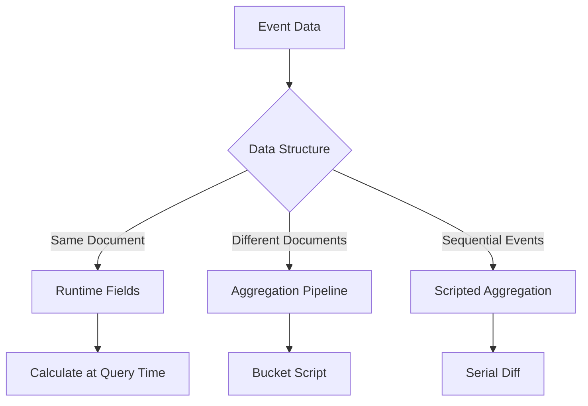

# How to Calculate Time Between Events in Elasticsearch

Author: [nawazdhandala](https://www.github.com/nawazdhandala)

Tags: Elasticsearch, Time Analysis, Event Processing, Aggregations, Analytics, Scripted Fields

Description: Learn how to calculate time differences between events in Elasticsearch using scripted fields, pipeline aggregations, and runtime fields for session analysis and event correlation.

---

Calculating the time between events is essential for user session analysis, workflow timing, incident response metrics, and performance monitoring. Elasticsearch provides several methods to compute time differences depending on your data structure and requirements.

## Common Use Cases

- **Session duration** - Time from login to logout
- **Response time** - Time from request to response
- **Lead time** - Time from order creation to fulfillment
- **Mean time to recovery** - Time from incident start to resolution
- **User engagement** - Time between user actions

## Data Structure Considerations



## Method 1: Time Between Fields in Same Document

When start and end times are in the same document:

### Sample Data

```bash
curl -X POST "https://localhost:9200/sessions/_bulk" \
  -H "Content-Type: application/json" \
  -u elastic:password \
  -d '
{"index":{}}
{"user_id":"user1","session_start":"2024-03-15T10:00:00Z","session_end":"2024-03-15T10:45:00Z"}
{"index":{}}
{"user_id":"user2","session_start":"2024-03-15T11:00:00Z","session_end":"2024-03-15T11:30:00Z"}
{"index":{}}
{"user_id":"user3","session_start":"2024-03-15T12:00:00Z","session_end":"2024-03-15T14:15:00Z"}
'
```

### Using Runtime Fields

```bash
curl -X GET "https://localhost:9200/sessions/_search" \
  -H "Content-Type: application/json" \
  -u elastic:password \
  -d '{
    "runtime_mappings": {
      "duration_minutes": {
        "type": "long",
        "script": {
          "source": "emit((doc[\"session_end\"].value.toInstant().toEpochMilli() - doc[\"session_start\"].value.toInstant().toEpochMilli()) / 60000)"
        }
      }
    },
    "fields": ["user_id", "session_start", "session_end", "duration_minutes"],
    "_source": false
  }'
```

### Using Script Fields

```bash
curl -X GET "https://localhost:9200/sessions/_search" \
  -H "Content-Type: application/json" \
  -u elastic:password \
  -d '{
    "script_fields": {
      "duration_seconds": {
        "script": {
          "source": "(doc[\"session_end\"].value.toInstant().toEpochMilli() - doc[\"session_start\"].value.toInstant().toEpochMilli()) / 1000"
        }
      },
      "duration_formatted": {
        "script": {
          "source": "long millis = doc[\"session_end\"].value.toInstant().toEpochMilli() - doc[\"session_start\"].value.toInstant().toEpochMilli(); long hours = millis / 3600000; long minutes = (millis % 3600000) / 60000; return hours + \"h \" + minutes + \"m\""
        }
      }
    }
  }'
```

### Aggregate on Calculated Duration

```bash
curl -X GET "https://localhost:9200/sessions/_search" \
  -H "Content-Type: application/json" \
  -u elastic:password \
  -d '{
    "size": 0,
    "runtime_mappings": {
      "duration_minutes": {
        "type": "long",
        "script": {
          "source": "emit((doc[\"session_end\"].value.toInstant().toEpochMilli() - doc[\"session_start\"].value.toInstant().toEpochMilli()) / 60000)"
        }
      }
    },
    "aggs": {
      "avg_duration": {
        "avg": { "field": "duration_minutes" }
      },
      "duration_percentiles": {
        "percentiles": {
          "field": "duration_minutes",
          "percents": [50, 90, 95, 99]
        }
      },
      "duration_histogram": {
        "histogram": {
          "field": "duration_minutes",
          "interval": 15
        }
      }
    }
  }'
```

## Method 2: Time Between Events in Different Documents

When events are in separate documents, use aggregations with bucket scripts.

### Sample Event Data

```bash
curl -X POST "https://localhost:9200/events/_bulk" \
  -H "Content-Type: application/json" \
  -u elastic:password \
  -d '
{"index":{}}
{"order_id":"order1","event_type":"created","timestamp":"2024-03-15T10:00:00Z"}
{"index":{}}
{"order_id":"order1","event_type":"shipped","timestamp":"2024-03-15T14:30:00Z"}
{"index":{}}
{"order_id":"order1","event_type":"delivered","timestamp":"2024-03-16T09:00:00Z"}
{"index":{}}
{"order_id":"order2","event_type":"created","timestamp":"2024-03-15T11:00:00Z"}
{"index":{}}
{"order_id":"order2","event_type":"shipped","timestamp":"2024-03-15T16:00:00Z"}
{"index":{}}
{"order_id":"order2","event_type":"delivered","timestamp":"2024-03-17T10:30:00Z"}
'
```

### Calculate Time Between Event Types

```bash
curl -X GET "https://localhost:9200/events/_search" \
  -H "Content-Type: application/json" \
  -u elastic:password \
  -d '{
    "size": 0,
    "aggs": {
      "by_order": {
        "terms": {
          "field": "order_id.keyword",
          "size": 100
        },
        "aggs": {
          "created_time": {
            "filter": { "term": { "event_type.keyword": "created" } },
            "aggs": {
              "time": { "min": { "field": "timestamp" } }
            }
          },
          "shipped_time": {
            "filter": { "term": { "event_type.keyword": "shipped" } },
            "aggs": {
              "time": { "min": { "field": "timestamp" } }
            }
          },
          "delivered_time": {
            "filter": { "term": { "event_type.keyword": "delivered" } },
            "aggs": {
              "time": { "min": { "field": "timestamp" } }
            }
          },
          "time_to_ship_hours": {
            "bucket_script": {
              "buckets_path": {
                "shipped": "shipped_time>time",
                "created": "created_time>time"
              },
              "script": "(params.shipped - params.created) / 3600000"
            }
          },
          "time_to_deliver_hours": {
            "bucket_script": {
              "buckets_path": {
                "delivered": "delivered_time>time",
                "shipped": "shipped_time>time"
              },
              "script": "(params.delivered - params.shipped) / 3600000"
            }
          }
        }
      }
    }
  }'
```

## Method 3: Sequential Event Timing with Date Histogram

Calculate time between sequential events using serial diff:

```bash
curl -X GET "https://localhost:9200/events/_search" \
  -H "Content-Type: application/json" \
  -u elastic:password \
  -d '{
    "size": 0,
    "query": {
      "term": { "order_id.keyword": "order1" }
    },
    "aggs": {
      "events_timeline": {
        "date_histogram": {
          "field": "timestamp",
          "fixed_interval": "1h",
          "min_doc_count": 1
        },
        "aggs": {
          "event_time": {
            "min": { "field": "timestamp" }
          },
          "time_since_previous": {
            "serial_diff": {
              "buckets_path": "event_time",
              "lag": 1
            }
          }
        }
      }
    }
  }'
```

## Method 4: Transform for Pre-calculated Durations

For frequently accessed metrics, use transforms to pre-calculate:

```bash
curl -X PUT "https://localhost:9200/_transform/order_durations" \
  -H "Content-Type: application/json" \
  -u elastic:password \
  -d '{
    "source": {
      "index": "events"
    },
    "dest": {
      "index": "order_metrics"
    },
    "pivot": {
      "group_by": {
        "order_id": { "terms": { "field": "order_id.keyword" } }
      },
      "aggregations": {
        "created_time": {
          "filter": { "term": { "event_type.keyword": "created" } },
          "aggs": { "time": { "min": { "field": "timestamp" } } }
        },
        "shipped_time": {
          "filter": { "term": { "event_type.keyword": "shipped" } },
          "aggs": { "time": { "min": { "field": "timestamp" } } }
        },
        "delivered_time": {
          "filter": { "term": { "event_type.keyword": "delivered" } },
          "aggs": { "time": { "min": { "field": "timestamp" } } }
        }
      }
    }
  }'

# Start the transform
curl -X POST "https://localhost:9200/_transform/order_durations/_start" \
  -u elastic:password
```

## Python Implementation

```python
from elasticsearch import Elasticsearch
from datetime import datetime, timedelta

es = Elasticsearch(
    ["https://localhost:9200"],
    basic_auth=("elastic", "password"),
    verify_certs=False
)

def calculate_session_duration(index="sessions"):
    """Calculate session durations using runtime fields."""
    response = es.search(
        index=index,
        body={
            "size": 100,
            "runtime_mappings": {
                "duration_minutes": {
                    "type": "long",
                    "script": {
                        "source": """
                            if (doc['session_end'].size() > 0 && doc['session_start'].size() > 0) {
                                emit((doc['session_end'].value.toInstant().toEpochMilli() -
                                      doc['session_start'].value.toInstant().toEpochMilli()) / 60000);
                            }
                        """
                    }
                }
            },
            "fields": ["user_id", "duration_minutes"],
            "_source": ["session_start", "session_end"]
        }
    )

    results = []
    for hit in response["hits"]["hits"]:
        results.append({
            "user_id": hit["fields"].get("user_id", [None])[0],
            "duration_minutes": hit["fields"].get("duration_minutes", [None])[0],
            "session_start": hit["_source"]["session_start"],
            "session_end": hit["_source"]["session_end"]
        })

    return results

def calculate_event_intervals(entity_id, entity_field="order_id", index="events"):
    """Calculate time between sequential events for an entity."""
    response = es.search(
        index=index,
        body={
            "size": 100,
            "query": {
                "term": {f"{entity_field}.keyword": entity_id}
            },
            "sort": [{"timestamp": "asc"}],
            "_source": ["event_type", "timestamp"]
        }
    )

    events = [hit["_source"] for hit in response["hits"]["hits"]]
    intervals = []

    for i in range(1, len(events)):
        prev_time = datetime.fromisoformat(events[i-1]["timestamp"].replace("Z", "+00:00"))
        curr_time = datetime.fromisoformat(events[i]["timestamp"].replace("Z", "+00:00"))
        delta = curr_time - prev_time

        intervals.append({
            "from_event": events[i-1]["event_type"],
            "to_event": events[i]["event_type"],
            "duration_hours": delta.total_seconds() / 3600
        })

    return intervals

def get_average_time_between_events(from_event, to_event, index="events"):
    """Calculate average time between two event types across all entities."""
    response = es.search(
        index=index,
        body={
            "size": 0,
            "aggs": {
                "by_entity": {
                    "terms": {
                        "field": "order_id.keyword",
                        "size": 10000
                    },
                    "aggs": {
                        "from_time": {
                            "filter": {"term": {"event_type.keyword": from_event}},
                            "aggs": {"time": {"min": {"field": "timestamp"}}}
                        },
                        "to_time": {
                            "filter": {"term": {"event_type.keyword": to_event}},
                            "aggs": {"time": {"min": {"field": "timestamp"}}}
                        },
                        "duration_hours": {
                            "bucket_script": {
                                "buckets_path": {
                                    "to": "to_time>time",
                                    "from": "from_time>time"
                                },
                                "script": "(params.to - params.from) / 3600000"
                            }
                        }
                    }
                },
                "avg_duration": {
                    "avg_bucket": {
                        "buckets_path": "by_entity>duration_hours"
                    }
                },
                "percentiles_duration": {
                    "percentiles_bucket": {
                        "buckets_path": "by_entity>duration_hours",
                        "percents": [50, 90, 95, 99]
                    }
                }
            }
        }
    )

    return {
        "average_hours": response["aggregations"]["avg_duration"]["value"],
        "percentiles": response["aggregations"]["percentiles_duration"]["values"]
    }

# Usage
print("Session Durations:")
for session in calculate_session_duration():
    print(f"  {session['user_id']}: {session['duration_minutes']} minutes")

print("\nOrder 1 Event Intervals:")
for interval in calculate_event_intervals("order1"):
    print(f"  {interval['from_event']} -> {interval['to_event']}: {interval['duration_hours']:.2f} hours")

print("\nAverage Time to Ship:")
metrics = get_average_time_between_events("created", "shipped")
print(f"  Average: {metrics['average_hours']:.2f} hours")
print(f"  P50: {metrics['percentiles']['50.0']:.2f} hours")
print(f"  P95: {metrics['percentiles']['95.0']:.2f} hours")
```

## Visualizing Time Metrics

### Distribution of Durations

```bash
curl -X GET "https://localhost:9200/sessions/_search" \
  -H "Content-Type: application/json" \
  -u elastic:password \
  -d '{
    "size": 0,
    "runtime_mappings": {
      "duration_minutes": {
        "type": "long",
        "script": {
          "source": "emit((doc[\"session_end\"].value.toInstant().toEpochMilli() - doc[\"session_start\"].value.toInstant().toEpochMilli()) / 60000)"
        }
      }
    },
    "aggs": {
      "duration_ranges": {
        "range": {
          "field": "duration_minutes",
          "ranges": [
            { "key": "short", "to": 15 },
            { "key": "medium", "from": 15, "to": 60 },
            { "key": "long", "from": 60 }
          ]
        }
      }
    }
  }'
```

## Performance Considerations

| Method | Use Case | Performance |
|--------|----------|-------------|
| Runtime Fields | Ad-hoc queries | Good for small datasets |
| Script Fields | One-time calculations | Moderate overhead |
| Transforms | Repeated queries | Best - pre-calculated |
| Bucket Scripts | Aggregation pipelines | Good with proper sizing |

## Best Practices

1. **Pre-calculate when possible** - Use transforms for frequently accessed metrics
2. **Index duration fields** - If time difference is commonly queried
3. **Use appropriate precision** - Milliseconds vs seconds vs minutes
4. **Handle missing values** - Check for null timestamps in scripts
5. **Consider time zones** - Ensure consistent timezone handling

## Conclusion

Calculating time between events in Elasticsearch requires different approaches:

1. **Same document** - Runtime fields or script fields
2. **Different documents** - Aggregations with bucket scripts
3. **Sequential events** - Serial diff pipeline aggregation
4. **Frequent queries** - Transforms for pre-calculation

Choose the method based on your data structure and query frequency to balance flexibility and performance.
